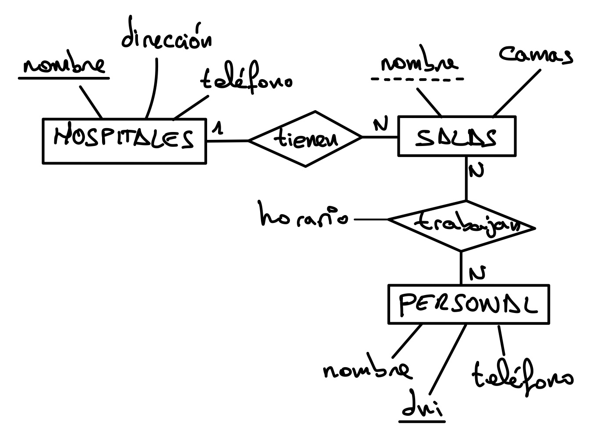
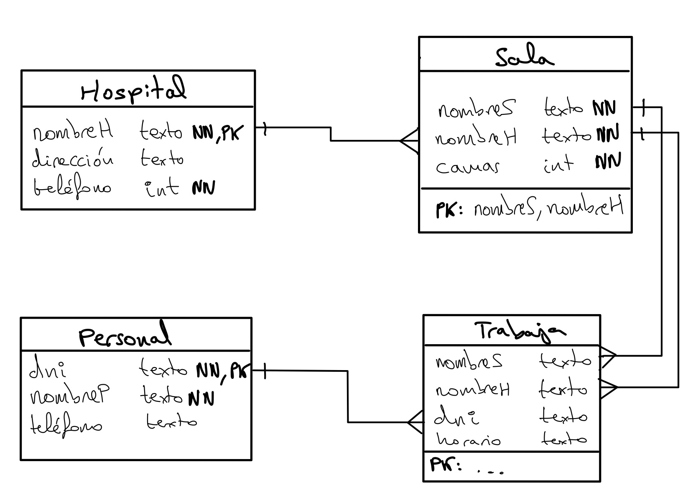

# Introducción al lenguaje SQL {#introSQL}

```{r , child = '_global_options.Rmd'}
```

Los sistemas de información gestionan repositorios de información en múltiples formatos, 
siendo el más popular las bases de datos relacionales a las que se accede mediante SQL (Structured Query Language).

El ejemplo que trabajaremos en este capítulo está disponible en Kaggle: [kaggle.com/code/diegodx/txd-2025-tutorialsql](https://www.kaggle.com/code/diegodx/txd-2025-tutorialsql)

## Bases de Datos Relacionales

### Definiciones

* **Dominio**: contexto (organización, empresa, evento...) objeto de gestión de la información.

* **Dato**: hecho con significado implícito, registable, relevante en un determinado dominio.

* **Base de datos**: colección de datos de un determinado dominio relacionados entre sí, organizados de forma que sea posible manipularlos y recuperarlos de forma eficiente.

* Sistema de Gestión de Bases de Datos (**SGBD**) (en inglés **RDBMS**, Relational Database Management System): software que permite a los usuarios crear y manipular bases de datos mediante operaciones **CRUD**:
	+ **C**reate: Crear / Insertar datos
	+ **R**read: Consultar / Leer datos
	+ **U**pdate: Actualizar / Modificar datos
	+ **D**elete: Eliminar datos

***

* **Modelo de datos**: abstracción conceptual que propone una manera de organizar y manipular los datos. Definido mediante:
	+ Estructura: elementos para organizar datos
	+ Integridad: reglas para relaciones los elementos
	+ Manipulación: operaciones sobre los datos adaptadas a la estructura y reglas

* Modelo **Entidad Relación** (entidades, relaciones, atributos)

{width=400px}

* Modelo de datos lógico o de representación (**modelo relacional** de Codd)
	+ Datos en relaciones (tablas)
	+ Base matemática formal
	+ Flexible

{width=600px}

* Modelo de datos físico (tal y como se almacenan los datos)

Una fila de la tabla (relación) es una tupla y una columna un atributo. 

{width=600px}

Una base de datos es un conjunto de tablas (al menos una).

{width=600px}

La tabla no es una relación porque la relación es un conjunto sin orden y una tabla puede tener filas repetidas y tiene orden.

***

* **Esquema**: estructura de la base de datos

* **Estado**: contenido de la base de datos

* Restricción de **integridad**: regla que debe cumplir la información registrada en la base de datos para garantizar la integridad de la información.

## Restricciones

Cualquier Base de Datos basada en el modelo relacional debería cumplir como mínimo estas restricciones (además de las propias del dominio):

* **Restricción de dominio**: Cada atributo debe tener un tipo de valores permitido, asegurando que sólo se almacenan datos válidos y consistentes
* **Atributos atómicos**: Cada atributo debe almacenar valores indivisibles (nombre completo descomponible en nombre y apellidos, domicilio en calle, CP, localidad, etc...)
* **Unicidad**: Co pueden existir dos tuplas iguales. Para ello se definen claves: 
	* Una **superclave** es un subconjunto de atributos tal que no existen dos tuplas con la misma superclave.
	> Ejercicio. En la relación Empleado(dni, nombre, apellidos, email) ¿cuántas superclaves existen?
	* Una **clave candidata** es una superclave mínima (superclave mínima es la clave a la que no se le puede eliminar un atributo). 
	> ¿Cuántas claves candidatas hay en el ejemplo anterior?
	* La **clave primaria** es la clave candidata que elegimos que identificar de forma unívoca las tuplas de una relación. Restricción de integridad de entidad: Ningún valor de la clave primaria puede ser un valor nulo.

* Una **clave foránea** es un conjunto de atributos de una relación R_1 que, para cada tupla, identifican a otra tupla de una relación R_2 con la que está relacionada. 
La Restricción de integridad referencial nos dice que la clave foránea ha de corresponderse con la clave primaria de R_2, y si la clave foránea no es nula ha de refir a una tupla en R_2.

{width=600px}

{width=600px}

Si borramos/actualizamos un valor de clave foránea podemos: (a) prohibir el cambio, o (b) poner a nulo la clave foránea (borrado) o propagar el cambio (modificación).

## Sistemas Gestores de Bases de Datos (SGDB)

Utilizar un SGDB tiene múltiples ventajas:

* Administración centralizada de los datos (por un administrador en un servidor/plataforma central que evita la información en silos -redundante/inconsistente)
* Desacoplamiento del almacenamiento físico de los datos (no es necesario conocerlo)
* Simplicidad de acceso (ODBC + SQL, lenguaje declarativo)
* Control de integridad (restricciones genéricas, integridad de entidad y referencial, de dominio, y las del dominio en software)
* Control de acceso concurrente (evita inconsistencia)
* Seguridad (autenticación, roles de acceso)
* Recuperación ante fallos (backup, logs y transacciones -rollback-)

Existen muchos SGDBs, pero los más populares son:

* **SQLite**: es muy ligero, no necesita un servidor para ejecutarse y es muy rápido cuando el conjunto de datos es pequeño.
	* Su escalabilidad y concurrencia son muy limitadas
	* Ideal para proyectos pequeños, aplicaciones locales o móviles y prácticas de TXD 
	* Usado en Google Chrome, Firefox, Safari, Dropbox (app de escritorio)
	* Es de dominio público
* **MySQL**: requiere un servidor para ejecutarse, cuenta con soporte en la nube
	* Presenta buena escalabilidad y concurrencia
	* Es muy utilizado en aplicaciones web de tamaño medio
	* Usado en Wordpress, y en general un gran porcentaje de páginas y aplicaciones web de tamaño pequeño y mediano. Incluso sitios grandes como Wikipedia o Facebook emplean variantes de MySQL.
	* Licencia GPL (con variantes comerciales)
* **PostgreSQL**: también requiere un servidor y tiene soporte en la nube
	* Su escalabilidad es excelente, óptimo para grandes cantidades de datos
	* Cuenta con muchas extensiones para, por ejemplo, información geográfica (PostGIS), series temporales (TimescaleDB), etc.
	* Ideal para sistemas complejos, analíticos o con alta concurrencia
	* Usado en Reddit, Instagram, Spotify, Netflix, ...
	* Licencia propia tipo MIT
* Otros SGDBs relacionales: MariaDB (derivado de MySQL), Microsoft SQL Server, Oracle

Ranking de popularidad según [DB-Engines](http://db-engines.com). La puntuación está calculada en función del número de menciones en páginas web, interés general en los sitemas, frecuencia de discusiones técnias, cantidad de ofertas de trabajo, relevancia en redes sociales, etc.

| 2025  | 2024  | SGDB  | Modelo                        | Puntuacion    | Var   |
|------:|------:|-------|-------------------------------|---------------|-------|
| 1. |1. |Oracle               |Relacional, Multi-modelo  |1212.77         |-96.67 |
| 2. |2. |MySQL                |Relacional, Multi-modelo  |879.66                 |-143.09 |
| 3. |3. |Microsoft SQL Server |Relacional, Multi-modelo  |715.05 |-87.04 |
| 4. |4. |PostgreSQL           |Relacional, Multi-modelo  |643.20         |-8.96 |
| 5. |5. |MongoDB              |Documental, Multi-modelo  |368.01 |-37.20 |
| 6. |7. |Snowflake            |Relacional                |198.65    |+58.05 |
| 7. |6. |Redis                |Clave-valor, Multi-modelo |142.33   |-7.30 |
| 8. |14. |Databricks          |Multi-modelo              |128.80   |+43.21 |
| 9. |9. |IBM Db2              |Relacional, Multi-modelo  |122.37  |-0.40 |
| 10. |8. |Elasticsearch       |Multi-modelo              |116.67   |-15.18 |
| 11. |11. |Apache Cassandra   |Wide column, Multi-modelo |105.16 |+7.56 |
| 12. |10. |SQLite             |Relacional                |104.56     |+2.64 |
| 13. |15. |MariaDB            |Relacional, Multi-modelo  |87.77 |+2.88 |
| 14. |12. |Microsoft Access   |Relacional                |80.79   |-11.36 |
| 15. |17. |Amazon DynamoDB    |Multi-modelo              |75.91  |+4.06 |

## Sintaxis SQL

SQL (Structured Query Language) es un lenguaje declarativo.
Es un lenguaje estándar: tiene un estándar oficial definido por ISO y ANSI.
Sin embargo, en la práctica cada SGDB implementa solo una parte de él, y además tiene sus propios dialectos, en los que puede variar por ejemplo lo siguiente:

* Tipos de datos (TEXT, VARCHAR, BLOB, etc.)
* Distinción o no de mayúsculas y minúsculas (cap sensitiveness)
* Cómo se manejan las transacciones
* Funciones (LENGTH(), LEN(), etc.)
* Formato de fechas
* Gestión de triggers
* ...

Sintaxis general:

* Consulta

```{sql eval=FALSE} 
  SELECT <campo/s>
  FROM <tabla>
  WHERE <condición>
  GROUP BY <campo>
  HAVING <condición>
  ORDER BY <campo>
  LIMIT <m> OFFSET <n>
```

* Modificación

```{sql eval=FALSE} 
  UPDATE <tabla>
  SET <cambios>
  WHERE <condición>
```

* Borrado

```{sql eval=FALSE} 
  DELETE FROM <tabla>
  WHERE <condición>
```

## Cláusulas básicas de SQL

### Lectura

* Seleccionar todas las columnas de una tabla: 

```{sql eval=FALSE}
  SELECT * FROM Track;  
```

* Seleccionar columnas específicas: 

```{sql eval=FALSE}
  SELECT name, composer FROM Track; 
```

* Alias de columna y tabla: 

```{sql eval=FALSE}
  SELECT name AS Canción FROM Track; 

  SELECT T.name FROM Track AS T;
```

* Funciones de agregación: 

```{sql eval=FALSE}
  SELECT COUNT(*), SUM(UnitPrice), MIN(UnitPrice), MAX(UnitPrice) FROM Track; 

  SELECT AVG(milliseconds) AS 'Duración Media' FROM Track; 
```

* Filtrado de duplicados: 

```{sql eval=FALSE}
  SELECT DISTINCT FirstName FROM Customer; 

  SELECT COUNT(DISTINCT FirstName) FROM Customer; 
```

* Formato: 

```{sql eval=FALSE}
  SELECT CONCAT(FirstName, ' ', LastName) AS Nombre FROM Employee; 

  SELECT (FirstName || ' ' || LastName) AS Nombre FROM Employee; 

  SELECT ROUND(AVG(Total), 2) AS 'Facturacion Media' FROM Invoice; 
```
 
#### Filtrado de Resultados 

* Seleccionar filas con condiciones: 

```{sql eval=FALSE}
SELECT name FROM Track
WHERE UnitPrice < 2.0; 
```

* Múltiples condiciones: 

  * Operadores: 'AND', 'OR', 'LIKE', 'NOT', 'IS NULL', 'IS NOT NULL' 
                'BETWEEN x AND y', 'IN (lista)' 
                
```{sql eval=FALSE}
  SELECT name FROM Track
  WHERE milliseconds > 120000 AND UnitPrice < 2.0; 
```
 
```{sql eval=FALSE}
  SELECT name FROM Track
  WHERE composer LIKE 'Metallica' OR composer LIKE 'Ulrich'; 
```
 
* Coincidencias parciales: 

```{sql eval=FALSE}
  SELECT * FROM Track
  WHERE name LIKE '%Love%'; 
```

  + '%' : Reemplazo por un conjunto de caracteres 
  + '_' : Reemplazo por un caracter 

* Rangos: 

```{sql eval=FALSE}
  SELECT * FROM Track
  WHERE UnitPrice BETWEEN 0.5 AND 1.5; 
```

* Valores en una lista: 

```{sql eval=FALSE}
  SELECT * FROM Track
  WHERE composer IN ('Metallica', 'Ulrich'); 
```

#### Ordenar Resultados 

* Ordenar por una columna: 

```{sql eval=FALSE}
  SELECT * FROM Track
  ORDER BY title ASC; 

  SELECT * FROM Track
  ORDER BY title DESC; 
```

* Ordenar por múltiples columnas: 

```{sql eval=FALSE}
  SELECT * FROM Track
  ORDER BY composer ASC, title DESC; 
```

#### Número de filas (paginación) 

* Obtener las N primeras: 

```{sql eval=FALSE}
  SELECT * FROM Track
  ORDER BY title ASC
  LIMIT 5;
```

* Obtener las N filas siguientes:

```{sql eval=FALSE}
  SELECT * FROM Track
  ORDER BY title ASC
  OFFSET 5 LIMIT 5;
```


## Gestión de tablas

* Creación de tablas

```{sql eval=FALSE}
CREATE TABLE table_name(
column1 datatype,
column2 datatype,
column3 datatype,
.....
columnN datatype,
PRIMARY KEY( one or more columns )
);
```
* Borrado de tablas

```{sql eval=FALSE}
DROP TABLE table_name;
```

* Creación de índices

```{sql eval=FALSE}
CREATE UNIQUE INDEX index_name
ON table_name ( column1, column2,...columnN);
```

* Modificación de tablas

```{sql eval=FALSE}
ALTER TABLE table_name
DROP INDEX index_name;

ALTER TABLE table_name
{ADD|DROP|MODIFY} column_name {data_ype};

ALTER TABLE table_name RENAME TO new_table_name;
```

## Gestión de datos

* Inserción de tuplas

```{sql eval=FALSE}
INSERT INTO table_name( column1, column2....columnN)
VALUES ( value1, value2....valueN);
```

* Modificación de datos

```{sql eval=FALSE}
UPDATE table_name
SET column1 = value1, column2 = value2....columnN=valueN
[ WHERE  CONDITION ];
```

* Eliminación de datos

```{sql eval=FALSE}
DELETE FROM table_name
WHERE  {CONDITION};
```

<iframe width="560" height="315" src="https://www.youtube.com/embed/i_cVJgIz_Cs" frameborder="0" allowfullscreen></iframe>


## Gestión de Bases de Datos

* Creación de una base de datos

```{sql eval=FALSE}
CREATE DATABASE database_name;
```

* Eliminación de una base de datos

```{sql eval=FALSE}
DROP DATABASE database_name;
```

* Selección de base de datos

```{sql eval=FALSE}
USE database_name;
```

* Gestión de transacciones

```{sql eval=FALSE}
BEGIN;

  ...
  
COMMIT;

ROLLBACK;
```


## Ejemplos de consultas SQL

```{sql eval=FALSE}
SELECT Nombre, Apellido1, Apellido2, Municipio, Provincia 
FROM Cliente
WHERE Municipio = 'Lugo'
ORDER BY Apellido1

INSERT Proveedor(Nombre, PersonaContacto, Ciudad, País)
VALUES ('Café Candelas', 'Ivana Candelas', 'Lugo', 'España')

UPDATE Pedidos
SET Cantidad = 2
WHERE IdProducto = 963

DELETE Cliente
WHERE Email = 'alexandregb@gmail.com'

```


## Conexión con bases de datos desde R 

### Introducción a SQL en R

SQL se usa para manipular datos dentro de una base de datos. Si la base de datos no es muy grande se puede cargar toda en un data.frame. 
No obstante, por escalabilidad y offloading de la carga de trabajo al servidor SGBD utilizaremos SQL.

Existen varios SGBD (SQLite, Microsoft SQL Server, MySQL, PostgreSQL, etc) los cuales comparten el soporte de SQL (en concreto ANSI SQL) aunque cada gestor extiende SQL 
de formas sutiles buscando minar cierta portabilidad de código (*vendor-locking*). En efecto, un código SQL desarrollado para SQLite es probable que falle con MySQL 
aunque tras aplicar ligeras modificaciones ya funcionará. Asimismo el mecanismo de conexión, configuración, rendimiento y operación suele diferir entre SGBD.

A continuación se lista una serie de paquetes utilizados en el acceso a los datos, lo que suele ser el principal esfuerzo a realizar cuando se trabaja con SGBD:

- [DBI](https://cran.r-project.org/web/packages/DBI/index.html)
- [RODBC](https://cran.r-project.org/web/packages/RODBC/index.html)
- [dbConnect](https://cran.r-project.org/web/packages/dbConnect/index.html)
- [RSQLite](https://cran.r-project.org/web/packages/RSQLite/index.html)
- [RMySQL](https://cran.r-project.org/web/packages/RMySQL/index.html)
- [RPostgreSQL](https://cran.r-project.org/web/packages/RPostgreSQL/index.html)

### El paquete sqldf

A continuación se presenta una serie de ejercicios con la sintaxis de SQL operando sobre un data.frame con el paquete sqldf. Esto inicialmente no incluye los detalles de conectarse a un SGBD, ni modificar los
datos, solamente el uso de SQL para extraer datos con el objetivo de ser analizados en R. 


```{r,error=FALSE,message=FALSE,warning=FALSE}
library(sqldf)
```

```{r}
sqldf('SELECT age, circumference FROM Orange WHERE Tree = 1 ORDER BY circumference ASC')
```

### SQL Queries

El comando inicial es SELECT. SQL no es case-sensitive, por lo que esto va a funcionar:

```{r,eval=FALSE}
sqldf("SELECT * FROM iris")
sqldf("select * from iris")
```

pero lo siguiente no va a funcionar (a menos que tengamos un objeto IRIS:

```{r,eval=FALSE}
sqldf("SELECT * FROM IRIS")
```

La sintaxis básica de SELECT es:

```{r,eval=FALSE}
SELECT variable1, variable2 FROM data
```

#### Asterisco/Wildcard

Lo extrae todo

```{r}
bod2 <- sqldf('SELECT * FROM BOD')
```

#### Limit

Limita el número de resultados

```{r}
sqldf('SELECT * FROM iris LIMIT 5')
```

#### Order By

Ordena las variables

```{r,eval=FALSE}
ORDER BY var1 {ASC/DESC}, var2 {ASC/DESC}
```

```{r}
sqldf("SELECT * FROM Orange ORDER BY age ASC, circumference DESC LIMIT 5")
```

#### Where

Sentencias condicionales, donde se puede incorporar operadores lógicos AND y OR, expresando el orden de evaluación con paréntesis en caso de ser necesario.

```{r}
sqldf('SELECT demand FROM BOD WHERE Time < 3')
```

```{r}
sqldf('SELECT * FROM rock WHERE (peri > 5000 AND shape < .05) OR perm > 1000')
```

Y extendiendo su uso con IN o LIKE (es último sólo con %), pudiendo aplicárseles el NOT:

```{r}
sqldf('SELECT * FROM BOD WHERE Time IN (1,7)')
```

```{r}
sqldf('SELECT * FROM BOD WHERE Time NOT IN (1,7)')
```

```{r}
sqldf('SELECT * FROM chickwts WHERE feed LIKE "%bean" LIMIT 5')
```

```{r}
sqldf('SELECT * FROM chickwts WHERE feed NOT LIKE "%bean" LIMIT 5')
```


## Ejemplo Scopus data

Ver ejemplo [*citan.zip*](data/citan.zip) y Apéndice \@ref(citan).

> “If your data fits in memory 
  there is no advantage to putting it in a database: 
  it will only be slower and more frustrating”
>
> --- Hadley Wickham – https://dbplyr.tidyverse.org/articles/dbplyr.html


## Ejercicios SQL con RSQLite

### Setup de RSQLite

Vamos a utilizar [RSQLite](https://cran.r-project.org/web/packages/RSQLite/index.html) desde Kaggle. Pero si lo queréis instalar en local La información para su instalación está [en el siguiente enlace](https://db.rstudio.com/databases/sqlite/).


```{r}
library(DBI)

# Create an ephemeral in-memory RSQLite database
con <- dbConnect(RSQLite::SQLite(), ":memory:")
dbListTables(con)
```


```{r}
dbWriteTable(con, "mtcars", mtcars)
dbListTables(con)
dbListFields(con, "mtcars")
dbReadTable(con, "mtcars")
# You can fetch all results:
res <- dbSendQuery(con, "SELECT * FROM mtcars WHERE cyl = 4")
dbFetch(res)
dbClearResult(res)

# Or a chunk at a time
res <- dbSendQuery(con, "SELECT * FROM mtcars WHERE cyl = 4")
while(!dbHasCompleted(res)){
  chunk <- dbFetch(res, n = 5)
  print(nrow(chunk))
}

# Clear the result
dbClearResult(res)

# Disconnect from the database
dbDisconnect(con)

```


## Práctica 1: SQL

Vamos a utilizar la base de datos [Chinook](https://www.sqlitetutorial.net/wp-content/uploads/2018/03/chinook.zip) del [tutorial de SQLite](https://www.sqlitetutorial.net/sqlite-sample-database/)

{width=600px}

Los ejercicios pedidos en Kaggle [kaggle.com/gltaboada/sqlite-tutorial-in-r](https://www.kaggle.com/gltaboada/sqlite-tutorial-in-r) se entregarán preferentemente antes del **14/10** compartiendo un notebook con las soluciones (¡notebooke privado!) con el usuario **gltaboada**. Antes me tenéis que enviar un email comunicando qué usuario tenéis cada uno. En caso de incidencia me podéis mandar un notebook descargado (.ipynb), o el mecanismo que hayamos acordado previamente. 


<!-- Exercises 19-20
### Ejercicios de Análisis Exploratorio

La puntuación de esta práctica será -3 más el número de respuestas correctas (puntuación máxima 10). Se valorará especialmente encontrar la solución más sencilla en una única query SQL. 

1. Conocer el importe mínimo, máximo y la media de las facturas.

2. Conocer el total de las facturas de cada uno de los países.

3. Obtener el listado de países junto con su facturación media, ordenado (a) alfabéticamente por país y (b) decrecientemente por importe de facturación media

4. Obtener un listado con Nombre y Apellidos de cliente y el importe de cada una de sus facturas (Hint: WHERE customer.CustomerID=invoices.CustomerID)

5. ¿Qué porcentaje de las canciones son video?

6. Listar los 10 mejores clientes (aquellos a los que se les ha facturado más cantidad) indicando Nombre, Apellidos, Pais y el importe total de su facturación.

7. Listar los géneros musicales por orden decreciente de popularidad (definida la popularidad como el número de canciones de ese género), indicando el porcentaje de las canciones de ese género.

8. Listar los 10 artistas con mayor número de canciones de forma descendente según el número de canciones.

9. Listar Nombre y Apellidos de los "Sales Support Agent" así como la facturación de los clientes que tienen asignados, además de mostrar el porcentaje de la facturación total y del número total de empleados. 

10. Listar los géneros musicales que más importe facturan y el porcentaje de su facturación.

11. Listas los géneros musicales ordenados de forma decreciente según el número de canciones por las que no están facturando.

12. Conocer la facturación de los clientes agrupados por su servidor de correo electrónico (e.g., la facturación de los clientes de gmail.com, los de hotmail.com, por orden decreciente de facturación).

13. Ordenar las playlists por la facturación obtenida por sus canciones.
-->


