Tecnologías para el Tratamiendo de Datos Masivos
================================================

En este apartado trataremos los siguientes epígrafes:

1. Introducción al Aprendizaje Estadístico

2. Tecnologías Big Data (Hadoop, Spark, Sparklyr)

3. Ejercicios de análisis de datos masivos.

```{r global-options, include=FALSE}
source("_global_options.R")
```

## Introducción al Aprendizaje Estadístico {#intro-AE}

Este apartado es una adaptación (reducida, pensada para 2 sesiones de 2 horas) del [Capítulo 1](https://rubenfcasal.github.io/aprendizaje_estadistico/intro-AE.html) de Fernández-Casal, Costa y Oviedo, [*Métodos predictivos de aprendizaje estadístico*](https://rubenfcasal.github.io/aprendizaje_estadistico/), que se sigue empleando como referencia completa para quien quiera profundizar (incluye, entre otros contenidos que aquí solo se tratarán brevemente por falta de tiempo, un desarrollo más completo de la maldición de la dimensionalidad y del paquete `caret`).

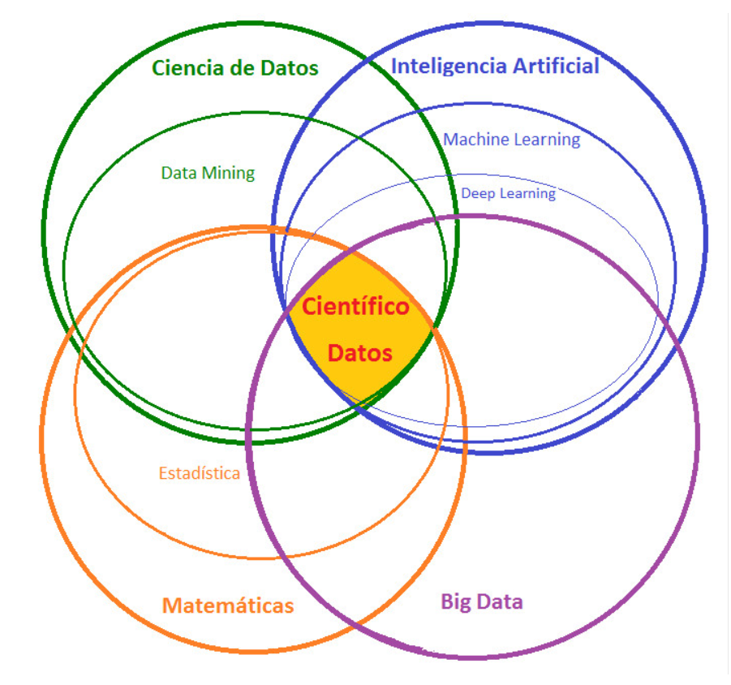{width="60%"}

La denominada **ciencia de datos** (*data science*) se ha vuelto muy popular hoy en día. Se trata de un campo multidisciplinar, con importantes aportaciones estadísticas e informáticas, dentro del que se incluyen disciplinas como **minería de datos** (*data mining*), **aprendizaje automático** (*machine learning*), **aprendizaje profundo** (*deep learning*), **modelado predictivo** (*predictive modeling*), **extracción de conocimiento** (*knowledge discovery*) y también el **aprendizaje estadístico** (*statistical learning*). Puede resumirse en el diagrama de Venn de la ciencia de datos de [Drew Conway](http://drewconway.com/zia/2013/3/26/the-data-science-venn-diagram) (Figura \@ref(fig:venn)).

```{r venn, echo=FALSE, out.width="50%", fig.cap="Diagrama de Venn de la ciencia de datos"}
knitr::include_graphics("images/Data-Science-Venn-Diagram_alt.png")
```

Podemos definir la ciencia de datos como el conjunto de conocimientos y herramientas utilizados en las distintas etapas del análisis de datos (Figura \@ref(fig:esquema2)), incluyendo la gestión, obtención y manipulación de los datos (ver Capítulo \@ref(manipR)).

Una de estas etapas es la construcción de modelos, a partir de los datos, para aprender y predecir. El **aprendizaje estadístico** (AE) se encarga de este problema desde un punto de vista estadístico: se consideran modelos estocásticos (con componente aleatoria) para tener en cuenta la incertidumbre debida a no disponer de toda la información sobre las variables que influyen en el fenómeno de interés.

En la inferencia estadística clásica se trata de explicar por completo lo que ocurre en la población y, suponiendo que esto se puede hacer con modelos tratables analíticamente, emplear resultados teóricos (típicamente asintóticos) para realizar inferencias, incluida la predicción. Los avances en computación han permitido el uso de modelos estadísticos más avanzados, principalmente métodos no paramétricos, muchos de los cuales no se pueden tratar analíticamente (o no por completo): este es el campo de la **estadística computacional**, en el que se enmarcaría el AE.

Cuando pensamos en AE, pensamos en:

- **Flexibilidad**: se tratan de obtener las conclusiones basándose únicamente en los datos, evitando asumir hipótesis para poder emplear resultados teóricos. La idea es "dejar hablar" a los datos, no "encorsetarlos" a priori.

- **Procesamiento automático de datos**: el proceso de aprendizaje puede realizarse con la menor intervención interactiva posible por parte del analista.

- ***Big data***: en sentido amplio, no solo tamaño muestral, también datos complejos o con necesidad de alta velocidad de proceso.

- **Predicción**: el objetivo (inicial) suele ser únicamente la predicción de nuevas observaciones, con métodos que son simples algoritmos.

Por el contrario, muchos de los métodos del AE no se preocupan (o se preocupan poco) por:

- **Reproducibilidad**: pequeños cambios en los datos pueden producir cambios notables en el modelo ajustado, aunque no deberían influir mucho en las predicciones. Muchas técnicas son además aleatorias, por lo que el resultado puede depender de la semilla empleada.

- **Cuantificación de la incertidumbre**: se obtienen medidas globales de la eficiencia del algoritmo, pero resulta complicado cuantificar la precisión de una predicción concreta.

- **Inferencia**: aparte de la predicción, la mayoría de los métodos no permiten realizar inferencias sobre características de la población (como contrastes de hipótesis).

Además, esta aproximación puede presentar diversos inconvenientes: algunos métodos son poco interpretables ("cajas negras"), pueden aparecer problemas de sobreajuste (*overfitting*, ver Sección \@ref(const-eval)) y pueden presentar más problemas al extrapolar o interpolar que los métodos clásicos (cuanto más flexible el algoritmo, más cuidado hay que tener al predecir en observaciones alejadas de la muestra empleada en el ajuste).

### Aprendizaje estadístico vs. aprendizaje automático

El término *machine learning* (ML; aprendizaje automático) se utiliza en *inteligencia artificial* desde 1959 para referirse, fundamentalmente, a algoritmos de predicción. Muchas de sus herramientas provienen de la estadística, que es la base de todos estos enfoques (conviene no perder la base formal). Por ello, desde la estadística computacional se introdujo el término *statistical learning* (aprendizaje estadístico) para referirse a este tipo de herramientas, pero desde el punto de vista estadístico (teniendo en cuenta la incertidumbre debida a no disponer de toda la información).

Tradicionalmente, ML no se preocupa del origen de los datos; incluso es habitual considerar que un conjunto enorme de datos equivale a disponer de toda la información (la población). Por el contrario, en AE se trata de comprender, en la medida de lo posible, el proceso subyacente del que provienen los datos y si son representativos de la población de interés (si tienen algún tipo de sesgo, especialmente de selección).

#### Las dos culturas

Breiman (2001), en su célebre artículo *Statistical modeling: the two cultures*, diferencia dos objetivos en el análisis de datos, *información* (en el sentido de inferencia) y *predicción*, que dan lugar a dos culturas:

- *Modelización de datos*: desarrollo de modelos (estocásticos) que permitan ajustar los datos y hacer inferencia. Es el trabajo habitual de los estadísticos académicos.

- *Modelización algorítmica* (predictiva): no está interesada en los mecanismos que generan los datos, solo en los algoritmos de predicción. Es el trabajo habitual de muchos estadísticos industriales y de muchos ingenieros informáticos. El ML es el núcleo de esta cultura, que pone todo el énfasis en la precisión predictiva (de ahí el papel dinamizador de competiciones entre algoritmos, al estilo del [Netflix Challenge](https://en.wikipedia.org/wiki/Netflix_Prize)).

### Métodos de aprendizaje estadístico

Dentro del AE se suelen diferenciar dos grandes bloques. El **aprendizaje no supervisado** comprende los métodos exploratorios, en los que no hay una variable respuesta explícita, y cuyo objetivo es entender las relaciones y estructuras presentes en los datos: análisis descriptivo, métodos de reducción de la dimensión (componentes principales, análisis factorial...), métodos de agrupación (análisis clúster) y detección de datos atípicos.

El **aprendizaje supervisado** engloba los métodos predictivos, en los que una de las variables está definida como variable respuesta, y cuyo objetivo es construir modelos que se utilizarán sobre todo para predecir. Dependiendo del tipo de variable respuesta se diferencia entre:

- **Clasificación**: si la respuesta es categórica.

- **Regresión**: cuando la respuesta es numérica.

En lo que sigue nos centraremos en el aprendizaje supervisado, combinando terminología estadística con la empleada en AE/ML.

#### Notación y terminología {#notacion}

Denotaremos por $\mathbf{X}=(X_1, X_2, \ldots, X_p)$ al vector de variables predictoras (explicativas o independientes; *inputs* o *features* en ML), cada una numérica o categórica. Emplearemos $Y(\mathbf{X})$ para la variable objetivo (respuesta o dependiente; *output* o *target* en ML), numérica (regresión) o categórica (clasificación).

Supondremos que el objetivo principal es, a partir de una muestra $\left\{\left( y_{i}, x_{1i}, \ldots, x_{pi} \right)  : i = 1, \ldots, n \right\}$, ajustar en regresión un modelo general de la forma (posiblemente tras una transformación de la respuesta):

\begin{equation}
  Y(\mathbf{X})=m(\mathbf{X})+\varepsilon
  (\#eq:modelogeneral)
\end{equation}

donde $m(\mathbf{x}) = E\left( \left. Y\right\vert \mathbf{X}=\mathbf{x} \right)$ es la media condicional (función de regresión o tendencia) y $\varepsilon$ un error aleatorio de media cero y varianza $\sigma^2$, independiente de $\mathbf{X}$.

Esta hipótesis de independencia (o al menos de incorrelación) entre observaciones es razonable cuando los datos provienen de un muestreo aleatorio simple, pero puede no ser adecuada con datos dependientes, como series temporales (dependencia temporal, ver Capítulo \@ref(tidyverse)) o datos espaciales (dependencia espacial). En esos casos habría que emplear métodos específicos que tengan en cuenta esa dependencia, lo que queda fuera del alcance de esta introducción.

#### Métodos (de aprendizaje supervisado) y paquetes de R {#metodos-pkgs}

Hay una gran cantidad de métodos de aprendizaje supervisado implementados en centenares de paquetes de `R` (ver [CRAN Task View: Machine Learning](https://cran.r-project.org/web/views/MachineLearning.html)). Algunos de los principales:

Métodos (principalmente) de clasificación:

- Análisis discriminante, regresión logística, multinomial...: `stats`, `MASS`.
- *k*-vecinos más próximos (KNN): `class`, `kknn`, `caret`.
- Árboles de decisión, *bagging*, bosques aleatorios, *boosting*: `rpart`, `party`, `C50`, `randomForest`, `adabag`, `xgboost`.
- Máquinas de soporte vectorial: `kernlab`, `e1071`.

Métodos (principalmente) de regresión:

- Modelos lineales (`lm()`), regularizados (*ridge*, LASSO: `glmnet`) y lineales generalizados (`glm()`).
- Modelos paramétricos no lineales (`nls()`).
- Regresión local y suavizado: `kknn`, `loess()`, `np`.
- Modelos aditivos generalizados: `mgcv`.
- Redes neuronales: `nnet`, `neuralnet`.

Como todos estos paquetes emplean opciones y convenciones distintas, se han desarrollado paquetes que ofrecen interfaces unificadas, entre ellos `r cite_pkg_("caret", "https://topepo.github.io/caret")`, `r cite_pkg_("mlr3", "https://mlr3.mlr-org.com")` y `r cite_pkg_("tidymodels", "https://www.tidymodels.org")` (este último juega, para el modelado predictivo, un papel similar al que `tidyverts`/`fable` de Hyndman juega para las series temporales; ver Capítulo \@ref(tidyverse)). También existen paquetes con entornos gráficos que evitan el uso de código, como `r cite_pkg_("rattle", "https://rattle.togaware.com")`.

### Construcción y evaluación de los modelos {#const-eval}

En la inferencia estadística clásica se emplea toda la información disponible para ajustar un modelo y, asumiendo que es correcto, se usan resultados teóricos para evaluar su precisión (por ejemplo, el coeficiente de determinación ajustado en regresión lineal múltiple). En estadística computacional, en cambio, es habitual evaluar la precisión mediante técnicas de remuestreo, como la validación cruzada, el *jackknife* o el *bootstrap*, entrenando el modelo con los datos disponibles y estimando el error de predicción de forma empírica.

Muchos métodos de AE son muy flexibles y pueden llegar a sobreajustarse a los datos de entrenamiento. Para evitarlo hay que controlar el proceso de aprendizaje mediante **hiperparámetros** (*tuning parameters*), que imponen restricciones al modelo. Una elección inadecuada puede dar lugar a sobreajuste (*overfitting*) o infraajuste (*underfitting*); además, una mayor complejidad suele reducir la interpretabilidad, por lo que el objetivo es lograr buenas predicciones con el modelo más simple posible.

#### Equilibrio entre sesgo y varianza: infraajuste y sobreajuste {#bias-variance}

Queremos aprender más allá de los datos de entrenamiento (hacer inferencia sobre nuevas observaciones). En AE hay que tener especial cuidado con el sobreajuste: el modelo se ajusta demasiado bien a los datos de entrenamiento pero falla con datos nunca vistos.

Recordando el modelo general \@ref(eq:modelogeneral), bajo una función de pérdida cuadrática el predictor óptimo (desconocido) sería la media condicional $m(\mathbf{x})$: el objetivo de cualquier método de AE es aproximarla lo mejor posible a partir de la muestra disponible.

Como ejemplo ilustrativo empleamos regresión polinómica, considerando el grado del polinomio como hiperparámetro que determina la complejidad del modelo. Simulamos una muestra y ajustamos modelos con distinta complejidad:

```{r polyfit, out.width="80%", fig.cap="Muestra (simulada) y ajustes polinómicos con distinta complejidad."}
# Simulación datos
n <- 30
x <- seq(0, 1, length = n)
mu <- 2 + 4*(5*x - 1)*(4*x - 2)*(x - 0.8)^2 # grado 4
sd <- 0.5
set.seed(1)
y <- mu + rnorm(n, 0, sd)
plot(x, y)
lines(x, mu, lwd = 2)
# Ajuste de los modelos
fit1 <- lm(y ~ x)
lines(x, fitted(fit1))
fit2 <- lm(y ~ poly(x, 4))
lines(x, fitted(fit2), lty = 2)
fit3 <- lm(y ~ poly(x, 20))
lines(x, fitted(fit3), lty = 3)
legend("topright", lty = c(1, 1, 2, 3), lwd = c(2, 1, 1, 1),
       legend = c("Verdadero", "Ajuste con grado 1",
                  "Ajuste con grado 4",
                  "Ajuste con grado 20"))
```

Al aumentar la complejidad se consigue un mejor ajuste a los datos de entrenamiento (Figura \@ref(fig:polyfit)), a costa de un incremento de la variabilidad de las predicciones, lo que puede empeorar el comportamiento del modelo con datos distintos de los observados. Si calculamos medidas de bondad de ajuste (MSE, $R^2$) se obtienen mejores resultados al aumentar la complejidad (Tabla \@ref(tab:gof-polyfit)):

```{r gof-polyfit, echo=FALSE}
gof <- t(sapply(list("`fit1`" = fit1, "`fit2`" = fit2, "`fit3`" = fit3),
    function(x) with(summary(x), c("$MSE$" = mean(residuals^2),
        "$R^2$" = r.squared, "$R^2_{adj}$" = adj.r.squared))))
cap <- "Medidas de bondad de ajuste de los modelos polinómicos (entrenamiento)."
knitr::kable(gof, "pipe", digits = 2, position = "!htb", caption = cap)
```

Pero si generamos nuevas respuestas del mismo proceso (predecimos), la precisión del modelo más complejo empeora considerablemente (Figura \@ref(fig:polyfit2)):

```{r polyfit2, out.width="90%", fig.cap="Muestra con ajustes polinómicos con distinta complejidad y nuevas observaciones."}
y.new <- mu + rnorm(n, 0, sd)
plot(x, y)
points(x, y.new, pch = 2)
lines(x, mu, lwd = 2)
lines(x, fitted(fit1))
lines(x, fitted(fit2), lty = 2)
lines(x, fitted(fit3), lty = 3)
leyenda <- c("Verdadero", "Muestra", "Ajuste con grado 1",
       "Ajuste con grado 4", "Ajuste con grado 20", "Nuevas observaciones")
legend("topright", legend = leyenda, lty = c(1, NA, 1, 2, 3, NA),
       lwd = c(2, NA, 1, 1, 1, NA), pch = c(NA, 1, NA, NA, NA, 2))
MSEP <- sapply(list(fit1 = fit1, fit2 = fit2, fit3 = fit3),
               function(x) mean((y.new - fitted(x))^2))
MSEP
```

Repitiendo la simulación 100 veces variando el grado del polinomio de 1 a 20 y evaluando la precisión tanto en la muestra de ajuste como en un nuevo conjunto de datos, obtenemos la Figura \@ref(fig:polyfitsim): los errores de entrenamiento disminuyen al aumentar la complejidad, pero los errores de predicción en nuevas observaciones inicialmente disminuyen, alcanzan un mínimo (línea vertical discontinua, modelo de grado 4) y después aumentan. A la izquierda de esa línea habría infraajuste (mayor sesgo, menor varianza) y a la derecha, sobreajuste (menor sesgo, mayor varianza).

```{r polyfitsim, out.width="80%", fig.cap="Precisiones (errores cuadráticos medios) de ajustes polinómicos en las muestras empleadas en el ajuste y en nuevas observaciones."}
nsim <- 100
set.seed(1)
grado.max <- 20
grados <- seq_len(grado.max)
# Simulación, ajustes y errores cuadráticos
mse <- mse.new <- matrix(nrow = grado.max, ncol = nsim)
for(i in seq_len(nsim)) {
  y <- mu + rnorm(n, 0, sd)
  y.new <- mu + rnorm(n, 0, sd)
  for (grado in grados) {
    fit <- lm(y ~ poly(x, grado))
    mse[grado, i] <- mean(residuals(fit)^2)
    mse.new[grado, i] <- mean((y.new - fitted(fit))^2)
  }
}
# Representación errores simulaciones
matplot(grados, mse, type = "l", col = "lightgray", lty = 1,
        ylim = c(0, 2), xlab = "Grado del polinomio (complejidad)", 
        ylab = "Error cuadrático medio")
matlines(grados, mse.new, type = "l", lty = 2, col = "lightgray")
# Errores globales
precision <- rowMeans(mse)
precision.new <- rowMeans(mse.new)
lines(grados, precision, lwd = 2)
lines(grados, precision.new, lty = 2, lwd = 2)
abline(h = sd^2, lty = 3); abline(v = 4, lty = 3)
legend("topright", lty = c(1, 2),
       legend = c("Muestras", "Nuevas observaciones"))
```

En general, al aumentar la complejidad disminuye el sesgo y aumenta la varianza (y viceversa): es el compromiso entre sesgo y varianza (*bias-variance tradeoff*, Figura \@ref(fig:biasvar)). La recomendación es seleccionar los hiperparámetros tratando de equilibrar ambos.

```{r biasvar, echo=FALSE, out.width="80%", fig.cap="Equilibrio entre sesgo y varianza (Fuente: Wikimedia Commons)."}
knitr::include_graphics("images/Bias-variance_tradeoff.png")
```

#### Datos de entrenamiento y datos de test {#entrenamiento-test}

Si el número de observaciones no es muy grande, se puede entrenar el modelo con todos los datos y emplear técnicas de remuestreo para evaluar la precisión (validación cruzada o *bootstrap*). Si el número de observaciones es grande, se suele particionar la base de datos en 2 (o 3) conjuntos disjuntos: **entrenamiento** (para construir los modelos) y **test** (para evaluar el rendimiento; los errores en esta muestra aproximan lo que ocurriría con nuevas observaciones). Típicamente se selecciona al azar un 80% para entrenamiento y un 20% para test.

Como ejemplo consideraremos el conjunto de datos `Boston` del paquete `MASS`, con la valoración de viviendas (`medv`) y el porcentaje de población con "menor estatus" (`lstat`) en los suburbios de Boston:

```{r}
data(Boston, package = "MASS")
set.seed(2)
nobs <- nrow(Boston)
itrain <- sample(nobs, round(0.8 * nobs))
train <- Boston[itrain, ]
test <- Boston[-itrain, ]
```

Análisis descriptivo básico de la muestra de entrenamiento:

```{r}
str(train)
summary(train)
par(mfrow = c(1, 3))
plot(density(train[, "medv"]), main = "Densidad")
boxplot(train$medv, main = "Boxplot")
vioplot::vioplot(train$medv, main = "Violín")
```

Para explorar las relaciones entre variables numéricas podemos representar la matriz de correlaciones con `GGally::ggpairs()`:

```{r}
library(GGally)
# solo se visualizan las variables de la posición (columna) 7 a 14
ggpairs(train, columns = 7:14)
```

```{r eval=FALSE}
# Alternativas clásicas:
pairs(train[, 7:14])
mcor <- cor(train)
round(mcor, 2)
library(corrplot)
corrplot(mcor)
```

Los datos de *test* deben utilizarse **exclusivamente** para evaluar el rendimiento final de los modelos, nunca para seleccionar hiperparámetros. Para esto último hay varias estrategias habituales:

- **Partición entrenamiento-validación-test**: la muestra se divide en tres subconjuntos (por ejemplo 70%-15%-15%). Los hiperparámetros se seleccionan con la muestra de validación y el modelo final se evalúa una única vez sobre el test.

- **Validación cruzada (*cross-validation*)**: los datos de entrenamiento se reutilizan mediante remuestreo. En la validación cruzada *k-fold*, los datos se dividen en *k* bloques disjuntos; en cada iteración uno actúa como validación y los *k-1* restantes como entrenamiento, repitiendo el proceso *k* veces.

- **Validación cruzada dejando una observación fuera** (*leave-one-out*, LOOCV): caso particular de *k-fold* con tantos bloques como observaciones. Aprovecha al máximo los datos, pero puede ser costosa computacionalmente y dar estimaciones con elevada varianza.

- **Bootstrap**: se generan remuestras con reemplazamiento; el modelo se ajusta en cada una y se evalúa sobre las observaciones no seleccionadas (*out-of-bag*).

En el caso de series temporales no es adecuado emplear particiones aleatorias, ya que se rompería la dependencia temporal: se emplean esquemas que respetan el orden cronológico (bloques temporales, o *rolling forecasting*/*time series cross-validation*, reentrenando sucesivamente con observaciones pasadas para predecir valores futuros; ver Capítulo \@ref(tidyverse) y, para más detalle, la [Sección 5.10 de *Forecasting: Principles and Practice*](https://otexts.com/fpp3/tscv.html) de Hyndman y Athanasopoulos).

#### Selección de hiperparámetros mediante validación cruzada {#cv}

Continuando con el ejemplo anterior, empleemos regresión polinómica para explicar la valoración de las viviendas a partir del estatus de los residentes (Figura \@ref(fig:bostonmass)), considerando de nuevo el grado del polinomio como hiperparámetro:

```{r bostonmass, out.width="85%", fig.cap="Valoración de las viviendas (medv) frente al porcentaje de población con menor estatus (lstat)."}
formula <- medv ~ lstat
plot(formula, data = train)
modelo0 <- lm(formula, train)
modelo0
summary(modelo0)
```

El ajuste lineal simple no es del todo adecuado (Figura \@ref(fig:bostondiag)), lo que motiva probar con polinomios de mayor grado:

```{r bostondiag, fig.cap="Gráficos de diagnóstico del modelo lineal simple."}
par(mfrow = c(2, 2))
plot(modelo0)
par(mfrow = c(1, 1))
```

En el caso de regresión lineal múltiple (y otros predictores lineales) se pueden obtener fácilmente las predicciones eliminando una observación a partir del ajuste con todos los datos (ver `?rstandard`), evitando así ajustar el modelo tantas veces como observaciones:

```{r}
cv.lm <- function(formula, datos) {
    modelo <- lm(formula, datos)
    return(rstandard(modelo, type = "predictive"))
}
res.cv2 <- cv.lm(medv ~ poly(lstat, 2), train)
res.cv4 <- cv.lm(medv ~ poly(lstat, 4), train)
res.cv5 <- cv.lm(medv ~ poly(lstat, 5), train) # Óptimo con 5 grados
res.cv6 <- cv.lm(medv ~ poly(lstat, 6), train)
c(mean(res.cv2^2), mean(res.cv4^2), mean(res.cv5^2), mean(res.cv6^2))
```

Calculamos el error cuadrático medio de validación cruzada para cada grado del polinomio y seleccionamos el que lo minimiza (Figura \@ref(fig:cvmse)):

```{r cvmse, fig.cap="Error cuadrático medio de validación cruzada según el grado del polinomio (complejidad)."}
grado.max <- 10
grados <- seq_len(grado.max)
cv.mse <- cv.mse.sd <- numeric(grado.max)
for (grado in grados) {
  cv.res <- cv.lm(medv ~ poly(lstat, grado), train)
  se <- cv.res^2
  cv.mse[grado] <- mean(se)
  cv.mse.sd[grado] <- sd(se) / sqrt(length(se))
}
plot(grados, cv.mse, ylim = c(25, 45), xlab = "Grado del polinomio")
imin.mse <- which.min(cv.mse)
grado.min <- grados[imin.mse]
points(grado.min, cv.mse[imin.mse], pch = 16)
grado.min
```

En lugar de emplear el valor óptimo del hiperparámetro, Breiman et al. (1984) propusieron la regla de "un error estándar" (*one-standard-error rule*): dado que las estimaciones de precisión presentan variabilidad, se selecciona el modelo más simple cuya precisión esté dentro de un error estándar de la del modelo óptimo (Figura \@ref(fig:cvonese)):

```{r cvonese, fig.cap="Selección del grado del polinomio mediante validación cruzada: valor óptimo y criterio de un error estándar (punto sólido)."}
plot(grados, cv.mse, ylim = c(25, 45), xlab = "Grado del polinomio")
segments(grados, cv.mse - cv.mse.sd, grados, cv.mse + cv.mse.sd)
upper.cv.mse <- cv.mse[imin.mse] + cv.mse.sd[imin.mse]
abline(h = upper.cv.mse, lty = 2)
imin.1se <- min(which(cv.mse <= upper.cv.mse))
grado.1se <- grados[imin.1se]
points(grado.1se, cv.mse[imin.1se], pch = 16)
grado.1se
```

```{r bostonfinal, fig.cap="Ajuste de los modelos finales: valor óptimo (línea continua) y criterio de un error estándar (línea discontinua)."}
plot(medv ~ lstat, data = train)
fit.min <- lm(medv ~ poly(lstat, grado.min), train)
fit.1se <- lm(medv ~ poly(lstat, grado.1se), train)
newdata <- data.frame(lstat = seq(0, 40, len = 100))
lines(newdata$lstat, predict(fit.min, newdata = newdata), lwd = 3)
lines(newdata$lstat, predict(fit.1se, newdata = newdata),
      lty = 2, col = 2, lwd = 3)
legend("topright", legend = c(paste("Grado óptimo:", grado.min),
       paste("oneSE rule:", grado.1se)), lty = c(1, 2))
```

::: {.exercise #train-validate-test}
Particiona la muestra `Boston` en datos de entrenamiento (70%), validación (15%) y test (15%), para entrenar los modelos polinómicos, seleccionar el grado óptimo (el hiperparámetro) y evaluar las predicciones del modelo final. Puede ser de utilidad:

```{r}
df <- Boston
set.seed(1)
nobs <- nrow(df)
itrain <- sample(nobs, 0.7 * nobs)
inotrain <- setdiff(seq_len(nobs), itrain)
ivalidate <- sample(inotrain, 0.15 * nobs)
itest <- setdiff(inotrain, ivalidate)
train <- df[itrain, ]
validate <- df[ivalidate, ]
test <- df[itest, ]
```
:::

::: {.exercise #train-boot-boston}
Una alternativa a la partición clásica en entrenamiento y validación es emplear **bootstrap** para estimar el error de predicción: se genera una remuestra bootstrap a partir del entrenamiento, se ajusta el modelo sobre ella y se evalúa el error en las observaciones no seleccionadas (*out-of-bag*, OOB). Trabajando de nuevo con `Boston` (`medv` frente a `lstat`), realiza el ajuste empleando una única muestra bootstrap y evalúa las predicciones en la muestra de test. Puede ser de utilidad:

```{r}
data(Boston, package = "MASS")
set.seed(1)
nobs <- nrow(Boston)
itrain <- sample(nobs, size = floor(0.8 * nobs))
train <- Boston[itrain, ]
test  <- Boston[-itrain, ]
# Remuestra bootstrap (con reemplazamiento) 
# de los índices de entrenamiento
set.seed(1)
ntrain <- nrow(train)
itrain_boot <- sample(seq_len(ntrain), replace = TRUE)
train_boot <- train[itrain_boot, ]
# Observaciones "out of bag" (no seleccionadas en la remuestra)
oob <- train[-itrain_boot, ]
```
:::

#### Evaluación de un método de regresión {#eval-reg}

Para estudiar la precisión de las predicciones se evalúa el modelo en el conjunto de test y se comparan las predicciones frente a los valores reales. En un gráfico de dispersión de observaciones frente a predicciones (Figura \@ref(fig:obspredplot)), los puntos deberían estar en torno a la recta $y=x$:

```{r obspredplot, fig.cap="Observaciones frente a predicciones (identidad, línea continua, y ajuste lineal, línea discontinua)."}
obs <- test$medv
pred <- predict(fit.min, newdata = test)
plot(pred, obs, xlab = "Predicción", ylab = "Observado")
abline(a = 0, b = 1)
res <- lm(obs ~ pred)
abline(res, lty = 2)
```

También es habitual calcular medidas de error, como las que proporciona `caret::postResample()`:

```{r}
caret::postResample(pred, obs)
sqrt(mean((obs - pred)^2))
mean(abs(obs - pred))
```

Además de las medidas de error habituales, `postResample()` calcula un *pseudo R-cuadrado* basado en el cuadrado de la correlación entre predicciones y observaciones, que no tiene en cuenta el sesgo (obtendríamos el mismo valor si desplazamos las predicciones sumando una constante). Una alternativa preferible sería:
$$\tilde R^2 = 1 - \frac{\sum_{i=1}^n(y_i - \hat y_i)^2}{\sum_{i=1}^n(y_i - \bar y)^2}$$
(equivalente al coeficiente de determinación ajustado, pero sin depender de las hipótesis estructurales del modelo), implementada junto con otras medidas de error en la función `accuracy()` del paquete [`mpae`](https://cran.r-project.org/package=mpae) (el mismo paquete de los autores del libro de referencia de esta sección):

```{r}
library(mpae)
accuracy <- function(pred, obs, na.rm = FALSE,
                     tol = sqrt(.Machine$double.eps)) {
  err <- obs - pred     # Errores
  if (na.rm) {
    is.a <- !is.na(err)
    err <- err[is.a]
    obs <- obs[is.a]
  }
  perr <- 100 * err / pmax(obs, tol)  # Errores porcentuales
  return(c(
    me = mean(err),           # Error medio
    rmse = sqrt(mean(err^2)), # Raíz del error cuadrático medio
    mae = mean(abs(err)),     # Error absoluto medio
    mpe = mean(perr),         # Error porcentual medio
    mape = mean(abs(perr)),   # Error porcentual absoluto medio
    # Pseudo R-cuadrado
    r.squared = 1 - sum(err^2) / sum((obs - mean(obs))^2) 
  ))
}
accu.min <- accuracy(pred, obs)
accu.min
accu.1se <- accuracy(predict(fit.1se, newdata = test), obs)
accu.1se
```

En este caso, el ajuste polinómico con el grado óptimo explicaría un `r sprintf("%.1f %%", 100*accu.min["r.squared"])` de la variabilidad de la respuesta en nuevas observaciones (un `r sprintf("%.1f %%", 100*(accu.min["r.squared"] - accu.1se["r.squared"]))` más que el modelo seleccionado con el criterio de un error estándar).

### Clasificación {#clasificacion}

Todo lo anterior se ilustró con un problema de regresión (`medv` es numérica), ajustado al modelo general \@ref(eq:modelogeneral). Cuando la respuesta es categórica hablamos de **clasificación**: ese modelo no es directamente aplicable a variables categóricas, aunque muchos métodos (como la regresión logística) lo emplean para una variable auxiliar numérica que después se transforma a probabilidades mediante la función logística. Veamos un ejemplo breve, tanto con dos clases (clasificación *binaria*) como con más de dos (*multiclase*), empleando el conjunto de datos `iris` (tres especies de lirio a partir de las medidas de sépalos y pétalos).

#### Ejemplo: clasificación binaria y multiclase con KNN {#knn-ejemplo}

El método de los **k-vecinos más próximos** (*k-nearest neighbors*, KNN) es uno de los más simples e intuitivos: para clasificar una nueva observación, busca las $k$ observaciones de entrenamiento más cercanas (según alguna distancia, típicamente la euclídea) y le asigna la clase mayoritaria entre ellas.

Para el caso binario nos quedamos únicamente con dos de las tres especies:

```{r}
data(iris)
iris2 <- droplevels(subset(iris, Species != "setosa"))
set.seed(1)
nobs <- nrow(iris2)
itrain <- sample(nobs, round(0.8 * nobs))
train2 <- iris2[itrain, ]
test2 <- iris2[-itrain, ]

library(class)
pred2 <- knn(train = train2[, c("Petal.Length", "Petal.Width")],
             test = test2[, c("Petal.Length", "Petal.Width")],
             cl = train2$Species, k = 5)
table(Predicho = pred2, Real = test2$Species)
mean(pred2 == test2$Species) # precisión (proporción de aciertos)
```

Lo interesante de KNN es que se extiende de forma **directa** al caso multiclase: la votación por mayoría entre los $k$ vecinos funciona igual sea cual sea el número de clases, sin necesidad de ningún truco adicional. Repitamos el ejemplo con las tres especies:

```{r}
set.seed(1)
nobs <- nrow(iris)
itrain <- sample(nobs, round(0.8 * nobs))
train3 <- iris[itrain, ]
test3 <- iris[-itrain, ]

pred3 <- knn(train = train3[, c("Petal.Length", "Petal.Width")],
             test = test3[, c("Petal.Length", "Petal.Width")],
             cl = train3$Species, k = 5)
table(Predicho = pred3, Real = test3$Species)
mean(pred3 == test3$Species)
```

No todos los métodos son tan flexibles: muchos clasificadores habituales (regresión logística, máquinas de soporte vectorial...) son *binarios por construcción* y necesitan una estrategia adicional para abordar más de dos clases. Las dos más empleadas son:

- **Uno contra uno** (*one-vs-one*, OVO): se entrena un clasificador binario para cada posible par de clases ($\binom{K}{2}$ modelos con $K$ clases) y se decide por votación mayoritaria entre todos ellos.
- **Uno contra el resto** (*one-vs-all*/*one-vs-rest*, OVA/OVR): se entrena un clasificador binario por cada clase frente a todas las demás juntas ($K$ modelos), y se asigna la clase cuyo modelo dé mayor confianza.

Antes de ver cómo resuelve esto un paquete concreto, conviene visualizar qué observaciones entran realmente en cada uno de los clasificadores binarios que componen cada estrategia: en OvR, cada uno de los $K$ clasificadores ve **todas** las observaciones (solo cambia qué especie se toma como positiva); en OvO, cada uno de los $\binom{K}{2}$ clasificadores ve **únicamente** las observaciones de las dos especies implicadas:

```{r ovo-ova, fig.cap="Qué observaciones entran en cada clasificador binario: arriba, uno contra el resto (OvR/OvA); abajo, uno contra uno (OvO)."}
lev <- levels(train3$Species)
col_clase <- c("#2a78d6", "#eb6834", "#1baf7a")
names(col_clase) <- lev
col_resto <- "grey80"
bord_resto <- "grey55"

xlim <- range(train3$Petal.Length)
ylim <- range(train3$Petal.Width)

layout(rbind(1, 2, c(3, 4, 5), 6, c(7, 8, 9)),
       heights = c(0.09, 0.055, 0.40, 0.055, 0.40))

titulo <- function(txt) {
  par(mar = c(0, 1, 0, 0))
  plot.new()
  text(0, 0.5, txt, adj = c(0, 0.5), cex = 1.15, font = 2)
}

par(mar = c(0, 0, 0, 0))
plot.new()
legend("center", legend = c(lev, "Resto"),
       pt.bg = c(col_clase, col_resto), pch = 21, pt.cex = 1.6,
       col = c(rep("black", 3), bord_resto),
       horiz = TRUE, bty = "n", cex = 1.05, text.width = 0.16)

titulo("Uno contra el resto (OvR / OvA): un clasificador por especie")

for (especie in lev) {
  par(mar = c(4, 4, 2.5, 1))
  es_foco <- train3$Species == especie
  plot(train3$Petal.Length[!es_foco], train3$Petal.Width[!es_foco],
       xlim = xlim, ylim = ylim, pch = 21, cex = 1, col = bord_resto,
       bg = col_resto, xlab = "Petal.Length", ylab = "Petal.Width",
       main = paste0(especie, " vs. Resto"))
  points(train3$Petal.Length[es_foco], train3$Petal.Width[es_foco],
         pch = 21, cex = 1.3, col = "black", bg = col_clase[especie])
}

titulo("Uno contra uno (OvO): un clasificador por cada par de especies")

pares <- combn(lev, 2, simplify = FALSE)
for (par_esp in pares) {
  par(mar = c(4, 4, 2.5, 1))
  sel <- train3$Species %in% par_esp
  datos_par <- train3[sel, ]
  plot(datos_par$Petal.Length, datos_par$Petal.Width,
       xlim = xlim, ylim = ylim, pch = 21, cex = 1.3, col = "black",
       bg = col_clase[as.character(datos_par$Species)],
       xlab = "Petal.Length", ylab = "Petal.Width",
       main = paste(par_esp, collapse = " vs. "))
}
```

Puede apreciarse que OvO necesita más clasificadores conforme crece $K$ ($\binom{K}{2}$ frente a $K$), pero cada uno se entrena con un problema más sencillo: menos observaciones, y una frontera potencialmente más clara al enfrentar solo dos especies a la vez en lugar de una especie contra el resto.

Alternativamente, la misma figura puede construirse con `ggplot2`/`patchwork` (código no evaluado; se deja aquí por si se prefiere retomar esta versión más adelante):

```{r ovo-ova-ggplot, eval=FALSE}
library(ggplot2)
library(patchwork)

col_clase <- c(setosa = "#2a78d6", versicolor = "#eb6834",
                virginica = "#1baf7a", Resto = "grey80")
lev <- levels(train3$Species)
xlim <- range(train3$Petal.Length)
ylim <- range(train3$Petal.Width)

ovr <- do.call(rbind, lapply(lev, function(especie) {
  d <- train3
  d$panel <- paste0(especie, " vs. Resto")
  d$grupo <- ifelse(d$Species == especie, especie, "Resto")
  d
}))
ovr$panel <- factor(ovr$panel, levels = paste0(lev, " vs. Resto"))
ovr$grupo <- factor(ovr$grupo, levels = c(lev, "Resto"))
ovr <- ovr[order(ovr$grupo != "Resto"), ]

pares <- combn(lev, 2, simplify = FALSE)
ovo <- do.call(rbind, lapply(pares, function(par_esp) {
  d <- train3[train3$Species %in% par_esp, ]
  d$panel <- paste(par_esp, collapse = " vs. ")
  d$grupo <- factor(as.character(d$Species), levels = lev)
  d
}))
ovo$panel <- factor(ovo$panel,
                     levels = sapply(pares, paste, collapse = " vs. "))

tema_panel <- theme_minimal(base_size = 12) +
  theme(legend.position = "bottom",
        strip.text = element_text(face = "bold"),
        panel.grid.minor = element_blank(),
        plot.title = element_text(face = "bold", size = 12))

p_ovr <- ggplot(ovr, aes(Petal.Length, Petal.Width, fill = grupo)) +
  geom_point(shape = 21, color = "black", size = 2.4, stroke = 0.3) +
  facet_wrap(~ panel, nrow = 1) +
  scale_fill_manual(values = col_clase, name = NULL,
                     limits = c(lev, "Resto")) +
  coord_cartesian(xlim = xlim, ylim = ylim) +
  labs(title = "Uno contra el resto (OvR / OvA)") +
  tema_panel

p_ovo <- ggplot(ovo, aes(Petal.Length, Petal.Width, fill = grupo)) +
  geom_point(shape = 21, color = "black", size = 2.4, stroke = 0.3) +
  facet_wrap(~ panel, nrow = 1) +
  scale_fill_manual(values = col_clase, name = NULL,
                     limits = c(lev, "Resto"), drop = FALSE) +
  coord_cartesian(xlim = xlim, ylim = ylim) +
  labs(title = "Uno contra uno (OvO)") +
  tema_panel

(p_ovr / p_ovo) +
  plot_layout(guides = "collect") &
  theme(legend.position = "bottom")
```

Por ejemplo, `r cite_pkg_("e1071", "https://cran.r-project.org/package=e1071")` resuelve el caso multiclase de las máquinas de soporte vectorial mediante la estrategia OVO por defecto:

```{r}
library(e1071)
modelo_ovo <- svm(Species ~ Petal.Length + Petal.Width,
                   data = train3, kernel = "linear")
pred_ovo <- predict(modelo_ovo, newdata = test3)
table(Predicho = pred_ovo, Real = test3$Species)
mean(pred_ovo == test3$Species)
```

Como con la regresión, la evaluación (matriz de confusión, precisión, u otras medidas como sensibilidad/especificidad) debe hacerse siempre sobre datos de test no utilizados para entrenar, y los hiperparámetros (aquí, $k$ o el tipo de *kernel*) se seleccionarían por validación cruzada (Sección \@ref(cv)) igual que en regresión.

#### La maldición de la dimensionalidad {#maldicion}

Los métodos basados en distancias o vecindarios locales, como KNN, se ven especialmente afectados por la llamada **maldición de la dimensionalidad** (*curse of dimensionality*): a medida que aumenta el número de predictores $p$, los datos se vuelven cada vez más dispersos en ese espacio de mayor dimensión, y el concepto de "vecino cercano" deja de ser realmente local.

Una forma sencilla de verlo: para capturar una fracción fija $r$ del volumen de datos mediante un hipercubo centrado en el punto de interés, el lado necesario de ese hipercubo es $r^{1/p}$. Cuanto mayor es $p$, más se acerca ese lado al rango completo de cada variable:

```{r maldicion, fig.cap="Lado del hipercubo necesario para capturar un 10% de los datos, según la dimensión."}
r <- 0.1  # fracción de datos que queremos capturar (10%)
p <- c(1, 2, 5, 10, 20, 50, 100)
lado <- r^(1 / p)
data.frame(p = p, lado_hipercubo = round(lado, 3))
plot(p, lado, type = "b", ylim = c(0, 1),
     xlab = "Número de predictores (p)",
     ylab = "Lado del hipercubo necesario")
abline(h = 1, lty = 2)
```

Con $p=1$ basta con recorrer el $10\%$ del rango de la variable; con $p=100$ haría falta cubrir prácticamente el rango completo ($97.7\%$) en *cada* predictor para conseguir esos mismos "vecinos". Es decir, con muchos predictores, los vecinos más próximos dejan de ser realmente próximos, salvo que se disponga de muestras enormes. Esto explica por qué, en dimensión alta, suelen preferirse métodos que no dependen tanto de la localidad (modelos lineales, regularización) o técnicas previas de selección/reducción de variables, que se tratan en el libro completo de referencia.

## Modelización con `tidymodels` {#tidymodels}

Como se comentó en la Sección \@ref(metodos-pkgs), cada paquete de modelización emplea su propia interfaz (argumentos, formato de los datos de entrada y salida...), lo que complica combinar y comparar métodos distintos. Paquetes como `caret` resuelven este problema ofreciendo una interfaz común; de hecho, el libro completo de referencia de esta sección (Fernández-Casal, Costa y Oviedo) emplea `caret` con este propósito. Como en este curso ya hemos trabajado con el universo `tidyverse` (Capítulo \@ref(tidyverse)), resulta natural emplear en su lugar `r cite_pkg_("tidymodels", "https://www.tidymodels.org")`, una colección de paquetes que sigue la misma filosofía (funciones que devuelven *tibbles*, uso extensivo de *pipes*) para cubrir todo el flujo de trabajo del AE:

- `r cite_pkg_("rsample", "https://rsample.tidymodels.org")`: partición y remuestreo de los datos (entrenamiento/test, validación cruzada, *bootstrap*...).
- `r cite_pkg_("recipes", "https://recipes.tidymodels.org")`: preprocesamiento de los datos (creación de variables, transformaciones...) de forma reproducible entre entrenamiento y test.
- `r cite_pkg_("parsnip", "https://parsnip.tidymodels.org")`: especificación de modelos con una interfaz común, independiente del paquete (*engine*) que finalmente ajusta el modelo.
- `r cite_pkg_("workflows", "https://workflows.tidymodels.org")`: combina receta y modelo en un único objeto.
- `r cite_pkg_("tune", "https://tune.tidymodels.org")` y `r cite_pkg_("dials", "https://dials.tidymodels.org")`: selección de hiperparámetros (equivalente al `train()` de `caret`).
- `r cite_pkg_("yardstick", "https://yardstick.tidymodels.org")`: cálculo de medidas de precisión.
- `r cite_pkg_("themis", "https://themis.tidymodels.org")`: pasos adicionales de receta para remuestrear clases desbalanceadas.
- `r cite_pkg_("broom", "https://broom.tidymodels.org")`: convierte la salida (habitualmente poco manejable) de un modelo de R en un *tibble*; muy útil junto con `dplyr::group_by()`/`tidyr::nest()` y `purrr::map()` para ajustar y resumir muchos modelos a la vez (p. ej. un modelo por grupo).

Para profundizar, la referencia principal es el libro (gratuito) [*Tidy Modeling with R*](https://www.tmwr.org) de Kuhn y Silge, junto con la documentación oficial en <https://www.tidymodels.org> (incluye *vignettes* y una *cheat sheet* para cada paquete).

Veamos cómo, con estas herramientas, se puede reproducir lo que hicimos "a mano" tanto en el ejemplo de regresión (selección del grado del polinomio) como en el de clasificación (selección de $k$ en KNN).

### Regresión: seleccionando el grado del polinomio con `tune_grid()` {#tidymodels-reg}

Retomamos el ejemplo de la Sección \@ref(cv) (valoración de viviendas `medv` frente al estatus `lstat`, conjunto `Boston`, mismas particiones `train`/`test`). En lugar del bucle manual, definimos una receta que incluye el grado del polinomio como hiperparámetro a ajustar (`step_poly()`), un modelo lineal (`linear_reg()`) y los combinamos en un flujo de trabajo (`workflow()`):

```{r}
library(tidymodels)

receta_poly <- recipe(medv ~ lstat, data = train) %>%
  step_poly(lstat, degree = tune())

modelo_lm <- linear_reg() %>%
  set_engine("lm")

flujo_reg <- workflow() %>%
  add_recipe(receta_poly) %>%
  add_model(modelo_lm)
```

Seleccionamos el grado óptimo por validación cruzada de 10 particiones (`vfold_cv()` + `tune_grid()`), en lugar de las predicciones tipo *leave-one-out* obtenidas con `rstandard()` empleadas anteriormente:

```{r}
set.seed(1)
cv_folds <- vfold_cv(train, v = 10)
grid_grados <- tibble(degree = 1:10)

res_tune <- tune_grid(
  flujo_reg,
  resamples = cv_folds,
  grid = grid_grados,
  metrics = metric_set(rmse)
)
show_best(res_tune, metric = "rmse", n = 5)
mejor_grado <- select_best(res_tune, metric = "rmse")
mejor_grado
```

Finalmente, ajustamos el modelo con el grado seleccionado sobre todo el entrenamiento y evaluamos sobre el test, igual que hicimos con `accuracy()` en la Sección \@ref(eval-reg):

```{r}
flujo_final <- finalize_workflow(flujo_reg, mejor_grado)
ajuste_final <- fit(flujo_final, data = train)

pred_tidymodels <- test %>%
  bind_cols(predict(ajuste_final, new_data = test))

metricas_reg <- metric_set(rmse, rsq, mae)
metricas_reg(pred_tidymodels, truth = medv, estimate = .pred)
```

### Clasificación: seleccionando $k$ en KNN con `tune_grid()` {#tidymodels-clas}

El mismo patrón sirve para clasificación. Retomamos el ejemplo multiclase de la Sección \@ref(knn-ejemplo) (`iris`, tres especies) y seleccionamos $k$ por validación cruzada (estratificada por `Species`, para mantener la proporción de clases en cada partición) en lugar de fijarlo arbitrariamente a 5:

```{r}
receta_knn <- recipe(Species ~ Petal.Length + Petal.Width, data = train3)

modelo_knn <- nearest_neighbor(neighbors = tune(),
                                mode = "classification") %>%
  set_engine("kknn")

flujo_knn <- workflow() %>%
  add_recipe(receta_knn) %>%
  add_model(modelo_knn)
```

Recuérdese que en la Sección \@ref(eval-reg) definimos nuestra propia función `accuracy()` (como sustituto de `mpae::accuracy()`), que enmascararía a `yardstick::accuracy()` si la referenciásemos sin cualificar; por eso, a partir de aquí, siempre la llamamos como `yardstick::accuracy()`:

```{r}
set.seed(1)
cv_folds3 <- vfold_cv(train3, v = 5, strata = Species)
grid_k <- tibble(neighbors = 1:15)

res_tune_knn <- tune_grid(
  flujo_knn,
  resamples = cv_folds3,
  grid = grid_k,
  metrics = metric_set(yardstick::accuracy)
)
```

`show_best()` muestra, a modo de inspección, las mejores combinaciones evaluadas (aquí, valores de $k$) ordenadas según la métrica indicada; `select_best()` devuelve directamente la mejor combinación como una *tibble* de hiperparámetros, lista para pasar a `finalize_workflow()`:

```{r}
show_best(res_tune_knn, metric = "accuracy", n = 5)
mejor_k <- select_best(res_tune_knn, metric = "accuracy")
mejor_k
```

```{r}
flujo_knn_final <- finalize_workflow(flujo_knn, mejor_k)
ajuste_knn_final <- fit(flujo_knn_final, data = train3)

pred_knn_tidymodels <- test3 %>%
  bind_cols(predict(ajuste_knn_final, new_data = test3))

yardstick::accuracy(pred_knn_tidymodels, truth = Species,
                     estimate = .pred_class)
yardstick::conf_mat(pred_knn_tidymodels, truth = Species,
                     estimate = .pred_class)
```

El mismo patrón (`recipe()` + especificación de modelo de `parsnip` + `workflow()` + `tune_grid()`) sirve para cualquier otro método: bastaría con cambiar `nearest_neighbor()` por, por ejemplo, `svm_linear()` con `set_engine("kernlab")` para repetir el ejemplo de máquinas de soporte vectorial de la sección anterior sin cambiar el resto del código. Es exactamente la misma idea que ofrece `caret` (cambiar el argumento `method` del modelo dentro de una interfaz común), pero expresada con la gramática de *pipes* y *tibbles* propia del universo `tidyverse` que hemos usado a lo largo del curso (Capítulo \@ref(tidyverse)).

### Clasificación desbalanceada: remuestreo dentro de la receta {#desbalanceo}

En los problemas de clasificación es habitual que las clases no estén balanceadas. Cuando esto ocurre, `accuracy` puede ser engañosa: un modelo que prediga siempre la clase mayoritaria puede obtener una precisión alta sin ser realmente útil. Conviene entonces mirar también otras medidas (sensibilidad, especificidad, *F1*...) y, si es necesario, remuestrear los datos de **entrenamiento**.

Retomamos `Boston`, pero ahora con la variable `fmedv` (`"Alto"` si `medv > 25`, `"Bajo"` en otro caso), claramente desbalanceada:

```{r}
data(Boston, package = "MASS")
Boston$fmedv <- factor(Boston$medv > 25, labels = c("Bajo", "Alto"))
set.seed(1)
itrain <- sample(nrow(Boston), round(0.8 * nrow(Boston)))
train_desb <- Boston[itrain, c("fmedv", "rm", "lstat", "dis")]
test_desb <- Boston[-itrain, c("fmedv", "rm", "lstat", "dis")]
table(train_desb$fmedv) # claramente desbalanceada
```

Para corregirlo basta con añadir un paso de remuestreo a la receta, por ejemplo `step_downsample()` del paquete `r cite_pkg_("themis", "https://themis.tidymodels.org")` (submuestrea la clase mayoritaria hasta igualar a la minoritaria; también existe `step_upsample()`, que sobremuestrea la minoritaria). Es importante aplicarlo **dentro de la receta**, y no antes: así solo afecta a cada partición de entrenamiento durante el ajuste (y, en su caso, durante la validación cruzada), y nunca a la muestra de test, evitando una estimación optimista de la precisión:

```{r}
library(themis)

modelo_glm <- logistic_reg() %>%
  set_engine("glm")

# Sin remuestrear
flujo_sin <- workflow() %>%
  add_recipe(recipe(fmedv ~ ., data = train_desb)) %>%
  add_model(modelo_glm)

# Con submuestreo de la clase mayoritaria dentro de la receta
flujo_down <- workflow() %>%
  add_recipe(recipe(fmedv ~ ., data = train_desb) %>%
               step_downsample(fmedv)) %>%
  add_model(modelo_glm)

ajuste_sin <- fit(flujo_sin, data = train_desb)
ajuste_down <- fit(flujo_down, data = train_desb)
```

Comparamos ambos ajustes sobre el test (`fmedv` tiene "Alto" como segundo nivel, por lo que empleamos `event_level = "second"` para que las métricas lo traten como la clase de interés, igual que `positive = "Alto"` en `caret::confusionMatrix()`). Aprovechamos para obtener de una vez, con una pequeña función auxiliar, tanto la clase predicha como la probabilidad estimada (esta última nos hará falta más adelante, en la Sección \@ref(roc-auc)):

```{r}
predecir <- function(ajuste) {
  test_desb %>%
    bind_cols(predict(ajuste, new_data = test_desb)) %>%
    bind_cols(predict(ajuste, new_data = test_desb, type = "prob"))
}
pred_sin <- predecir(ajuste_sin)
pred_down <- predecir(ajuste_down)

metricas_clas <- metric_set(yardstick::accuracy, yardstick::f_meas,
                             yardstick::bal_accuracy)
metricas_clas(pred_sin, truth = fmedv, estimate = .pred_class,
              event_level = "second")
metricas_clas(pred_down, truth = fmedv, estimate = .pred_class,
              event_level = "second")
yardstick::conf_mat(pred_down, truth = fmedv, estimate = .pred_class)
```

Lo habitual es que el submuestreo aumente la sensibilidad hacia la clase minoritaria (`Alto`) y la precisión balanceada, a costa de reducir ligeramente la exactitud global: exactamente el compromiso que se ilustraba con `caret::trainControl(sampling = "down")` en el libro de referencia, ahora resuelto añadiendo un paso más a la receta de `tidymodels`.

### Curva ROC y AUC {#roc-auc}

Cuando el método proporciona estimaciones de las probabilidades (como aquí, la regresión logística), estas contienen más información que la clase predicha, y podemos aprovecharla en la evaluación mediante la **curva ROC** (*receiver operating characteristic*) y el área bajo la curva (AUC), tal y como se hace en la Sección "Evaluación de un método de clasificación" del libro de referencia de Fernández-Casal, Costa y Oviedo. La curva ROC representa la sensibilidad (TPR) frente a $1-$especificidad (FPR) para todos los posibles puntos de corte de la probabilidad estimada (no solo $c=0.5$); el AUC resume ese rendimiento en un único número, entre 0.5 (clasificador aleatorio) y 1 (clasificador perfecto).

**Con `r cite_pkg_("pROC", "https://cran.r-project.org/package=pROC")`**, exactamente como en el libro de referencia, a partir de las probabilidades estimadas por el modelo sin remuestrear (`ajuste_sin`):

```{r roc-proc, fig.cap="Curva ROC del modelo logístico sobre `fmedv`."}
library(pROC)
roc_glm <- roc(response = pred_sin$fmedv, predictor = pred_sin$.pred_Alto)
plot(roc_glm)
```

```{r}
roc_glm$auc
ci.auc(roc_glm)
```

**Con `tidymodels`/`yardstick`**, el equivalente son las funciones `roc_curve()` (para la curva) y `roc_auc()` (para el área), que trabajan directamente sobre la columna de probabilidad `.pred_Alto` que ya incluyen `pred_sin`/`pred_down` (Sección \@ref(desbalanceo)). Aprovechamos para comparar el modelo sin remuestrear y el submuestreado (con `event_level = "second"`, como en el resto de la sección, ya que `"Alto"` es la segunda categoría):

```{r roc-yardstick, fig.cap="Curvas ROC (`tidymodels`) de los modelos sin remuestrear y submuestreado."}
yardstick::roc_auc(pred_sin, truth = fmedv, .pred_Alto,
                    event_level = "second")
yardstick::roc_auc(pred_down, truth = fmedv, .pred_Alto,
                    event_level = "second")

pred_sin %>%
  yardstick::roc_curve(truth = fmedv, .pred_Alto,
                        event_level = "second") %>%
  autoplot()
```

El submuestreo apenas afecta al AUC (que solo depende del orden de las probabilidades predichas, no del punto de corte elegido: en este ejemplo baja de 0.92 a 0.918), aunque sí cambia notablemente qué punto de corte resulta más adecuado y, con él, las métricas basadas en la clase predicha (sensibilidad, especificidad, $F_1$...) vistas en el apartado anterior.


### Importancia de variables y efectos parciales: `vip` y `pdp` {#vip}

Independientemente del modelo empleado, el paquete `r cite_pkg_("vip", "https://koalaverse.github.io/vip")` (*variable importance plots*) permite representar la importancia de cada predictor con una única función, `vip()`. Cuando el modelo no proporciona una medida de importancia propia (como aquí, un modelo logístico dentro de un `workflow`), `vip` puede calcularla por ***permutación***: para cada predictor se desordenan (se "permutan") aleatoriamente sus valores y se mide cuánto empeora una métrica; cuanto mayor el empeoramiento, más importante es la variable. Esta idea es completamente genérica (no depende de la estructura interna del modelo), por lo que sirve igual para un modelo lineal, un KNN o, más adelante, para árboles y bosques aleatorios, sin necesidad de conocer los detalles de cada método. La aplicamos sobre el modelo con submuestreo de la sección anterior:

`vip()` extrae de `workflow` el ajuste `glm` subyacente antes de llamar a `pred_wrapper` (que por tanto recibe ese `glm`, no el `workflow`): usamos `predict.glm()` (vector de probabilidades) en vez del `predict()` de `tidymodels` (tibble con `.pred_class`), fijando el punto de corte habitual en 0.5:

```{r}
library(vip)

vip(ajuste_down, method = "permute", target = "fmedv", metric = "accuracy",
    event_level = "second", nsim = 10, train = train_desb,
    pred_wrapper = function(object, newdata) {
      prob <- predict(object, newdata = newdata, type = "response")
      factor(ifelse(prob > 0.5, "Alto", "Bajo"),
             levels = levels(train_desb$fmedv))
    })
```

Más allá de la importancia global de cada variable, suele interesar también **cómo** influye cada predictor en la predicción: los **gráficos de efectos parciales** (*partial dependence plots*, PDP) muestran la predicción media del modelo al variar un predictor, manteniendo el resto en sus valores observados. A diferencia de `vip`, aquí sí podemos emplear directamente el `workflow` (`predict.workflow()` ya existe como método genérico; solo necesitamos indicarle a `pdp` cómo obtener un vector numérico de probabilidades a partir del resultado):

```{r pdp-example, fig.cap="Efecto parcial de `lstat` sobre la probabilidad de valoración alta (`fmedv = Alto`)."}
library(pdp)

pdp_lstat <- partial(ajuste_sin, pred.var = "lstat", train = train_desb,
                      pred.fun = function(object, newdata) {
                        predict(object, new_data = newdata,
                                type = "prob")$.pred_Alto
                      })
autoplot(pdp_lstat)
```

Como es de esperar en un modelo logístico aditivo en `lstat`, la probabilidad estimada de `"Alto"` decrece de forma monótona (aproximadamente en forma de "S") al aumentar el porcentaje de población con menor estatus. En modelos no aditivos el PDP puede ocultar interacciones entre predictores; para estudiarlas existe el paquete `r cite_pkg_("vivid", "https://cran.r-project.org/package=vivid")` (*variable importance and variable interaction displays*), con gráficos tipo mapa de calor y red que combinan importancia e interacción. Su uso resulta más natural sobre modelos de árboles y bosques aleatorios, que aún no hemos visto en este curso introductorio (se tratarán, junto con `vivid`, en la parte de la asignatura dedicada a *Big Data*); de momento queda solo como referencia para cuando lleguemos a esos métodos.

### Resumen: tidymodels y R base {#resumen-tidymodels}

A modo de referencia rápida, la siguiente tabla recoge las tareas más habituales de esta sección junto con su equivalente en R base (o `caret`), tal y como se han empleado a lo largo del capítulo:

| Tarea                        | R base / caret                          | tidymodels                              |
|-------------------------------|-------------------------------------------|--------------------------------------------|
| Validación cruzada            | bucle manual (Sección \@ref(cv))          | `rsample::vfold_cv()`                     |
| Preprocesamiento              | manual (`$`, `factor()`...)               | `recipe()` + `step_*()`                   |
| Especificar el modelo         | `lm()`, `glm()`, `knn()`, `svm()`...      | `linear_reg()`, `nearest_neighbor()`...   |
| Combinar receta y modelo      | (no existe como tal)                      | `workflow()` + `add_recipe()`/`add_model()`|
| Seleccionar hiperparámetros   | bucle manual sobre la rejilla             | `tune_grid()` + `show_best()`/`select_best()` |
| Ajustar el modelo final       | `lm()`, `glm()`...                        | `finalize_workflow()` + `fit()`           |
| Medidas de error/acierto      | `caret::postResample()`, `accuracy()` propia | `yardstick::accuracy()`, `metric_set()`  |
| Matriz de confusión           | `table()`, `caret::confusionMatrix()`     | `yardstick::conf_mat()`                   |
| Remuestreo por desbalanceo    | (no se trata en este tema)                | `step_downsample()`                       |
| Curva ROC / AUC               | `pROC::roc()`                             | `yardstick::roc_curve()`/`roc_auc()`      |
| Importancia de variables      | `vip::vip()` (igual con ambos)            | `vip::vip()` (igual con ambos)            |
| Efectos parciales             | `pdp::partial()` (igual con ambos)        | `pdp::partial()` (igual con ambos)        |

::: {.exercise #penguins-clas}
El conjunto de datos `penguins` del paquete `r cite_pkg_("palmerpenguins", "https://allisonhorst.github.io/palmerpenguins")` (tres especies de pingüinos de la Antártida —Adelie, Chinstrap y Gentoo— con medidas del pico y de las aletas) permite practicar tanto clasificación como regresión con `tidymodels`, y además tiene algunos valores faltantes que conviene tratar antes de modelizar (ver Sección \@ref(tidyr-missing) del Tema 5):

```{r}
data(penguins, package = "palmerpenguins")
colSums(is.na(penguins))
penguins <- na.omit(penguins) # o mejor, imputar (Sección \@ref(tidyr-missing))
```

a) Emplea `nearest_neighbor()` (o `svm_linear()`) para predecir la especie (`species`) a partir de `bill_length_mm` y `bill_depth_mm`, seleccionando el hiperparámetro por validación cruzada, como en la Sección \@ref(tidymodels-clas).

b) Emplea `linear_reg()` para predecir el peso (`body_mass_g`) a partir de `flipper_length_mm`, como en la Sección \@ref(tidymodels-reg).
:::

::: {.exercise #penguins-simpson}
Curiosamente, en `penguins` la relación entre `bill_length_mm` y `bill_depth_mm` es negativa si se ignora la especie, pero positiva dentro de cada especie: un ejemplo real de la **paradoja de Simpson** (la relación global se invierte al no tener en cuenta una variable de agrupación relevante). Compruébalo calculando la correlación entre ambas variables (i) para el conjunto completo y (ii) por separado para cada especie (`dplyr::group_by(species)`), y represéntalo con un diagrama de dispersión coloreando por `species`.
:::

### Análisis e interpretación de los modelos {#analisis-modelos}

Además de obtener buenas predicciones, en muchos problemas resulta importante **analizar e interpretar los modelos ajustados**, es decir, comprender qué variables influyen en la respuesta y de qué manera. Este aspecto ha cobrado especial relevancia dentro del AE y el ML, dando lugar al área conocida como [*interpretable machine learning*](https://christophm.github.io/interpretable-ml-book/).

Existe un compromiso claro entre **capacidad predictiva e interpretabilidad**: a mayor complejidad del modelo, suele ser menor la facilidad de interpretación. Por ello, cuando varios modelos presentan un rendimiento similar, suele preferirse el más simple. En los modelos estadísticos clásicos (lineales, aditivos) la interpretación se apoya directamente en la estructura del modelo, aunque la colinealidad o las interacciones pueden dificultarla. En modelos más complejos ("cajas negras") se recurre a herramientas adicionales, como las **medidas de importancia de variables** o los **gráficos de efectos parciales** (ya vistos de forma concreta, con `vip` y `pdp`, en la Sección \@ref(vip)).

En esta asignatura se emplearán principalmente modelos con una estructura interpretable; las herramientas avanzadas de interpretación se introducirán solo cuando resulten necesarias en capítulos posteriores.

Para quien quiera profundizar en aprendizaje estadístico más allá de esta introducción, el libro completo de referencia dedica capítulos específicos a la regresión (selección de variables, regularización, regresión logística y multinomial), a la clasificación (más allá de KNN: árboles, SVM, evaluación específica con curvas ROC...), a la regresión no paramétrica (splines, modelos aditivos, regresión local), a la maldición de la dimensionalidad y al uso de `caret` como interfaz unificada, contenidos que quedan fuera del alcance de esta asignatura pero pueden ser de interés para quien continúe por esa línea (en la Sección \@ref(tidymodels) hemos visto una alternativa equivalente con `tidymodels`, más coherente con el resto del `tidyverse` empleado en el curso).


## Tecnologías Big Data (Hadoop/Spark y Visualización)

### Tecnologías Hadoop, Spark, y Sparklyr

A continuación se introducen los conceptos básicos de las tecnologías Hadoop, Spark y Sparklyr:

- Hadoop: framework open-source desarrollado en Java principalmente que soporta aplicaciones distribuidas sobre miles de nodos y a escala Petabyte. Está inspirado en el diseño de las operaciones de MapReduce de Google y el Google File System (GFS). Entre sus principales componentes destaca HDFS Hadoop Distributed File System, sistema de ficheros distribuido sobre múltiples nodos y accesible a nivel de aplicación. También destaca YARN como gestor de recursos, para ejecutar aplicaciones. Destacar que la versión original, Hadoop 1, estaba basada extensivamente en Map Reduce, Hadoop 2 colocó en su core a YARN y Hadoop 3 está orientado a la provisión de Plataforma como servicio y ejecución simultánea de múltiples cargas de trabajo distribuidas sobre recursos solicitados bajo demanda. 

- Hive: es un sistema de almancenamiento y explotación de datos del estilo de un data warehouse open source diseñado para ser ejecutado en entornos Hadoop. Permite agrupar, consultar y analizar datos almacenados en Hadoop File System y en Amazon S3 (almacenamiento de objetos en general) en esquema en estrella. Su lenguaje de consulta de datos, Hive Query Language o (HQL). 

- Spark: framework de computación distribuida open-source para el procesamiento de datos masivos sobre Hadoop con un paralelismo implícito sobre su estructura de datos (Resilient Distributed Dataset o RDD), permite operar en paralelo sobre una colección de datos sin saber en qué servidores están disponibles dichos datos y de una forma tolerante a fallos. Es uno de los principales frameworks de programación de entornos Hadoop al estar optimizado su procesamiento sobre memoria (en lugar de sobre archivos en disco) para obtener velocidad, tanto en sus vertientes Spark streaming y Spark SQL, como Spark Machile Learning MLlib. Dispone de interfaces en Java, Scala, Python y R, siendo las interfaces de R Rspark y Sparklyr.

- SparkR: es un paquete, el primero que apareció, para conectar R con Spark. Intenta ser lo más parecida a la interfaz estándard de R de manipulación de datos.

- Sparklyr: es una librería para conectar R con Spark posterior a SparkR. Intenta ser lo más parecida a dplyr y embeber SQL en las consultas, soportando una mayor cantidad de paquetes. Por este motivo es el proyecto más activo actualmente, sustituyendo a SparkR.


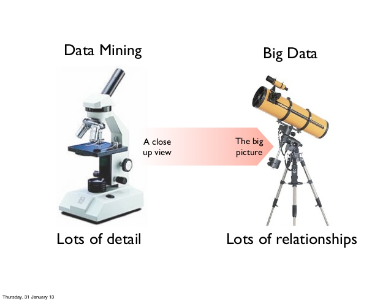{width="60%"}

### Big Data y Machine Learning

El Machine Learning o Aprendizaje Máquina es aquella parte de la inteligencia artificial con capacidad de aprender de los datos. 

{width="70%"}

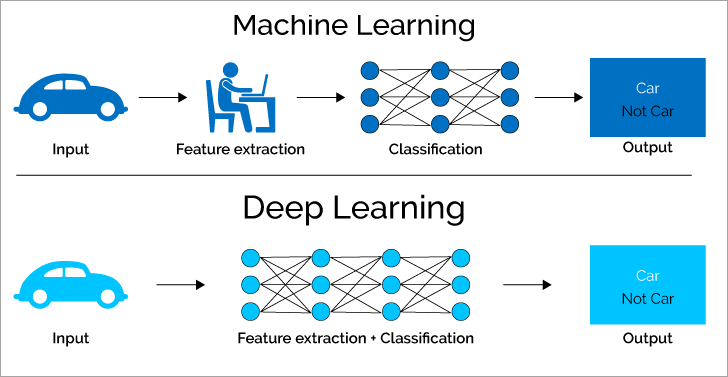


```{r , child = '_global_options.Rmd'}
```

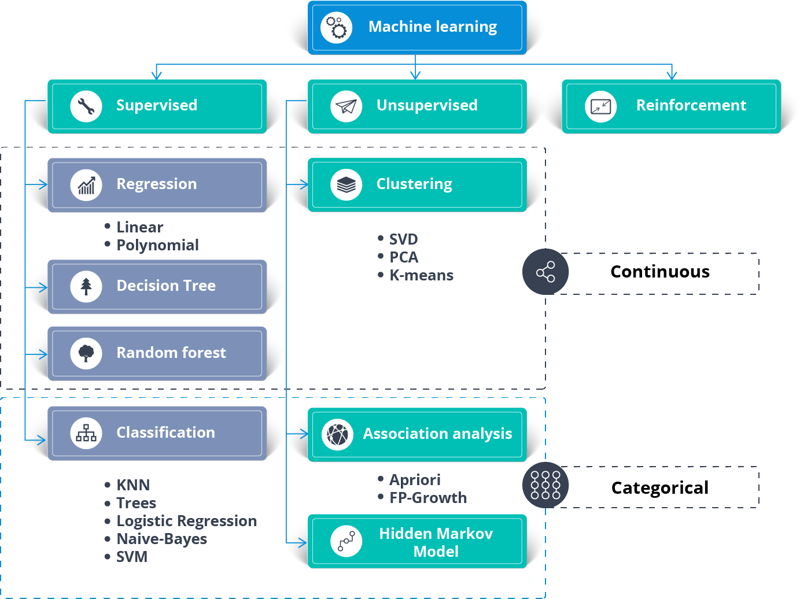

Y un ejemplo de cómo se trabaja en machine learning:

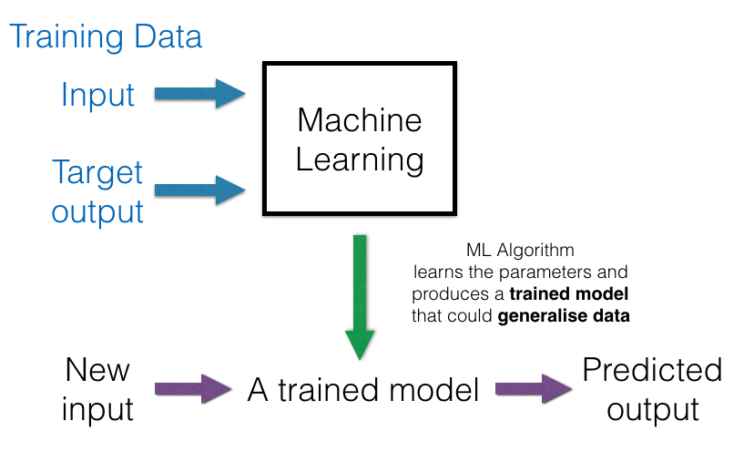{width="70%"}

<!--

https://medium.com/analytics-vidhya/iris-species-using-auto-ml-pycaret-327985fb362f
http://www.lac.inpe.br/~rafael.santos/Docs/CAP394/WholeStory-Iris.html
https://sebastianraschka.com/faq/docs/clf-behavior-data.html
https://pythonmachinelearning.pro/supervised-learning-using-decision-trees-to-classify-data/

-->

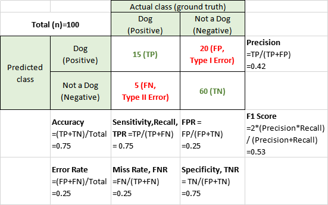{width="70%"}

### Rattle como alternativa a RapidMiner en R

Las instrucciones para instalar R está en el [Apéndice 3 de este documento](https://gltaboada.github.io/tgdbook/instalaci%C3%B3n-de-r.html)

Un tutorial adecuado para introducirse en Rattle es [éste](https://www.dummies.com/programming/using-rattle-iris-r-programming/)
 
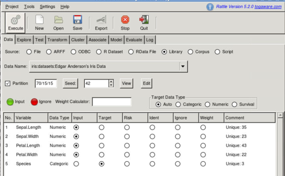

Con el tutorial se pueden ver las capacidades de rattle de explorar los datos, como se puede apreciar a continuación.

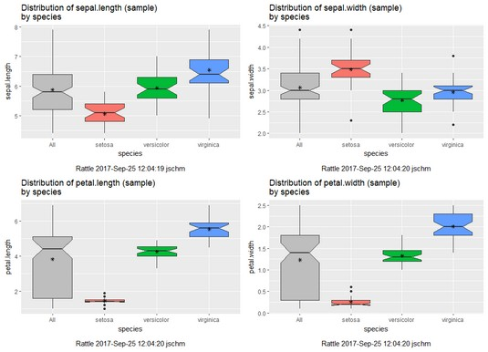

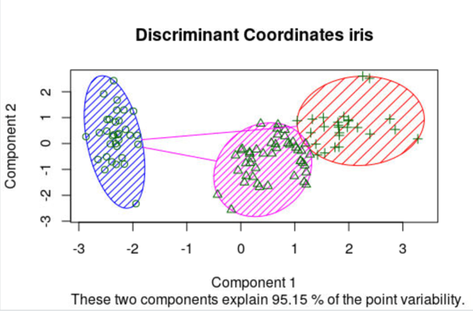

### Visualización y Generación de Cuadros de Mando

Se sigue un tutorial de la herramienta [PowerBI, con datos de Excel y OData Feed](https://docs.microsoft.com/es-es/power-bi/desktop-tutorial-analyzing-sales-data-from-excel-and-an-odata-feed)

Como documentación de se soporte se cuenta con la web de [PowerBI](https://docs.microsoft.com/es-es/power-bi/) y [un tutorial adicional](https://ccance.net/manuales/powerbi/capitulo_01_introduccion.pdf)

## Introducción al Análisis de Datos Masivos

En primer lugar se ha de considerar explorar los datos y realizar minería con ellos, y eso es posible hacerlo vía sparklyr. 

Este apartado, eminentemente práctico, lo trabajaremos a través de [la práctica 3 de TGD](https://www.kaggle.com/gltaboada/t3-practice3-flights).

<!--

## Práctica 3: Big Data

Los ejercicios se entregarán por correo electrónico a guillermo.lopez.taboada@udc.es en formato PDF o R MarkDown con el nombre de archivo P3X-Apellidos-Nombre.Rmd (sin tildes ni caracteres especiales en el nombre del arhivo) **antes** del miércoles 18 de Diciembre.

### Ejercicio A con sparklyr

(3 puntos) Replicación del siguiente ejercicio con sparklyr y el dataset iris (https://spark.rstudio.com/mlib/) en modo local o modo YARN. Puede ser dentro de jupyterlab (así me entregáis archivo “Apellidos-Nombre.ipynb”) o en R remoto o en Rstudio (vía Desktop de visualización) (en estos dos últimos casos entregáis P3A-Apellidos-Nombre.R).

### Ejercicio B con rattle

(4 puntos) Informe (en PDF) sobre uno de los 4 datasets (audit, weather, weatherAUS, wine) que se describen a continuación   https://cran.r-project.org/web/packages/rattle.data/rattle.data.pdf
Se busca que realicéis un análisis con Rattle, mínimo con las pestañas Explore, Cluster y Model.

### Ejercicio C con sparklyr y Hadoop

(3 puntos) Replicación del siguiente ejercicio con sparklyr en el CESGA, en análisis de los datos del dataset de vuelos:
http://hua-zhou.github.io/teaching/biostatm280-2019winter/slides/16-sparklyr/sparklyr-flights.html  
se valorarán análisis adicionales y detalles sobre tiempos de ejecución de los análisis, espera en colas yarn, listado de trabajos spark, etc… 

### Combinando los distintos elementos

Vamos a seguir [un tutorial de análisis de datos de vuelos](http://hua-zhou.github.io/teaching/biostatm280-2019winter/slides/16-sparklyr/sparklyr-intro.html), adaptándolo al entorno del CESGA. 

En primer lugar, tras conectarnos por ssh al CESGA, y en el mismo directorio en que hemos hecho la conexión, nos descargamos los datos:

```{r, eval=FALSE}
# Make download directory
mkdir flights

# Download flight data by year
for i in {1987..2008}
  do
    echo "$(date) $i Download"
    fnam=$i.csv.bz2
    wget -O flights/$fnam http://stat-computing.org/dataexpo/2009/$fnam
    echo "$(date) $i Unzip"
    bunzip2 flights/$fnam
  done

# Download airline carrier data
wget -O airlines.csv http://www.transtats.bts.gov/Download_Lookup.asp?Lookup=L_UNIQUE_CARRIERS

# Download airports data
wget -O airports.csv https://raw.githubusercontent.com/jpatokal/openflights/master/data/airports.dat
```

Comprobamos que los datos están correctos:

```{r, eval=FALSE}
head flights/1987.csv 
head airlines.csv
head airports.csv
```

Y los copiamos al HDFS a través del comando fs de Hadoop:

```{r, eval=FALSE}
# Copy flight data to HDFS
hadoop fs -put flights 

# Copy airline data to HDFS
hadoop fs -mkdir airlines/
hadoop fs -put airlines.csv airlines

# Copy airport data to HDFS
hadoop fs -mkdir airports/
hadoop fs -put airports.csv airports
```

A continuación lanzamos la ejecución de 'hive':

```{r, eval=FALSE}
$ hive
```

Y creamos los metadatos que estructurarán la tabla de vuelos y cargamos los datos en la tabla Hive:

```{r, eval=FALSE}
# Create metadata for flights
CREATE EXTERNAL TABLE IF NOT EXISTS flights230
(
year int,
month int,
dayofmonth int,
dayofweek int,
deptime int,
crsdeptime int,
arrtime int, 
crsarrtime int,
uniquecarrier string,
flightnum int,
tailnum string, 
actualelapsedtime int,
crselapsedtime int,
airtime string,
arrdelay int,
depdelay int, 
origin string,
dest string,
distance int,
taxiin string,
taxiout string,
cancelled int,
cancellationcode string,
diverted int,
carrierdelay string,
weatherdelay string,
nasdelay string,
securitydelay string,
lateaircraftdelay string
)
ROW FORMAT DELIMITED
FIELDS TERMINATED BY ','
LINES TERMINATED BY '\n'
TBLPROPERTIES("skip.header.line.count"="1");

# Load data into table
LOAD DATA INPATH 'flights' INTO TABLE flights230;
```

Ídem para la tabla de aerolíneas, creamos los metadatos y cargamos los datos en la tabla HIVE:

```{r, eval=FALSE}
# Create metadata for airlines
CREATE EXTERNAL TABLE IF NOT EXISTS airlines
(
Code string,
Description string
)
ROW FORMAT SERDE 'org.apache.hadoop.hive.serde2.OpenCSVSerde'
WITH SERDEPROPERTIES
(
"separatorChar" = '\,',
"quoteChar"     = '\"'
)
STORED AS TEXTFILE
tblproperties("skip.header.line.count"="1");

# Load data into table
LOAD DATA INPATH 'airlines' INTO TABLE airlines;
```

Ídem para la tabla de aeropuertos, creamos los metadatos y cargamos los datos en la tabla HIVE:

```{r, eval=FALSE}
# Create metadata for airports
CREATE EXTERNAL TABLE IF NOT EXISTS airports
(
id string,
name string,
city string,
country string,
faa string,
icao string,
lat double,
lon double,
alt int,
tz_offset double,
dst string,
tz_name string
)
ROW FORMAT SERDE 'org.apache.hadoop.hive.serde2.OpenCSVSerde'
WITH SERDEPROPERTIES
(
"separatorChar" = '\,',
"quoteChar"     = '\"'
)
STORED AS TEXTFILE;

# Load data into table
LOAD DATA INPATH 'airports' INTO TABLE airports;
```

Nos conectamos a Spark (desde jupyter-lab o R): (alternativamente con 'sc <- spark_connect(master = "local")' )

```{r, eval=FALSE}
# Connect to Spark
library(sparklyr)
library(dplyr)
library(ggplot2)
sc <- spark_connect(master = "yarn-client", spark_home = Sys.getenv('SPARK_HOME')) 
sc
```

Si tenemos problemas para conectar podemos gestionar con YARN los recursos

```{r, eval=FALSE}
# Ver trabajos en YARN
yarn top

# Trabajos YARN en ejecución, en espera y aceptados
yarn application -list | grep RUNNING
yarn application -list | grep ACCEPTED
yarn application -list | grep SUBMITTED

# Cómo matar un trabajo YARN (si es de nuestro usuario). Indicar el ID de aplicación
yarn application -kill application_1575999528886_0161

```

Crear tablas dplyr a tablas HIVE: 

```{r, eval=FALSE}
# Cache flights Hive table into Spark
#tbl_cache(sc, 'flights')
flights_tbl <- tbl(sc, 'flights230')
flights_tbl %>% print(width = Inf)
```

```{r, eval=FALSE}
# Cache airlines Hive table into Spark
#tbl_cache(sc, 'airlines')
airlines_tbl <- tbl(sc, 'airlines')
airlines_tbl %>% print(width = Inf)
```

```{r, eval=FALSE}
# Cache airports Hive table into Spark
#tbl_cache(sc, 'airports')
airports_tbl <- tbl(sc, 'airports')
airports_tbl %>% print(width = Inf)
```

Ejemplos de análisis exploratorio de datos. Todos los vuelos por año:

```{r, eval=FALSE}
system.time({
out <- flights_tbl %>%
  group_by(year) %>%
  count() %>%
  arrange(year) %>%
  collect()
})
out
out %>% ggplot(aes(x = year, y = n)) + geom_col()
```

Vuelos con origen LAX (Los Angeles) por año:

```{r, eval=FALSE}
system.time({
out <- flights_tbl %>%
  filter(origin == "LAX") %>%
  group_by(year) %>%
  count() %>%
  arrange(year) %>%
  collect()
})
out
out %>% ggplot(aes(x = year, y = n)) + 
    geom_col() +
    labs(title = "Number of flights from LAX")
```

Y listado de países y número de aeropuertos:

```{r, eval=FALSE}
system.time({
out <- airports_tbl %>%
  group_by("country") %>%
  count()
})
out
```

Vamos a proceder a generar un conjunto de datos para calcular un modelo. Para ello buscaremos modelar como una regresión lineal la ganancia de un vuelo (gain) como (depdelay - arrdelay) basándose en la distancia, el retraso de la salida y la aerolínea usando datos del período 2003-2007:

```{r, eval=FALSE}
# Filter records and create target variable 'gain'
system.time(
  model_data <- flights_tbl %>%
    filter(!is.na(arrdelay) & !is.na(depdelay) & !is.na(distance)) %>%
    filter(depdelay > 15 & depdelay < 240) %>%
    filter(arrdelay > -60 & arrdelay < 360) %>%
    filter(year >= 2003 & year <= 2007) %>%
    left_join(airlines_tbl, by = c("uniquecarrier" = "code")) %>%
    mutate(gain = depdelay - arrdelay) %>%
    select(year, month, arrdelay, depdelay, distance, uniquecarrier, description, gain)
)
model_data
```

```{r, eval=FALSE}
# Summarize data by carrier
model_data %>%
  group_by(uniquecarrier) %>%
  summarize(description = min(description), gain = mean(gain), 
            distance = mean(distance), depdelay = mean(depdelay)) %>%
  select(description, gain, distance, depdelay) %>%
  arrange(gain)
```

Para entrenar la regresión lineal y predecir el tiempo ganado o perdido en un vuelo en función de la distancia, retraso en la salida y aerolínea procedemos de este modo:

```{r, eval=FALSE}
# Partition the data into training and validation sets
model_partition <- model_data %>% 
  sdf_partition(train = 0.8, valid = 0.2, seed = 5555)

# Fit a linear model
system.time(
  ml1 <- model_partition$train %>%
    ml_linear_regression(gain ~ distance + depdelay + uniquecarrier)
)

# Summarize the linear model
summary(ml1)
```

A continuación se compara la bondad del modelo con el subconjunto de validación

```{r, eval=FALSE}
# Calculate average gains by predicted decile
system.time(
  model_deciles <- lapply(model_partition, function(x) {
    ml_predict(ml1, x) %>%
      mutate(decile = ntile(desc(prediction), 10)) %>%
      group_by(decile) %>%
      summarize(gain = mean(gain)) %>%
      select(decile, gain) %>%
      collect()
  })
)
model_deciles

# Create a summary dataset for plotting
deciles <- rbind(
  data.frame(data = 'train', model_deciles$train),
  data.frame(data = 'valid', model_deciles$valid),
  make.row.names = FALSE
)
deciles

# Plot average gains by predicted decile
deciles %>%
  ggplot(aes(factor(decile), gain, fill = data)) +
  geom_bar(stat = 'identity', position = 'dodge') +
  labs(title = 'Average gain by predicted decile', x = 'Decile', y = 'Minutes')
```

Visualizar predicciones usando el año 2008 (no usado en el entrenamiento):

```{r, eval=FALSE}
# Select data from an out of time sample
data_2008 <- flights_tbl %>%
  filter(!is.na(arrdelay) & !is.na(depdelay) & !is.na(distance)) %>%
  filter(depdelay > 15 & depdelay < 240) %>%
  filter(arrdelay > -60 & arrdelay < 360) %>%
  filter(year == 2008) %>%
  left_join(airlines_tbl, by = c("uniquecarrier" = "code")) %>%
  mutate(gain = depdelay - arrdelay) %>%
  select(year, month, arrdelay, depdelay, distance, uniquecarrier, description, gain, origin, dest)
data_2008

# Summarize data by carrier
carrier <- ml_predict(ml1, data_2008) %>%
  group_by(description) %>%
  summarize(gain = mean(gain), prediction = mean(prediction), freq = n()) %>%
  filter(freq > 10000) %>%
  collect()
carrier

# Plot actual gains and predicted gains by airline carrier
ggplot(carrier, aes(gain, prediction)) + 
  geom_point(alpha = 0.75, color = 'red', shape = 3) +
  geom_abline(intercept = 0, slope = 1, alpha = 0.15, color = 'blue') +
  geom_text(aes(label = substr(description, 1, 20)), size = 3, alpha = 0.75, vjust = -1) +
  labs(title='Average Gains Forecast', x = 'Actual', y = 'Predicted')
```

Al terminar cualquier ejercicio con sparklyr desconectamos de Spark:

```{r, eval=FALSE}
spark_disconnect_all()
```

En este tema vamos a ver las tecnologías más relevantes para el tratamiento de datos masivos dentro de R, como son Spark (con sparklyr) dentro del ecosistema Hadoop. Los ejercicios prácticos se realizarán sobre la [plataforma Big Data](http://bigdata.cesga.es/) del [Centro de Supercomputación de Galicia (CESGA)](http://www.cesga.es)


Conexión vía SSH a CESGA (siempre con VPN activada!) y ejemplo #1:

```{r, eval=FALSE}
wget  https://packages.revolutionanalytics.com/datasets/claims2.csv 

# [3 minutos – 1GB/minuto en CESGA]  [recomendada la descarga desde servidor dtn.srv.cesga.es] [copia temp /tmp]

hadoop fs –mkdir p1/
hadoop fs -mkdir p1/claims/
hadoop fs –put claims2.csv p1/claims/   [3 segundos]
hadoop fs –ls p1/claims/

$ myquota
# [1TB en $HOMEBD y 18TB en Hadoop]

$ spark-shell --packages com.databricks:spark-csv_2.10:1.4.0
> val sqlContext = new org.apache.spark.sql.SQLContext(sc); 
> val df = sqlContext.read.format(csv).option(header, true).load(p1/claims/claims2.csv)
> df.count();  df.first();  df.take(5);  df.printSchema();
> df.registerTempTable(TblName)
> sqlContext.sql(select * from TblName limit 100).take(100).foreach(println)
> sqlContext.sql(select * from TblName where Calendar_year=2005).count()
```

Usando Spark-shell pero también podemos realizar ciertos análisis con hive:

```{r, eval=FALSE}
$ hadoop fs -mkdir bdp
$ hadoop fs -mkdir bdp/hv_csv_table
$ hadoop fs -mkdir bdp/hv_csv_table/ip
$ hadoop fs -put claims2.csv bdp/hv_csv_table/ip

$ hive      OR   $ beeline (recomendado este último por seguridad pero por simplicidad usamos hive en CESGA)

CREATE SCHEMA IF NOT EXISTS bdp;
CREATE EXTERNAL TABLE IF NOT EXISTS bdp.hv_csv_table (Row_ID STRING, Household_ID STRING, Vehicle STRING, Calendar_Year STRING, Model_Year STRING, Blind_Make STRING, Blind_Model STRING, Blind_Submodel STRING, Cat1 STRING, Cat2 STRING, Cat3 STRING, Cat4 STRING, Cat5 STRING, Cat6 STRING, Cat7 STRING, Cat8 STRING, Cat9 STRING, Cat10 STRING, Cat11 STRING, Cat12 STRING, OrdCat STRING, Var1 STRING, Var2 STRING, Var3 STRING, Var4 STRING, Var5 STRING, Var6 STRING, Var7 STRING, Var8 STRING, NVCat STRING, NVVar1 STRING, NVVar2 STRING, NVVar3 STRING, NVVar4 STRING, Claim_Amount STRING, veh_age STRING) ROW FORMAT DELIMITED FIELDS TERMINATED BY ',' STORED AS TEXTFILE LOCATION 'hdfs://nameservice1/user/cursoXXX/p1/claims/';

SELECT * FROM bdp.hv_csv_table LIMIT 10;
SELECT * FROM bdp.hv_csv_table where Calendar_Year=2005 limit 10;
SELECT * FROM bdp.hv_csv_table where Calendar_Year>2005;
```

Y ejemplo #2:
 
```{r, eval=FALSE}
# Generación de un archivo spanishTexts-ALL y 120-million-word-spanish-corpus.zip  
# Origen: https://www.kaggle.com/rtatman/120-million-word-spanish-corpus
hadoop fs –mkdir p2
hadoop fs -put 120-million-word-spanish-corpus.zip p2

$ spark-shell
# map
var map = sc.textFile(p2/spanishTest-ALL).flatMap(line => line.split( )).map(word => (word,1));
# reduce
var counts = map.reduceByKey(_ + _);
# save the output to file, every time a different directory!!!
counts.saveAsTextFile(p2/output)
counts.count() counts.first() counts.take(5)
# from word -> num to num -> word
# then sortBy num of occurrence in descending order 
val mostCommon = counts.map(p => (p._2, p._1)).sortByKey(false, 1)
mostCommon.take(50)
```

### Uso de Sparklyr

Conexión vía SSH a CESGA (siempre con VPN activada!) y una vez dentro "module load sparklyr" y arrancar R:

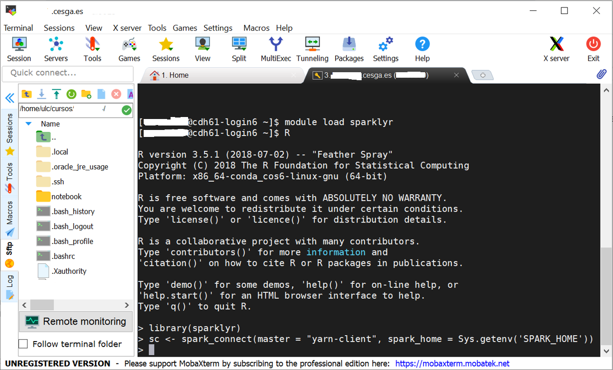

Y dentro del notebook R ya se puede probar el funcionamiento de Sparklyr con los siguientes pasos, cuyo resultado debería ser el que se aprecia a continuación:

```{r, eval=FALSE}
library(sparklyr)
sc <- spark_connect(master = "yarn-client", spark_home = Sys.getenv('SPARK_HOME')) 
iris_tbl <- copy_to(sc, iris, "iris", overwrite = TRUE)
iris_tbl
```

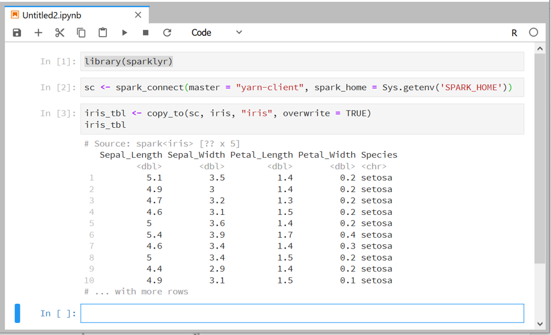

NOTA: en ausencia de clúster Hadoop con YARN, o para debugging, también se puede conectar usando las siguientes instrucciones, y obtener elm mismo resultado que en presencia de YARN.

```{r, eval=FALSE}
library(sparklyr)
sc <- spark_connect(master = "local")
iris_tbl <- copy_to(sc, iris, "iris", overwrite = TRUE)
iris_tbl
```

-->

