# El paquete scimetr {#scimetr}


Package `scimetr` implements tools for quantitative research in scientometrics and bibliometrics. 
It provides routines for importing bibliographic data from Thomson Reuters' Web of Science (http://www.webofknowledge.com) and performing bibliometric analysis. For more information visit https://rubenfcasal.github.io/scimetr/articles/scimetr.html. 


Instalación
-----------

Para instalar el paquete sería recomendable en primer lugar instalar las dependencias:


``` r
install.packages(c('dplyr', 'lazyeval', 'stringr', 'ggplot2', 'openxlsx', 'tidyr'))
```

Como de momento no está disponible en CRAN, 
habría que instalar la versión de desarrollo en GitHub.
En Windows bastaría con instalar la versión binaria del paquete *scimetr_X.Y.Z.zip*
(disponible [aqui](https://github.com/rubenfcasal/scimetr/tree/master/docs)), 
alternativamente se puede instalar directamente de GitHub:

``` r
# install.packages("devtools")
devtools::install_github("rubenfcasal/scimetr")
```

Una vez instalado ya podríamos cargar el paquete:


``` r
library(scimetr)
```

```
##  scimetr: Analysis of Scientific Publication Data with R,
##  version 0.3.6 (built on 2023-04-21).
##  Copyright (C) UDC Rankings Group 2017-2023.
##  Type `help(scimetr)` for an overview of the package or
##  visit https://rubenfcasal.github.io/scimetr.
```


Carga de datos
--------------

### Datos de ejemplo

En el paquete se incluyen dos conjuntos de datos de ejemplo 
correspondientes a la búsqueda en WoS
por el campo Organización-Nombre preferido de la UDC 
(Organization-Enhaced: OG = Universidade da Coruna):

- `wosdf`: año 2015.

- `wosdf2`:  área de investigación 'Mathematics', años 2008-2017.

Variables WoS:


``` r
# View(wosdf2) # En RStudio...
variable.labels <- attr(wosdf, "variable.labels")
knitr::kable(as.data.frame(variable.labels)) # caption = "Variable labels"
```


|   |variable.labels                 |
|:--|:-------------------------------|
|PT |Publication type                |
|AU |Author                          |
|BA |Book authors                    |
|BE |Editor                          |
|GP |Group author                    |
|AF |Author full                     |
|BF |Book authors fullname           |
|CA |Corporate author                |
|TI |Title                           |
|SO |Publication name                |
|SE |Series title                    |
|BS |Book series                     |
|LA |Language                        |
|DT |Document type                   |
|CT |Conference title                |
|CY |Conference year                 |
|CL |Conference place                |
|SP |Conference sponsors             |
|HO |Conference host                 |
|DE |Keywords                        |
|ID |Keywords Plus                   |
|AB |Abstract                        |
|C1 |Addresses                       |
|RP |Reprint author                  |
|EM |Author email                    |
|RI |Researcher id numbers           |
|OI |Orcid numbers                   |
|FU |Funding agency and grant number |
|FX |Funding text                    |
|CR |Cited references                |
|NR |Number of cited references      |
|TC |Times cited                     |
|Z9 |Total times cited count         |
|U1 |Usage Count (Last 180 Days)     |
|U2 |Usage Count (Since 2013)        |
|PU |Publisher                       |
|PI |Publisher city                  |
|PA |Publisher address               |
|SN |ISSN                            |
|EI |eISSN                           |
|BN |ISBN                            |
|J9 |Journal.ISI                     |
|JI |Journal.ISO                     |
|PD |Publication date                |
|PY |Year published                  |
|VL |Volume                          |
|IS |Issue                           |
|PN |Part number                     |
|SU |Supplement                      |
|SI |Special issue                   |
|MA |Meeting abstract                |
|BP |Beginning page                  |
|EP |Ending page                     |
|AR |Article number                  |
|DI |DOI                             |
|D2 |Book DOI                        |
|PG |Page count                      |
|WC |WOS category                    |
|SC |Research areas                  |
|GA |Document delivery number        |
|UT |Access number                   |
|PM |Pub Med ID                      |

Se puede crear una base de datos con la función `CreateDB.wos()`:


``` r
db <- CreateDB.wos(wosdf2, label = "Mathematics_UDC_2008-2017 (01-02-2019)")
str(db, 1)
```

```
## List of 11
##  $ Docs      :'data.frame':	389 obs. of  25 variables:
##   ..- attr(*, "variable.labels")= Named chr [1:62] "Publication type" "Author" "Book authors" "Editor" ...
##   .. ..- attr(*, "names")= chr [1:62] "PT" "AU" "BA" "BE" ...
##  $ Authors   :'data.frame':	610 obs. of  4 variables:
##  $ AutDoc    :'data.frame':	1260 obs. of  2 variables:
##  $ Categories:'data.frame':	46 obs. of  2 variables:
##  $ CatDoc    :'data.frame':	866 obs. of  2 variables:
##  $ Areas     :'data.frame':	26 obs. of  2 variables:
##  $ AreaDoc   :'data.frame':	771 obs. of  2 variables:
##  $ Addresses :'data.frame':	896 obs. of  5 variables:
##  $ AddAutDoc :'data.frame':	1328 obs. of  3 variables:
##  $ Sources   :'data.frame':	150 obs. of  14 variables:
##  $ label     : chr "Mathematics_UDC_2008-2017 (01-02-2019)"
##  - attr(*, "variable.labels")= Named chr [1:62] "Publication type" "Author" "Book authors" "Editor" ...
##   ..- attr(*, "names")= chr [1:62] "PT" "AU" "BA" "BE" ...
##  - attr(*, "class")= chr "wos.db"
```

### Cargar datos de directorio

Se pueden cargar automáticamente los archivos wos
(tienen una limitación de 500 registros) de un subdirectorio:


``` r
dir("UDC_2008-2017 (01-02-2019)", pattern='*.txt')
```

```
##  [1] "savedrecs01.txt" "savedrecs02.txt" "savedrecs03.txt" "savedrecs04.txt"
##  [5] "savedrecs05.txt" "savedrecs06.txt" "savedrecs07.txt" "savedrecs08.txt"
##  [9] "savedrecs09.txt" "savedrecs10.txt" "savedrecs11.txt" "savedrecs12.txt"
## [13] "savedrecs13.txt" "savedrecs14.txt" "savedrecs15.txt"
```


Se pueden combinar los ficheros y crear la correspondiente base de datos con los siguientes comandos:


``` r
wos.txt <- ImportSources.wos("UDC_2008-2017 (01-02-2019)", other = FALSE)
db.txt <- CreateDB.wos(wos.txt)
```


Sumarios
--------

### Sumario `summary.wos.db()`


``` r
res1 <- summary(db)
options(digits = 5)
res1
```

```
## Number of documents: 389 
## Authors: 610 
## Period: 2008 - 2017 
## 
## Document types:
##                            Documents
## Article                          360
## Article; Proceedings Paper        16
## Correction                         1
## Editorial Material                 5
## Review                             7
## 
## Number of authors per document:
##    Min. 1st Qu.  Median    Mean 3rd Qu.    Max. 
##    1.00    2.00    3.00    3.24    4.00    8.00 
## 
## Number of documents per author:
##    Min. 1st Qu.  Median    Mean 3rd Qu.    Max. 
##    1.00    1.00    1.00    2.07    2.00   29.00 
## 
## Number of times cited:
##    Min. 1st Qu.  Median    Mean 3rd Qu.    Max. 
##     0.0     1.0     3.0    10.9     9.0  1139.0 
## 
## Indexes:
##  H  G 
## 24 54 
## 
## Top Categories:
##                                                  Documents
## Mathematics, Interdisciplinary Applications            134
## Mathematics, Applied                                   130
## Statistics & Probability                               121
## Mathematics                                             77
## Engineering, Multidisciplinary                          64
## Mechanics                                               59
## Computer Science, Interdisciplinary Applications        45
## Computer Science, Artificial Intelligence               20
## Social Sciences, Mathematical Methods                   17
## Automation & Control Systems                            16
## Others                                                 183
## 
## Top Areas:
##                                         Documents
## Mathematics                                   389
## Computer Science                               69
## Engineering                                    69
## Mechanics                                      59
## Physics                                        22
## Chemistry                                      17
## Mathematical Methods In Social Sciences        17
## Automation & Control Systems                   16
## Instruments & Instrumentation                  16
## Business & Economics                           15
## Others                                         82
## 
## Top Journals:
##                                     Documents
## Comput. Meth. Appl. Mech. Eng.             29
## J. Math. Anal. Appl.                       11
## Chemometrics Intell. Lab. Syst.            11
## Rev. Int. Metod. Numer. Calc. Dise.        11
## J. Comput. Appl. Math.                     10
## Comput. Stat. Data Anal.                    9
## Int. J. Numer. Methods Fluids               9
## Appl. Numer. Math.                          9
## J. Nonparametr. Stat.                       8
## Int. J. Numer. Methods Eng.                 8
## Others                                    274
## 
## Top Countries:
##         Documents
## Spain         389
## USA            49
## France         32
## Italy          13
## Mexico         11
## UK             11
## Germany        10
## Canada          8
## China           8
## Belgium         7
## Others         52
```

### Sumario por años `summary_year()`


``` r
res2 <- summary_year(db)
res2
```

```
## 
## Annual Scientific Production:
## 
##      Documents
## 2008        42
## 2009        28
## 2010        40
## 2011        37
## 2012        44
## 2013        40
## 2014        38
## 2015        39
## 2016        47
## 2017        34
## 
## Annual Authors per Document:
## 
##          Avg Median
##  2008 2.8810    3.0
##  2009 3.3214    3.0
##  2010 3.3500    3.0
##  2011 3.3784    3.0
##  2012 2.8182    2.5
##  2013 3.3750    3.0
##  2014 3.2368    3.0
##  2015 3.0513    3.0
##  2016 3.5745    3.0
##  2017 3.4706    3.0
## 
## Annual Times Cited:
## 
##       Cites     Avg Median
##  2008   755 17.9762    5.0
##  2009   265  9.4643    6.0
##  2010   410 10.2500    5.0
##  2011  1422 38.4324    5.0
##  2012   335  7.6136    3.5
##  2013   271  6.7750    4.0
##  2014   336  8.8421    3.5
##  2015   215  5.5128    2.0
##  2016   192  4.0851    2.0
##  2017    55  1.6176    1.0
```


Gráficos
--------

Se emplea la librería [`ggplot2`](https://ggplot2.tidyverse.org)...


### Gráficos de la base de datos `plot.wos.db()`


``` r
plot(db)
```

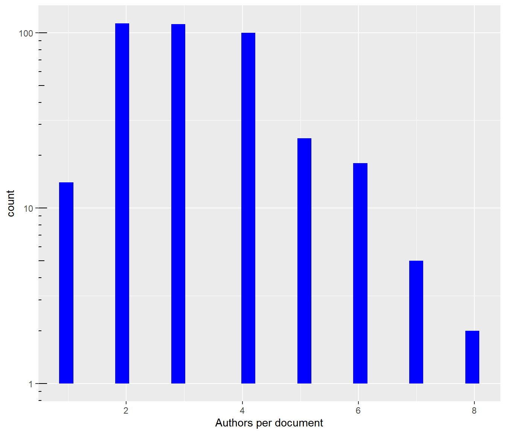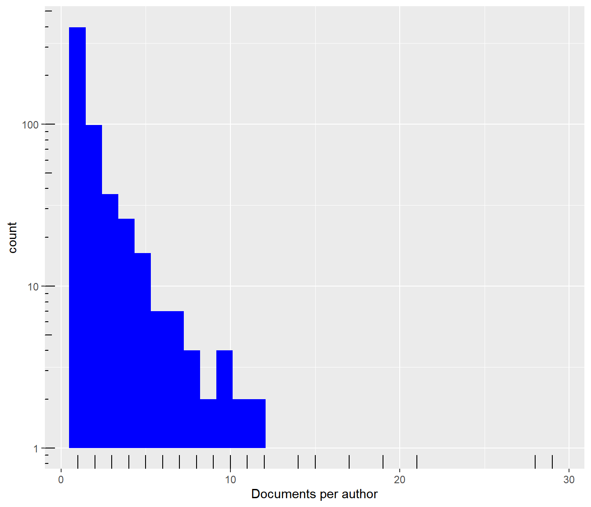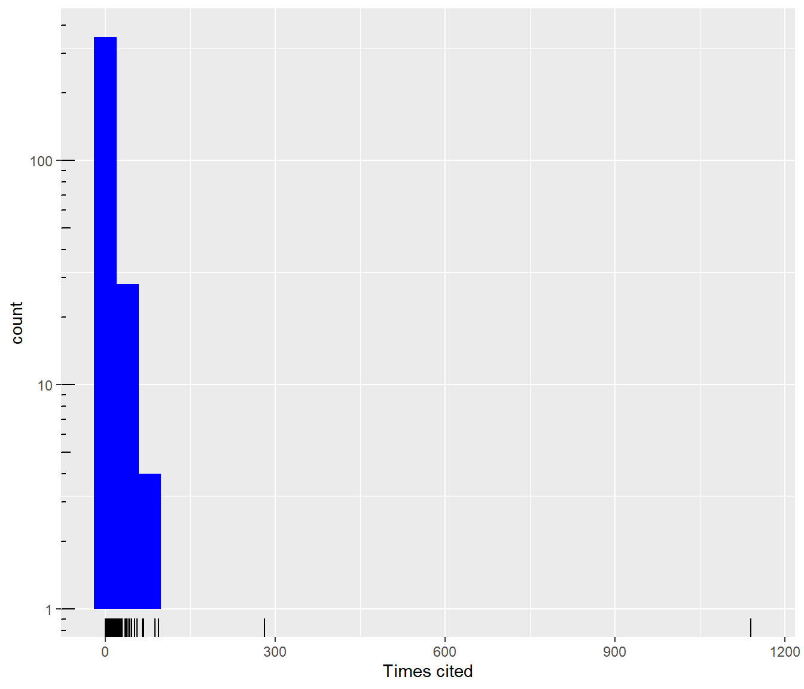

### Gráficos sumario `plot.summary.wos.db()`


``` r
plot(res1)
```

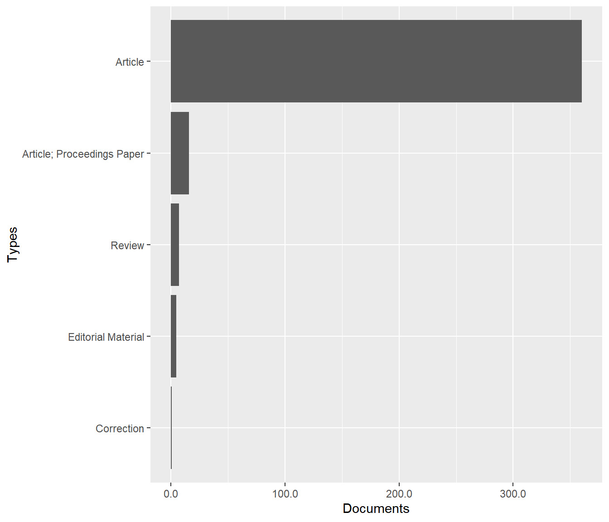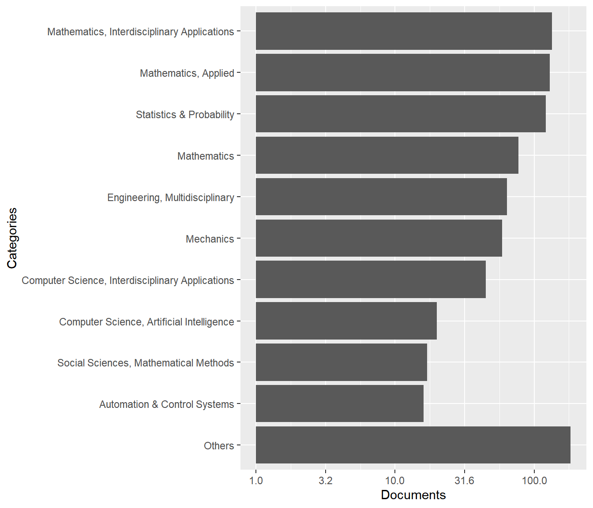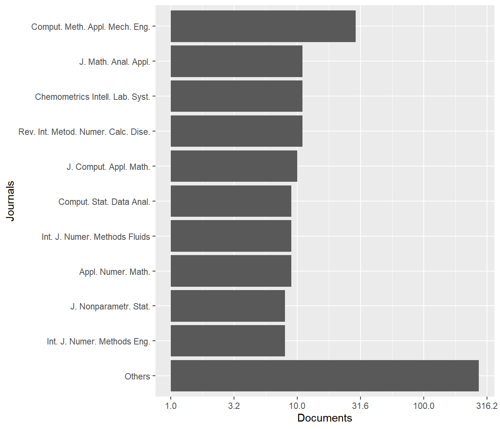

``` r
plot(res1, pie = TRUE)
```

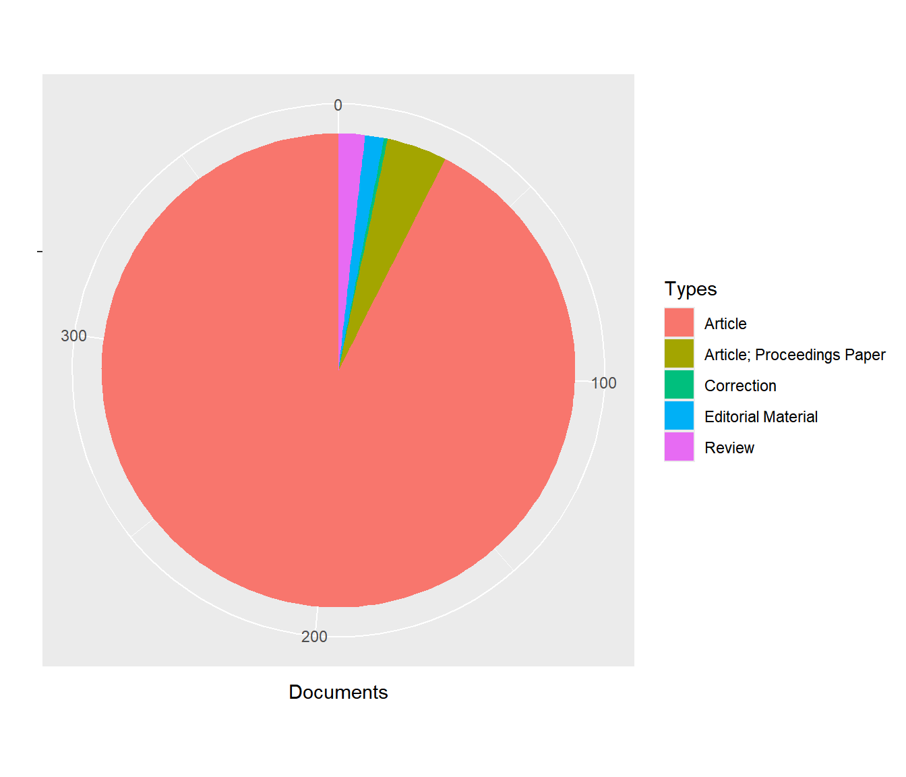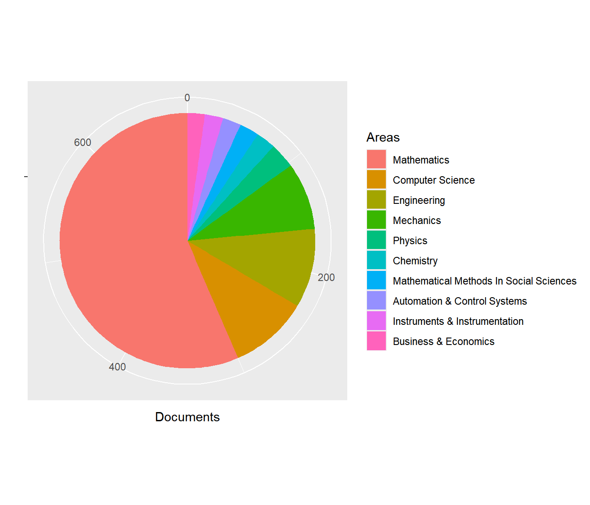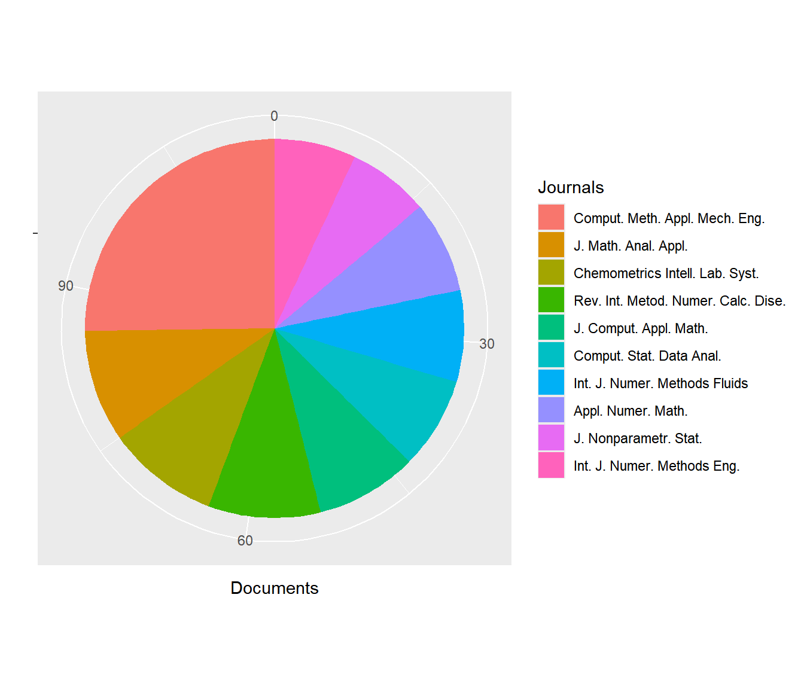

### Gráficos sumario por años `plot.summary.year()`


``` r
plot(res2)
```

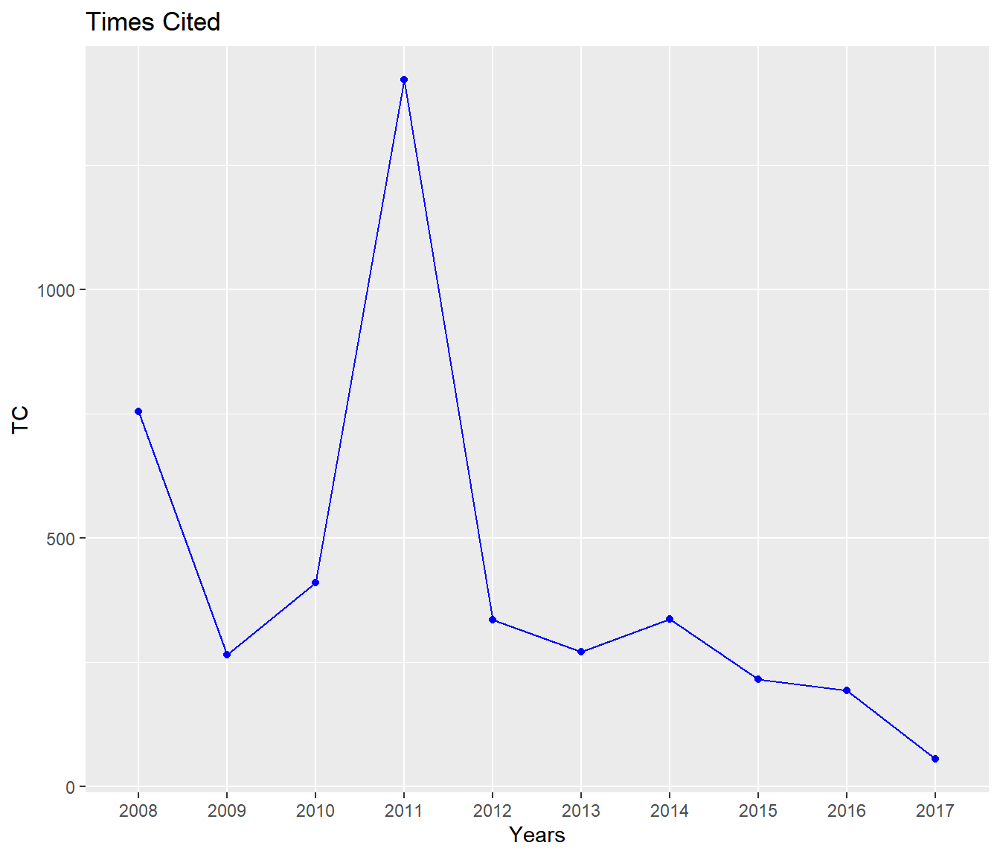

``` r
plot(res2, boxplot = TRUE)
```

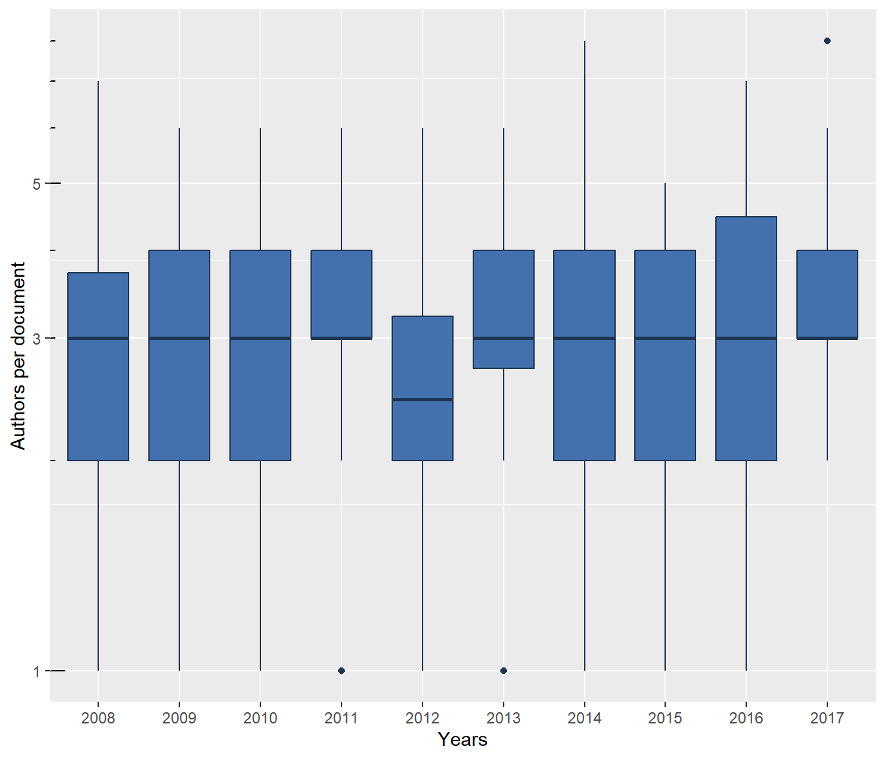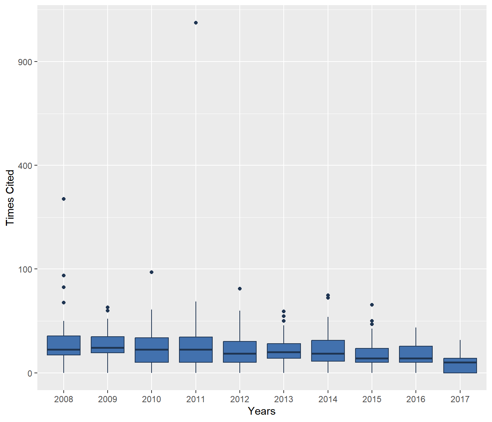

Filtrado
--------

Se combinan las funciones `get.id<Tabla>()` 
(se puede emplear cualquier variable de la correspondiente tabla; 
multiple conditions are combined with `&`, see e.g. `dplyr::filter()`) 
con la función `get.idDocs()`.

### Funciones get

- `get.idAuthors()`: buscar id (códigos) de autores

    Buscar un autor concreto:
      
    
    ``` r
    idAuthor <- get.idAuthors(db, AF == "Cao, Ricardo")
    idAuthor
    ```
    
    ```
    ## Cao, Ricardo 
    ##           16
    ```
      
    Buscar en nombres de autores:
      
    
    ``` r
    idAuthors <- get.idAuthors(db, grepl('Cao', AF))
    idAuthors
    ```
    
    ```
    ##           Cao, Ricardo Cao-Rial, Maria Teresa 
    ##                     16                     69
    ```

- `get.idAreas()`: Devuelve códigos de las áreas

    
    ``` r
    get.idAreas(db, SC == 'Mathematics')
    ```
    
    ```
    ## Mathematics 
    ##          16
    ```
    
    ``` r
    get.idAreas(db, SC == 'Mathematics' | SC == 'Computer Science')
    ```
    
    ```
    ## Computer Science      Mathematics 
    ##                7               16
    ```

- `get.idCategories()`: códigos de las categorías

    
    ``` r
    get.idCategories(db, grepl('Mathematics', WC))
    ```
    
    ```
    ##                                 Mathematics 
    ##                                          28 
    ##                        Mathematics, Applied 
    ##                                          29 
    ## Mathematics, Interdisciplinary Applications 
    ##                                          30
    ```

- `get.idJournals()` códigos de las revistas


