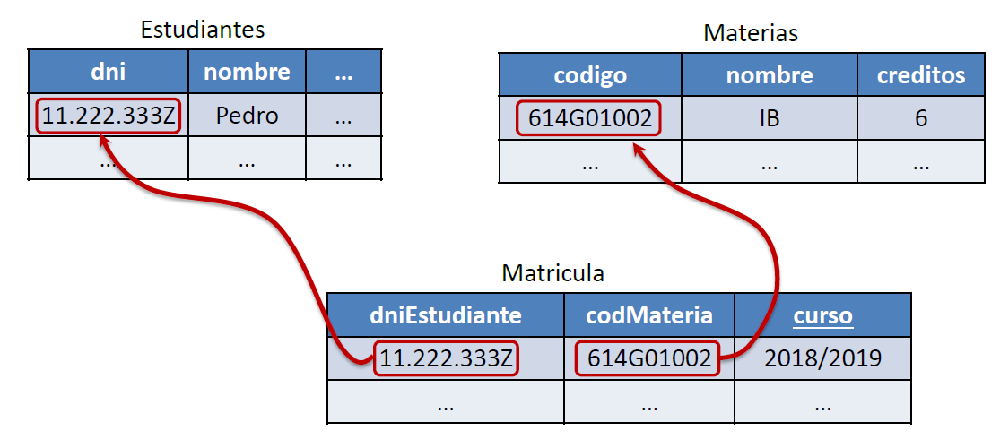
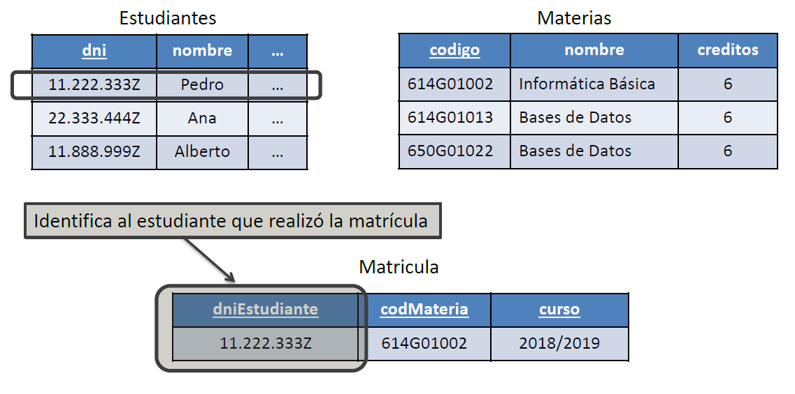
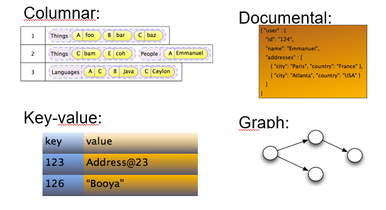
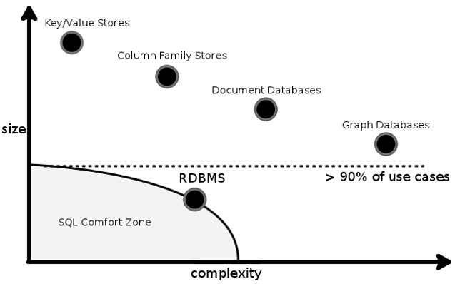
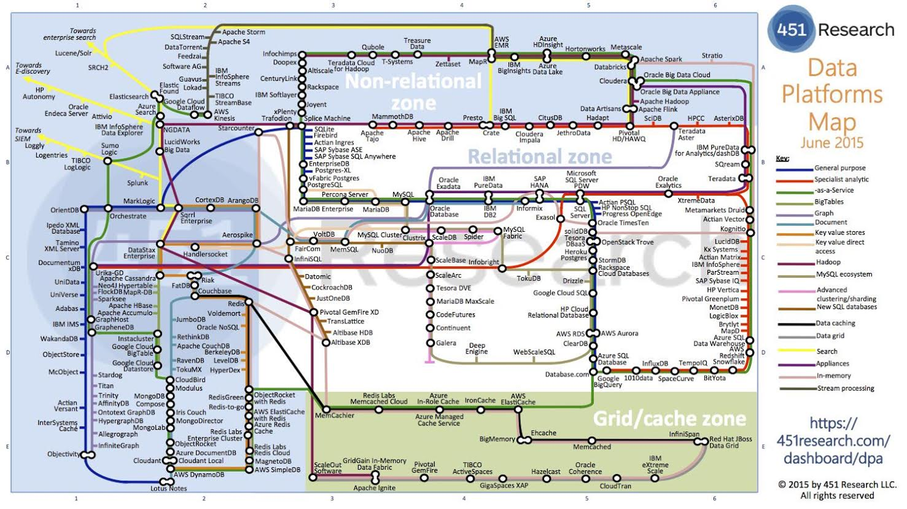
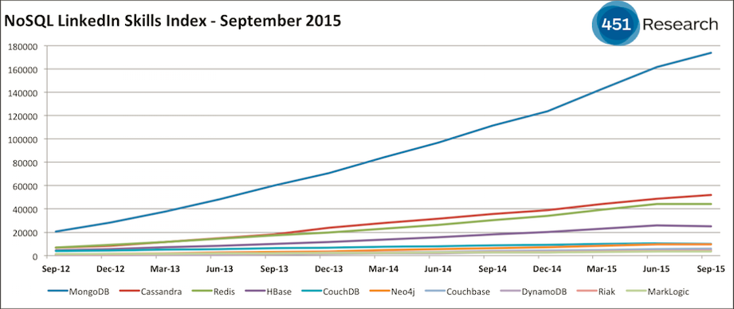
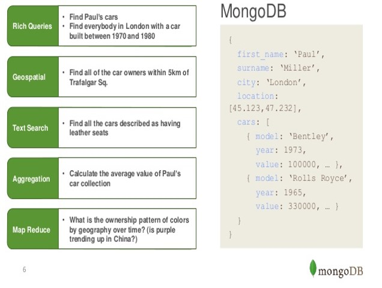
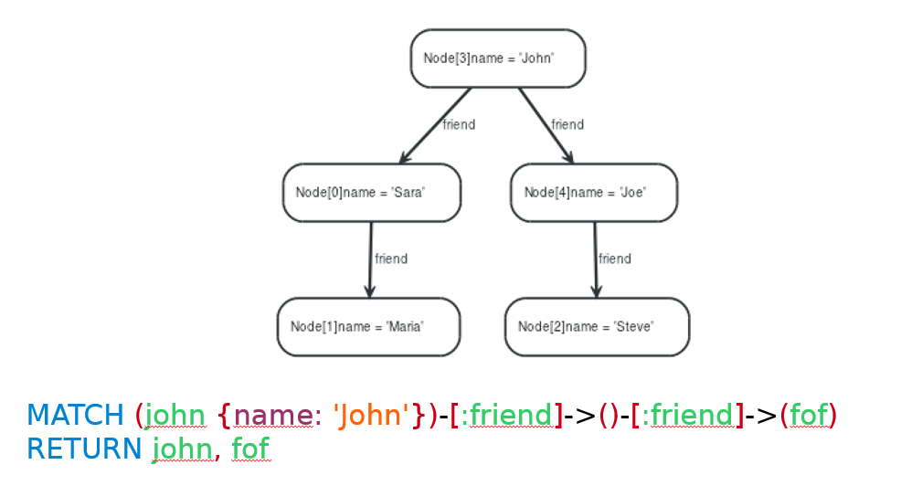

--- 
title: "Prácticas de Tecnologías de Gestión y Manipulación de Datos"
author: "Guillermo López Taboada (guillermo.lopez.taboada@udc.es) y Rubén F. Casal (ruben.fcasal@udc.es)"
date: "2019-11-07"
site: bookdown::bookdown_site
output: bookdown::gitbook
documentclass: book
bibliography: [book.bib, packages.bib]
biblio-style: apalike
link-citations: yes
github-repo: gltaboada/tgdbook
description: "Prácticas de la asignatura de Tecnologías de Gestión de Datos del Máster en Técnicas Estadísticas."
---

# Prólogo {-}

Este libro contiene algunas de las prácticas de la asignatura de [Tecnologías de Gestión de Datos](http://eamo.usc.es/pub/mte/index.php/es/?option=com_content&view=article&id=2202&idm=38&a%C3%B1o=2019) del [Máster interuniversitario en Técnicas Estadísticas](http://eio.usc.es/pub/mte)).

Este libro ha sido escrito en [R-Markdown](http://rmarkdown.rstudio.com) empleando el paquete [`bookdown`](https://bookdown.org/yihui/bookdown/) y está disponible en el repositorio Github: [gltaboada/tgdbook](https://github.com/gltaboada/tgdbook). 
Se puede acceder a la versión en línea a través del siguiente enlace:

<https://gltaboada.github.io/tgdbook>.

donde puede descargarse en formato [pdf](https://gltaboada.github.io/tgdbook/Practicas_de_TGD.pdf).


Para ejecutar los ejemplos mostrados en el libro será necesario tener instalados los siguientes paquetes:
[`dplyr`](https://dplyr.tidyverse.org) (colección [`tidyverse`](https://www.tidyverse.org/)),
[`tidyr`](https://tidyr.tidyverse.org),
[`stringr`](https://stringr.tidyverse.org),
[`readxl`](https://readxl.tidyverse.org) , 
[`openxlsx`](https://cran.r-project.org/web/packages/openxlsx/index.html), [`RODBC`](https://cran.r-project.org/web/packages/RODBC/index.html), 
[`sqldf`](https://cran.r-project.org/web/packages/sqldf/index.html),
[`RSQLite`](https://r-dbi.github.io/RSQLite), 
[`foreign`](https://cran.r-project.org/web/packages/foreign/index.html), 
[`SparkR`](https://cran.r-project.org/web/packages/SparkR/index.html), 
[`magrittr`](https://cran.r-project.org/web/packages/magrittr/index.html), 
[`knitr`](https://yihui.name/knitr) 
Por ejemplo mediante los comandos:

```r
pkgs <- c('dplyr', 'tidyr', 'stringr', 'readxl', 'openxlsx', 'magrittr', 
          'RODBC', 'sqldf', 'RSQLite', 'foreign', 'SparkR', 'knitr')
# install.packages(pkgs, dependencies=TRUE)
install.packages(setdiff(pkgs, installed.packages()[,'Package']), dependencies = TRUE)
```

Para generar el libro (compilar) se recomendaría consultar el libro de ["Escritura de libros con bookdown" ](https://rubenfcasal.github.io/bookdown_intro) en castellano.

<!-- --> 

Este obra está bajo una licencia de [Creative Commons Reconocimiento-NoComercial-SinObraDerivada 4.0 Internacional](https://creativecommons.org/licenses/by-nc-nd/4.0/deed.es_ES) 
(esperamos poder liberarlo bajo una licencia menos restrictiva más adelante...).


<!--chapter:end:index.Rmd-->

Introducción a las Tecnologías de Gestión y Manipulación de Datos
=================================================================


<!-- ## Introducción -->


La información relevante de la materia está disponible en la guía docente y la ficha de la asignatura

En particular, los resultados de aprendizaje son:

* Manejar de forma autónoma y solvente el software necesario para acceder a conjuntos de datos en entornos profesionales y/o en la nube.	

* Saber gestionar conjuntos de datos masivos en un entorno multidisciplinar que permita la participación en proyectos profesionales complejos que requieran el uso de técnicas estadísticas.	

* Saber relacionar el software de diseño y gestión de bases de datos con el específicamente implementado para el análisis de datos.

## Contenidos

1. Introducción al lenguaje SQL	
	+ Bases de datos relacionales
	+ Sintaxis SQL
	+ Conexión con bases de datos desde R
2. Introducción a tecnologías NoSQL	
	+ Conceptos y tipos de bases de datos NoSQL (documental, columnar, clave/valor y de grafos)
	+ Conexión de R a NoSQL
3. Tecnologías para el tratamiento de datos masivos	
	+ Tecnologías Big Data (Hadoop, Spark, Hive, Rspark, Sparklyr)
	+ Visualización y generación de cuadros de mando 
	+ Introducción al análisis de datos masivos.


## Planificación

*Working draft...*

La impartición de los contenidos durante el curso dependerá de los conocimientos de partida y la asimilación de los 
conceptos. Para completar nuestra visión de los conocimientos previos os requerimos completar este formulario en la primera sesión de clase: https://forms.gle/9HR5iFHXoLowrCHLA

- Clase 1 (12/9-R): Seminario R (Manipulación de datos con el paquete base de R)

- Clase 2 (19/9): Tema 1: Conceptos de bases de datos

- Clase 3 (26/9): Tema 1: Introducción a SQL

- Clase 4 (3/10-R): Seminario dplyr (Manipulación de datos con el paquete dplyr)

- Clase 5 (10/10): Tema 1: Ejercicios prácticos de Entidad-relación y SQL

- Clase 6 (17/10): Tema 1: Continuación de ejercicios prácticos SQL

- Clase 7 (24/10): Tema 2: Introducción a NoSQL

- Clase 8 (31/10): Tema 2: Ejercicios prácticos de NoSQL

- Clase 9 (7/11): Tema 3: Ecosistema Big Data (Hadoop, Spark)

- Clase 10 (14/11): Tema 3: Tecnologías Big Data (Rspark/sparklyr)

- Clase 11 (21/11): Seminario visualización con power BI 

- Clase 12 (28/11): Seminario machine learning CESGA/localhost

- Clase 13 (5/12): Tema 3: Introducción al análisis de datos masivos 

- Clase 14 (12/12-R): Seminario Aprendizaje Estadístico/Automático, Data Mining

- Clase 15 (19/12-opcional): Seminario aplicaciones Big Data en investigación e industria


### Evaluación

-   **Examen** (60%): El examen de la materia evaluará los siguientes aspectos: 
Conceptos de la materia: Dominio de los conocimientos teóricos y operativos de la materia.
Asimilación práctica de materia: Asimilación y comprensión de los conocimientos teóricos y operativos de la materia.

-   **Prácticas de laboratorio** (30%): Evaluación de las prácticas de laboratorio desarrolladas por los estudiantes.

-   **Trabajos tutelados** (10%): Evaluación de los trabajos tutelados desarrollados por los estudiantes.


#### Observaciones sobre la evaluación:

* Las prácticas de laboratorio se realizarán en grupos de 2 estudiantes, salvo el trabajo tutelado que es individual y opcional. En caso de no realizar el trabajo tutelado los estudiantes tendrán un 67% de nota del examen y un 33% de prácticas de laboratorio. El plazo para realizar las 3 prácticas será de 2 semanas desde la presentación de la práctica. El plazo para la entrega de los trabajos tutelados es el último día de clase de la asignatura.

* El estudiante que quiera realizar un trabajo tutelado ha de hablar (o mediante correo electrónico) con los profesores para validar y confirmar el tema y alcance del trabajo tutelado.

* Para poder aprobar la asignatura en la primera oportunidad será necesario obtener como mínimo el 30% de la nota máxima de la suma de las prácticas de laboratorio y trabajos tutelados e, igualmente, el 30% de la nota máxima final de la Prueba mixta (examen), y tener una nota total (prácticas más trabajos tutelados más prueba mixta) igual o superior al 50% de la nota máxima.

* En la segunda oportunidad solamente se podrá recuperar la nota del examen. Las notas de prácticas y de trabajos tutelados serán las obtenidas durante el curso. Para los alumnos que utilicen la oportunidad adelantada de diciembre se utilizarán las notas de prácticas y trabajos tutelados que obtuvieran en su último curso. En esta oportunidad solo será necesario para aprobar obtener una nota total igual o superior al 50% de la nota máxima.

* Una vez que un estudiante es evaluado en una práctica de laboratorio o en un trabajo tutelado implica que será calificado. Por tanto, la calificación "No Presentado" no es posible una vez que una práctica/trabajo ha sido evaluada.

## Fuentes de información:

### Básica

* Daroczi, G. (2015). Mastering Data Analysis with R. Packt Publishing

* Grolemund, G. y Wickham, H. (2016). R for Data Science. https://r4ds.had.co.nz/ & O'Reilly

* Silberschatz, A., Korth, H. y Sudarshan, S. (2014). Fundamentos de Bases de Datos. Mc Graw Hill

* Rubén Fernández Casal ([R Machinery](https://rubenfcasal.github.io)):

    - [Introducción al Análisis de Datos con R ](https://rubenfcasal.github.io/intror)
      (con Javier Roca y Julián Costa)
    
    - [Ayuda y Recursos para el Aprendizaje de R ](https://rubenfcasal.github.io/post/ayuda-y-recursos-para-el-aprendizaje-de-r)
    
    - [Escritura de libros con el paquete bookdown ](https://rubenfcasal.github.io/bookdown_intro)
      (con Tomás Cotos)
    
    - [Apéndice introducción a Rmarkdown ](https://rubenfcasal.github.io/bookdown_intro/rmarkdown.html) 
    
    - [Pesentación análisis de datos con R ](https://rubenfcasal.github.io/post/presentaciones/AnalisisDatosR.pdf)
    

### Complementaria:

* Wes McKinney (2017). Python for Data Analysis: Data Wrangling with Pandas, NumPy, and IPython. O'Reilly (2ª ed.)
* Tom White (2015). Hadoop: The Definitive Guide. O'Reilly (4ª ed.)
* Alex Holmes (2014). Hadoop in practice. Manning (2ª ed.)
* Centro de Supercomputación de Galicia (2019). Servicio de Big Data del CESGA. https://bigdata.cesga.es/


<!--chapter:end:01-Introduccion.Rmd-->

Manipulación de datos con R
===========================


La mayoría de los estudios estadísticos
requieren disponer de un conjunto de datos. 

Lectura, importación y exportación de datos
-------------------------------------------

Además de la introducción directa, R es capaz de
importar datos externos en múltiples formatos:

-   bases de datos disponibles en librerías de R

-   archivos de texto en formato ASCII

-   archivos en otros formatos: Excel, SPSS, ...

-   bases de datos relacionales: MySQL, Oracle, ...

-   formatos web: HTML, XML, JSON, ...

-   ....

### Formato de datos de R

El formato de archivo en el que habitualmente se almacena objetos (datos)
R es binario y está comprimido (en formato `"gzip"` por defecto).
Para cargar un fichero de datos se emplea normalmente [`load()`](https://www.rdocumentation.org/packages/base/versions/3.6.1/topics/load):

```r
res <- load("data/empleados.RData")
res
```

```
## [1] "empleados"
```

```r
ls()
```

```
##  [1] "citefig"   "citefig2"  "empleados" "fig.path"  "inline"   
##  [6] "inline2"   "is_html"   "is_latex"  "latexfig"  "latexfig2"
## [11] "res"
```
y para guardar [`save()`](https://www.rdocumentation.org/packages/base/versions/3.6.1/topics/save):

```r
# Guardar
save(empleados, file = "data/empleados_new.RData")
```

Aunque, como indica este comando en la ayuda (`?save`):

> For saving single R objects, [`saveRDS()` ](https://www.rdocumentation.org/packages/base/versions/3.6.1/topics/saveRDS) 
> is mostly preferable to save(), 
> notably because of the functional nature of readRDS(), as opposed to load(). 


```r
saveRDS(empleados, file = "data/empleados_new.rds")
## restore it under a different name
empleados2 <- readRDS("data/empleados_new.rds")
# identical(empleados, empleados2)
```

El objeto empleado normalmente en R para almacenar datos en memoria 
es el [`data.frame`](https://www.rdocumentation.org/packages/base/versions/3.6.1/topics/data.frame).


### Acceso a datos en paquetes

R dispone de múltiples conjuntos de datos en distintos paquetes, especialmente en el paquete `datasets` 
que se carga por defecto al abrir R. 
Con el comando `data()` podemos obtener un listado de las bases de datos disponibles.

Para cargar una base de datos concreta se utiliza el comando
`data(nombre)` (aunque en algunos casos se cargan automáticamente al emplearlos). 
Por ejemplo, `data(cars)` carga la base de datos llamada `cars` en el entorno de trabajo (`".GlobalEnv"`)
y `?cars` muestra la ayuda correspondiente con la descripición de la base de datos.


### Lectura de archivos de texto {#cap2-texto}

En R para leer archivos de texto se suele utilizar la función `read.table()`.
Supóngase, por ejemplo, que en el directorio actual está el fichero
*empleados.txt*. La lectura de este fichero vendría dada por el código:


```r
# Session > Set Working Directory > To Source...?
datos <- read.table(file = "data/empleados.txt", header = TRUE)
# head(datos)
str(datos)
```

```
## 'data.frame':	474 obs. of  10 variables:
##  $ id      : int  1 2 3 4 5 6 7 8 9 10 ...
##  $ sexo    : Factor w/ 2 levels "Hombre","Mujer": 1 1 2 2 1 1 1 2 2 2 ...
##  $ fechnac : Factor w/ 462 levels " ","1/10/1964",..: 166 275 362 228 176 397 240 290 36 143 ...
##  $ educ    : int  15 16 12 8 15 15 15 12 15 12 ...
##  $ catlab  : Factor w/ 3 levels "Administrativo",..: 2 1 1 1 1 1 1 1 1 1 ...
##  $ salario : num  57000 40200 21450 21900 45000 ...
##  $ salini  : int  27000 18750 12000 13200 21000 13500 18750 9750 12750 13500 ...
##  $ tiempemp: int  98 98 98 98 98 98 98 98 98 98 ...
##  $ expprev : int  144 36 381 190 138 67 114 0 115 244 ...
##  $ minoria : Factor w/ 2 levels "No","Sí": 1 1 1 1 1 1 1 1 1 1 ...
```
Si el fichero estuviese en el directorio *c:\\datos* bastaría con especificar
`file = "c:/datos/empleados.txt"`.
Nótese también que para la lectura del fichero anterior se ha
establecido el argumento `header=TRUE` para indicar que la primera línea del
fichero contiene los nombres de las variables.

Los argumentos utilizados habitualmente para esta función son:

-   `header`: indica si el fichero tiene cabecera (`header=TRUE`) o no
    (`header=FALSE`). Por defecto toma el valor `header=FALSE`.

-   `sep`: carácter separador de columnas que por defecto es un espacio
    en blanco (`sep=""`). Otras opciones serían: `sep=","` si el separador es
    un ";", `sep="*"` si el separador es un "\*", etc.

-   `dec`: carácter utilizado en el fichero para los números decimales.
    Por defecto se establece `dec = "."`. Si los decimales vienen dados
    por "," se utiliza `dec = ","`

Resumiendo, los (principales) argumentos por defecto de la función
`read.table` son los que se muestran en la siguiente línea:


```r
read.table(file, header = FALSE, sep = "", dec = ".")  
```

Para más detalles sobre esta función véase
`help(read.table)`.

Estan disponibles otras funciones con valores por defecto de los parámetros 
adecuados para otras situaciones. Por ejemplo, para ficheros separados por tabuladores 
se puede utilizar `read.delim()` o `read.delim2()`:

```r
read.delim(file, header = TRUE, sep = "\t", dec = ".")
read.delim2(file, header = TRUE, sep = "\t", dec = ",")
```

### Alternativa `tidyverse`

Para leer archivos de texto en distintos formatos también se puede emplear el paquete [`readr`](https://readr.tidyverse.org) 
(colección [`tidyverse`](https://www.tidyverse.org/)), para lo que se recomienda
consultar el [Capítulo 11](https://r4ds.had.co.nz/data-import.html) del libro [R for Data Science](http://r4ds.had.co.nz).


### Importación desde SPSS

El programa R permite
lectura de ficheros de datos en formato SPSS (extensión *.sav*) sin
necesidad de tener instalado dicho programa en el ordenador. Para ello
se necesita:

-   cargar la librería `foreign`

-   utilizar la función `read.spss`

Por ejemplo:


```r
library(foreign)
datos <- read.spss(file = "data/Employee data.sav", to.data.frame = TRUE)
# head(datos)
str(datos)
```

```
## 'data.frame':	474 obs. of  10 variables:
##  $ id      : num  1 2 3 4 5 6 7 8 9 10 ...
##  $ sexo    : Factor w/ 2 levels "Hombre","Mujer": 1 1 2 2 1 1 1 2 2 2 ...
##  $ fechnac : num  1.17e+10 1.19e+10 1.09e+10 1.15e+10 1.17e+10 ...
##  $ educ    : Factor w/ 10 levels "8","12","14",..: 4 5 2 1 4 4 4 2 4 2 ...
##  $ catlab  : Factor w/ 3 levels "Administrativo",..: 3 1 1 1 1 1 1 1 1 1 ...
##  $ salario : Factor w/ 221 levels "15750","15900",..: 179 137 28 31 150 101 121 31 71 45 ...
##  $ salini  : Factor w/ 90 levels "9000","9750",..: 60 42 13 21 48 23 42 2 18 23 ...
##  $ tiempemp: Factor w/ 36 levels "63","64","65",..: 36 36 36 36 36 36 36 36 36 36 ...
##  $ expprev : Factor w/ 208 levels "Ausente","10",..: 38 131 139 64 34 181 13 1 14 91 ...
##  $ minoria : Factor w/ 2 levels "No","Sí": 1 1 1 1 1 1 1 1 1 1 ...
##  - attr(*, "variable.labels")= Named chr  "Código de empleado" "Sexo" "Fecha de nacimiento" "Nivel educativo" ...
##   ..- attr(*, "names")= chr  "id" "sexo" "fechnac" "educ" ...
##  - attr(*, "codepage")= int 1252
```

**Nota**: Si hay fechas, puede ser recomendable emplear la función `spss.get()` del paquete `Hmisc`.


### Importación desde Excel

Se pueden leer fichero de
Excel (con extensión *.xlsx*) utilizando por ejemplo los paquetes [`openxlsx`](https://cran.r-project.org/web/packages/openxlsx/index.html), [`readxl`](https://readxl.tidyverse.org) (colección [`tidyverse`](https://www.tidyverse.org/)), `XLConnect` o 
[`RODBC`](https://cran.r-project.org/web/packages/RODBC/index.html) (este paquete se empleará más adelante para acceder a bases de datos),
entre otros.

Por ejemplo el siguiente código implementa una función que permite leer todos
los archivos en formato *.xlsx* en un directorio:


```r
library(openxlsx)

read_xlsx <- function(path = '.') {
  files <- dir(path, pattern = '*.xlsx') # list.files
  # file.list <- lapply(files, readWorkbook)
  file.list <- vector(length(files), mode = 'list')
  for (i in seq_along(files)) 
      file.list[[i]] <- readWorkbook(files[i])
  file.names <- sub('\\.xlsx$', '', basename(files)) 
  names(file.list) <- file.names
  file.list
}
```

Para combinar los archivos (suponiendo que tienen las mismas columnas), podríamos ejecutar una llamada a [`rbind()` ](https://www.rdocumentation.org/packages/base/versions/3.6.1/topics/rbind)
o emplear la función [`bind_rows()` ](https://www.rdocumentation.org/packages/dplyr/versions/0.7.8/topics/bind)
del paquete [`dplyr`](https://dplyr.tidyverse.org):


```r
df <- do.call('rbind', file.list)

df <- dplyr::bind_rows(file.list)
```

Sin embargo, un procedimiento sencillo consiste en  exportar los datos desde Excel a un archivo
de texto separado por tabuladores (extensión *.csv*).
Por ejemplo, supongamos que queremos leer el fichero *coches.xls*:

-   Desde Excel se selecciona el menú
    `Archivo -> Guardar como -> Guardar como` y en `Tipo` se escoge la opción de
    archivo CSV. De esta forma se guardarán los datos en el archivo
    *coches.csv*.

-   El fichero *coches.csv* es un fichero de texto plano (se puede
    editar con Notepad), con cabecera, las columnas separadas por ";", y
    siendo "," el carácter decimal.

-   Por lo tanto, la lectura de este fichero se puede hacer con:

    
    ```r
    datos <- read.table("coches.csv", header = TRUE, sep = ";", dec = ",")
    ```

Otra posibilidad es utilizar la función `read.csv2`, que es
una adaptación de la función general `read.table` con las siguientes
opciones:

```r
read.csv2(file, header = TRUE, sep = ";", dec = ",")
```

Por lo tanto, la lectura del fichero *coches.csv* se puede hacer de modo
más directo con:

```r
datos <- read.csv2("coches.csv")
```

### Exportación de datos

Puede ser de interés la
exportación de datos para que puedan leídos con otros programas. Para
ello, se puede emplear la función `write.table()`. Esta función es
similar, pero funcionando en sentido inverso, a `read.table()` 
(Sección \@ref(cap2-texto)).

Veamos un ejemplo:


```r
tipo <- c("A", "B", "C")
longitud <- c(120.34, 99.45, 115.67)
datos <- data.frame(tipo, longitud)
datos
```

```
##   tipo longitud
## 1    A   120.34
## 2    B    99.45
## 3    C   115.67
```
Para guardar el data.frame `datos` en un fichero de texto se
puede utilizar:

```r
write.table(datos, file = "datos.txt")
```
Otra posibilidad es utilizar la función:

```r
write.csv2(datos, file = "datos.csv")
```
que dará lugar al fichero *datos.csv* importable directamente desde Excel.


Manipulación de datos
---------------------

Una vez cargada una (o varias) bases
de datos hay una series de operaciones que serán de interés para el
tratamiento de datos: 

-   Operaciones con variables: 
    - crear
    - recodificar (e.g. categorizar)
    - ...

-   Operaciones con casos:
    - ordenar
    - filtrar
    - ...

-   Operaciones con tablas de datos:
    - unir
    - combinar
    - consultar
    - ...


A continuación se tratan algunas operaciones *básicas*.

### Operaciones con variables

#### Creación (y eliminación) de variables

Consideremos de nuevo la
base de datos `cars` incluida en el paquete `datasets`:

```r
data(cars)
# str(cars)
head(cars)
```

```
##   speed dist
## 1     4    2
## 2     4   10
## 3     7    4
## 4     7   22
## 5     8   16
## 6     9   10
```

Utilizando el comando `help(cars)`
se obtiene que `cars` es un data.frame con 50 observaciones y dos
variables:

-   `speed`: Velocidad (millas por hora)

-   `dist`: tiempo hasta detenerse (pies)

Recordemos que, para acceder a la variable `speed` se puede
hacer directamente con su nombre o bien utilizando notación
"matricial".

```r
cars$speed
```

```
##  [1]  4  4  7  7  8  9 10 10 10 11 11 12 12 12 12 13 13 13 13 14 14 14 14
## [24] 15 15 15 16 16 17 17 17 18 18 18 18 19 19 19 20 20 20 20 20 22 23 24
## [47] 24 24 24 25
```

```r
cars[, 1]  # Equivalente
```

```
##  [1]  4  4  7  7  8  9 10 10 10 11 11 12 12 12 12 13 13 13 13 14 14 14 14
## [24] 15 15 15 16 16 17 17 17 18 18 18 18 19 19 19 20 20 20 20 20 22 23 24
## [47] 24 24 24 25
```
Supongamos ahora que queremos transformar la variable original `speed`
(millas por hora) en una nueva variable `velocidad` (kilómetros por
hora) y añadir esta nueva variable al data.frame `cars`.
La transformación que permite pasar millas a kilómetros es
`kilómetros=millas/0.62137` que en R se hace directamente con:


```r
cars$speed/0.62137
```

 Finalmente, incluimos la nueva variable que llamaremos
`velocidad` en `cars`:

```r
cars$velocidad <- cars$speed / 0.62137
head(cars)
```

```
##   speed dist velocidad
## 1     4    2  6.437388
## 2     4   10  6.437388
## 3     7    4 11.265430
## 4     7   22 11.265430
## 5     8   16 12.874777
## 6     9   10 14.484124
```

También transformaremos la variable `dist` (en pies) en una nueva
variable `distancia` (en metros). Ahora la transformación deseada es
`metros=pies/3.2808`:


```r
cars$distancia <- cars$dis / 3.2808
head(cars)
```

```
##   speed dist velocidad distancia
## 1     4    2  6.437388 0.6096074
## 2     4   10  6.437388 3.0480371
## 3     7    4 11.265430 1.2192148
## 4     7   22 11.265430 6.7056815
## 5     8   16 12.874777 4.8768593
## 6     9   10 14.484124 3.0480371
```

 Ahora, eliminaremos las variables originales `speed` y
`dist`, y guardaremos el data.frame resultante con el nombre `coches`.
En primer lugar, veamos varias formas de acceder a las variables de
interés:

```r
cars[, c(3, 4)]
cars[, c("velocidad", "distancia")]
cars[, -c(1, 2)]
```

Utilizando alguna de las opciones anteriores se obtiene el `data.frame`
deseado:

```r
coches <- cars[, c("velocidad", "distancia")]
# head(coches)
str(coches)
```

```
## 'data.frame':	50 obs. of  2 variables:
##  $ velocidad: num  6.44 6.44 11.27 11.27 12.87 ...
##  $ distancia: num  0.61 3.05 1.22 6.71 4.88 ...
```

Finalmente los datos anteriores podrían ser guardados en un fichero
exportable a Excel con el siguiente comando:

```r
write.csv2(coches, file = "coches.csv")
```

### Operaciones con casos

#### Ordenación

Continuemos con el data.frame `cars`. 
Se puede comprobar que los datos disponibles están ordenados por
los valores de `speed`. A continuación haremos la ordenación utilizando
los valores de `dist`. Para ello utilizaremos el conocido como vector de
índices de ordenación.
Este vector establece el orden en que tienen que ser elegidos los
elementos para obtener la ordenación deseada. 
Veamos un ejemplo sencillo:

```r
x <- c(2.5, 4.3, 1.2, 3.1, 5.0) # valores originales
ii <- order(x)
ii    # vector de ordenación
```

```
## [1] 3 1 4 2 5
```

```r
x[ii] # valores ordenados
```

```
## [1] 1.2 2.5 3.1 4.3 5.0
```
En el caso de vectores, el procedimiento anterior se podría
hacer directamente con: 

```r
sort(x)
```

Sin embargo, para ordenar data.frames será necesario la utilización del
vector de índices de ordenación. A continuación, los datos de `cars`
ordenados por `dist`:

```r
ii <- order(cars$dist) # Vector de índices de ordenación
cars2 <- cars[ii, ]    # Datos ordenados por dist
head(cars2)
```

```
##    speed dist velocidad distancia
## 1      4    2  6.437388 0.6096074
## 3      7    4 11.265430 1.2192148
## 2      4   10  6.437388 3.0480371
## 6      9   10 14.484124 3.0480371
## 12    12   14 19.312165 4.2672519
## 5      8   16 12.874777 4.8768593
```

#### Filtrado

El filtrado de datos consiste en
elegir una submuestra que cumpla determinadas condiciones. Para ello se
puede utilizar la función [`subset()` ](https://www.rdocumentation.org/packages/base/versions/3.6.1/topics/subset) 
(que además permite seleccionar variables).

A continuación se muestran un par de ejemplos:

```r
subset(cars, dist > 85) # datos con dis>85
```

```
##    speed dist velocidad distancia
## 47    24   92  38.62433  28.04194
## 48    24   93  38.62433  28.34674
## 49    24  120  38.62433  36.57644
```

```r
subset(cars, speed > 10 & speed < 15 & dist > 45) # speed en (10,15) y dist>45
```

```
##    speed dist velocidad distancia
## 19    13   46  20.92151  14.02097
## 22    14   60  22.53086  18.28822
## 23    14   80  22.53086  24.38430
```

También se pueden hacer el filtrado empleando directamente los
correspondientes vectores de índices:


```r
ii <- cars$dist > 85
cars[ii, ]   # dis>85
```

```
##    speed dist velocidad distancia
## 47    24   92  38.62433  28.04194
## 48    24   93  38.62433  28.34674
## 49    24  120  38.62433  36.57644
```

```r
ii <- cars$speed > 10 & cars$speed < 15 & cars$dist > 45
cars[ii, ]  # speed en (10,15) y dist>45
```

```
##    speed dist velocidad distancia
## 19    13   46  20.92151  14.02097
## 22    14   60  22.53086  18.28822
## 23    14   80  22.53086  24.38430
```

En este caso puede ser de utilidad la función [`which()` ](https://www.rdocumentation.org/packages/base/versions/3.6.1/topics/which):


```r
it <- which(ii)
str(it)
```

```
##  int [1:3] 19 22 23
```

```r
cars[it, 1:2]
```

```
##    speed dist
## 19    13   46
## 22    14   60
## 23    14   80
```

```r
# rownames(cars[it, 1:2])

id <- which(!ii)
str(cars[id, 1:2])
```

```
## 'data.frame':	47 obs. of  2 variables:
##  $ speed: num  4 4 7 7 8 9 10 10 10 11 ...
##  $ dist : num  2 10 4 22 16 10 18 26 34 17 ...
```

```r
# Se podría p.e. emplear cars[id, ] para predecir cars[it, ]$speed
# ?which.min
```

### Funciones `apply`


#### La función `apply`

Una forma de evitar la
utilización de bucles es utilizando la sentencia `apply` que permite
evaluar una misma función en todas las filas, columnas, etc. de un array
de forma simultánea.

La sintaxis de esta función es:

```r
apply(X, MARGIN, FUN, ...)
```
-   `X`: matriz (o array)
-   `MARGIN`: Un vector indicando las dimensiones donde se aplicará
    la función. 1 indica filas, 2 indica columnas, y `c(1,2)` indica
    filas y columnas.
-   `FUN`: función que será aplicada.
-   `...`: argumentos opcionales que serán usados por `FUN`.

Veamos la utilización de la función `apply` con un ejemplo:

```r
x <- matrix(1:9, nrow = 3)
x
```

```
##      [,1] [,2] [,3]
## [1,]    1    4    7
## [2,]    2    5    8
## [3,]    3    6    9
```

```r
apply(x, 1, sum)    # Suma por filas
```

```
## [1] 12 15 18
```

```r
apply(x, 2, sum)    # Suma por columnas
```

```
## [1]  6 15 24
```

```r
apply(x, 2, min)    # Mínimo de las columnas
```

```
## [1] 1 4 7
```

```r
apply(x, 2, range)  # Rango (mínimo y máximo) de las columnas
```

```
##      [,1] [,2] [,3]
## [1,]    1    4    7
## [2,]    3    6    9
```

#### Variantes de la función `apply`

[`lapply()`](https://www.rdocumentation.org/packages/base/versions/3.6.1/topics/lapply):


```r
# lista con las medianas de las variables
list <- lapply(cars, median)
str(list)
```

```
## List of 4
##  $ speed    : num 15
##  $ dist     : num 36
##  $ velocidad: num 24.1
##  $ distancia: num 11
```

[`sapply()`](https://www.rdocumentation.org/packages/base/versions/3.6.1/topics/sapply):


```r
# matriz con las medias, medianas y desv. de las variables
res <- sapply(cars, 
          function(x) c(mean = mean(x), median = median(x), sd = sd(x)))
# str(res)
res
```

```
##            speed     dist velocidad distancia
## mean   15.400000 42.98000 24.783945 13.100463
## median 15.000000 36.00000 24.140206 10.972933
## sd      5.287644 25.76938  8.509655  7.854602
```

```r
knitr::kable(t(res), digits = 1)
```


\begin{tabular}{l|r|r|r}
\hline
  & mean & median & sd\\
\hline
speed & 15.4 & 15.0 & 5.3\\
\hline
dist & 43.0 & 36.0 & 25.8\\
\hline
velocidad & 24.8 & 24.1 & 8.5\\
\hline
distancia & 13.1 & 11.0 & 7.9\\
\hline
\end{tabular}


```r
cfuns <- function(x, funs = c(mean, median, sd))
            sapply(funs, function(f) f(x))
x <- 1:10
cfuns(x)
```

```
## [1] 5.50000 5.50000 3.02765
```

```r
sapply(cars, cfuns)
```

```
##          speed     dist velocidad distancia
## [1,] 15.400000 42.98000 24.783945 13.100463
## [2,] 15.000000 36.00000 24.140206 10.972933
## [3,]  5.287644 25.76938  8.509655  7.854602
```

```r
nfuns <- c("mean", "median", "sd")
sapply(nfuns, function(f) eval(parse(text = paste0(f, "(x)"))))
```

```
##    mean  median      sd 
## 5.50000 5.50000 3.02765
```

<!-- 
añadir nombres a cfuns 
cfuns <- function(x, funs = c(mean, median, sd)){
  # nfuns <- deparse(substitute(funs))
  res <- sapply(funs, function(f) f(x))
  names(res) <- nfuns
  return(res)
}

-->

#### La función `tapply`

La function [`tapply()`](https://www.rdocumentation.org/packages/base/versions/3.6.1/topics/tapply) es
similar a la función `apply()` y permite aplicar una función a los datos desagregados,
utilizando como criterio los distintos niveles de una variable factor. 
La sintaxis de esta función es como sigue:

```r
    tapply(X, INDEX, FUN, ...,)
```
-   `X`: matriz (o array).
-   `INDEX`: factor indicando los grupos (niveles).
-   `FUN`: función que será aplicada.
-   `...`: argumentos opcionales .

Consideremos, por ejemplo, el data.frame `ChickWeight` con datos de un
experimento relacionado con la repercusión de varias dietas en el peso
de pollos.

```r
data(ChickWeight)
# str(ChickWeight)
head(ChickWeight)
```

```
##   weight Time Chick Diet
## 1     42    0     1    1
## 2     51    2     1    1
## 3     59    4     1    1
## 4     64    6     1    1
## 5     76    8     1    1
## 6     93   10     1    1
```

```r
peso <- ChickWeight$weight
dieta <- ChickWeight$Diet
levels(dieta) <- c("Dieta 1", "Dieta 2", "Dieta 3", "Dieta 4")
tapply(peso, dieta, mean)  # Peso medio por dieta
```

```
##  Dieta 1  Dieta 2  Dieta 3  Dieta 4 
## 102.6455 122.6167 142.9500 135.2627
```

```r
tapply(peso, dieta, summary)
```

```
## $`Dieta 1`
##    Min. 1st Qu.  Median    Mean 3rd Qu.    Max. 
##   35.00   57.75   88.00  102.65  136.50  305.00 
## 
## $`Dieta 2`
##    Min. 1st Qu.  Median    Mean 3rd Qu.    Max. 
##    39.0    65.5   104.5   122.6   163.0   331.0 
## 
## $`Dieta 3`
##    Min. 1st Qu.  Median    Mean 3rd Qu.    Max. 
##    39.0    67.5   125.5   142.9   198.8   373.0 
## 
## $`Dieta 4`
##    Min. 1st Qu.  Median    Mean 3rd Qu.    Max. 
##   39.00   71.25  129.50  135.26  184.75  322.00
```

Otro ejemplo:

```r
provincia <- as.factor(c(1, 3, 4, 2, 4, 3, 2, 1, 4, 3, 2))
levels(provincia) = c("A Coruña", "Lugo", "Orense", "Pontevedra")
hijos <- c(1, 2, 0, 3, 4, 1, 0, 0, 2, 3, 1)
data.frame(provincia, hijos)
```

```
##     provincia hijos
## 1    A Coruña     1
## 2      Orense     2
## 3  Pontevedra     0
## 4        Lugo     3
## 5  Pontevedra     4
## 6      Orense     1
## 7        Lugo     0
## 8    A Coruña     0
## 9  Pontevedra     2
## 10     Orense     3
## 11       Lugo     1
```

```r
tapply(hijos, provincia, mean) # Número medio de hijos por provincia
```

```
##   A Coruña       Lugo     Orense Pontevedra 
##   0.500000   1.333333   2.000000   2.000000
```

### Operaciones con tablas de datos

Ver ejemplo [*wosdata.R*](data/wosdata.zip)

***Unir tablas***:

[`rbind()` ](https://www.rdocumentation.org/packages/base/versions/3.6.1/topics/rbind)

[`cbind()` ](https://www.rdocumentation.org/packages/base/versions/3.6.1/topics/cbind)

***Combinar tablas***:

[`match()`](https://www.rdocumentation.org/packages/base/versions/3.6.1/topics/match)

`match(x, table)` devuelve un vector (de la misma longitud que `x`) 
con las (primeras) posiciones de coincidencia de `x` en `table`
(o `NA`, por defecto, si no hay coincidencia).
Para combinar tablas puede ser más cómodo el operador `%in%` (`?'%in%'`).

[`pmatch()`](https://www.rdocumentation.org/packages/base/versions/3.6.1/topics/match)


<!--chapter:end:02-ManipulacionDatosR.Rmd-->

Introducción al lenguaje SQL
============================

Working draft...


Los sistemas de información gestionan repositorios de información en múltiples formatos, 
siendo el más popular las bases de datos relacionales a las que se accede mediante SQL (Structured Query Language)

## Bases de Datos Relacionales

### Definiciones

* **Dominio**: contexto (organización, empresa, evento...) objeto de gestión de la información.

* **Dato**: hecho con significado implícito, registable, relevante en un determinado dominio.

* **Base de datos**: colección de datos de un determinado dominio relacionados entre sí, organizados de forma que sea posible manipularlos y recuperarlos de forma eficiente.

* Sistema de Gestión de Bases de Datos (**SGBD**) (en inglés **RDBMS**, Relational Database Management System): software que permite a los usuarios crear y manipular bases de datos mediante operaciones CRUD:
	+ Crear / Insertar Datos (Create)
	+ Consultar / Leer (Read)
	+ Actualizar / Modificar (Update)
	+ Eliminar (Delete)

***

* **Modelo de datos**: abstracción conceptual que propone una manera de organizar y manipular los datos. Definido mediante:
	+ Estructura: elementos para organizar datos
	+ Integridad: reglas para relaciones los elementos
	+ Manipulación: operaciones sobre los datos adaptadas a la estructura y reglas

* Modelo de datos conceptual **Entidad Relación** (entidades, relaciones, atributos)

* Modelo de datos lógico o de representación (**modelo relacional** de Codd)
	+ Datos en relaciones (tablas)
	+ Base matemática formal
	+ Flexible

* Modelo de datos físico (tal y como se almacenan los datos)

Una fila de la tabla (relación) es una tupla y una columna un atributo (ver Figura \@ref(fig:relacion)). 

(ver Figura \@ref(fig:relacion))

(ver Figura \@ref(fig:relacion))


\begin{figure}[!htb]

{\centering \includegraphics[width=0.7\linewidth]{images/Relacion} 

}

\caption{Esquema de una relación.}(\#fig:relacion)
\end{figure}

Una base de datos es un conjunto de tablas (al menos una).

{width=600px}

La tabla no es una relación porque la relación es un conjunto sin orden y una tabla puede tener filas repetidas y tiene orden.

***

* **Esquema**: estructura de la base de datos

* **Estado**: contenido de la base de datos

* Restricción de **integridad**: regla que debe cumplir la información registrada en la base de datos para garantizar la integridad de la información.

Cualquier Base de Datos basada en el modelo relacional ha de cumplir como mínimo estas restricciones (además de las propias del dominio):

* Restricción de dominio: el valor de cada atributo debe de ser único (teléfono, no valor único), no descomponible (nombre completo descomponible en nombre y apellidos, domicilio en calle, CP, localidad, etc...)

* Una relación es un conjunto de tuplas, por tanto todas las tuplas son distintas.

* Una **superclave** es un subconjunto de atributos tal que no existen dos tuplas con la misma superclave. 

> Ejercicio. En la relación Empleado(dni, nombre, apellidos, email) ¿cuántas superclaves existen?

* Una **clave candidata** es una superclave mínima (superclave mínima es la clave a la que no se le puede eliminar un atributo). 

> ¿Cuántas claves candidatas hay en el ejemplo anterior?

* **Clave primaria** es la clave candidata que elegimos que identificar de forma unívoca las tuplas de una relación. Restricción de integridad de entidad: Ningún valor de la clave primaria puede ser un valor nulo.

* **Clave foránea** es un conjunto de atributos de una relación R_1 que, para cada tupla, identifican a otra tupla de una relación R_2 con la que está relacionada. 
La Restricción de integridad referencial nos dice que la clave foránea ha de corresponderse con la clave primaria de R_2, y si la clave foránea no es nula ha de refir a una tupla en R_2.

{width=600px}

{width=600px}

Si borramos/actualizamos un valor de clave foránea podemos: (a) prohibir el cambio, o (b) poner a nulo la clave foránea (borrado) o propogar el cambio (modificación).

***

* Ventajas de SGBD:
	+ Administración centralizada de los datos (por un administrador en un servidor/plataforma central que evita la información en silos -redundante/inconsistente)
	+ Desacoplado del almacenamiento físico de los datos (no es necesario conocerlo)
	+ Simplicidad de acceso (ODBC + SQL, lenguaje declarativo)
	+ Control de integridad (restricciones genéricas, integridad de entidad y referencial, de dominio, y las del dominio en software)
	+ Control de acceso concurrente (evita inconsistencia)
	+ Seguridad (autenticación, roles de acceso)
	+ Recuperación ante fallos (backup, logs y transacciones -rollback-)


## Sintaxis SQL

A continuación 27 clásulas SQL básicas

### Extracción SQL (11 statements)


```r
SELECT column1, column2....columnN
FROM   table_name;

SELECT DISTINCT column1, column2....columnN
FROM   table_name;

SELECT column1, column2....columnN
FROM   table_name
WHERE  CONDITION;

SELECT column1, column2....columnN
FROM   table_name
WHERE  CONDITION-1 {AND|OR} CONDITION-2;

SELECT column1, column2....columnN
FROM   table_name
WHERE  column_name IN (val-1, val-2,...val-N);

SELECT column1, column2....columnN
FROM   table_name
WHERE  column_name BETWEEN val-1 AND val-2;

SELECT column1, column2....columnN
FROM   table_name
WHERE  column_name LIKE { PATTERN };

SELECT column1, column2....columnN
FROM   table_name
WHERE  CONDITION
ORDER BY column_name {ASC|DESC};

SELECT SUM(column_name)
FROM   table_name
WHERE  CONDITION
GROUP BY column_name;

SELECT COUNT(column_name)
FROM   table_name
WHERE  CONDITION;

SELECT SUM(column_name)
FROM   table_name
WHERE  CONDITION
GROUP BY column_name
HAVING (arithematic function condition);
```

### Crear/Actualizar/Borrar tablas SQL (8 statements)


```r
CREATE TABLE table_name(
column1 datatype,
column2 datatype,
column3 datatype,
.....
columnN datatype,
PRIMARY KEY( one or more columns )
);

DROP TABLE table_name;

CREATE UNIQUE INDEX index_name
ON table_name ( column1, column2,...columnN);

ALTER TABLE table_name
DROP INDEX index_name;

DESC table_name;

TRUNCATE TABLE table_name;

ALTER TABLE table_name {ADD|DROP|MODIFY} column_name {data_ype};

ALTER TABLE table_name RENAME TO new_table_name;
```

### Añadir/Actualizar/Borrar tuplas en SQL (3 statements)


```r
INSERT INTO table_name( column1, column2....columnN)
VALUES ( value1, value2....valueN);

UPDATE table_name
SET column1 = value1, column2 = value2....columnN=valueN
[ WHERE  CONDITION ];

DELETE FROM table_name
WHERE  {CONDITION};
```

### Gestión Bases de Datos (5 statements)


```r
CREATE DATABASE database_name;

DROP DATABASE database_name;

USE database_name;

COMMIT;

ROLLBACK;
```


### Ejemplos de consultas SQL


```r
SELECT Nombre, Apellido1, Apellido2, Municipio, Provincia 
FROM Cliente
WHERE Municipio = 'Lugo'
ORDER BY Apellido1

INSERT Proveedor(Nombre, PersonaContacto, Ciudad, País)
VALUES ('Café Candelas', 'Ivana Candelas', 'Lugo', 'España')

UPDATE Pedidos
SET Cantidad = 2
WHERE IdProducto = 963

DELETE Cliente
WHERE Email = 'alexandregb@gmail.com'
```


## Conexión con bases de datos desde R 

### Introducción a SQL en R

SQL se usa para manipular datos dentro de una base de datos. Si la base de datos no es muy grande se puede cargar toda en un data.frame. 
No obstante, por escalabilidad y offloading de la carga de trabajo al servidor SGBD utilizaremos SQL.

Existen varios SGBD (SQLite, Microsoft SQL Server, PostgreSQL, etc) los cuales comparten el soporte de SQL (en concreto ANSI SQL) aunque cada gestor extiende SQL 
de formas sutiles buscando minar cierta portabilidad de código (*vendor-locking*). En efecto, un código SQL desarrollado para SQLite es probable que falle con MySQL 
aunque tras aplicar ligeras modificaciones ya funcionará. Asimismo el mecanismo de conexión, configuración, rendimiento y operación suele diferir entre SGBD.

A continuación se lista una serie de paquetes utilizados en el acceso a los datos, lo que suele ser el principal esfuerzo a realizar cuando se trabaja con SGBD:

- [DBI](https://cran.r-project.org/web/packages/DBI/index.html)
- [RODBC](https://cran.r-project.org/web/packages/RODBC/index.html)
- [dbConnect](https://cran.r-project.org/web/packages/dbConnect/index.html)
- [RSQLite](https://cran.r-project.org/web/packages/RSQLite/index.html)
- [RMySQL](https://cran.r-project.org/web/packages/RMySQL/index.html)
- [RPostgreSQL](https://cran.r-project.org/web/packages/RPostgreSQL/index.html)

### El paquete sqldf

A continuación se presenta una serie de ejercicios con la sintaxis de SQL operando sobre un data.frame con el paquete sqldf. Esto inicialmente no incluye los detalles de conectarse a un SGBD, ni modificar los
datos, solamente el uso de SQL para extraer datos con el objetivo de ser analizados en R. 


```r
library(sqldf)
```


```r
sqldf('SELECT age, circumference FROM Orange WHERE Tree = 1 ORDER BY circumference ASC')
```

```
##    age circumference
## 1  118            30
## 2  484            58
## 3  664            87
## 4 1004           115
## 5 1231           120
## 6 1372           142
## 7 1582           145
```

### SQL Queries

El comando inicial es SELECT. SQL no es case-sensitive, por lo que esto va a funcionar:


```r
sqldf("SELECT * FROM iris")
sqldf("select * from iris")
```

pero lo siguiente no va a funcionar (a menos que tengamos un objeto IRIS:


```r
sqldf("SELECT * FROM IRIS")
```

La sintaxis básica de SELECT es:


```r
SELECT variable1, variable2 FROM data
```

#### Asterisco/Wildcard

Lo extrae todo


```r
bod2 <- sqldf('SELECT * FROM BOD')
```

#### Limit

Limita el número de resultados


```r
sqldf('SELECT * FROM iris LIMIT 5')
```

```
##   Sepal.Length Sepal.Width Petal.Length Petal.Width Species
## 1          5.1         3.5          1.4         0.2  setosa
## 2          4.9         3.0          1.4         0.2  setosa
## 3          4.7         3.2          1.3         0.2  setosa
## 4          4.6         3.1          1.5         0.2  setosa
## 5          5.0         3.6          1.4         0.2  setosa
```

#### Order By

Ordena las variables


```r
ORDER BY var1 {ASC/DESC}, var2 {ASC/DESC}
```


```r
sqldf("SELECT * FROM Orange ORDER BY age ASC, circumference DESC LIMIT 5")
```

```
##   Tree age circumference
## 1    2 118            33
## 2    4 118            32
## 3    1 118            30
## 4    3 118            30
## 5    5 118            30
```

#### Where

Sentencias condicionales, donde se puede incorporar operadores lógicos AND y OR, expresando el orden de evaluación con paréntesis en caso de ser necesario.


```r
sqldf('SELECT demand FROM BOD WHERE Time < 3')
```

```
##   demand
## 1    8.3
## 2   10.3
```


```r
sqldf('SELECT * FROM rock WHERE (peri > 5000 AND shape < .05) OR perm > 1000')
```

```
##   area     peri    shape perm
## 1 5048  941.543 0.328641 1300
## 2 1016  308.642 0.230081 1300
## 3 5605 1145.690 0.464125 1300
## 4 8793 2280.490 0.420477 1300
```

Y extendiendo su uso con IN o LIKE (es último sólo con %), pudiendo aplicárseles el NOT:


```r
sqldf('SELECT * FROM BOD WHERE Time IN (1,7)')
```

```
##   Time demand
## 1    1    8.3
## 2    7   19.8
```


```r
sqldf('SELECT * FROM BOD WHERE Time NOT IN (1,7)')
```

```
##   Time demand
## 1    2   10.3
## 2    3   19.0
## 3    4   16.0
## 4    5   15.6
```


```r
sqldf('SELECT * FROM chickwts WHERE feed LIKE "%bean" LIMIT 5')
```

```
##   weight      feed
## 1    179 horsebean
## 2    160 horsebean
## 3    136 horsebean
## 4    227 horsebean
## 5    217 horsebean
```


```r
sqldf('SELECT * FROM chickwts WHERE feed NOT LIKE "%bean" LIMIT 5')
```

```
##   weight    feed
## 1    309 linseed
## 2    229 linseed
## 3    181 linseed
## 4    141 linseed
## 5    260 linseed
```


## Ejemplo Scopus data

Ver ejemplo [*citan.zip*](data/citan.zip) y Apéndice \@ref(citan).

> “If your data fits in memory 
  there is no advantage to putting it in a database: 
  it will only be slower and more frustrating”
>
> --- Hadley Wickham – https://dbplyr.tidyverse.org/articles/dbplyr.html


## Ejercicios SQL con RSQLite

### Setup de RSQLite

Vamos a utilizar [RSQLite](https://cran.r-project.org/web/packages/RSQLite/index.html). La información para su instalación está [en el siguiente enlace](https://db.rstudio.com/databases/sqlite/).


```r
library(DBI)

# Create an ephemeral in-memory RSQLite database
con <- dbConnect(RSQLite::SQLite(), ":memory:")
dbListTables(con)
```

```
## character(0)
```


```r
dbWriteTable(con, "mtcars", mtcars)
dbListTables(con)
```

```
## [1] "mtcars"
```

```r
dbListFields(con, "mtcars")
```

```
##  [1] "mpg"  "cyl"  "disp" "hp"   "drat" "wt"   "qsec" "vs"   "am"   "gear"
## [11] "carb"
```

```r
dbReadTable(con, "mtcars")
```

```
##     mpg cyl  disp  hp drat    wt  qsec vs am gear carb
## 1  21.0   6 160.0 110 3.90 2.620 16.46  0  1    4    4
## 2  21.0   6 160.0 110 3.90 2.875 17.02  0  1    4    4
## 3  22.8   4 108.0  93 3.85 2.320 18.61  1  1    4    1
## 4  21.4   6 258.0 110 3.08 3.215 19.44  1  0    3    1
## 5  18.7   8 360.0 175 3.15 3.440 17.02  0  0    3    2
## 6  18.1   6 225.0 105 2.76 3.460 20.22  1  0    3    1
## 7  14.3   8 360.0 245 3.21 3.570 15.84  0  0    3    4
## 8  24.4   4 146.7  62 3.69 3.190 20.00  1  0    4    2
## 9  22.8   4 140.8  95 3.92 3.150 22.90  1  0    4    2
## 10 19.2   6 167.6 123 3.92 3.440 18.30  1  0    4    4
## 11 17.8   6 167.6 123 3.92 3.440 18.90  1  0    4    4
## 12 16.4   8 275.8 180 3.07 4.070 17.40  0  0    3    3
## 13 17.3   8 275.8 180 3.07 3.730 17.60  0  0    3    3
## 14 15.2   8 275.8 180 3.07 3.780 18.00  0  0    3    3
## 15 10.4   8 472.0 205 2.93 5.250 17.98  0  0    3    4
## 16 10.4   8 460.0 215 3.00 5.424 17.82  0  0    3    4
## 17 14.7   8 440.0 230 3.23 5.345 17.42  0  0    3    4
## 18 32.4   4  78.7  66 4.08 2.200 19.47  1  1    4    1
## 19 30.4   4  75.7  52 4.93 1.615 18.52  1  1    4    2
## 20 33.9   4  71.1  65 4.22 1.835 19.90  1  1    4    1
## 21 21.5   4 120.1  97 3.70 2.465 20.01  1  0    3    1
## 22 15.5   8 318.0 150 2.76 3.520 16.87  0  0    3    2
## 23 15.2   8 304.0 150 3.15 3.435 17.30  0  0    3    2
## 24 13.3   8 350.0 245 3.73 3.840 15.41  0  0    3    4
## 25 19.2   8 400.0 175 3.08 3.845 17.05  0  0    3    2
## 26 27.3   4  79.0  66 4.08 1.935 18.90  1  1    4    1
## 27 26.0   4 120.3  91 4.43 2.140 16.70  0  1    5    2
## 28 30.4   4  95.1 113 3.77 1.513 16.90  1  1    5    2
## 29 15.8   8 351.0 264 4.22 3.170 14.50  0  1    5    4
## 30 19.7   6 145.0 175 3.62 2.770 15.50  0  1    5    6
## 31 15.0   8 301.0 335 3.54 3.570 14.60  0  1    5    8
## 32 21.4   4 121.0 109 4.11 2.780 18.60  1  1    4    2
```

```r
# You can fetch all results:
res <- dbSendQuery(con, "SELECT * FROM mtcars WHERE cyl = 4")
dbFetch(res)
```

```
##     mpg cyl  disp  hp drat    wt  qsec vs am gear carb
## 1  22.8   4 108.0  93 3.85 2.320 18.61  1  1    4    1
## 2  24.4   4 146.7  62 3.69 3.190 20.00  1  0    4    2
## 3  22.8   4 140.8  95 3.92 3.150 22.90  1  0    4    2
## 4  32.4   4  78.7  66 4.08 2.200 19.47  1  1    4    1
## 5  30.4   4  75.7  52 4.93 1.615 18.52  1  1    4    2
## 6  33.9   4  71.1  65 4.22 1.835 19.90  1  1    4    1
## 7  21.5   4 120.1  97 3.70 2.465 20.01  1  0    3    1
## 8  27.3   4  79.0  66 4.08 1.935 18.90  1  1    4    1
## 9  26.0   4 120.3  91 4.43 2.140 16.70  0  1    5    2
## 10 30.4   4  95.1 113 3.77 1.513 16.90  1  1    5    2
## 11 21.4   4 121.0 109 4.11 2.780 18.60  1  1    4    2
```

```r
dbClearResult(res)

# Or a chunk at a time
res <- dbSendQuery(con, "SELECT * FROM mtcars WHERE cyl = 4")
while(!dbHasCompleted(res)){
  chunk <- dbFetch(res, n = 5)
  print(nrow(chunk))
}
```

```
## [1] 5
## [1] 5
## [1] 1
```

```r
# Clear the result
dbClearResult(res)

# Disconnect from the database
dbDisconnect(con)
```


## Práctica 1: SQL

Vamos a utilizar la base de datos [Chinook](https://www.sqlitetutorial.net/wp-content/uploads/2018/03/chinook.zip) del [tutorial de SQLite](https://www.sqlitetutorial.net/sqlite-sample-database/)

{width=600px}

Los ejercicios se entregarán por correo electrónico a guillermo.lopez.taboada@udc.es en formato R MarkDown con el nombre de archivo P1-Nombre-Apellidos.Rmd **antes** del 6 de Noviembre.

### Ejercicios de Análisis Exploratorio

La puntuación de esta práctica será -3 más el número de respuestas correctas (puntuación máxima 10). Se valorará especialmente encontrar la solución más sencilla en una única query SQL. 

1. Conocer el importe mínimo, máximo y la media de las facturas.

2. Conocer el total de las facturas de cada uno de los países.

3. Obtener el listado de países junto con su facturación media, ordenado (a) alfabéticamente por país y (b) decrecientemente por importe de facturación media

4. Obtener un listado con Nombre y Apellidos de cliente y el importe de cada una de sus facturas (Hint: WHERE customer.CustomerID=invoices.CustomerID)

5. ¿Qué porcentaje de las canciones son video?

6. Listar los 10 mejores clientes (aquellos a los que se les ha facturado más cantidad) indicando Nombre, Apellidos, Pais y el importe total de su facturación.

7. Listar los géneros musicales por orden decreciente de popularidad (definida la popularidad como el número de canciones de ese género), indicando el porcentaje de las canciones de ese género.

8. Listar los 10 artistas con mayor número de canciones de forma descendente según el número de canciones.

9. Listar Nombre y Apellidos de los "Sales Support Agent" así como la facturación de los clientes que tienen asignados, además de mostrar el porcentaje de la facturación total y del número total de empleados. 

10. Listar los géneros musicales que más importe facturan y el porcentaje de su facturación.

11. Listas los géneros musicales ordenados de forma decreciente según el número de canciones por las que no están facturando.

12. Conocer la facturación de los clientes agrupados por su servidor de correo electrónico (e.g., la facturación de los clientes de gmail.com, los de hotmail.com, por orden decreciente de facturación).

13. Ordenar las playlists por la facturación obtenida por sus canciones.


<!--chapter:end:03-SQL.Rmd-->

Manipulación de datos con `dplyr`
=================================

Working draft...

En este capítulo se realiza una breve introducción al paquete  [`dplyr`](https://dplyr.tidyverse.org/index.html). 
Para mas información, ver por ejemplo la 'vignette' del paquete:  

[Introduction to dplyr](https://cran.rstudio.com/web/packages/dplyr/vignettes/dplyr.html),

o el Capítulo [5 Data transformation](http://r4ds.had.co.nz/transform.html) del libro:

[R for Data Science](http://r4ds.had.co.nz).


El paquete **dplyr**
--------------------


```r
library(dplyr)
```

**dplyr** Permite sustituir funciones base de R (como `split()`, `subset()`, 
`apply()`, `sapply()`, `lapply()`, `tapply()` y `aggregate()`)
mediante una "gramática" más sencilla para la manipulación de datos:

* `select()` seleccionar variables/columnas (también `rename()`).
* `mutate()` crear variables/columnas (también `transmute()`).
* `filter()` seleccionar casos/filas (también `slice()`).
* `arrange()`  ordenar o organizar casos/filas.
* `summarise()` resumir valores.
* `group_by()` permite operaciones por grupo empleando el concepto
"dividir-aplicar-combinar" (`ungroup()` elimina el agrupamiento).

Puede trabajar con conjuntos de datos en distintos formatos:
     
* `data.frame`, `data.table`, `tibble`, ...
* bases de datos relacionales (lenguaje SQL), ...
* bases de datos *Hadoop* (paquete `plyrmr`).

En lugar de operar sobre vectores como las funciones base,
opera sobre objetos de este tipo (solo nos centraremos en `data.frame`).

### Datos de ejemplo

El fichero *empleados.RData* contiene datos de empleados de un banco.
Supongamos por ejemplo que estamos interesados en estudiar si hay
discriminación por cuestión de sexo o raza.


Operaciones con variables (columnas)
------------------------------------

### Seleccionar variables con **select()**


```r
emplea2 <- select(empleados, id, sexo, minoria, tiempemp, salini, salario)
head(emplea2)
```

```
##   id   sexo minoria tiempemp salini salario
## 1  1 Hombre      No       98  27000   57000
## 2  2 Hombre      No       98  18750   40200
## 3  3  Mujer      No       98  12000   21450
## 4  4  Mujer      No       98  13200   21900
## 5  5 Hombre      No       98  21000   45000
## 6  6 Hombre      No       98  13500   32100
```

Se puede cambiar el nombre (ver también *?rename()*)


```r
head(select(empleados, sexo, noblanca = minoria, salario))
```

```
##     sexo noblanca salario
## 1 Hombre       No   57000
## 2 Hombre       No   40200
## 3  Mujer       No   21450
## 4  Mujer       No   21900
## 5 Hombre       No   45000
## 6 Hombre       No   32100
```

Se pueden emplear los nombres de variables como índices:


```r
head(select(empleados, sexo:salario))
```

```
##     sexo    fechnac educ         catlab salario
## 1 Hombre 1952-02-03   15      Directivo   57000
## 2 Hombre 1958-05-23   16 Administrativo   40200
## 3  Mujer 1929-07-26   12 Administrativo   21450
## 4  Mujer 1947-04-15    8 Administrativo   21900
## 5 Hombre 1955-02-09   15 Administrativo   45000
## 6 Hombre 1958-08-22   15 Administrativo   32100
```

```r
head(select(empleados, -(sexo:salario)))
```

```
##   id salini tiempemp expprev minoria     sexoraza
## 1  1  27000       98     144      No Blanca varón
## 2  2  18750       98      36      No Blanca varón
## 3  3  12000       98     381      No Blanca mujer
## 4  4  13200       98     190      No Blanca mujer
## 5  5  21000       98     138      No Blanca varón
## 6  6  13500       98      67      No Blanca varón
```

Hay opciones para considerar distintos criterios: `starts_with()`, `ends_with()`, 
`contains()`, `matches()`, `one_of()` (ver *?select*).


```r
head(select(empleados, starts_with("s")))
```

```
##     sexo salario salini     sexoraza
## 1 Hombre   57000  27000 Blanca varón
## 2 Hombre   40200  18750 Blanca varón
## 3  Mujer   21450  12000 Blanca mujer
## 4  Mujer   21900  13200 Blanca mujer
## 5 Hombre   45000  21000 Blanca varón
## 6 Hombre   32100  13500 Blanca varón
```

### Generar nuevas variables con **mutate()**


```r
head(mutate(emplea2, incsal = salario - salini, tsal = incsal/tiempemp ))
```

```
##   id   sexo minoria tiempemp salini salario incsal      tsal
## 1  1 Hombre      No       98  27000   57000  30000 306.12245
## 2  2 Hombre      No       98  18750   40200  21450 218.87755
## 3  3  Mujer      No       98  12000   21450   9450  96.42857
## 4  4  Mujer      No       98  13200   21900   8700  88.77551
## 5  5 Hombre      No       98  21000   45000  24000 244.89796
## 6  6 Hombre      No       98  13500   32100  18600 189.79592
```


Operaciones con casos (filas)
-----------------------------

### Seleccionar casos con **filter()**


```r
head(filter(emplea2, sexo == "Mujer", minoria == "Sí"))
```

```
##   id  sexo minoria tiempemp salini salario
## 1 14 Mujer      Sí       98  16800   35100
## 2 23 Mujer      Sí       97  11100   24000
## 3 24 Mujer      Sí       97   9000   16950
## 4 25 Mujer      Sí       97   9000   21150
## 5 40 Mujer      Sí       96   9000   19200
## 6 41 Mujer      Sí       96  11550   23550
```

### Organizar casos con **arrange()**


```r
head(arrange(emplea2, salario))
```

```
##    id  sexo minoria tiempemp salini salario
## 1 378 Mujer      No       70  10200   15750
## 2 338 Mujer      No       74  10200   15900
## 3  90 Mujer      No       92   9750   16200
## 4 224 Mujer      No       82  10200   16200
## 5 411 Mujer      No       68  10200   16200
## 6 448 Mujer      Sí       66  10200   16350
```

```r
head(arrange(emplea2, desc(salini), salario))
```

```
##    id   sexo minoria tiempemp salini salario
## 1  29 Hombre      No       96  79980  135000
## 2 343 Hombre      No       73  60000  103500
## 3 205 Hombre      No       83  52500   66750
## 4 160 Hombre      No       86  47490   66000
## 5 431 Hombre      No       66  45000   86250
## 6  32 Hombre      No       96  45000  110625
```


Resumir valores con **summarise()**
-----------------------------------


```r
summarise(empleados, sal.med = mean(salario), n = n())
```

```
##    sal.med   n
## 1 34419.57 474
```


Agrupar casos con **group_by()**
-----------------------------


```r
summarise(group_by(empleados, sexo, minoria), sal.med = mean(salario), n = n())
```

```
## # A tibble: 4 x 4
## # Groups:   sexo [2]
##   sexo   minoria sal.med     n
##   <fct>  <fct>     <dbl> <int>
## 1 Hombre No       44475.   194
## 2 Hombre Sí       32246.    64
## 3 Mujer  No       26707.   176
## 4 Mujer  Sí       23062.    40
```


Operador *pipe* **%>%** (tubería, redirección)
-----------------------------
Este operador le permite canalizar la salida de una función a la entrada de otra función. 
`segundo(primero(datos))` se traduce en `datos %>% primero %>% segundo`
(lectura de funciones de izquierda a derecha).

Ejemplos:


```r
empleados %>%  filter(catlab == "Directivo") %>%
          group_by(sexo, minoria) %>%
          summarise(sal.med = mean(salario), n = n())
```

```
## # A tibble: 3 x 4
## # Groups:   sexo [2]
##   sexo   minoria sal.med     n
##   <fct>  <fct>     <dbl> <int>
## 1 Hombre No       65684.    70
## 2 Hombre Sí       76038.     4
## 3 Mujer  No       47214.    10
```

```r
empleados %>% select(sexo, catlab, salario) %>%
          filter(catlab != "Seguridad") %>%
          group_by(catlab) %>%
          mutate(saldif = salario - mean(salario)) %>%
          ungroup() %>%
          boxplot(saldif ~ sexo*droplevels(catlab), data = .)
abline(h = 0, lty = 2)
```

<!-- --> 

Operaciones con tablas de datos
-------------------------------

[Join two tbls together](https://dplyr.tidyverse.org/reference/join.html)

[Two-table verbs](https://dplyr.tidyverse.org/articles/two-table.html)

Bases de datos con dplyr
------------------------

[Databases using R](https://db.rstudio.com)

[dplyr as a database interface](https://db.rstudio.com/overview)

[Databases using dplyr](https://db.rstudio.com/dplyr)

[Introduction to dbplyr](https://dbplyr.tidyverse.org/articles/dbplyr.html)

[SQL databases and R](https://datacarpentry.org/R-ecology-lesson/05-r-and-databases.html), [Data Carpentry](https://datacarpentry.org/R-ecology-lesson/index.html)

[R and Data – When Should we Use Relational Databases? ](https://intellixus.com/2018/06/29/r-and-data-when-should-we-use-relational-databases)


--------------

Una alternativa (más rápida) es emplear
[data.table](https://rdatatable.gitlab.io/data.table).

<!--chapter:end:04-dplyr.Rmd-->

Introducción a Tecnologías NoSQL
================================

Working draft...


## Conceptos y tipos de bases de datos NoSQL (documental, columnar, clave/valor y de grafos)

NoSQL - “Not Only SQL” - es una nueva categoría de bases de datos no-relacionales y altamente distribuidas.

Las bases de datos NoSQL nacen de la necesidad de:

- Simplicidad en los diseños

- Escalado horizontal

- Mayor control en la disponibilidad

Pero cuidado, en muchos escenarios las BBDD relacionales siguen siendo la mejor opción.

### Características de las bases de datos NoSQL

* Libre de esquemas – no se diseñan las tablas y relaciones por adelantado, además de permitir la migración del esquema.
* Proporcionan replicación a través de escalado horizontal.
* Este escalado horizontal se traduce en arquitectura distribuida
* Generalmente ofrecen consistencia débil
* Hacen uso de estructuras de datos sencillas, normalmente pares clave/valor a bajo nivel
* Suelen tener un sistema de consultas propio (o SQL-like)
* Siguen el modelo BASE (*B*asic Availability, Soft state, Eventual consistency) en lugar de ACID (*A*tomicity, *C*onsistency, *I*solation, *D*urability)

El modelo BASE consiste en:

* Basic Availability – el sistema garantiza disponibilidad, en términos del teorema CAP.
* Soft state – el estado del sistema puede cambiar a lo largo del tiempo, incluso sin entrada. Esto es provocado por el modelo de consistencia eventual.
* Eventual consistency – el sistema alcanzará un estado consistente con el tiempo, siempre y cuando no reciba entrada durante ese tiempo.


#### Teorema CAP

Es imposible para un sistema de cómputo distribuido garantizar simultáneamente:

* Consistency – Todos los nodos ven los mismos datos al mismo tiempo
* Availability – Toda petición obtiene una respuesta en caso tanto de éxito como fallo
* Partition Tolerance – El sistema seguirá funcionando ante pérdidas arbitrarias de información o fallos parciales 


Las razones para escoger NoSQL son:

* Analítica
 + Gran cantidad de escrituras, análisis en bloque 
* Escalabilidad
 + Tan fácil como añadir un nuevo nodo a la red, bajo coste.
* Redundancia
 + Están diseñadas teniendo en cuenta la redundancia
* Rápido desarrollo
 + Al ser schema-less o schema on-read son más flexibles que schema on-write
* Flexibilidad en el almacenamiento de datos
 + Almacenan todo tipo de datos: texto, imágenes, BLOBs
 + Gran rendimiento en consultas sobre datos que no implican relaciones jerárquicas
 + Gran rendimiento sobre BBDD desnormalizadas
* Tamaño
 + El tamaño del esquema de datos es demasiado grande
 + Muchos datos temporales fuera de almacén principal

Razones para NO escoger NoSQL:
* Consistencia y Disponibilidad de los datos son críticas
* Relaciones entre datos son importantes 
 + E.g. joins numerosos y/o importantes
* En general, cuando el modelo ACID encaja mejor

### Tipos de Bases de Datos NoSQL












### MongoDB: NoSQL documental




### Redis: NoSQL key-value

In-memory data structure store, útil para base de datos de login-password, sensor-valor, URL-respuesta, con una sintaxis muy sencilla:

* El comando SET almacena valores
 + SET server:name “luna”
* Recuperamos esos valores con GET
 + GET server:name
* INCR incrementa atómicamente un valor
 + INCR clients
* DEL elimina claves y sus valores asociados
 + DEL clients
* TTL (Time To Live) útil para cachés
 + EXPIRE promocion 60

### Cassandra: NoSQL columnar


### Neo4j: NoSQL grafos





### Otros: search engines

Son sistemas especializados en búsquedas, procesamiento de lenguaje natural como ElasticSearch, Solr, Splunk (logs de aplicaciones), etc...


## Conexión de R a MongoDB

A través del paquete [mongolite](https://cran.rstudio.com/web/packages/mongolite/mongolite.pdf), aquí tenéis un [Tutorial](https://datascienceplus.com/using-mongodb-with-r/)


```r
install.packages("mongolite")
```


```r
library(mongolite)

# Connect to a local MongoDB

my_collection = mongo(collection = "restaurants", db = "Restaurants") # create connection, database and collection
my_collection$count
```

```
## function (query = "{}") 
## {
##     check_col()
##     mongo_collection_count(col, query)
## }
## <bytecode: 0x00000000270e1b28>
## <environment: 0x00000000270ebd40>
```


## Práctica 2: NoSQL


Los ejercicios se entregarán por correo electrónico a guillermo.lopez.taboada@udc.es en formato R MarkDown con el nombre de archivo P1-Nombre-Apellidos.Rmd (sin tildes ni caracteres especiales en el nombre del arhivo) **antes** del 20 de Noviembre.

### Ejercicios con RMongoDB

Realizaremos una serie de ejercicios con la collección [Restaurants] (https://www.w3resource.com/mongodb-exercises/restaurants.zip) importados mediante:
.\mongoimport.exe --db=Restaurants --file=D:\DATA\opendata\restaurants.json

La puntuación de esta práctica será el número de respuestas correctas:

1. Mostrar todos los documentos de la colección restaurants (que no se ejecute en el .rmd, sólo la query)

2. Mostrar nombre de restaurante, barrio y cocina de la colección restaurants (que no se ejecute en el .rmd, sólo la query)

3. Mostrar los primeros 5 restaurantes del barrio Bronx.

4. Mostrar los restaurantes con una longitud menor que -75.7541

5. Mostrar los restaurantes con una puntuación superior a 90

6. Mostrar los restaurantes de comida American o Chineese del barrio Queens.

7. Mostrar los restaurantes con un grado "A" y puntuación 9 obtenida en fecha 2014-08-11T00:00:00Z

8. Con valor de 3 puntos, propón un JSON para descargar, indícame la URL, si has de hacer algún proceso antes de importarlo en MongoDB, cómo lo importas, dame un pantallazo del análisis exploratorio de ese JSON y una query que harías contra ese JSON (la query en MongoDB, Compass o RmongoDB)


<!--chapter:end:05-NoSQL.Rmd-->

Tecnologías para el Tratamiendo de Datos Masivos
================================================

Working draft...


## Tecnologías Big Data (Hadoop, Spark, Hive, Rspark, Sparklyr)

Introducción a los conceptos básicos del ecosistema Hadoop

Descargar Spark de https://spark.apache.org/downloads.html
y disponer al menos de Java 7

```
tar -xzf spark-1.5.2-bin-hadoop2.6.tgz
sudo mv spark-1.5.2-bin-hadoop2.6 /opt/spark
export SPARK_HOME=/opt/spark
export PATH=$SPARK_HOME/bin:$PATH
```

Ejecutar pyspark o sparkshell para saber si está correctamente instalado.


```
spark-submit --class org.apache.spark.examples.SparkPi --master local $SPARK_HOME/examples/jars/spark-examples*.jar 10

Pi is roughly 3.140576

```

<!-- https://rpubs.com/wendyu/sparkr -->


Set system environment by pointing R session to the installed SparkR.


```r
Sys.setenv(SPARK_HOME = "/home/gltaboada/spark/")
.libPaths(c(file.path(Sys.getenv("SPARK_HOME"), "R", "lib"), .libPaths()))
library(SparkR)
```

Initialize Spark context and SQL context


```r
sc <- sparkR.session(master = "local",sparkEnvir = list(spark.driver.memory="2g"))
sqlContext <- sparkR.session(sc)
```


## Visualización y Generación de Cuadros de Mando


## Introducción al Análisis de Datos Masivos


<!--chapter:end:06-Hadoop.tmp.Rmd-->

# (APPENDIX) Apendices {-} 

Working draft...


# Enlaces {#links}

**Recursos para el aprendizaje de R** (  <https://rubenfcasal.github.io/post/ayuda-y-recursos-para-el-aprendizaje-de-r>
): A continuación se muestran algunos recursos que pueden ser útiles para el aprendizaje de R y la obtención de ayuda...


***Ayuda online***:

- Ayuda en línea sobre funciones o paquetes: [RDocumentation](https://www.rdocumentation.org/)

- Buscador [RSeek](http://rseek.org/)

- [StackOverflow](http://stackoverflow.com/questions/tagged/r)


***Cursos***:
algunos cursos gratuitos:
   
- [Coursera](https://www.coursera.org/):

    - [Introducción a Data Science: Programación Estadística con  R](https://www.coursera.org/learn/intro-data-science-programacion-estadistica-r)

    - [Mastering Software Development in R](https://www.coursera.org/specializations/r)

<!-- -->

- [DataCamp](https://www.datacamp.com/courses):

    - [Introducción a R](https://www.datacamp.com/courses/introduccion-a-r/)
  
<!-- -->
  
- [Stanford online](http://online.stanford.edu/courses):

    - [Statistical Learning](http://online.stanford.edu/course/statistical-learning)
  
<!-- -->

- Curso UCA: [Introducción a R, R-commander y shiny](http://knuth.uca.es/moodle/course/view.php?id=51)

<!-- -->

- Udacity: [Data Analysis with R](https://eu.udacity.com/course/data-analysis-with-r--ud651)

<!-- -->

- [Swirl Courses](https://swirlstats.com/scn/title.html):
  se pueden hacer cursos desde el propio R con el paquete
  [swirl](https://swirlstats.com).

<!-- 
Preparar curso con el paquete swirl?
-->

Para información sobre cursos en castellano se puede recurrir a la web de [R-Hispano](http://r-es.org/) en el apartado [formación](http://r-es.org/category/formacion). Algunos de los cursos que aparecen en entradas antiguas son gratuitos. 
Ver: [Cursos MOOC relacionados con R](http://r-es.org/2016/02/12/cursos-masivos-y-otra-formacion-on-line-sobre-r/).


***Libros***

* ***Iniciación***:
    
    - R for Data Science
      ([online](http://r4ds.had.co.nz/), [O'Reilly](http://shop.oreilly.com/product/0636920034407.do))
    
    - 2011 - The Art of R Programming. A Tour of Statistical Software Design, 
      ([No Starch Press](https://www.nostarch.com/artofr.htm))
    
    - Hands-On Programming with R: Write Your Own Functions and Simulations, 
      by Garrett Grolemund 
      ([O'Reilly](http://shop.oreilly.com/product/0636920028574.do))
    
* ***Avanzados***:
    
    - Advanced R by Hadley Wickham
      (online: [1ª ed](http://adv-r.had.co.nz/), 
      [2ª ed](https://adv-r.hadley.nz/), 
      [Chapman & Hall](https://www.amazon.com/dp/1466586966))
    
    - 2008 - Software for Data Analysis: Programming with R - Chambers
      ([Springer](http://www.springer.com/la/book/9780387759357))
    
    - R packages by Hadley Wickham
      ([online](http://r-pkgs.had.co.nz/),
      [O'Reilly](http://shop.oreilly.com/product/0636920034421.do))

* ***Bookdown***:
  el paquete [`bookdown`](https://bookdown.org) de R permite escribir libros empleando 
  [R Markdown](http://rmarkdown.rstudio.com) y compartirlos. 
  En https://bookdown.org está disponible una selección de libros escritos con este paquete 
  (un listado más completo está disponible [aquí](https://bookdown.org/home/archive/)).
  Algunos libros en este formato en castellano son:
    
    - [Prácticas de Simulación](https://rubenfcasal.github.io/simbook)
      (disponible en el repositorio de GitHub
      [rubenfcasal/simbook](https://github.com/rubenfcasal/simbook)).
      
    - [Escritura de libros con bookdown](https://rubenfcasal.github.io/bookdown_intro/)
      (disponible en el repositorio de GitHub
      [rubenfcasal/bookdown_intro](https://github.com/rubenfcasal/bookdown_intro)).
    
    - [R para profesionales de los datos: una introducción](https://www.datanalytics.com/libro_r/index.html).
    
    - [Estadística Básica Edulcorada](https://bookdown.org/aquintela/EBE).


***Material online***:
en la web se puede encontrar mucho material adicional, por ejemplo:

- [CRAN: Other R documentation](https://www.r-project.org/other-docs.html)

- Blogs en inglés:

    - https://www.r-bloggers.com/

    - https://www.littlemissdata.com/blog/rstudioconf2019 
    
    - RStudio: https://blog.rstudio.com
    
    - Microsoft Revolutions: https://blog.revolutionanalytics.com


- Blogs en castellano:

    -  https://www.datanalytics.com
    
    -  http://oscarperpinan.github.io/R
  
    -  http://rubenfcasal.github.io
   
   
- Listas de correo:

    - Listas de distribución de r-project.org: https://stat.ethz.ch/mailman/listinfo
    
    - Búsqueda en R-help:  http://r.789695.n4.nabble.com/R-help-f789696.html
    
    - Búsqueda en R-help-es: https://r-help-es.r-project.narkive.com
      
        https://grokbase.com/g/r/r-help-es

    - Archivos de R-help-es: https://stat.ethz.ch/pipermail/r-help-es


## RStudio {#rstudio-links}

[***RStudio***](https://www.rstudio.com): 
  
* [Online learning](https://www.rstudio.com/online-learning) 
  
* [Webinars](https://resources.rstudio.com/webinars)

* [sparklyr](https://spark.rstudio.com/)

* [shiny](http://shiny.rstudio.com)


[***tidyverse***](https://www.tidyverse.org/):

- [dplyr](https://dplyr.tidyverse.org)

- [tibble](https://tibble.tidyverse.org)

- [tidyr](https://tidyr.tidyverse.org)

- [stringr](https://stringr.tidyverse.org)

- [readr](https://readr.tidyverse.org)

- [Databases using R](https://db.rstudio.com),
  [dplyr as a database interface](https://db.rstudio.com/overview),
  [Databases using dplyr](https://db.rstudio.com/dplyr)

[***CheatSheets***](https://resources.rstudio.com/rstudio-cheatsheets):

- [rmarkdown](https://resources.rstudio.com/rstudio-cheatsheets/rmarkdown-2-0-cheat-sheet)

- [shiny](https://resources.rstudio.com/rstudio-cheatsheets/shiny-cheat-sheet)

- [dplyr](https://github.com/rstudio/cheatsheets/blob/master/data-transformation.pdf)

- [tidyr](https://github.com/rstudio/cheatsheets/blob/master/data-import.pdf)

- [stringr](https://resources.rstudio.com/rstudio-cheatsheets/stringr-cheat-sheet)
  

## Bibliometría {#bibliom-links}

- [CITAN](https://cran.r-project.org/web/packages/CITAN/index.html)

- [scimetr](https://rubenfcasal.github.io/scimetr/index.html)

- [bibliometrix](http://www.bibliometrix.org)

- [wosr](https://vt-arc.github.io/wosr/index.html)

- [rwos](https://github.com/juba/rwos)

- [rcrossref](https://docs.ropensci.org/rcrossref)

- [ropensci](https://ropensci.org/packages/): Literature

- [Diderot](https://cran.r-project.org/web/packages/Diderot/index.html)

- ...


 

<!--chapter:end:20-Enlaces.Rmd-->

