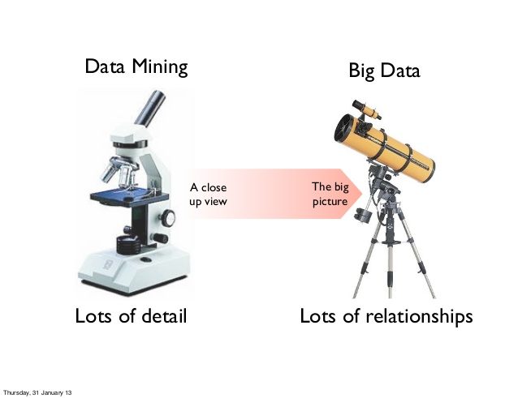
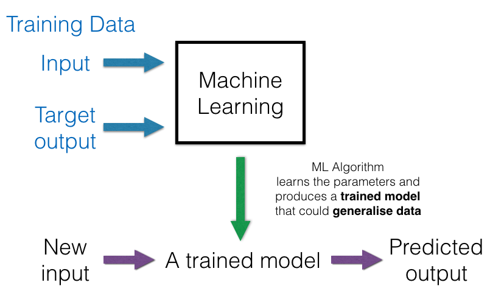
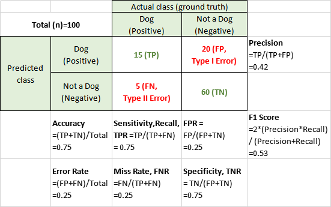
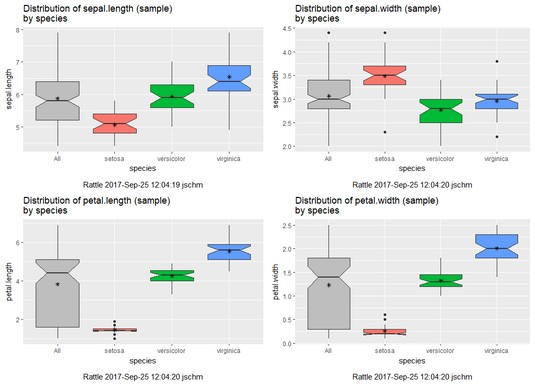
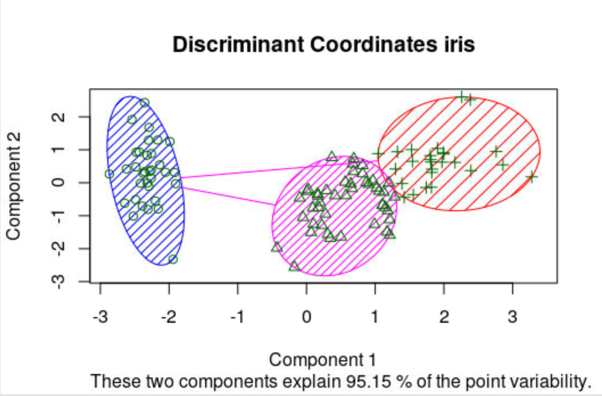
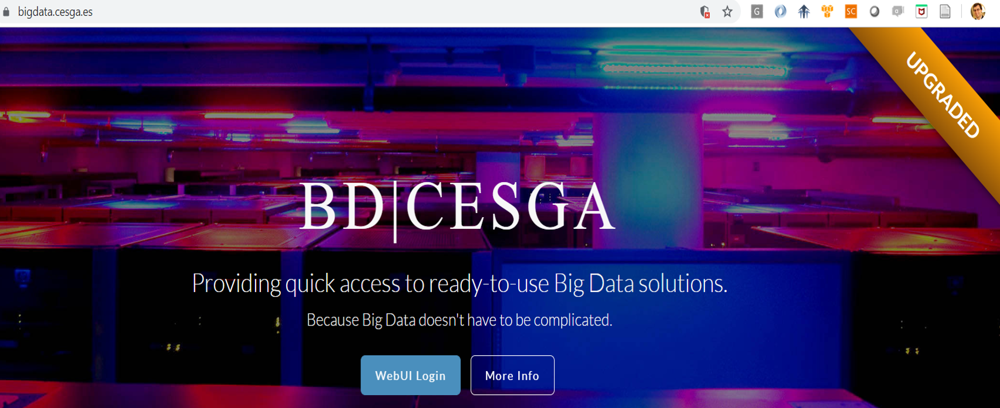
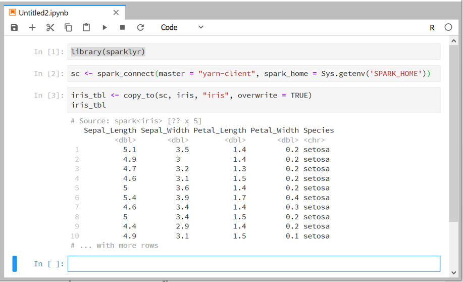

--- 
title: "Prácticas de Tecnologías de Gestión y Manipulación de Datos"
author: "Guillermo López Taboada (guillermo.lopez.taboada@udc.es) y Rubén F. Casal (ruben.fcasal@udc.es)"
date: "2022-11-04"
site: bookdown::bookdown_site
output: bookdown::gitbook
documentclass: book
bibliography: [book.bib, packages.bib]
biblio-style: apalike
link-citations: yes
github-repo: gltaboada/tgdbook
description: "Prácticas de la asignatura de Tecnologías de Gestión de Datos del Máster en Técnicas Estadísticas."
---

# Prólogo {-}

Este libro contiene algunas de las prácticas de la asignatura de [Tecnologías de Gestión de Datos](http://eamo.usc.es/pub/mte/index.php/es/?option=com_content&view=article&id=2202&idm=38&a%C3%B1o=2020) del [Máster interuniversitario en Técnicas Estadísticas](http://eio.usc.es/pub/mte)).

Este libro ha sido escrito en [R-Markdown](http://rmarkdown.rstudio.com) empleando el paquete [`bookdown`](https://bookdown.org/yihui/bookdown/) y está disponible en el repositorio Github: [gltaboada/tgdbook](https://github.com/gltaboada/tgdbook). 
Se puede acceder a la versión en línea a través del siguiente enlace:

<https://gltaboada.github.io/tgdbook>.

donde puede descargarse en formato [pdf](https://gltaboada.github.io/tgdbook/Practicas_de_TGD.pdf).


Para ejecutar los ejemplos mostrados en el libro será necesario tener instalados los siguientes paquetes:
[`dplyr`](https://dplyr.tidyverse.org) (colección [`tidyverse`](https://www.tidyverse.org/)),
[`tidyr`](https://tidyr.tidyverse.org),
[`stringr`](https://stringr.tidyverse.org),
[`readxl`](https://readxl.tidyverse.org) , 
[`openxlsx`](https://cran.r-project.org/web/packages/openxlsx/index.html), [`RODBC`](https://cran.r-project.org/web/packages/RODBC/index.html), 
[`sqldf`](https://cran.r-project.org/web/packages/sqldf/index.html),
[`RSQLite`](https://r-dbi.github.io/RSQLite), 
[`foreign`](https://cran.r-project.org/web/packages/foreign/index.html), 
[`magrittr`](https://cran.r-project.org/web/packages/magrittr/index.html), 
[`knitr`](https://yihui.name/knitr) 
Por ejemplo mediante los comandos:

```r
pkgs <- c('dplyr', 'tidyr', 'stringr', 'readxl', 'openxlsx', 'magrittr', 
          'RODBC', 'sqldf', 'RSQLite', 'foreign', 'knitr')
# install.packages(pkgs, dependencies=TRUE)
install.packages(setdiff(pkgs, installed.packages()[,'Package']), dependencies = TRUE)
```

Para generar el libro (compilar) se recomendaría consultar el libro de ["Escritura de libros con bookdown" ](https://rubenfcasal.github.io/bookdown_intro) en castellano.


\includegraphics[width=1.22in]{images/by-nc-nd-88x31} 

Este obra está bajo una licencia de [Creative Commons Reconocimiento-NoComercial-SinObraDerivada 4.0 Internacional](https://creativecommons.org/licenses/by-nc-nd/4.0/deed.es_ES) 
(esperamos poder liberarlo bajo una licencia menos restrictiva más adelante...).


<!--chapter:end:index.Rmd-->

---
title: "T0 INTRO"
author: "Guillermo Lopez Taboada"
date: "2/11/2020"
output: pdf_document
---

Introducción a las Tecnologías de Gestión y Manipulación de Datos
=================================================================


<!-- ## Introducción -->


La información relevante de la materia está disponible en la guía docente y la ficha de la asignatura

En particular, los resultados de aprendizaje son:

* Manejar de forma autónoma y solvente el software necesario para acceder a conjuntos de datos en entornos profesionales y/o en la nube.	

* Saber gestionar conjuntos de datos masivos en un entorno multidisciplinar que permita la participación en proyectos profesionales complejos que requieran el uso de técnicas estadísticas.	

* Saber relacionar el software de diseño y gestión de bases de datos con el específicamente implementado para el análisis de datos.

## Contenidos

1. Introducción al lenguaje SQL	
	+ Bases de datos relacionales
	+ Sintaxis SQL
	+ Conexión con bases de datos desde R
2. Introducción a tecnologías NoSQL	
	+ Conceptos y tipos de bases de datos NoSQL (documental, columnar, clave/valor y de grafos)
	+ Conexión de R a NoSQL
3. Tecnologías para el tratamiento de datos masivos	
	+ Introducción al Aprendizaje Estadístico
	+ Tecnologías Big Data (Hadoop, Spark, Sparklyr)
	+ Ejercicios de análisis de datos masivos.
	

## Planificación (tentativa)

La impartición de los contenidos durante el curso dependerá de los conocimientos de partida y la asimilación de los 
conceptos. Para completar nuestra visión de los conocimientos previos os requerimos completar este formulario en la primera sesión de clase: https://forms.gle/EbbBNeXTpk8MK1C76

- Semana 1 (4/11): Presentación e introducción a Tema 1 y SQL.

- Semana 2 (11/11): Tema 1 y SQL.

- Semana 3 (15, 16, 17 y 18/11): Seminario Manipulación de datos con dplyr (15 y 16) y Ejercicios SQL (17 y 18).

- Semana 4 (21 y 22/11) Tema 2: NoSQL y Seminario tratamiento de texto (CSV, excel, Json) y open data 

- Semana 4 (23 y 24/11) Tema 3: Conceptos de Big Data y datos masivos. 25 no hay clase.

- Semana 5 (28, 29 y 30/11) Tema 3: Introducción al Aprendizaje Estadístico 

- Semana 5 (1 y 2/12) Tema 3: Tutorial de sparklyr

- Semana 6 (5, 7 y 9/12) Tema 3: Prácticas sparklyr

- Semana 7 (12, 13, 14, 15 y 16) Tema 3: Prácticas sparklyr, seminario de visualización y aplicaciones de datos masivos

- Semana 8 (19, 20 y 21/12) Backup


Examen 24/1 4pm. 


<!-- Curso 2019-2020

- Clase 1 (12/9-R): Seminario R (Manipulación de datos con el paquete base de R)

- Clase 2 (19/9): Tema 1: Conceptos de bases de datos

- Clase 3 (26/9): Tema 1: Introducción a SQL

- Clase 4 (3/10-R): Seminario dplyr (Manipulación de datos con el paquete dplyr)

- Clase 5 (10/10): Jornada usuarios R Galicia (cubre objetivos de Seminario aplicaciones Big Data en investigación e industria)

- Clase 6 (17/10): Tema 1: Ejercicios prácticos de Entidad-relación y SQL

- Clase 7 (24/10): Tema 2: Introducción a NoSQL

- Clase 8 (31/10):  Tema 1: Continuación de ejercicios prácticos SQL

- Clase 9 (7/11):  Tema 2: Ejercicios prácticos de NoSQL

- Clase 10 (14/11):   Seminario visualización con power BI

- Clase 11 (21/11):  Tema 3: Ecosistema Big Data (Hadoop, Spark)

- Clase 12 (28/11):  Tecnologías Big Data (Rspark/sparklyr) + Seminario machine learning CESGA/localhost

- Clase 13 (5/12): Tema 3: Introducción al análisis de datos masivos son sparklyr

- Clase 14 (12/12): Tema 3: Prácticas de Aprendizaje Estadístico/Automático, Data Mining con rattle

- Clase 15 (19/12-R): Seminario conectividad dplyr a BBDD

-->

### Evaluación

-   **Examen** (60%): El examen de la materia evaluará los siguientes aspectos: 
Conceptos de la materia: Dominio de los conocimientos teóricos y operativos de la materia.
Asimilación práctica de materia: Asimilación y comprensión de los conocimientos teóricos y operativos de la materia.

-   **Prácticas de laboratorio** (40%): Evaluación de las prácticas de laboratorio desarrolladas por los estudiantes.


<!-- Curso 2019-2020
#### Observaciones sobre la evaluación:

* Las prácticas de laboratorio se realizarán de forma individual. El plazo para realizar las 3 prácticas será indicado en la presentación de la práctica. El plazo para la entrega de los trabajos tutelados es el último día de clase de la asignatura.

* El estudiante que quiera realizar un trabajo tutelado ha de hablar (o mediante correo electrónico) con los profesores para validar y confirmar el tema y alcance del trabajo tutelado.

* Para poder aprobar la asignatura en la primera oportunidad será necesario obtener como mínimo el 30% de la nota máxima de la suma de las prácticas de laboratorio y trabajos tutelados e, igualmente, el 30% de la nota máxima final de la Prueba mixta (examen), y tener una nota total (prácticas más trabajos tutelados más prueba mixta) igual o superior al 50% de la nota máxima.

* En la segunda oportunidad solamente se podrá recuperar la nota del examen. Las notas de prácticas y de trabajos tutelados serán las obtenidas durante el curso. Para los alumnos que utilicen la oportunidad adelantada de diciembre se utilizarán las notas de prácticas y trabajos tutelados que obtuvieran en su último curso. En esta oportunidad solo será necesario para aprobar obtener una nota total igual o superior al 50% de la nota máxima.

* Una vez que un estudiante es evaluado en una práctica de laboratorio o en un trabajo tutelado implica que será calificado. Por tanto, la calificación "No Presentado" no es posible una vez que una práctica/trabajo ha sido evaluada.

-->

## Fuentes de información:

### Básica

* Daroczi, G. (2015). Mastering Data Analysis with R. Packt Publishing

* Grolemund, G. y Wickham, H. (2016). [R for Data Science](https://r4ds.had.co.nz/) O'Reilly

* Silberschatz, A., Korth, H. y Sudarshan, S. (2014). Fundamentos de Bases de Datos. Mc Graw Hill

* Rubén Fernández Casal y Julián Costa Bouza. [Apuntes de Aprendizaje Estadístico](https://rubenfcasal.github.io/aprendizaje_estadistico/)

* Luraschi, J., Kuo, K., Ruiz, K. [Mastering Spark with R](https://therinspark.com/) O'Reilly

* Rubén Fernández Casal ([R Machinery](https://rubenfcasal.github.io)):

    - [Introducción al Análisis de Datos con R ](https://rubenfcasal.github.io/intror)
      (con Javier Roca y Julián Costa)
    
    - [Ayuda y Recursos para el Aprendizaje de R ](https://rubenfcasal.github.io/post/ayuda-y-recursos-para-el-aprendizaje-de-r)
    
    - [Escritura de libros con el paquete bookdown ](https://rubenfcasal.github.io/bookdown_intro)
      (con Tomás Cotos)
    
    - [Apéndice introducción a Rmarkdown ](https://rubenfcasal.github.io/bookdown_intro/rmarkdown.html) 
    
    - [Pesentación análisis de datos con R ](https://rubenfcasal.github.io/post/presentaciones/AnalisisDatosR.pdf)


### Complementaria:

* Wes McKinney (2017). Python for Data Analysis: Data Wrangling with Pandas, NumPy, and IPython. O'Reilly (2ª ed.)
* Tom White (2015). Hadoop: The Definitive Guide. O'Reilly (4ª ed.)
* Alex Holmes (2014). Hadoop in practice. Manning (2ª ed.)
* Centro de Supercomputación de Galicia (2020). [Servicio de Big Data del CESGA] (https://bigdata.cesga.es/)


<!--chapter:end:01-Introduccion.Rmd-->

Manipulación de datos con R
===========================


En el proceso de análisis de datos, al margen de su obtención y organización, una de las primeras etapas es el acceso y la manipulación de los datos (ver Figura \@ref(fig:esquema2)).
En este capítulo se repasarán brevemente las principales herramientas disponibles en el paquete base de R para ello.
Posteriormente en el Capítulo \@ref(dplyr) se mostrará como alternativa el uso del paquete [`dplyr`](https://dplyr.tidyverse.org/index.html).

\begin{figure}[!htb]

{\centering \includegraphics[width=0.8\linewidth]{images/esquema2} 

}

\caption{Etapas del proceso}(\#fig:esquema2)
\end{figure}


Lectura, importación y exportación de datos
-------------------------------------------

Además de la introducción directa, R es capaz de
importar datos externos en múltiples formatos:

-   bases de datos disponibles en librerías de R

-   archivos de texto en formato ASCII

-   archivos en otros formatos: Excel, SPSS, ...

-   bases de datos relacionales: MySQL, Oracle, ...

-   formatos web: HTML, XML, JSON, ...

-   ....

### Formato de datos de R

El formato de archivo en el que habitualmente se almacena objetos (datos)
R es binario y está comprimido (en formato `"gzip"` por defecto).
Para cargar un fichero de datos se emplea normalmente [`load()`](https://www.rdocumentation.org/packages/base/versions/3.6.1/topics/load):

```r
res <- load("data/empleados.RData")
res
```

```
## [1] "empleados"
```

```r
ls()
```

```
##  [1] "citefig"   "citefig2"  "empleados" "fig.path"  "inline"    "inline2"  
##  [7] "is_html"   "is_latex"  "latexfig"  "latexfig2" "res"
```
y para guardar [`save()`](https://www.rdocumentation.org/packages/base/versions/3.6.1/topics/save):

```r
# Guardar
save(empleados, file = "data/empleados_new.RData")
```

Aunque, como indica este comando en la ayuda (`?save`):

> For saving single R objects, [`saveRDS()` ](https://www.rdocumentation.org/packages/base/versions/3.6.1/topics/saveRDS) 
> is mostly preferable to save(), 
> notably because of the functional nature of readRDS(), as opposed to load(). 


```r
saveRDS(empleados, file = "data/empleados_new.rds")
## restore it under a different name
empleados2 <- readRDS("data/empleados_new.rds")
# identical(empleados, empleados2)
```

El objeto empleado normalmente en R para almacenar datos en memoria 
es el [`data.frame`](https://www.rdocumentation.org/packages/base/versions/3.6.1/topics/data.frame).


### Acceso a datos en paquetes

R dispone de múltiples conjuntos de datos en distintos paquetes, especialmente en el paquete `datasets` 
que se carga por defecto al abrir R. 
Con el comando `data()` podemos obtener un listado de las bases de datos disponibles.

Para cargar una base de datos concreta se utiliza el comando
`data(nombre)` (aunque en algunos casos se cargan automáticamente al emplearlos). 
Por ejemplo, `data(cars)` carga la base de datos llamada `cars` en el entorno de trabajo (`".GlobalEnv"`)
y `?cars` muestra la ayuda correspondiente con la descripición de la base de datos.


### Lectura de archivos de texto {#cap2-texto}

En R para leer archivos de texto se suele utilizar la función `read.table()`.
Supóngase, por ejemplo, que en el directorio actual está el fichero
*empleados.txt*. La lectura de este fichero vendría dada por el código:


```r
# Session > Set Working Directory > To Source...?
datos <- read.table(file = "data/empleados.txt", header = TRUE)
# head(datos)
str(datos)
```

```
## 'data.frame':	474 obs. of  10 variables:
##  $ id      : int  1 2 3 4 5 6 7 8 9 10 ...
##  $ sexo    : chr  "Hombre" "Hombre" "Mujer" "Mujer" ...
##  $ fechnac : chr  "2/3/1952" "5/23/1958" "7/26/1929" "4/15/1947" ...
##  $ educ    : int  15 16 12 8 15 15 15 12 15 12 ...
##  $ catlab  : chr  "Directivo" "Administrativo" "Administrativo" "Administrativo" ...
##  $ salario : num  57000 40200 21450 21900 45000 ...
##  $ salini  : int  27000 18750 12000 13200 21000 13500 18750 9750 12750 13500 ...
##  $ tiempemp: int  98 98 98 98 98 98 98 98 98 98 ...
##  $ expprev : int  144 36 381 190 138 67 114 0 115 244 ...
##  $ minoria : chr  "No" "No" "No" "No" ...
```
Si el fichero estuviese en el directorio *c:\\datos* bastaría con especificar
`file = "c:/datos/empleados.txt"`.
Nótese también que para la lectura del fichero anterior se ha
establecido el argumento `header=TRUE` para indicar que la primera línea del
fichero contiene los nombres de las variables.

Los argumentos utilizados habitualmente para esta función son:

-   `header`: indica si el fichero tiene cabecera (`header=TRUE`) o no
    (`header=FALSE`). Por defecto toma el valor `header=FALSE`.

-   `sep`: carácter separador de columnas que por defecto es un espacio
    en blanco (`sep=""`). Otras opciones serían: `sep=","` si el separador es
    un ";", `sep="*"` si el separador es un "\*", etc.

-   `dec`: carácter utilizado en el fichero para los números decimales.
    Por defecto se establece `dec = "."`. Si los decimales vienen dados
    por "," se utiliza `dec = ","`

Resumiendo, los (principales) argumentos por defecto de la función
`read.table` son los que se muestran en la siguiente línea:


```r
read.table(file, header = FALSE, sep = "", dec = ".")  
```

Para más detalles sobre esta función véase
`help(read.table)`.

Estan disponibles otras funciones con valores por defecto de los parámetros 
adecuados para otras situaciones. Por ejemplo, para ficheros separados por tabuladores 
se puede utilizar `read.delim()` o `read.delim2()`:

```r
read.delim(file, header = TRUE, sep = "\t", dec = ".")
read.delim2(file, header = TRUE, sep = "\t", dec = ",")
```

### Alternativa `tidyverse`

Para leer archivos de texto en distintos formatos también se puede emplear el paquete [`readr`](https://readr.tidyverse.org) 
(colección [`tidyverse`](https://www.tidyverse.org/)), para lo que se recomienda
consultar el [Capítulo 11](https://r4ds.had.co.nz/data-import.html) del libro [R for Data Science](http://r4ds.had.co.nz).


### Importación desde SPSS

El programa R permite
lectura de ficheros de datos en formato SPSS (extensión *.sav*) sin
necesidad de tener instalado dicho programa en el ordenador. Para ello
se necesita:

-   cargar la librería `foreign`

-   utilizar la función `read.spss`

Por ejemplo:


```r
library(foreign)
datos <- read.spss(file = "data/Employee data.sav", to.data.frame = TRUE)
# head(datos)
str(datos)
```

```
## 'data.frame':	474 obs. of  10 variables:
##  $ id      : num  1 2 3 4 5 6 7 8 9 10 ...
##  $ sexo    : Factor w/ 2 levels "Hombre","Mujer": 1 1 2 2 1 1 1 2 2 2 ...
##  $ fechnac : num  1.17e+10 1.19e+10 1.09e+10 1.15e+10 1.17e+10 ...
##  $ educ    : Factor w/ 10 levels "8","12","14",..: 4 5 2 1 4 4 4 2 4 2 ...
##  $ catlab  : Factor w/ 3 levels "Administrativo",..: 3 1 1 1 1 1 1 1 1 1 ...
##  $ salario : Factor w/ 221 levels "15750","15900",..: 179 137 28 31 150 101 121 31 71 45 ...
##  $ salini  : Factor w/ 90 levels "9000","9750",..: 60 42 13 21 48 23 42 2 18 23 ...
##  $ tiempemp: Factor w/ 36 levels "63","64","65",..: 36 36 36 36 36 36 36 36 36 36 ...
##  $ expprev : Factor w/ 208 levels "Ausente","10",..: 38 131 139 64 34 181 13 1 14 91 ...
##  $ minoria : Factor w/ 2 levels "No","Sí": 1 1 1 1 1 1 1 1 1 1 ...
##  - attr(*, "variable.labels")= Named chr [1:10] "Código de empleado" "Sexo" "Fecha de nacimiento" "Nivel educativo" ...
##   ..- attr(*, "names")= chr [1:10] "id" "sexo" "fechnac" "educ" ...
##  - attr(*, "codepage")= int 1252
```

**Nota**: Si hay fechas, puede ser recomendable emplear la función `spss.get()` del paquete `Hmisc`.


### Importación desde Excel

Se pueden leer fichero de
Excel (con extensión *.xlsx*) utilizando por ejemplo los paquetes [`openxlsx`](https://cran.r-project.org/web/packages/openxlsx/index.html), [`readxl`](https://readxl.tidyverse.org) (colección [`tidyverse`](https://www.tidyverse.org/)), `XLConnect` o 
[`RODBC`](https://cran.r-project.org/web/packages/RODBC/index.html) (este paquete se empleará más adelante para acceder a bases de datos),
entre otros.

Por ejemplo el siguiente código implementa una función que permite leer todos
los archivos en formato *.xlsx* en un directorio:


```r
library(openxlsx)

read_xlsx <- function(path = '.') {
  files <- dir(path, pattern = '*.xlsx') # list.files
  # file.list <- lapply(files, readWorkbook)
  file.list <- vector(length(files), mode = 'list')
  for (i in seq_along(files)) 
      file.list[[i]] <- readWorkbook(files[i])
  file.names <- sub('\\.xlsx$', '', basename(files)) 
  names(file.list) <- file.names
  file.list
}
```

Para combinar los archivos (suponiendo que tienen las mismas columnas), podríamos ejecutar una llamada a [`rbind()` ](https://www.rdocumentation.org/packages/base/versions/3.6.1/topics/rbind)
o emplear la función [`bind_rows()` ](https://www.rdocumentation.org/packages/dplyr/versions/0.7.8/topics/bind)
del paquete [`dplyr`](https://dplyr.tidyverse.org):


```r
df <- do.call('rbind', file.list)

df <- dplyr::bind_rows(file.list)
```

Como alternativa simple se pueden exportar los datos desde Excel a un archivo de texto *separado por comas* (extensión *.csv*).
Por ejemplo, supongamos que queremos leer el fichero *coches.xls*:

-   Desde Excel se selecciona el menú
    `Archivo -> Guardar como -> Guardar como` y en `Tipo` se escoge la opción de
    archivo CSV. De esta forma se guardarán los datos en el archivo
    *coches.csv*.

-   El fichero *coches.csv* es un fichero de texto plano (se puede
    editar con Notepad), con cabecera, las columnas separadas por ";", y
    siendo "," el carácter decimal.

-   Por lo tanto, la lectura de este fichero se puede hacer con:

    
    ```r
    datos <- read.table("coches.csv", header = TRUE, sep = ";", dec = ",")
    ```

Otra posibilidad es utilizar la función `read.csv2`, que es
una adaptación de la función general `read.table` con las siguientes
opciones:

```r
read.csv2(file, header = TRUE, sep = ";", dec = ",")
```

Por lo tanto, la lectura del fichero *coches.csv* se puede hacer de modo
más directo con:

```r
datos <- read.csv2("coches.csv")
```

Esta forma de proceder, exportando a formato CSV, se puede emplear con otras hojas de cálculo o fuentes de datos. 
Hay que tener en cuenta que si estas fuentes emplean el formato anglosajón, el separador de campos será `sep = ","` y el de decimales `dec = ","`, las opciones por defecto en la función `read.csv()`.


### Exportación de datos

Puede ser de interés la
exportación de datos para que puedan leídos con otros programas. Para
ello, se puede emplear la función `write.table()`. Esta función es
similar, pero funcionando en sentido inverso, a `read.table()` 
(Sección \@ref(cap2-texto)).

Veamos un ejemplo:


```r
tipo <- c("A", "B", "C")
longitud <- c(120.34, 99.45, 115.67)
datos <- data.frame(tipo, longitud)
datos
```

```
##   tipo longitud
## 1    A   120.34
## 2    B    99.45
## 3    C   115.67
```
Para guardar el data.frame `datos` en un fichero de texto se
puede utilizar:

```r
write.table(datos, file = "datos.txt")
```
Otra posibilidad es utilizar la función:

```r
write.csv2(datos, file = "datos.csv")
```
que dará lugar al fichero *datos.csv* importable directamente desde Excel.


Manipulación de datos
---------------------

Una vez cargada una (o varias) bases
de datos hay una series de operaciones que serán de interés para el
tratamiento de datos: 

-   Operaciones con variables: 
    - crear
    - recodificar (e.g. categorizar)
    - ...

-   Operaciones con casos:
    - ordenar
    - filtrar
    - ...

-   Operaciones con tablas de datos:
    - unir
    - combinar
    - consultar
    - ...


A continuación se tratan algunas operaciones *básicas*.

### Operaciones con variables

#### Creación (y eliminación) de variables

Consideremos de nuevo la
base de datos `cars` incluida en el paquete `datasets`:

```r
data(cars)
# str(cars)
head(cars)
```

```
##   speed dist
## 1     4    2
## 2     4   10
## 3     7    4
## 4     7   22
## 5     8   16
## 6     9   10
```

Utilizando el comando `help(cars)`
se obtiene que `cars` es un data.frame con 50 observaciones y dos
variables:

-   `speed`: Velocidad (millas por hora)

-   `dist`: tiempo hasta detenerse (pies)

Recordemos que, para acceder a la variable `speed` se puede
hacer directamente con su nombre o bien utilizando notación
"matricial".

```r
cars$speed
```

```
##  [1]  4  4  7  7  8  9 10 10 10 11 11 12 12 12 12 13 13 13 13 14 14 14 14 15 15
## [26] 15 16 16 17 17 17 18 18 18 18 19 19 19 20 20 20 20 20 22 23 24 24 24 24 25
```

```r
cars[, 1]  # Equivalente
```

```
##  [1]  4  4  7  7  8  9 10 10 10 11 11 12 12 12 12 13 13 13 13 14 14 14 14 15 15
## [26] 15 16 16 17 17 17 18 18 18 18 19 19 19 20 20 20 20 20 22 23 24 24 24 24 25
```
Supongamos ahora que queremos transformar la variable original `speed`
(millas por hora) en una nueva variable `velocidad` (kilómetros por
hora) y añadir esta nueva variable al data.frame `cars`.
La transformación que permite pasar millas a kilómetros es
`kilómetros=millas/0.62137` que en R se hace directamente con:


```r
cars$speed/0.62137
```

 Finalmente, incluimos la nueva variable que llamaremos
`velocidad` en `cars`:

```r
cars$velocidad <- cars$speed / 0.62137
head(cars)
```

```
##   speed dist velocidad
## 1     4    2  6.437388
## 2     4   10  6.437388
## 3     7    4 11.265430
## 4     7   22 11.265430
## 5     8   16 12.874777
## 6     9   10 14.484124
```

También transformaremos la variable `dist` (en pies) en una nueva
variable `distancia` (en metros). Ahora la transformación deseada es
`metros=pies/3.2808`:


```r
cars$distancia <- cars$dis / 3.2808
head(cars)
```

```
##   speed dist velocidad distancia
## 1     4    2  6.437388 0.6096074
## 2     4   10  6.437388 3.0480371
## 3     7    4 11.265430 1.2192148
## 4     7   22 11.265430 6.7056815
## 5     8   16 12.874777 4.8768593
## 6     9   10 14.484124 3.0480371
```

 Ahora, eliminaremos las variables originales `speed` y
`dist`, y guardaremos el data.frame resultante con el nombre `coches`.
En primer lugar, veamos varias formas de acceder a las variables de
interés:

```r
cars[, c(3, 4)]
cars[, c("velocidad", "distancia")]
cars[, -c(1, 2)]
```

Utilizando alguna de las opciones anteriores se obtiene el `data.frame`
deseado:

```r
coches <- cars[, c("velocidad", "distancia")]
# head(coches)
str(coches)
```

```
## 'data.frame':	50 obs. of  2 variables:
##  $ velocidad: num  6.44 6.44 11.27 11.27 12.87 ...
##  $ distancia: num  0.61 3.05 1.22 6.71 4.88 ...
```

Finalmente los datos anteriores podrían ser guardados en un fichero
exportable a Excel con el siguiente comando:

```r
write.csv2(coches, file = "coches.csv")
```

#### Recodificación de variables

Con el comando `cut()` podemos crear variables categóricas a partir de variables numéricas.
El parámetro `breaks` permite especificar los intervalos para la discretización, puede ser un vector con los extremos de los intervalos o un entero con el número de intervalos.
Por ejemplo, para categorizar la variable `cars$speed` en tres intervalos equidistantes podemos emplear^[Aunque si el objetivo es obtener las frecuencias de cada intervalo puede ser más eficiente emplear `hist()` con `plot = FALSE`.]:


```r
fspeed <- cut(cars$speed, 3, labels = c("Baja", "Media", "Alta"))
table(fspeed)
```

```
## fspeed
##  Baja Media  Alta 
##    11    24    15
```

Para categorizar esta variable en tres niveles con aproximadamente el mismo número de observaciones podríamos combinar esta función con `quantile()`:


```r
breaks <- quantile(cars$speed, probs = seq(0, 1, len = 4))
fspeed <- cut(cars$speed, breaks, labels = c("Baja", "Media", "Alta"))
table(fspeed)
```

```
## fspeed
##  Baja Media  Alta 
##    17    16    15
```

Para otro tipo de recodificaciones podríamos emplear la función `ifelse()` vectorial:


```r
fspeed <- ifelse(cars$speed < 15, "Baja", "Alta")
fspeed <- factor(fspeed, levels = c("Baja", "Alta"))
table(fspeed)
```

```
## fspeed
## Baja Alta 
##   23   27
```

Alternativamente en el caso de dos niveles podríamos emplear directamente la función `factor()`:


```r
fspeed <- factor(cars$speed >= 15, labels = c("Baja", "Alta")) # levels = c("FALSE", "TRUE")
table(fspeed)
```

```
## fspeed
## Baja Alta 
##   23   27
```

En el caso de múltiples niveles se podría emplear `ifelse()` anidados:


```r
fspeed <- ifelse(cars$speed < 10, "Baja",
                 ifelse(cars$speed < 20, "Media", "Alta"))
fspeed <- factor(fspeed, levels = c("Baja", "Media", "Alta"))
table(fspeed)
```

```
## fspeed
##  Baja Media  Alta 
##     6    32    12
```

Otra alternativa sería emplear la función [`recode()`](https://www.rdocumentation.org/packages/car/versions/3.0-9/topics/recode) del paquete `car`.

NOTA: Para acceder directamente a las variables de un data.frame podríamos emplear la función `attach()` para añadirlo a la ruta de búsqueda y `detach()` al finalizar.
Sin embargo esta forma de proceder puede causar numerosos inconvenientes, especialmente al modificar la base de datos, por lo que la recomendación sería emplear `with()`.
Por ejemplo, podríamos calcular el factor anterior empleando:


```r
fspeed <- with(cars, ifelse(speed < 10, "Baja",
                 ifelse(speed < 20, "Media", "Alta")))
fspeed <- factor(fspeed, levels = c("Baja", "Media", "Alta"))
table(fspeed)
```

```
## fspeed
##  Baja Media  Alta 
##     6    32    12
```


### Operaciones con casos

#### Ordenación

Continuemos con el data.frame `cars`. 
Se puede comprobar que los datos disponibles están ordenados por
los valores de `speed`. A continuación haremos la ordenación utilizando
los valores de `dist`. Para ello utilizaremos el conocido como vector de
índices de ordenación.
Este vector establece el orden en que tienen que ser elegidos los
elementos para obtener la ordenación deseada. 
Veamos un ejemplo sencillo:

```r
x <- c(2.5, 4.3, 1.2, 3.1, 5.0) # valores originales
ii <- order(x)
ii    # vector de ordenación
```

```
## [1] 3 1 4 2 5
```

```r
x[ii] # valores ordenados
```

```
## [1] 1.2 2.5 3.1 4.3 5.0
```
En el caso de vectores, el procedimiento anterior se podría
hacer directamente con: 

```r
sort(x)
```

Sin embargo, para ordenar data.frames será necesario la utilización del
vector de índices de ordenación. A continuación, los datos de `cars`
ordenados por `dist`:

```r
ii <- order(cars$dist) # Vector de índices de ordenación
cars2 <- cars[ii, ]    # Datos ordenados por dist
head(cars2)
```

```
##    speed dist velocidad distancia
## 1      4    2  6.437388 0.6096074
## 3      7    4 11.265430 1.2192148
## 2      4   10  6.437388 3.0480371
## 6      9   10 14.484124 3.0480371
## 12    12   14 19.312165 4.2672519
## 5      8   16 12.874777 4.8768593
```

#### Filtrado

El filtrado de datos consiste en
elegir una submuestra que cumpla determinadas condiciones. Para ello se
puede utilizar la función [`subset()` ](https://www.rdocumentation.org/packages/base/versions/3.6.1/topics/subset) 
(que además permite seleccionar variables).

A continuación se muestran un par de ejemplos:

```r
subset(cars, dist > 85) # datos con dis>85
```

```
##    speed dist velocidad distancia
## 47    24   92  38.62433  28.04194
## 48    24   93  38.62433  28.34674
## 49    24  120  38.62433  36.57644
```

```r
subset(cars, speed > 10 & speed < 15 & dist > 45) # speed en (10,15) y dist>45
```

```
##    speed dist velocidad distancia
## 19    13   46  20.92151  14.02097
## 22    14   60  22.53086  18.28822
## 23    14   80  22.53086  24.38430
```

También se pueden hacer el filtrado empleando directamente los
correspondientes vectores de índices:


```r
ii <- cars$dist > 85
cars[ii, ]   # dis>85
```

```
##    speed dist velocidad distancia
## 47    24   92  38.62433  28.04194
## 48    24   93  38.62433  28.34674
## 49    24  120  38.62433  36.57644
```

```r
ii <- cars$speed > 10 & cars$speed < 15 & cars$dist > 45
cars[ii, ]  # speed en (10,15) y dist>45
```

```
##    speed dist velocidad distancia
## 19    13   46  20.92151  14.02097
## 22    14   60  22.53086  18.28822
## 23    14   80  22.53086  24.38430
```

En este caso puede ser de utilidad la función [`which()` ](https://www.rdocumentation.org/packages/base/versions/3.6.1/topics/which):


```r
it <- which(ii)
str(it)
```

```
##  int [1:3] 19 22 23
```

```r
cars[it, 1:2]
```

```
##    speed dist
## 19    13   46
## 22    14   60
## 23    14   80
```

```r
# rownames(cars[it, 1:2])

id <- which(!ii)
str(cars[id, 1:2])
```

```
## 'data.frame':	47 obs. of  2 variables:
##  $ speed: num  4 4 7 7 8 9 10 10 10 11 ...
##  $ dist : num  2 10 4 22 16 10 18 26 34 17 ...
```

```r
# Equivalentemente:
str(cars[-it, 1:2])
```

```
## 'data.frame':	47 obs. of  2 variables:
##  $ speed: num  4 4 7 7 8 9 10 10 10 11 ...
##  $ dist : num  2 10 4 22 16 10 18 26 34 17 ...
```

```r
# Se podría p.e. emplear cars[id, ] para predecir cars[it, ]$speed
# ?which.min
```


### Funciones `apply`


#### La función `apply`

Una forma de evitar la
utilización de bucles es utilizando la sentencia `apply` que permite
evaluar una misma función en todas las filas, columnas, etc. de un array
de forma simultánea.

La sintaxis de esta función es:

```r
apply(X, MARGIN, FUN, ...)
```
-   `X`: matriz (o array)
-   `MARGIN`: Un vector indicando las dimensiones donde se aplicará
    la función. 1 indica filas, 2 indica columnas, y `c(1,2)` indica
    filas y columnas.
-   `FUN`: función que será aplicada.
-   `...`: argumentos opcionales que serán usados por `FUN`.

Veamos la utilización de la función `apply` con un ejemplo:

```r
x <- matrix(1:9, nrow = 3)
x
```

```
##      [,1] [,2] [,3]
## [1,]    1    4    7
## [2,]    2    5    8
## [3,]    3    6    9
```

```r
apply(x, 1, sum)    # Suma por filas
```

```
## [1] 12 15 18
```

```r
apply(x, 2, sum)    # Suma por columnas
```

```
## [1]  6 15 24
```

```r
apply(x, 2, min)    # Mínimo de las columnas
```

```
## [1] 1 4 7
```

```r
apply(x, 2, range)  # Rango (mínimo y máximo) de las columnas
```

```
##      [,1] [,2] [,3]
## [1,]    1    4    7
## [2,]    3    6    9
```

#### Variantes de la función `apply`

[`lapply()`](https://www.rdocumentation.org/packages/base/versions/3.6.1/topics/lapply):


```r
# lista con las medianas de las variables
list <- lapply(cars, median)
str(list)
```

```
## List of 4
##  $ speed    : num 15
##  $ dist     : num 36
##  $ velocidad: num 24.1
##  $ distancia: num 11
```

[`sapply()`](https://www.rdocumentation.org/packages/base/versions/3.6.1/topics/sapply):


```r
# matriz con las medias, medianas y desv. de las variables
res <- sapply(cars, 
          function(x) c(mean = mean(x), median = median(x), sd = sd(x)))
# str(res)
res
```

```
##            speed     dist velocidad distancia
## mean   15.400000 42.98000 24.783945 13.100463
## median 15.000000 36.00000 24.140206 10.972933
## sd      5.287644 25.76938  8.509655  7.854602
```

```r
knitr::kable(t(res), digits = 1)
```


\begin{tabular}{l|r|r|r}
\hline
  & mean & median & sd\\
\hline
speed & 15.4 & 15.0 & 5.3\\
\hline
dist & 43.0 & 36.0 & 25.8\\
\hline
velocidad & 24.8 & 24.1 & 8.5\\
\hline
distancia & 13.1 & 11.0 & 7.9\\
\hline
\end{tabular}


```r
cfuns <- function(x, funs = c(mean, median, sd))
            sapply(funs, function(f) f(x))
x <- 1:10
cfuns(x)
```

```
## [1] 5.50000 5.50000 3.02765
```

```r
sapply(cars, cfuns)
```

```
##          speed     dist velocidad distancia
## [1,] 15.400000 42.98000 24.783945 13.100463
## [2,] 15.000000 36.00000 24.140206 10.972933
## [3,]  5.287644 25.76938  8.509655  7.854602
```

```r
nfuns <- c("mean", "median", "sd")
sapply(nfuns, function(f) eval(parse(text = paste0(f, "(x)"))))
```

```
##    mean  median      sd 
## 5.50000 5.50000 3.02765
```

<!-- 
añadir nombres a cfuns 
cfuns <- function(x, funs = c(mean, median, sd)){
  # nfuns <- deparse(substitute(funs))
  res <- sapply(funs, function(f) f(x))
  names(res) <- nfuns
  return(res)
}

-->

#### La función `tapply`

La function [`tapply()`](https://www.rdocumentation.org/packages/base/versions/3.6.1/topics/tapply) es
similar a la función `apply()` y permite aplicar una función a los datos desagregados,
utilizando como criterio los distintos niveles de una variable factor. 
La sintaxis de esta función es como sigue:

```r
    tapply(X, INDEX, FUN, ...,)
```
-   `X`: matriz (o array).
-   `INDEX`: factor indicando los grupos (niveles).
-   `FUN`: función que será aplicada.
-   `...`: argumentos opcionales .

Consideremos, por ejemplo, el data.frame `ChickWeight` con datos de un
experimento relacionado con la repercusión de varias dietas en el peso
de pollos.

```r
data(ChickWeight)
# str(ChickWeight)
head(ChickWeight)
```

```
##   weight Time Chick Diet
## 1     42    0     1    1
## 2     51    2     1    1
## 3     59    4     1    1
## 4     64    6     1    1
## 5     76    8     1    1
## 6     93   10     1    1
```

```r
peso <- ChickWeight$weight
dieta <- ChickWeight$Diet
levels(dieta) <- c("Dieta 1", "Dieta 2", "Dieta 3", "Dieta 4")
tapply(peso, dieta, mean)  # Peso medio por dieta
```

```
##  Dieta 1  Dieta 2  Dieta 3  Dieta 4 
## 102.6455 122.6167 142.9500 135.2627
```

```r
tapply(peso, dieta, summary)
```

```
## $`Dieta 1`
##    Min. 1st Qu.  Median    Mean 3rd Qu.    Max. 
##   35.00   57.75   88.00  102.65  136.50  305.00 
## 
## $`Dieta 2`
##    Min. 1st Qu.  Median    Mean 3rd Qu.    Max. 
##    39.0    65.5   104.5   122.6   163.0   331.0 
## 
## $`Dieta 3`
##    Min. 1st Qu.  Median    Mean 3rd Qu.    Max. 
##    39.0    67.5   125.5   142.9   198.8   373.0 
## 
## $`Dieta 4`
##    Min. 1st Qu.  Median    Mean 3rd Qu.    Max. 
##   39.00   71.25  129.50  135.26  184.75  322.00
```

Otro ejemplo:

```r
provincia <- as.factor(c(1, 3, 4, 2, 4, 3, 2, 1, 4, 3, 2))
levels(provincia) = c("A Coruña", "Lugo", "Orense", "Pontevedra")
hijos <- c(1, 2, 0, 3, 4, 1, 0, 0, 2, 3, 1)
data.frame(provincia, hijos)
```

```
##     provincia hijos
## 1    A Coruña     1
## 2      Orense     2
## 3  Pontevedra     0
## 4        Lugo     3
## 5  Pontevedra     4
## 6      Orense     1
## 7        Lugo     0
## 8    A Coruña     0
## 9  Pontevedra     2
## 10     Orense     3
## 11       Lugo     1
```

```r
tapply(hijos, provincia, mean) # Número medio de hijos por provincia
```

```
##   A Coruña       Lugo     Orense Pontevedra 
##   0.500000   1.333333   2.000000   2.000000
```

Alternativamente se podría emplear la función `aggregate()` que tiene las ventajas de admitir fórmulas y disponer de un método para series de tiempo.


### Operaciones con tablas de datos


***Unir tablas***:

* [`rbind()` ](https://www.rdocumentation.org/packages/base/versions/3.6.1/topics/rbind): combina vectores, matrices, arrays o data.frames por filas.

* [`cbind()` ](https://www.rdocumentation.org/packages/base/versions/3.6.1/topics/cbind): Idem por columnas.


***Combinar tablas***:


* [`match(x, table)`](https://www.rdocumentation.org/packages/base/versions/3.6.1/topics/match) devuelve un vector (de la misma longitud que `x`)  con las (primeras) posiciones de coincidencia de `x` en `table` (o `NA`, por defecto, si no hay coincidencia).

    Para realizar consultas combinando tablas puede ser más cómodo el operador `%in%` (`?'%in%'`).

* [`pmatch(x, table, ...)`](https://www.rdocumentation.org/packages/base/versions/3.6.1/topics/pmatch): similar al anterior pero con coincidencias parciales de cadenas de texto. 


## Ejemplo WoS data

Ejemplo [*wosdata.R*](data/wosdata.R) en [*wosdata.zip*](data/wosdata.zip).
Ver Apéndice \@ref(scimetr).


```r
# library(dplyr)
# library(stringr)
# https://rubenfcasal.github.io/scimetr/articles/scimetr.html
# library(scimetr)

db <- readRDS("data/wosdata/db_udc_2015.rds")
str(db, 1)
```

```
## List of 11
##  $ Docs      :'data.frame':	856 obs. of  26 variables:
##  $ Authors   :'data.frame':	4051 obs. of  4 variables:
##  $ AutDoc    :'data.frame':	5511 obs. of  2 variables:
##  $ Categories:'data.frame':	189 obs. of  2 variables:
##  $ CatDoc    :'data.frame':	1495 obs. of  2 variables:
##  $ Areas     :'data.frame':	121 obs. of  2 variables:
##  $ AreaDoc   :'data.frame':	1364 obs. of  2 variables:
##  $ Addresses :'data.frame':	3655 obs. of  5 variables:
##  $ AddAutDoc :'data.frame':	7751 obs. of  3 variables:
##  $ Journals  :'data.frame':	520 obs. of  12 variables:
##  $ label     : chr ""
##  - attr(*, "variable.labels")= Named chr [1:62] "Publication type" "Author" "Book authors" "Editor" ...
##   ..- attr(*, "names")= chr [1:62] "PT" "AU" "BA" "BE" ...
##  - attr(*, "class")= chr "wos.db"
```

```r
variable.labels <- attr(db, "variable.labels")
knitr::kable(as.data.frame(variable.labels)) # caption = "Variable labels"
```


\begin{tabular}{l|l}
\hline
  & variable.labels\\
\hline
PT & Publication type\\
\hline
AU & Author\\
\hline
BA & Book authors\\
\hline
BE & Editor\\
\hline
GP & Group author\\
\hline
AF & Author full\\
\hline
BF & Book authors fullname\\
\hline
CA & Corporate author\\
\hline
TI & Title\\
\hline
SO & Publication name\\
\hline
SE & Series title\\
\hline
BS & Book series\\
\hline
LA & Language\\
\hline
DT & Document type\\
\hline
CT & Conference title\\
\hline
CY & Conference year\\
\hline
CL & Conference place\\
\hline
SP & Conference sponsors\\
\hline
HO & Conference host\\
\hline
DE & Keywords\\
\hline
ID & Keywords Plus\\
\hline
AB & Abstract\\
\hline
C1 & Addresses\\
\hline
RP & Reprint author\\
\hline
EM & Author email\\
\hline
RI & Researcher id numbers\\
\hline
OI & Orcid numbers\\
\hline
FU & Funding agency and grant number\\
\hline
FX & Funding text\\
\hline
CR & Cited references\\
\hline
NR & Number of cited references\\
\hline
TC & Times cited\\
\hline
Z9 & Total times cited count\\
\hline
U1 & Usage Count (Last 180 Days)\\
\hline
U2 & Usage Count (Since 2013)\\
\hline
PU & Publisher\\
\hline
PI & Publisher city\\
\hline
PA & Publisher address\\
\hline
SN & ISSN\\
\hline
EI & eISSN\\
\hline
BN & ISBN\\
\hline
J9 & Journal.ISI\\
\hline
JI & Journal.ISO\\
\hline
PD & Publication date\\
\hline
PY & Year published\\
\hline
VL & Volume\\
\hline
IS & Issue\\
\hline
PN & Part number\\
\hline
SU & Supplement\\
\hline
SI & Special issue\\
\hline
MA & Meeting abstract\\
\hline
BP & Beginning page\\
\hline
EP & Ending page\\
\hline
AR & Article number\\
\hline
DI & DOI\\
\hline
D2 & Book DOI\\
\hline
PG & Page count\\
\hline
WC & WOS category\\
\hline
SC & Research areas\\
\hline
GA & Document delivery number\\
\hline
UT & Access number\\
\hline
PM & Pub Med ID\\
\hline
\end{tabular}

Documentos correspondientes a revistas:


```r
# View(db$Journals)
iidj <- with(db$Journals, idj[grepl('Chem', JI)])
db$Journals$JI[iidj]
```

```
##  [1] "J. Am. Chem. Soc."                  "Inorg. Chem."                      
##  [3] "J. Chem. Phys."                     "J. Chem. Thermodyn."               
##  [5] "J. Solid State Chem."               "Chemosphere"                       
##  [7] "Antimicrob. Agents Chemother."      "Trac-Trends Anal. Chem."           
##  [9] "Eur. J. Med. Chem."                 "J. Chem. Technol. Biotechnol."     
## [11] "J. Antimicrob. Chemother."          "Food Chem."                        
## [13] "Cancer Chemother. Pharmacol."       "Int. J. Chem. Kinet."              
## [15] "Chem.-Eur. J."                      "J. Phys. Chem. A"                  
## [17] "New J. Chem."                       "Chem. Commun."                     
## [19] "Chem. Eng. J."                      "Comb. Chem. High Throughput Screen"
## [21] "Mini-Rev. Med. Chem."               "Phys. Chem. Chem. Phys."           
## [23] "Org. Biomol. Chem."                 "J. Chem Inf. Model."               
## [25] "ACS Chem. Biol."                    "Environ. Chem. Lett."              
## [27] "Anal. Bioanal. Chem."               "J. Cheminformatics"                
## [29] "J. Mat. Chem. B"
```

```r
idd <- with(db$Docs, idj %in% iidj)
which(idd)
```

```
##  [1]   2   4  16  23  43  69 119 126 138 175 188 190 203 208 226 240 272 337 338
## [20] 341 342 357 382 385 386 387 388 394 411 412 428 460 483 518 525 584 600 604
## [39] 605 616 620 665 697 751 753 775 784 796 806 808 847 848
```

```r
# View(db$Docs[idd, ])
head(db$Docs[idd, 1:3])
```

```
##    idd idj
## 2    2  37
## 4    4 272
## 16  16 195
## 23  23 436
## 43  43 455
## 69  69  37
##                                                                                                                                                                                                                                 TI
## 2                                                                                      Role of Temperature and Pressure on the Multisensitive Multiferroic Dicyanamide Framework [TPrA][Mn(dca)(3)] with Perovskite-like Structure
## 4                                                                                                                    Exceptionally Inert Lanthanide(III) PARACEST MRI Contrast Agents Based on an 18-Membered Macrocyclic Platform
## 16 Reduced susceptibility to biocides in Acinetobacter baumannii: association with resistance to antimicrobials, epidemiological behaviour, biological cost and effect on the expression of genes encoding porins and efflux pumps
## 23                                                       Two Catechol Siderophores, Acinetobactin and Amonabactin, Are Simultaneously Produced by Aeromonas salmonicida subsp salmonicida Sharing Part of the Biosynthetic Pathway
## 43                                                                                                                                                                        Conservation of stony materials in the built environment
## 69                                                                                                                                                         Gd3+-Based Magnetic Resonance Imaging Contrast Agent Responsive to Zn2+
```

Documentos correspondientes a autores:


```r
# View(db$Authors)
iida <- with(db$Authors, ida[grepl('Abad', AF)])
db$Authors$AF[iida]
```

```
## [1] "Mato Abad, Virginia" "Abad, Maria-Jose"    "Abad Vicente, J."   
## [4] "Abada, Sabah"
```

```r
idd <- with(db$AutDoc, idd[ida %in% iida])
idd
```

```
## [1] 273 291 518 586
```

```r
# View(db$Docs[idd, ])
head(db$Docs[idd, 1:3])
```

```
##     idd idj
## 273 273 282
## 291 291 141
## 518 518 272
## 586 586 311
##                                                                                                                                                                                      TI
## 273                                 Classification of mild cognitive impairment and Alzheimer's Disease with machine-learning techniques using H-1 Magnetic Resonance Spectroscopy data
## 291 Identifying a population of patients suitable for the implantation of a subcutaneous defibrillator (S-ICD) among patients implanted with a conventional transvenous device (TV-ICD)
## 518           Importance of Outer-Sphere and Aggregation Phenomena in the Relaxation Properties of Phosphonated Gadolinium Complexes with Potential Applications as MRI Contrast Agents
## 586                                                                      Enhanced thermal conductivity of rheologically percolated carbon nanofiber reinforced polypropylene composites
```

<!--chapter:end:02-ManipulacionDatosR.Rmd-->

---
title: "T1 SQL"
author: "Guillermo Lopez Taboada"
date: "15/09/2019"
output: pdf_document
notes: "https://dbeaver.io/ for 2020 labs"
---

Introducción al lenguaje SQL
============================


Los sistemas de información gestionan repositorios de información en múltiples formatos, 
siendo el más popular las bases de datos relacionales a las que se accede mediante SQL (Structured Query Language).

El ejemplo que trabajaremos en este capítulo está disponible en Kaggle: [www.kaggle.com/gltaboada/sqlite-tutorial-in-r](https://www.kaggle.com/gltaboada/sqlite-tutorial-in-r)

## Bases de Datos Relacionales

### Definiciones

* **Dominio**: contexto (organización, empresa, evento...) objeto de gestión de la información.

* **Dato**: hecho con significado implícito, registable, relevante en un determinado dominio.

* **Base de datos**: colección de datos de un determinado dominio relacionados entre sí, organizados de forma que sea posible manipularlos y recuperarlos de forma eficiente.

* Sistema de Gestión de Bases de Datos (**SGBD**) (en inglés **RDBMS**, Relational Database Management System): software que permite a los usuarios crear y manipular bases de datos mediante operaciones CRUD:
	+ Crear / Insertar Datos (Create)
	+ Consultar / Leer (Read)
	+ Actualizar / Modificar (Update)
	+ Eliminar (Delete)

***

* **Modelo de datos**: abstracción conceptual que propone una manera de organizar y manipular los datos. Definido mediante:
	+ Estructura: elementos para organizar datos
	+ Integridad: reglas para relaciones los elementos
	+ Manipulación: operaciones sobre los datos adaptadas a la estructura y reglas

* Modelo de datos conceptual **Entidad Relación** (entidades, relaciones, atributos)

* Modelo de datos lógico o de representación (**modelo relacional** de Codd)
	+ Datos en relaciones (tablas)
	+ Base matemática formal
	+ Flexible

* Modelo de datos físico (tal y como se almacenan los datos)

Una fila de la tabla (relación) es una tupla y una columna un atributo (ver Figura \@ref(fig:relacion)). 

(ver Figura \@ref(fig:relacion))

(ver Figura \@ref(fig:relacion))


\begin{figure}[!htb]

{\centering \includegraphics[width=0.7\linewidth]{images/Relacion} 

}

\caption{Esquema de una relación.}(\#fig:relacion)
\end{figure}

Una base de datos es un conjunto de tablas (al menos una).

{width=600px}

La tabla no es una relación porque la relación es un conjunto sin orden y una tabla puede tener filas repetidas y tiene orden.

***

* **Esquema**: estructura de la base de datos

* **Estado**: contenido de la base de datos

* Restricción de **integridad**: regla que debe cumplir la información registrada en la base de datos para garantizar la integridad de la información.

Cualquier Base de Datos basada en el modelo relacional ha de cumplir como mínimo estas restricciones (además de las propias del dominio):

* Restricción de dominio: el valor de cada atributo debe de ser único (teléfono, no valor único), no descomponible (nombre completo descomponible en nombre y apellidos, domicilio en calle, CP, localidad, etc...)

* Una relación es un conjunto de tuplas, por tanto todas las tuplas son distintas.

* Una **superclave** es un subconjunto de atributos tal que no existen dos tuplas con la misma superclave. 

> Ejercicio. En la relación Empleado(dni, nombre, apellidos, email) ¿cuántas superclaves existen?

* Una **clave candidata** es una superclave mínima (superclave mínima es la clave a la que no se le puede eliminar un atributo). 

> ¿Cuántas claves candidatas hay en el ejemplo anterior?

* **Clave primaria** es la clave candidata que elegimos que identificar de forma unívoca las tuplas de una relación. Restricción de integridad de entidad: Ningún valor de la clave primaria puede ser un valor nulo.

* **Clave foránea** es un conjunto de atributos de una relación R_1 que, para cada tupla, identifican a otra tupla de una relación R_2 con la que está relacionada. 
La Restricción de integridad referencial nos dice que la clave foránea ha de corresponderse con la clave primaria de R_2, y si la clave foránea no es nula ha de refir a una tupla en R_2.

{width=600px}

{width=600px}

Si borramos/actualizamos un valor de clave foránea podemos: (a) prohibir el cambio, o (b) poner a nulo la clave foránea (borrado) o propagar el cambio (modificación).

***

* Ventajas de SGBD:
	+ Administración centralizada de los datos (por un administrador en un servidor/plataforma central que evita la información en silos -redundante/inconsistente)
	+ Desacoplado del almacenamiento físico de los datos (no es necesario conocerlo)
	+ Simplicidad de acceso (ODBC + SQL, lenguaje declarativo)
	+ Control de integridad (restricciones genéricas, integridad de entidad y referencial, de dominio, y las del dominio en software)
	+ Control de acceso concurrente (evita inconsistencia)
	+ Seguridad (autenticación, roles de acceso)
	+ Recuperación ante fallos (backup, logs y transacciones -rollback-)


## Sintaxis SQL

A continuación 27 clásulas SQL básicas

### Extracción SQL (11 statements)


```r
SELECT column1, column2....columnN
FROM   table_name;

SELECT DISTINCT column1, column2....columnN
FROM   table_name;

SELECT column1, column2....columnN
FROM   table_name
WHERE  CONDITION;

SELECT column1, column2....columnN
FROM   table_name
WHERE  CONDITION-1 {AND|OR} CONDITION-2;

SELECT column1, column2....columnN
FROM   table_name
WHERE  column_name IN (val-1, val-2,...val-N);

SELECT column1, column2....columnN
FROM   table_name
WHERE  column_name BETWEEN val-1 AND val-2;

SELECT column1, column2....columnN
FROM   table_name
WHERE  column_name LIKE { PATTERN };

SELECT column1, column2....columnN
FROM   table_name
WHERE  CONDITION
ORDER BY column_name {ASC|DESC};

SELECT SUM(column_name)
FROM   table_name
WHERE  CONDITION
GROUP BY column_name;

SELECT COUNT(column_name)
FROM   table_name
WHERE  CONDITION;

SELECT SUM(column_name)
FROM   table_name
WHERE  CONDITION
GROUP BY column_name
HAVING (arithematic function condition);
```

### Crear/Actualizar/Borrar tablas SQL (8 statements)


```r
CREATE TABLE table_name(
column1 datatype,
column2 datatype,
column3 datatype,
.....
columnN datatype,
PRIMARY KEY( one or more columns )
);

DROP TABLE table_name;

CREATE UNIQUE INDEX index_name
ON table_name ( column1, column2,...columnN);

ALTER TABLE table_name
DROP INDEX index_name;

DESC table_name;

TRUNCATE TABLE table_name;

ALTER TABLE table_name {ADD|DROP|MODIFY} column_name {data_ype};

ALTER TABLE table_name RENAME TO new_table_name;
```

### Añadir/Actualizar/Borrar tuplas en SQL (3 statements)


```r
INSERT INTO table_name( column1, column2....columnN)
VALUES ( value1, value2....valueN);

UPDATE table_name
SET column1 = value1, column2 = value2....columnN=valueN
[ WHERE  CONDITION ];

DELETE FROM table_name
WHERE  {CONDITION};
```

### Gestión Bases de Datos (5 statements)


```r
CREATE DATABASE database_name;

DROP DATABASE database_name;

USE database_name;

COMMIT;

ROLLBACK;
```


### Ejemplos de consultas SQL


```r
SELECT Nombre, Apellido1, Apellido2, Municipio, Provincia 
FROM Cliente
WHERE Municipio = 'Lugo'
ORDER BY Apellido1

INSERT Proveedor(Nombre, PersonaContacto, Ciudad, País)
VALUES ('Café Candelas', 'Ivana Candelas', 'Lugo', 'España')

UPDATE Pedidos
SET Cantidad = 2
WHERE IdProducto = 963

DELETE Cliente
WHERE Email = 'alexandregb@gmail.com'
```


## Conexión con bases de datos desde R 

### Introducción a SQL en R

SQL se usa para manipular datos dentro de una base de datos. Si la base de datos no es muy grande se puede cargar toda en un data.frame. 
No obstante, por escalabilidad y offloading de la carga de trabajo al servidor SGBD utilizaremos SQL.

Existen varios SGBD (SQLite, Microsoft SQL Server, MySQL, PostgreSQL, etc) los cuales comparten el soporte de SQL (en concreto ANSI SQL) aunque cada gestor extiende SQL 
de formas sutiles buscando minar cierta portabilidad de código (*vendor-locking*). En efecto, un código SQL desarrollado para SQLite es probable que falle con MySQL 
aunque tras aplicar ligeras modificaciones ya funcionará. Asimismo el mecanismo de conexión, configuración, rendimiento y operación suele diferir entre SGBD.

A continuación se lista una serie de paquetes utilizados en el acceso a los datos, lo que suele ser el principal esfuerzo a realizar cuando se trabaja con SGBD:

- [DBI](https://cran.r-project.org/web/packages/DBI/index.html)
- [RODBC](https://cran.r-project.org/web/packages/RODBC/index.html)
- [dbConnect](https://cran.r-project.org/web/packages/dbConnect/index.html)
- [RSQLite](https://cran.r-project.org/web/packages/RSQLite/index.html)
- [RMySQL](https://cran.r-project.org/web/packages/RMySQL/index.html)
- [RPostgreSQL](https://cran.r-project.org/web/packages/RPostgreSQL/index.html)

### El paquete sqldf

A continuación se presenta una serie de ejercicios con la sintaxis de SQL operando sobre un data.frame con el paquete sqldf. Esto inicialmente no incluye los detalles de conectarse a un SGBD, ni modificar los
datos, solamente el uso de SQL para extraer datos con el objetivo de ser analizados en R. 


```r
library(sqldf)
```


```r
sqldf('SELECT age, circumference FROM Orange WHERE Tree = 1 ORDER BY circumference ASC')
```

```
##    age circumference
## 1  118            30
## 2  484            58
## 3  664            87
## 4 1004           115
## 5 1231           120
## 6 1372           142
## 7 1582           145
```

### SQL Queries

El comando inicial es SELECT. SQL no es case-sensitive, por lo que esto va a funcionar:


```r
sqldf("SELECT * FROM iris")
sqldf("select * from iris")
```

pero lo siguiente no va a funcionar (a menos que tengamos un objeto IRIS:


```r
sqldf("SELECT * FROM IRIS")
```

La sintaxis básica de SELECT es:


```r
SELECT variable1, variable2 FROM data
```

#### Asterisco/Wildcard

Lo extrae todo


```r
bod2 <- sqldf('SELECT * FROM BOD')
```

#### Limit

Limita el número de resultados


```r
sqldf('SELECT * FROM iris LIMIT 5')
```

```
##   Sepal.Length Sepal.Width Petal.Length Petal.Width Species
## 1          5.1         3.5          1.4         0.2  setosa
## 2          4.9         3.0          1.4         0.2  setosa
## 3          4.7         3.2          1.3         0.2  setosa
## 4          4.6         3.1          1.5         0.2  setosa
## 5          5.0         3.6          1.4         0.2  setosa
```

#### Order By

Ordena las variables


```r
ORDER BY var1 {ASC/DESC}, var2 {ASC/DESC}
```


```r
sqldf("SELECT * FROM Orange ORDER BY age ASC, circumference DESC LIMIT 5")
```

```
##   Tree age circumference
## 1    2 118            33
## 2    4 118            32
## 3    1 118            30
## 4    3 118            30
## 5    5 118            30
```

#### Where

Sentencias condicionales, donde se puede incorporar operadores lógicos AND y OR, expresando el orden de evaluación con paréntesis en caso de ser necesario.


```r
sqldf('SELECT demand FROM BOD WHERE Time < 3')
```

```
##   demand
## 1    8.3
## 2   10.3
```


```r
sqldf('SELECT * FROM rock WHERE (peri > 5000 AND shape < .05) OR perm > 1000')
```

```
##   area     peri    shape perm
## 1 5048  941.543 0.328641 1300
## 2 1016  308.642 0.230081 1300
## 3 5605 1145.690 0.464125 1300
## 4 8793 2280.490 0.420477 1300
```

Y extendiendo su uso con IN o LIKE (es último sólo con %), pudiendo aplicárseles el NOT:


```r
sqldf('SELECT * FROM BOD WHERE Time IN (1,7)')
```

```
##   Time demand
## 1    1    8.3
## 2    7   19.8
```


```r
sqldf('SELECT * FROM BOD WHERE Time NOT IN (1,7)')
```

```
##   Time demand
## 1    2   10.3
## 2    3   19.0
## 3    4   16.0
## 4    5   15.6
```


```r
sqldf('SELECT * FROM chickwts WHERE feed LIKE "%bean" LIMIT 5')
```

```
##   weight      feed
## 1    179 horsebean
## 2    160 horsebean
## 3    136 horsebean
## 4    227 horsebean
## 5    217 horsebean
```


```r
sqldf('SELECT * FROM chickwts WHERE feed NOT LIKE "%bean" LIMIT 5')
```

```
##   weight    feed
## 1    309 linseed
## 2    229 linseed
## 3    181 linseed
## 4    141 linseed
## 5    260 linseed
```


## Ejemplo Scopus data

Ver ejemplo [*citan.zip*](data/citan.zip) y Apéndice \@ref(citan).

> “If your data fits in memory 
  there is no advantage to putting it in a database: 
  it will only be slower and more frustrating”
>
> --- Hadley Wickham – https://dbplyr.tidyverse.org/articles/dbplyr.html


## Ejercicios SQL con RSQLite

### Setup de RSQLite

Vamos a utilizar [RSQLite](https://cran.r-project.org/web/packages/RSQLite/index.html) desde Kaggle. Pero si lo queréis instalar en local La información para su instalación está [en el siguiente enlace](https://db.rstudio.com/databases/sqlite/).


```r
library(DBI)

# Create an ephemeral in-memory RSQLite database
con <- dbConnect(RSQLite::SQLite(), ":memory:")
dbListTables(con)
```

```
## character(0)
```


```r
dbWriteTable(con, "mtcars", mtcars)
dbListTables(con)
```

```
## [1] "mtcars"
```

```r
dbListFields(con, "mtcars")
```

```
##  [1] "mpg"  "cyl"  "disp" "hp"   "drat" "wt"   "qsec" "vs"   "am"   "gear"
## [11] "carb"
```

```r
dbReadTable(con, "mtcars")
```

```
##     mpg cyl  disp  hp drat    wt  qsec vs am gear carb
## 1  21.0   6 160.0 110 3.90 2.620 16.46  0  1    4    4
## 2  21.0   6 160.0 110 3.90 2.875 17.02  0  1    4    4
## 3  22.8   4 108.0  93 3.85 2.320 18.61  1  1    4    1
## 4  21.4   6 258.0 110 3.08 3.215 19.44  1  0    3    1
## 5  18.7   8 360.0 175 3.15 3.440 17.02  0  0    3    2
## 6  18.1   6 225.0 105 2.76 3.460 20.22  1  0    3    1
## 7  14.3   8 360.0 245 3.21 3.570 15.84  0  0    3    4
## 8  24.4   4 146.7  62 3.69 3.190 20.00  1  0    4    2
## 9  22.8   4 140.8  95 3.92 3.150 22.90  1  0    4    2
## 10 19.2   6 167.6 123 3.92 3.440 18.30  1  0    4    4
## 11 17.8   6 167.6 123 3.92 3.440 18.90  1  0    4    4
## 12 16.4   8 275.8 180 3.07 4.070 17.40  0  0    3    3
## 13 17.3   8 275.8 180 3.07 3.730 17.60  0  0    3    3
## 14 15.2   8 275.8 180 3.07 3.780 18.00  0  0    3    3
## 15 10.4   8 472.0 205 2.93 5.250 17.98  0  0    3    4
## 16 10.4   8 460.0 215 3.00 5.424 17.82  0  0    3    4
## 17 14.7   8 440.0 230 3.23 5.345 17.42  0  0    3    4
## 18 32.4   4  78.7  66 4.08 2.200 19.47  1  1    4    1
## 19 30.4   4  75.7  52 4.93 1.615 18.52  1  1    4    2
## 20 33.9   4  71.1  65 4.22 1.835 19.90  1  1    4    1
## 21 21.5   4 120.1  97 3.70 2.465 20.01  1  0    3    1
## 22 15.5   8 318.0 150 2.76 3.520 16.87  0  0    3    2
## 23 15.2   8 304.0 150 3.15 3.435 17.30  0  0    3    2
## 24 13.3   8 350.0 245 3.73 3.840 15.41  0  0    3    4
## 25 19.2   8 400.0 175 3.08 3.845 17.05  0  0    3    2
## 26 27.3   4  79.0  66 4.08 1.935 18.90  1  1    4    1
## 27 26.0   4 120.3  91 4.43 2.140 16.70  0  1    5    2
## 28 30.4   4  95.1 113 3.77 1.513 16.90  1  1    5    2
## 29 15.8   8 351.0 264 4.22 3.170 14.50  0  1    5    4
## 30 19.7   6 145.0 175 3.62 2.770 15.50  0  1    5    6
## 31 15.0   8 301.0 335 3.54 3.570 14.60  0  1    5    8
## 32 21.4   4 121.0 109 4.11 2.780 18.60  1  1    4    2
```

```r
# You can fetch all results:
res <- dbSendQuery(con, "SELECT * FROM mtcars WHERE cyl = 4")
dbFetch(res)
```

```
##     mpg cyl  disp  hp drat    wt  qsec vs am gear carb
## 1  22.8   4 108.0  93 3.85 2.320 18.61  1  1    4    1
## 2  24.4   4 146.7  62 3.69 3.190 20.00  1  0    4    2
## 3  22.8   4 140.8  95 3.92 3.150 22.90  1  0    4    2
## 4  32.4   4  78.7  66 4.08 2.200 19.47  1  1    4    1
## 5  30.4   4  75.7  52 4.93 1.615 18.52  1  1    4    2
## 6  33.9   4  71.1  65 4.22 1.835 19.90  1  1    4    1
## 7  21.5   4 120.1  97 3.70 2.465 20.01  1  0    3    1
## 8  27.3   4  79.0  66 4.08 1.935 18.90  1  1    4    1
## 9  26.0   4 120.3  91 4.43 2.140 16.70  0  1    5    2
## 10 30.4   4  95.1 113 3.77 1.513 16.90  1  1    5    2
## 11 21.4   4 121.0 109 4.11 2.780 18.60  1  1    4    2
```

```r
dbClearResult(res)

# Or a chunk at a time
res <- dbSendQuery(con, "SELECT * FROM mtcars WHERE cyl = 4")
while(!dbHasCompleted(res)){
  chunk <- dbFetch(res, n = 5)
  print(nrow(chunk))
}
```

```
## [1] 5
## [1] 5
## [1] 1
```

```r
# Clear the result
dbClearResult(res)

# Disconnect from the database
dbDisconnect(con)
```


## Práctica 1: SQL

Vamos a utilizar la base de datos [Chinook](https://www.sqlitetutorial.net/wp-content/uploads/2018/03/chinook.zip) del [tutorial de SQLite](https://www.sqlitetutorial.net/sqlite-sample-database/)

{width=600px}

Los ejercicios pedidos en Kaggle [kaggle.com/gltaboada/sqlite-tutorial-in-r](https://www.kaggle.com/gltaboada/sqlite-tutorial-in-r) se entregarán preferentemente antes del **14/10** compartiendo un notebook con las soluciones (¡notebooke privado!) con el usuario **gltaboada**. Antes me tenéis que enviar un email comunicando qué usuario tenéis cada uno. En caso de incidencia me podéis mandar un notebook descargado (.ipynb), o el mecanismo que hayamos acordado previamente. 


<!-- Exercises 19-20
### Ejercicios de Análisis Exploratorio

La puntuación de esta práctica será -3 más el número de respuestas correctas (puntuación máxima 10). Se valorará especialmente encontrar la solución más sencilla en una única query SQL. 

1. Conocer el importe mínimo, máximo y la media de las facturas.

2. Conocer el total de las facturas de cada uno de los países.

3. Obtener el listado de países junto con su facturación media, ordenado (a) alfabéticamente por país y (b) decrecientemente por importe de facturación media

4. Obtener un listado con Nombre y Apellidos de cliente y el importe de cada una de sus facturas (Hint: WHERE customer.CustomerID=invoices.CustomerID)

5. ¿Qué porcentaje de las canciones son video?

6. Listar los 10 mejores clientes (aquellos a los que se les ha facturado más cantidad) indicando Nombre, Apellidos, Pais y el importe total de su facturación.

7. Listar los géneros musicales por orden decreciente de popularidad (definida la popularidad como el número de canciones de ese género), indicando el porcentaje de las canciones de ese género.

8. Listar los 10 artistas con mayor número de canciones de forma descendente según el número de canciones.

9. Listar Nombre y Apellidos de los "Sales Support Agent" así como la facturación de los clientes que tienen asignados, además de mostrar el porcentaje de la facturación total y del número total de empleados. 

10. Listar los géneros musicales que más importe facturan y el porcentaje de su facturación.

11. Listas los géneros musicales ordenados de forma decreciente según el número de canciones por las que no están facturando.

12. Conocer la facturación de los clientes agrupados por su servidor de correo electrónico (e.g., la facturación de los clientes de gmail.com, los de hotmail.com, por orden decreciente de facturación).

13. Ordenar las playlists por la facturación obtenida por sus canciones.
-->


<!--chapter:end:03-SQL.Rmd-->


Manipulación de datos con `dplyr` {#dplyr}
=================================

Working draft...

En este capítulo se realiza una breve introducción al paquete  [`dplyr`](https://dplyr.tidyverse.org/index.html). 
Para mas información, ver por ejemplo la 'vignette' del paquete   
[Introduction to dplyr](https://cran.rstudio.com/web/packages/dplyr/vignettes/dplyr.html),
o el Capítulo [5 Data transformation](http://r4ds.had.co.nz/transform.html) del libro 
[R for Data Science](http://r4ds.had.co.nz)^[Una alternativa (más rápida) es emplear
[data.table](https://rdatatable.gitlab.io/data.table).].


El paquete **dplyr**
--------------------


```r
library(dplyr)
```

[`dplyr`](https://dplyr.tidyverse.org/index.html) 
permite sustituir funciones base de R (como `split()`, `subset()`, 
`apply()`, `sapply()`, `lapply()`, `tapply()` y `aggregate()`)
mediante una "gramática" más sencilla para la manipulación de datos:

- `select()` seleccionar variables/columnas (también `rename()`).

- `mutate()` crear variables/columnas (también `transmute()`).

- `filter()` seleccionar casos/filas (también `slice()`).

- `arrange()`  ordenar o organizar casos/filas.

- `summarise()` resumir valores.

- `group_by()` permite operaciones por grupo empleando el concepto
"dividir-aplicar-combinar" (`ungroup()` elimina el agrupamiento).

Puede trabajar con conjuntos de datos en distintos formatos:
     
- `data.frame`, `data.table`, `tibble`, ...

- bases de datos relacionales (lenguaje SQL); paquete [dbplyr](https://dbplyr.tidyverse.org), ...

- bases de datos *Hadoop*:

    - [`plyrmr`](https://github.com/RevolutionAnalytics/plyrmr/blob/master/docs/tutorial.md), 
    
    - [`sparklyr`](https://spark.rstudio.com)
    
    - ...

En lugar de operar sobre vectores como las funciones base,
opera sobre objetos de este tipo (solo nos centraremos en `data.frame`).

### Datos de ejemplo

El fichero *empleados.RData* contiene datos de empleados de un banco.
Supongamos por ejemplo que estamos interesados en estudiar si hay
discriminación por cuestión de sexo o raza.


Operaciones con variables (columnas)
------------------------------------

### Seleccionar variables con **select()**


```r
emplea2 <- select(empleados, id, sexo, minoria, tiempemp, salini, salario)
head(emplea2)
```

```
##   id   sexo minoria tiempemp salini salario
## 1  1 Hombre      No       98  27000   57000
## 2  2 Hombre      No       98  18750   40200
## 3  3  Mujer      No       98  12000   21450
## 4  4  Mujer      No       98  13200   21900
## 5  5 Hombre      No       98  21000   45000
## 6  6 Hombre      No       98  13500   32100
```

Se puede cambiar el nombre (ver también *?rename()*)


```r
head(select(empleados, sexo, noblanca = minoria, salario))
```

```
##     sexo noblanca salario
## 1 Hombre       No   57000
## 2 Hombre       No   40200
## 3  Mujer       No   21450
## 4  Mujer       No   21900
## 5 Hombre       No   45000
## 6 Hombre       No   32100
```

Se pueden emplear los nombres de variables como índices:


```r
head(select(empleados, sexo:salario))
```

```
##     sexo    fechnac educ         catlab salario
## 1 Hombre 1952-02-03   15      Directivo   57000
## 2 Hombre 1958-05-23   16 Administrativo   40200
## 3  Mujer 1929-07-26   12 Administrativo   21450
## 4  Mujer 1947-04-15    8 Administrativo   21900
## 5 Hombre 1955-02-09   15 Administrativo   45000
## 6 Hombre 1958-08-22   15 Administrativo   32100
```

```r
head(select(empleados, -(sexo:salario)))
```

```
##   id salini tiempemp expprev minoria     sexoraza
## 1  1  27000       98     144      No Blanca varón
## 2  2  18750       98      36      No Blanca varón
## 3  3  12000       98     381      No Blanca mujer
## 4  4  13200       98     190      No Blanca mujer
## 5  5  21000       98     138      No Blanca varón
## 6  6  13500       98      67      No Blanca varón
```

Hay opciones para considerar distintos criterios: `starts_with()`, `ends_with()`, 
`contains()`, `matches()`, `one_of()` (ver *?select*).


```r
head(select(empleados, starts_with("s")))
```

```
##     sexo salario salini     sexoraza
## 1 Hombre   57000  27000 Blanca varón
## 2 Hombre   40200  18750 Blanca varón
## 3  Mujer   21450  12000 Blanca mujer
## 4  Mujer   21900  13200 Blanca mujer
## 5 Hombre   45000  21000 Blanca varón
## 6 Hombre   32100  13500 Blanca varón
```

### Generar nuevas variables con **mutate()**


```r
head(mutate(emplea2, incsal = salario - salini, tsal = incsal/tiempemp ))
```

```
##   id   sexo minoria tiempemp salini salario incsal      tsal
## 1  1 Hombre      No       98  27000   57000  30000 306.12245
## 2  2 Hombre      No       98  18750   40200  21450 218.87755
## 3  3  Mujer      No       98  12000   21450   9450  96.42857
## 4  4  Mujer      No       98  13200   21900   8700  88.77551
## 5  5 Hombre      No       98  21000   45000  24000 244.89796
## 6  6 Hombre      No       98  13500   32100  18600 189.79592
```


Operaciones con casos (filas)
-----------------------------

### Seleccionar casos con **filter()**


```r
head(filter(emplea2, sexo == "Mujer", minoria == "Sí"))
```

```
##   id  sexo minoria tiempemp salini salario
## 1 14 Mujer      Sí       98  16800   35100
## 2 23 Mujer      Sí       97  11100   24000
## 3 24 Mujer      Sí       97   9000   16950
## 4 25 Mujer      Sí       97   9000   21150
## 5 40 Mujer      Sí       96   9000   19200
## 6 41 Mujer      Sí       96  11550   23550
```

### Organizar casos con **arrange()**


```r
head(arrange(emplea2, salario))
```

```
##    id  sexo minoria tiempemp salini salario
## 1 378 Mujer      No       70  10200   15750
## 2 338 Mujer      No       74  10200   15900
## 3  90 Mujer      No       92   9750   16200
## 4 224 Mujer      No       82  10200   16200
## 5 411 Mujer      No       68  10200   16200
## 6 448 Mujer      Sí       66  10200   16350
```

```r
head(arrange(emplea2, desc(salini), salario))
```

```
##    id   sexo minoria tiempemp salini salario
## 1  29 Hombre      No       96  79980  135000
## 2 343 Hombre      No       73  60000  103500
## 3 205 Hombre      No       83  52500   66750
## 4 160 Hombre      No       86  47490   66000
## 5 431 Hombre      No       66  45000   86250
## 6  32 Hombre      No       96  45000  110625
```


Resumir valores con **summarise()**
-----------------------------------


```r
summarise(empleados, sal.med = mean(salario), n = n())
```

```
##    sal.med   n
## 1 34419.57 474
```


Agrupar casos con **group_by()**
-----------------------------


```r
summarise(group_by(empleados, sexo, minoria), sal.med = mean(salario), n = n())
```

```
## `summarise()` regrouping output by 'sexo' (override with `.groups` argument)
```

```
## # A tibble: 4 x 4
## # Groups:   sexo [2]
##   sexo   minoria sal.med     n
##   <fct>  <fct>     <dbl> <int>
## 1 Hombre No       44475.   194
## 2 Hombre Sí       32246.    64
## 3 Mujer  No       26707.   176
## 4 Mujer  Sí       23062.    40
```


Operador *pipe* **%>%** (tubería, redirección)
-----------------------------
Este operador le permite canalizar la salida de una función a la entrada de otra función. 
`segundo(primero(datos))` se traduce en `datos %>% primero %>% segundo`
(lectura de funciones de izquierda a derecha).

Ejemplos:


```r
empleados %>%  filter(catlab == "Directivo") %>%
          group_by(sexo, minoria) %>%
          summarise(sal.med = mean(salario), n = n())
```

```
## `summarise()` regrouping output by 'sexo' (override with `.groups` argument)
```

```
## # A tibble: 3 x 4
## # Groups:   sexo [2]
##   sexo   minoria sal.med     n
##   <fct>  <fct>     <dbl> <int>
## 1 Hombre No       65684.    70
## 2 Hombre Sí       76038.     4
## 3 Mujer  No       47214.    10
```

```r
empleados %>% select(sexo, catlab, salario) %>%
          filter(catlab != "Seguridad") %>%
          group_by(catlab) %>%
          mutate(saldif = salario - mean(salario)) %>%
          ungroup() %>%
          boxplot(saldif ~ sexo*droplevels(catlab), data = .)
abline(h = 0, lty = 2)
```

<!-- --> 

Operaciones con tablas de datos
-------------------------------

Se emplean funciones `xxx_join()` (ver la documentación del paquete 
[Join two tbls together](https://dplyr.tidyverse.org/reference/join.html),
o la vignette [Two-table verbs](https://dplyr.tidyverse.org/articles/two-table.html)):

- `inner_join()`: devuelve las filas de `x` que tienen valores coincidentes en `y`, 
  y todas las columnas de `x` e `y`. Si hay varias coincidencias entre `x` e `y`, 
  se devuelven todas las combinaciones.
  
- `left_join()`: devuelve todas las filas de `x` y todas las columnas de `x` e `y`. 
  Las filas de `x` sin correspondencia en `y` contendrán `NA` en las nuevas columnas. 
  Si hay varias coincidencias entre `x` e `y`, se devuelven todas las combinaciones
  (duplicando las filas).
  `right_join()` hace lo contrario, devuelve todas las filas de `y`, y `full_join()`
  devuelve todas las filas de `x` e `y` (duplicando o asignando `NA` si es necesario).

- `semi_join()`: devuelve las filas de `x` que tienen valores coincidentes en `y`, 
  manteniendo sólo las columnas de `x` (al contrario que `inner_join()` no duplica filas).
  `anti_join()` hace lo contrario, devuelve las filas sin correspondencia. 

El parámetro `by` determina las variables clave para las correspondencias.
Si no se establece se considerarán todas las que tengan el mismo nombre en ambas tablas.
Se puede establecer a un vector de nombres coincidentes y en caso de que los nombres sean
distintos a un vector con nombres de la forma `c("clave_x" = "clave_y")`.

Adicionalmente, si las tablas `x` e `y` tienen las mismas variables, se pueden combinar 
las observaciones con operaciones de conjuntos:

- `intersect(x, y)`: observaciones en `x` y en `y`.

- `union(x, y)`: observaciones en `x` o `y` no duplicadas.

- `setdiff(x, y)`: observaciones en `x` pero no en `y`.


Bases de datos con dplyr
------------------------

Algunos enlaces:

- [Databases using R](https://db.rstudio.com)

    - [dplyr as a database interface](https://db.rstudio.com/overview)

    - [Databases using dplyr](https://db.rstudio.com/dplyr)

- [Introduction to dbplyr](https://dbplyr.tidyverse.org/articles/dbplyr.html)

- [Data Carpentry](https://datacarpentry.org/R-ecology-lesson/index.html)
    - [SQL databases and R](https://datacarpentry.org/R-ecology-lesson/05-r-and-databases.html), 

- [R and Data – When Should we Use Relational Databases? ](https://intellixus.com/2018/06/29/r-and-data-when-should-we-use-relational-databases)

### Ejemplos (Práctica 1)

Como ejemplo emplearemos los ejercicios de la Práctica 1.


```r
# install.packages('dbplyr')
library(dplyr)
library(dbplyr)
```

Conectar la base de datos:

```r
chinook <- DBI::dbConnect(RSQLite::SQLite(), "data/chinook.db")
```

Listar tablas:

```r
src_dbi(chinook)
```

```
## src:  sqlite 3.33.0 [C:\Users\Guillermo LT\Documents\GitHub\tgdbook\data\chinook.db]
## tbls: albums, artists, customers, employees, genres, invoice_items, invoices,
##   media_types, playlist_track, playlists, sqlite_sequence, sqlite_stat1, tracks
```

Enlazar una tabla:

```r
invoices <- tbl(chinook, "invoices")
invoices
```

```
## # Source:   table<invoices> [?? x 9]
## # Database: sqlite 3.33.0 [C:\Users\Guillermo
## #   LT\Documents\GitHub\tgdbook\data\chinook.db]
##    InvoiceId CustomerId InvoiceDate BillingAddress BillingCity BillingState
##        <int>      <int> <chr>       <chr>          <chr>       <chr>       
##  1         1          2 2009-01-01~ Theodor-Heuss~ Stuttgart   <NA>        
##  2         2          4 2009-01-02~ Ullevålsveien~ Oslo        <NA>        
##  3         3          8 2009-01-03~ Grétrystraat ~ Brussels    <NA>        
##  4         4         14 2009-01-06~ 8210 111 ST NW Edmonton    AB          
##  5         5         23 2009-01-11~ 69 Salem Stre~ Boston      MA          
##  6         6         37 2009-01-19~ Berger Straße~ Frankfurt   <NA>        
##  7         7         38 2009-02-01~ Barbarossastr~ Berlin      <NA>        
##  8         8         40 2009-02-01~ 8, Rue Hanovre Paris       <NA>        
##  9         9         42 2009-02-02~ 9, Place Loui~ Bordeaux    <NA>        
## 10        10         46 2009-02-03~ 3 Chatham Str~ Dublin      Dublin      
## # ... with more rows, and 3 more variables: BillingCountry <chr>,
## #   BillingPostalCode <chr>, Total <dbl>
```

Ojo `[?? x 9]`: de momento no conoce el número de filas.

```r
nrow(invoices)
```

```
## [1] NA
```

Mostrar la consulta SQL:

```r
show_query(head(invoices))
```

```
## <SQL>
## SELECT *
## FROM `invoices`
## LIMIT 6
```

```r
str(head(invoices))
```

```
## List of 2
##  $ src:List of 2
##   ..$ con  :Formal class 'SQLiteConnection' [package "RSQLite"] with 7 slots
##   .. .. ..@ ptr                :<externalptr> 
##   .. .. ..@ dbname             : chr "C:\\Users\\Guillermo LT\\Documents\\GitHub\\tgdbook\\data\\chinook.db"
##   .. .. ..@ loadable.extensions: logi TRUE
##   .. .. ..@ flags              : int 70
##   .. .. ..@ vfs                : chr ""
##   .. .. ..@ ref                :<environment: 0x000000001cde8160> 
##   .. .. ..@ bigint             : chr "integer64"
##   ..$ disco: NULL
##   ..- attr(*, "class")= chr [1:4] "src_SQLiteConnection" "src_dbi" "src_sql" "src"
##  $ ops:List of 4
##   ..$ name: chr "head"
##   ..$ x   :List of 2
##   .. ..$ x   : 'ident' chr "invoices"
##   .. ..$ vars: chr [1:9] "InvoiceId" "CustomerId" "InvoiceDate" "BillingAddress" ...
##   .. ..- attr(*, "class")= chr [1:3] "op_base_remote" "op_base" "op"
##   ..$ dots: list()
##   ..$ args:List of 1
##   .. ..$ n: num 6
##   ..- attr(*, "class")= chr [1:3] "op_head" "op_single" "op"
##  - attr(*, "class")= chr [1:5] "tbl_SQLiteConnection" "tbl_dbi" "tbl_sql" "tbl_lazy" ...
```

Al trabajar con bases de datos, dplyr intenta ser lo más vago posible:

-  No exporta datos a R a menos que se pida explícitamente (`colect()`).

-  Retrasa cualquier operación lo máximo posible: 
   agrupa todo lo que se desea hacer y luego hace una única petición a la base de datos.
   

```r
invoices %>% head %>% collect
```

```
## # A tibble: 6 x 9
##   InvoiceId CustomerId InvoiceDate BillingAddress BillingCity BillingState
##       <int>      <int> <chr>       <chr>          <chr>       <chr>       
## 1         1          2 2009-01-01~ Theodor-Heuss~ Stuttgart   <NA>        
## 2         2          4 2009-01-02~ Ullevålsveien~ Oslo        <NA>        
## 3         3          8 2009-01-03~ Grétrystraat ~ Brussels    <NA>        
## 4         4         14 2009-01-06~ 8210 111 ST NW Edmonton    AB          
## 5         5         23 2009-01-11~ 69 Salem Stre~ Boston      MA          
## 6         6         37 2009-01-19~ Berger Straße~ Frankfurt   <NA>        
## # ... with 3 more variables: BillingCountry <chr>, BillingPostalCode <chr>,
## #   Total <dbl>
```

```r
invoices %>% count # número de filas
```

```
## # Source:   lazy query [?? x 1]
## # Database: sqlite 3.33.0 [C:\Users\Guillermo
## #   LT\Documents\GitHub\tgdbook\data\chinook.db]
##       n
##   <int>
## 1   412
```

1.  Conocer el importe mínimo, máximo y la media de las facturas
    
    
    ```r
    res <- invoices %>% summarise(min = min(Total, na.rm = TRUE), 
                            max = max(Total, na.rm = TRUE), med = mean(Total, na.rm = TRUE))
    show_query(res)
    ```
    
    ```
    ## <SQL>
    ## SELECT MIN(`Total`) AS `min`, MAX(`Total`) AS `max`, AVG(`Total`) AS `med`
    ## FROM `invoices`
    ```
    
    ```r
    res  %>% collect
    ```
    
    ```
    ## # A tibble: 1 x 3
    ##     min   max   med
    ##   <dbl> <dbl> <dbl>
    ## 1  0.99  25.9  5.65
    ```

2.  Conocer el total de las facturas de cada uno de los países.

    
    ```r
    res <- invoices %>% group_by(BillingCountry) %>% 
              summarise(n = n(), total = sum(Total, na.rm = TRUE))
    show_query(res)
    ```
    
    ```
    ## <SQL>
    ## SELECT `BillingCountry`, COUNT(*) AS `n`, SUM(`Total`) AS `total`
    ## FROM `invoices`
    ## GROUP BY `BillingCountry`
    ```
    
    ```r
    res  %>% collect
    ```
    
    ```
    ## # A tibble: 24 x 3
    ##    BillingCountry     n total
    ##    <chr>          <int> <dbl>
    ##  1 Argentina          7  37.6
    ##  2 Australia          7  37.6
    ##  3 Austria            7  42.6
    ##  4 Belgium            7  37.6
    ##  5 Brazil            35 190. 
    ##  6 Canada            56 304. 
    ##  7 Chile              7  46.6
    ##  8 Czech Republic    14  90.2
    ##  9 Denmark            7  37.6
    ## 10 Finland            7  41.6
    ## # ... with 14 more rows
    ```

3.  Obtener el listado de países junto con su facturación media, ordenado 
    (a) alfabéticamente por país

    
    ```r
    res <- invoices %>% group_by(BillingCountry) %>% 
              summarise(n = n(), med = mean(Total, na.rm = TRUE)) %>%
              arrange(BillingCountry)
    show_query(res)
    ```
    
    ```
    ## <SQL>
    ## SELECT `BillingCountry`, COUNT(*) AS `n`, AVG(`Total`) AS `med`
    ## FROM `invoices`
    ## GROUP BY `BillingCountry`
    ## ORDER BY `BillingCountry`
    ```
    
    ```r
    res  %>% collect
    ```
    
    ```
    ## # A tibble: 24 x 3
    ##    BillingCountry     n   med
    ##    <chr>          <int> <dbl>
    ##  1 Argentina          7  5.37
    ##  2 Australia          7  5.37
    ##  3 Austria            7  6.09
    ##  4 Belgium            7  5.37
    ##  5 Brazil            35  5.43
    ##  6 Canada            56  5.43
    ##  7 Chile              7  6.66
    ##  8 Czech Republic    14  6.45
    ##  9 Denmark            7  5.37
    ## 10 Finland            7  5.95
    ## # ... with 14 more rows
    ```

(b) decrecientemente por importe de facturación media
    
    
    ```r
    invoices %>% group_by(BillingCountry) %>% 
              summarise(n = n(), med = mean(Total, na.rm = TRUE)) %>%
              arrange(desc(med)) %>% collect
    ```
    
    ```
    ## # A tibble: 24 x 3
    ##    BillingCountry     n   med
    ##    <chr>          <int> <dbl>
    ##  1 Chile              7  6.66
    ##  2 Ireland            7  6.52
    ##  3 Hungary            7  6.52
    ##  4 Czech Republic    14  6.45
    ##  5 Austria            7  6.09
    ##  6 Finland            7  5.95
    ##  7 Netherlands        7  5.80
    ##  8 India             13  5.79
    ##  9 USA               91  5.75
    ## 10 Norway             7  5.66
    ## # ... with 14 more rows
    ```

4.  Obtener un listado con Nombre y Apellidos de cliente y el importe de cada una de sus facturas 
    (Hint: WHERE customer.CustomerID=invoices.CustomerID)

    
    ```r
    customers <- tbl(chinook, "customers")
    tbl_vars(customers) 
    ```
    
    ```
    ## <dplyr:::vars>
    ##  [1] "CustomerId"   "FirstName"    "LastName"     "Company"      "Address"     
    ##  [6] "City"         "State"        "Country"      "PostalCode"   "Phone"       
    ## [11] "Fax"          "Email"        "SupportRepId"
    ```
    
    ```r
    res <- customers %>% inner_join(invoices, by = "CustomerId") %>% select(FirstName, LastName, Country, Total) 
    show_query(res)
    ```
    
    ```
    ## <SQL>
    ## SELECT `FirstName`, `LastName`, `Country`, `Total`
    ## FROM (SELECT `LHS`.`CustomerId` AS `CustomerId`, `FirstName`, `LastName`, `Company`, `Address`, `City`, `State`, `Country`, `PostalCode`, `Phone`, `Fax`, `Email`, `SupportRepId`, `InvoiceId`, `InvoiceDate`, `BillingAddress`, `BillingCity`, `BillingState`, `BillingCountry`, `BillingPostalCode`, `Total`
    ## FROM `customers` AS `LHS`
    ## INNER JOIN `invoices` AS `RHS`
    ## ON (`LHS`.`CustomerId` = `RHS`.`CustomerId`)
    ## )
    ```
    
    ```r
    res  %>% collect
    ```
    
    ```
    ## # A tibble: 412 x 4
    ##    FirstName LastName  Country Total
    ##    <chr>     <chr>     <chr>   <dbl>
    ##  1 Luís      Gonçalves Brazil   3.98
    ##  2 Luís      Gonçalves Brazil   3.96
    ##  3 Luís      Gonçalves Brazil   5.94
    ##  4 Luís      Gonçalves Brazil   0.99
    ##  5 Luís      Gonçalves Brazil   1.98
    ##  6 Luís      Gonçalves Brazil  13.9 
    ##  7 Luís      Gonçalves Brazil   8.91
    ##  8 Leonie    Köhler    Germany  1.98
    ##  9 Leonie    Köhler    Germany 13.9 
    ## 10 Leonie    Köhler    Germany  8.91
    ## # ... with 402 more rows
    ```

5.  ¿Qué porcentaje de las canciones son video?

    
    ```r
    tracks <- tbl(chinook, "tracks")
    head(tracks) 
    ```
    
    ```
    ## # Source:   lazy query [?? x 9]
    ## # Database: sqlite 3.33.0 [C:\Users\Guillermo
    ## #   LT\Documents\GitHub\tgdbook\data\chinook.db]
    ##   TrackId Name  AlbumId MediaTypeId GenreId Composer Milliseconds  Bytes
    ##     <int> <chr>   <int>       <int>   <int> <chr>           <int>  <int>
    ## 1       1 For ~       1           1       1 Angus Y~       343719 1.12e7
    ## 2       2 Ball~       2           2       1 <NA>           342562 5.51e6
    ## 3       3 Fast~       3           2       1 F. Balt~       230619 3.99e6
    ## 4       4 Rest~       3           2       1 F. Balt~       252051 4.33e6
    ## 5       5 Prin~       3           2       1 Deaffy ~       375418 6.29e6
    ## 6       6 Put ~       1           1       1 Angus Y~       205662 6.71e6
    ## # ... with 1 more variable: UnitPrice <dbl>
    ```
    
    ```r
    tracks %>% group_by(MediaTypeId) %>% 
        summarise(n = n()) %>% collect %>% mutate(freq = n / sum(n))
    ```
    
    ```
    ## # A tibble: 5 x 3
    ##   MediaTypeId     n    freq
    ##         <int> <int>   <dbl>
    ## 1           1  3034 0.866  
    ## 2           2   237 0.0677 
    ## 3           3   214 0.0611 
    ## 4           4     7 0.00200
    ## 5           5    11 0.00314
    ```
    
    ```r
    media_types <- tbl(chinook, "media_types")
    head(media_types)
    ```
    
    ```
    ## # Source:   lazy query [?? x 2]
    ## # Database: sqlite 3.33.0 [C:\Users\Guillermo
    ## #   LT\Documents\GitHub\tgdbook\data\chinook.db]
    ##   MediaTypeId Name                       
    ##         <int> <chr>                      
    ## 1           1 MPEG audio file            
    ## 2           2 Protected AAC audio file   
    ## 3           3 Protected MPEG-4 video file
    ## 4           4 Purchased AAC audio file   
    ## 5           5 AAC audio file
    ```
    
    ```r
    tracks %>% inner_join(media_types, by = "MediaTypeId") %>% count(Name.y) %>% 
        collect %>% mutate(freq = n / sum(n)) %>% filter(grepl('video', Name.y))
    ```
    
    ```
    ## # A tibble: 1 x 3
    ##   Name.y                          n   freq
    ##   <chr>                       <int>  <dbl>
    ## 1 Protected MPEG-4 video file   214 0.0611
    ```

6.  Listar los 10 mejores clientes (aquellos a los que se les ha facturado más cantidad) 
    indicando Nombre, Apellidos, Pais y el importe total de su facturación.

    
    ```r
    customers %>% inner_join(invoices, by = "CustomerId") %>% group_by(CustomerId) %>% 
        summarise(FirstName, LastName, country, total = sum(Total, na.rm = TRUE)) %>%  
        arrange(desc(total)) %>% head(10) %>% collect
    ```
    
    ```
    ## # A tibble: 10 x 5
    ##    CustomerId FirstName LastName   Country        total
    ##         <int> <chr>     <chr>      <chr>          <dbl>
    ##  1          6 Helena    Holý       Czech Republic  49.6
    ##  2         26 Richard   Cunningham USA             47.6
    ##  3         57 Luis      Rojas      Chile           46.6
    ##  4         45 Ladislav  Kovács     Hungary         45.6
    ##  5         46 Hugh      O'Reilly   Ireland         45.6
    ##  6         28 Julia     Barnett    USA             43.6
    ##  7         24 Frank     Ralston    USA             43.6
    ##  8         37 Fynn      Zimmermann Germany         43.6
    ##  9          7 Astrid    Gruber     Austria         42.6
    ## 10         25 Victor    Stevens    USA             42.6
    ```

7.  Listar los géneros musicales por orden decreciente de popularidad 
    (definida la popularidad como el número de canciones de ese género), 
    indicando el porcentaje de las canciones de ese género.

    
    ```r
    tracks %>% inner_join(tbl(chinook, "genres"), by = "GenreId") %>% count(Name.y) %>% 
        arrange(desc(n)) %>% collect %>% mutate(freq = n / sum(n))
    ```
    
    ```
    ## # A tibble: 25 x 3
    ##    Name.y                 n   freq
    ##    <chr>              <int>  <dbl>
    ##  1 Rock                1297 0.370 
    ##  2 Latin                579 0.165 
    ##  3 Metal                374 0.107 
    ##  4 Alternative & Punk   332 0.0948
    ##  5 Jazz                 130 0.0371
    ##  6 TV Shows              93 0.0265
    ##  7 Blues                 81 0.0231
    ##  8 Classical             74 0.0211
    ##  9 Drama                 64 0.0183
    ## 10 R&B/Soul              61 0.0174
    ## # ... with 15 more rows
    ```

8.  Listar los 10 artistas con mayor número de canciones 
    de forma descendente según el número de canciones.

    
    ```r
    tracks %>% inner_join(tbl(chinook, "albums"), by = "AlbumId") %>% 
        inner_join(tbl(chinook, "artists"), by = "ArtistId") %>% 
        count(Name.y) %>% arrange(desc(n)) %>% collect
    ```
    
    ```
    ## # A tibble: 204 x 2
    ##    Name.y              n
    ##    <chr>           <int>
    ##  1 Iron Maiden       213
    ##  2 U2                135
    ##  3 Led Zeppelin      114
    ##  4 Metallica         112
    ##  5 Lost               92
    ##  6 Deep Purple        92
    ##  7 Pearl Jam          67
    ##  8 Lenny Kravitz      57
    ##  9 Various Artists    56
    ## 10 The Office         53
    ## # ... with 194 more rows
    ```

Desconectar la base de datos:


```r
DBI::dbDisconnect(chinook)            
```


<!--chapter:end:04-dplyr.Rmd-->

Introducción a Tecnologías NoSQL
================================

Son tecnologías de almacenamiento de datos en servicios web altamente escalables.


## Conceptos y tipos de bases de datos NoSQL (documental, columnar, clave/valor y de grafos)

NoSQL - “Not Only SQL” - es una nueva categoría de bases de datos no-relacionales y altamente distribuidas.

Las bases de datos NoSQL nacen de la necesidad de:

- Simplicidad en los diseños

- Escalado horizontal

- Mayor control en la disponibilidad

Pero cuidado, en muchos escenarios las BBDD relacionales siguen siendo la mejor opción.

### Características de las bases de datos NoSQL

* Libre de esquemas – no se diseñan las tablas y relaciones por adelantado, además de permitir la migración del esquema.
* Proporcionan replicación a través de escalado horizontal.
* Este escalado horizontal se traduce en arquitectura distribuida
* Generalmente ofrecen consistencia débil
* Hacen uso de estructuras de datos sencillas, normalmente pares clave/valor a bajo nivel
* Suelen tener un sistema de consultas propio (o SQL-like)
* Siguen el modelo BASE (*B*asic Availability, Soft state, Eventual consistency) en lugar de ACID (*A*tomicity, *C*onsistency, *I*solation, *D*urability)

El modelo BASE consiste en:

* Basic Availability – el sistema garantiza disponibilidad, en términos del teorema CAP.
* Soft state – el estado del sistema puede cambiar a lo largo del tiempo, incluso sin entrada. Esto es provocado por el modelo de consistencia eventual.
* Eventual consistency – el sistema alcanzará un estado consistente con el tiempo, siempre y cuando no reciba entrada durante ese tiempo.


#### Teorema CAP

Es imposible para un sistema de cómputo distribuido garantizar simultáneamente:

* Consistency – Todos los nodos ven los mismos datos al mismo tiempo
* Availability – Toda petición obtiene una respuesta en caso tanto de éxito como fallo
* Partition Tolerance – El sistema seguirá funcionando ante pérdidas arbitrarias de información o fallos parciales 


Las razones para escoger NoSQL son:

* Analítica
 + Gran cantidad de escrituras, análisis en bloque 
* Escalabilidad
 + Tan fácil como añadir un nuevo nodo a la red, bajo coste.
* Redundancia
 + Están diseñadas teniendo en cuenta la redundancia
* Rápido desarrollo
 + Al ser schema-less o schema on-read son más flexibles que schema on-write
* Flexibilidad en el almacenamiento de datos
 + Almacenan todo tipo de datos: texto, imágenes, BLOBs
 + Gran rendimiento en consultas sobre datos que no implican relaciones jerárquicas
 + Gran rendimiento sobre BBDD desnormalizadas
* Tamaño
 + El tamaño del esquema de datos es demasiado grande
 + Muchos datos temporales fuera de almacén principal

Razones para NO escoger NoSQL:
* Consistencia y Disponibilidad de los datos son críticas
* Relaciones entre datos son importantes 
 + E.g. joins numerosos y/o importantes
* En general, cuando el modelo ACID encaja mejor

### Tipos de Bases de Datos NoSQL


### MongoDB: NoSQL documental


### Redis: NoSQL key-value

In-memory data structure store, útil para base de datos de login-password, sensor-valor, URL-respuesta, con una sintaxis muy sencilla:

* El comando SET almacena valores
 + SET server:name “luna”
* Recuperamos esos valores con GET
 + GET server:name
* INCR incrementa atómicamente un valor
 + INCR clients
* DEL elimina claves y sus valores asociados
 + DEL clients
* TTL (Time To Live) útil para cachés
 + EXPIRE promocion 60

### Cassandra: NoSQL columnar


### Neo4j: NoSQL grafos


### Otros: search engines

Son sistemas especializados en búsquedas, procesamiento de lenguaje natural como ElasticSearch, Solr, Splunk (logs de aplicaciones), etc...


## Conexión de R a MongoDB

A través del paquete [mongolite](https://cran.rstudio.com/web/packages/mongolite/mongolite.pdf), aquí tenéis un [Tutorial](https://datascienceplus.com/using-mongodb-with-r/)


```r
install.packages("mongolite")
```


```r
library(mongolite)

# Connect to a local MongoDB

my_collection = mongo(collection = "restaurants", db = "Restaurants") # create connection, database and collection
my_collection$count
```


## Ejercicios prácticos con MongoDB

Estos ejercicios se pueden hacer en un notebook Kaggle accediendo a un clúster de MongoDB en el [cloud de MongoDB](https://cloud.mongodb.com). Se carga la base de datos de ejemplo y se puede hacer con la colección de restaurantes (o alternativamente con otras colleciones).

1. Mostrar todos los documentos de la colección restaurants (u otra)

2. Mostrar nombre de restaurante, barrio y cocina de la colección restaurants (o los campos de otra colección)

3. Mostrar los primeros 5 restaurantes del barrio Bronx.

4. Mostrar los restaurantes con una longitud menor que -75.7541

5. Mostrar los restaurantes con una puntuación superior a 90

6. Mostrar los restaurantes de comida American o Chineese del barrio Queens.

7. Mostrar los restaurantes con un grado "A" y puntuación 9 obtenida en fecha 2014-08-11T00:00:00Z

8. Propón un JSON para descargar (de algún repositorio OpenData o disponible en un API), indícame la URL, si has de hacer algún proceso antes de importarlo en MongoDB, cómo lo importas, dame un pantallazo del análisis exploratorio de ese JSON y una query que harías contra ese JSON (la query en MongoDB, Compass o RmongoDB)


<!--chapter:end:05-NoSQL.Rmd-->

---
title: "T3 Big Data"
author: "Guillermo Lopez Taboada"
date: "11/11/20202"
output: pdf_document
---


Tecnologías para el Tratamiendo de Datos Masivos
================================================

En este apartado trataremos los siguientes epígrafes:

1. Introducción al Aprendizaje Estadístico

2. Tecnologías Big Data (Hadoop, Spark, Sparklyr)

3. Ejercicios de análisis de datos masivos.


## Introducción al Aprendizaje Estadístico

El material para este apartado está disponible en el 
[Capítulo 1 del libro "Aprendizaje Estadístico"](
https://rubenfcasal.github.io/aprendizaje_estadistico/intro-AE.html) de Rubén Fernández Casal.  

Para seguir este capítulo es altamente recomendable tener instalado Rattle, para ello consultad el apéndice de instalación de R al final de este libro.

{width="60%"}


## Tecnologías Big Data (Hadoop/Spark y Visualización)

### Tecnologías Hadoop, Spark, y Sparklyr

A continuación se introducen los conceptos básicos de las tecnologías Hadoop, Spark y Sparklyr:

- Hadoop: framework open-source desarrollado en Java principalmente que soporta aplicaciones distribuidas sobre miles de nodos y a escala Petabyte. Está inspirado en el diseño de las operaciones de MapReduce de Google y el Google File System (GFS). Entre sus principales componentes destaca HDFS Hadoop Distributed File System, sistema de ficheros distribuido sobre múltiples nodos y accesible a nivel de aplicación. También destaca YARN como gestor de recursos, para ejecutar aplicaciones. Destacar que la versión original, Hadoop 1, estaba basada extensivamente en Map Reduce, Hadoop 2 colocó en su core a YARN y Hadoop 3 está orientado a la provisión de Plataforma como servicio y ejecución simultánea de múltiples cargas de trabajo distribuidas sobre recursos solicitados bajo demanda. 


- Hive: es un sistema de almancenamiento y explotación de datos del estilo de un data warehouse open source diseñado para ser ejecutado en entornos Hadoop. Permite agrupar, consultar y analizar datos almacenados en Hadoop File System y en Amazon S3 (almacenamiento de objetos en general) en esquema en estrella. Su lenguaje de consulta de datos, Hive Query Language o (HQL). 


- Spark: framework de computación distribuida open-source para el procesamiento de datos masivos sobre Hadoop con un paralelismo implícito sobre su estructura de datos (Resilient Distributed Dataset o RDD), permite operar en paralelo sobre una colección de datos sin saber en qué servidores están disponibles dichos datos y de una forma tolerante a fallos. Es uno de los principales frameworks de programación de entornos Hadoop al estar optimizado su procesamiento sobre memoria (en lugar de sobre archivos en disco) para obtener velocidad, tanto en sus vertientes Spark streaming y Spark SQL, como Spark Machile Learning MLlib. Dispone de interfaces en Java, Scala, Python y R, siendo las interfaces de R Rspark y Sparklyr.

- SparkR: es un paquete, el primero que apareció, para conectar R con Spark. Intenta ser lo más parecida a la interfaz estándard de R de manipulación de datos.

- Sparklyr: es una librería para conectar R con Spark posterior a SparkR. Intenta ser lo más parecida a dplyr y embeber SQL en las consultas, soportando una mayor cantidad de paquetes. Por este motivo es el proyecto más activo actualmente, sustituyendo a SparkR.


{width="60%"}


### Big Data y Machine Learning

El Machine Learning o Aprendizaje Máquina es aquella parte de la inteligencia artificial con capacidad de aprender de los datos. 

{width="70%"}


Y un ejemplo de cómo se trabaja en machine learning:

{width="70%"}

<!--

https://medium.com/analytics-vidhya/iris-species-using-auto-ml-pycaret-327985fb362f
http://www.lac.inpe.br/~rafael.santos/Docs/CAP394/WholeStory-Iris.html
https://sebastianraschka.com/faq/docs/clf-behavior-data.html
https://pythonmachinelearning.pro/supervised-learning-using-decision-trees-to-classify-data/

-->

{width="70%"}


### Rattle como alternativa a RapidMiner en R


Las instrucciones para instalar R está en el [Apéndice 3 de este documento](https://gltaboada.github.io/tgdbook/instalaci%C3%B3n-de-r.html)

Un tutorial adecuado para introducirse en Rattle es [éste](https://www.dummies.com/programming/using-rattle-iris-r-programming/)
 


Con el tutorial se pueden ver las capacidades de rattle de explorar los datos, como se puede apreciar a continuación.







### Visualización y Generación de Cuadros de Mando

Se sigue un tutorial de la herramienta [PowerBI, con datos de Excel y OData Feed](https://docs.microsoft.com/es-es/power-bi/desktop-tutorial-analyzing-sales-data-from-excel-and-an-odata-feed)

Como documentación de se soporte se cuenta con la web de [PowerBI](https://docs.microsoft.com/es-es/power-bi/) y [un tutorial adicional](https://ccance.net/manuales/powerbi/capitulo_01_introduccion.pdf)


## Introducción al Análisis de Datos Masivos

En primer lugar se ha de considerar explorar los datos y realizar minería con ellos, y eso es posible hacerlo vía sparklyr. 

Este apartado, eminentemente práctico, lo trabajaremos a través de [la práctica 3 de TGD](https://www.kaggle.com/gltaboada/t3-practice3-flights).


<!--


## Práctica 3: Big Data


Los ejercicios se entregarán por correo electrónico a guillermo.lopez.taboada@udc.es en formato PDF o R MarkDown con el nombre de archivo P3X-Apellidos-Nombre.Rmd (sin tildes ni caracteres especiales en el nombre del arhivo) **antes** del miércoles 18 de Diciembre.

### Ejercicio A con sparklyr


(3 puntos) Replicación del siguiente ejercicio con sparklyr y el dataset iris (https://spark.rstudio.com/mlib/) en modo local o modo YARN. Puede ser dentro de jupyterlab (así me entregáis archivo “Apellidos-Nombre.ipynb”) o en R remoto o en Rstudio (vía Desktop de visualización) (en estos dos últimos casos entregáis P3A-Apellidos-Nombre.R).

### Ejercicio B con rattle

(4 puntos) Informe (en PDF) sobre uno de los 4 datasets (audit, weather, weatherAUS, wine) que se describen a continuación   https://cran.r-project.org/web/packages/rattle.data/rattle.data.pdf
Se busca que realicéis un análisis con Rattle, mínimo con las pestañas Explore, Cluster y Model.

### Ejercicio C con sparklyr y Hadoop

(3 puntos) Replicación del siguiente ejercicio con sparklyr en el CESGA, en análisis de los datos del dataset de vuelos:
http://hua-zhou.github.io/teaching/biostatm280-2019winter/slides/16-sparklyr/sparklyr-flights.html  
se valorarán análisis adicionales y detalles sobre tiempos de ejecución de los análisis, espera en colas yarn, listado de trabajos spark, etc… 


### Combinando los distintos elementos

Vamos a seguir [un tutorial de análisis de datos de vuelos](http://hua-zhou.github.io/teaching/biostatm280-2019winter/slides/16-sparklyr/sparklyr-intro.html), adaptándolo al entorno del CESGA. 

En primer lugar, tras conectarnos por ssh al CESGA, y en el mismo directorio en que hemos hecho la conexión, nos descargamos los datos:


```r
# Make download directory
mkdir flights

# Download flight data by year
for i in {1987..2008}
  do
    echo "$(date) $i Download"
    fnam=$i.csv.bz2
    wget -O flights/$fnam http://stat-computing.org/dataexpo/2009/$fnam
    echo "$(date) $i Unzip"
    bunzip2 flights/$fnam
  done

# Download airline carrier data
wget -O airlines.csv http://www.transtats.bts.gov/Download_Lookup.asp?Lookup=L_UNIQUE_CARRIERS

# Download airports data
wget -O airports.csv https://raw.githubusercontent.com/jpatokal/openflights/master/data/airports.dat
```

Comprobamos que los datos están correctos:


```r
head flights/1987.csv 
head airlines.csv
head airports.csv
```

Y los copiamos al HDFS a través del comando fs de Hadoop:


```r
# Copy flight data to HDFS
hadoop fs -put flights 

# Copy airline data to HDFS
hadoop fs -mkdir airlines/
hadoop fs -put airlines.csv airlines

# Copy airport data to HDFS
hadoop fs -mkdir airports/
hadoop fs -put airports.csv airports
```


A continuación lanzamos la ejecución de 'hive':


```r
$ hive
```


Y creamos los metadatos que estructurarán la tabla de vuelos y cargamos los datos en la tabla Hive:


```r
# Create metadata for flights
CREATE EXTERNAL TABLE IF NOT EXISTS flights230
(
year int,
month int,
dayofmonth int,
dayofweek int,
deptime int,
crsdeptime int,
arrtime int, 
crsarrtime int,
uniquecarrier string,
flightnum int,
tailnum string, 
actualelapsedtime int,
crselapsedtime int,
airtime string,
arrdelay int,
depdelay int, 
origin string,
dest string,
distance int,
taxiin string,
taxiout string,
cancelled int,
cancellationcode string,
diverted int,
carrierdelay string,
weatherdelay string,
nasdelay string,
securitydelay string,
lateaircraftdelay string
)
ROW FORMAT DELIMITED
FIELDS TERMINATED BY ','
LINES TERMINATED BY '\n'
TBLPROPERTIES("skip.header.line.count"="1");

# Load data into table
LOAD DATA INPATH 'flights' INTO TABLE flights230;
```


Ídem para la tabla de aerolíneas, creamos los metadatos y cargamos los datos en la tabla HIVE:


```r
# Create metadata for airlines
CREATE EXTERNAL TABLE IF NOT EXISTS airlines
(
Code string,
Description string
)
ROW FORMAT SERDE 'org.apache.hadoop.hive.serde2.OpenCSVSerde'
WITH SERDEPROPERTIES
(
"separatorChar" = '\,',
"quoteChar"     = '\"'
)
STORED AS TEXTFILE
tblproperties("skip.header.line.count"="1");

# Load data into table
LOAD DATA INPATH 'airlines' INTO TABLE airlines;
```

Ídem para la tabla de aeropuertos, creamos los metadatos y cargamos los datos en la tabla HIVE:


```r
# Create metadata for airports
CREATE EXTERNAL TABLE IF NOT EXISTS airports
(
id string,
name string,
city string,
country string,
faa string,
icao string,
lat double,
lon double,
alt int,
tz_offset double,
dst string,
tz_name string
)
ROW FORMAT SERDE 'org.apache.hadoop.hive.serde2.OpenCSVSerde'
WITH SERDEPROPERTIES
(
"separatorChar" = '\,',
"quoteChar"     = '\"'
)
STORED AS TEXTFILE;

# Load data into table
LOAD DATA INPATH 'airports' INTO TABLE airports;
```


Nos conectamos a Spark (desde jupyter-lab o R): (alternativamente con 'sc <- spark_connect(master = "local")' )


```r
# Connect to Spark
library(sparklyr)
library(dplyr)
library(ggplot2)
sc <- spark_connect(master = "yarn-client", spark_home = Sys.getenv('SPARK_HOME')) 
sc
```


Si tenemos problemas para conectar podemos gestionar con YARN los recursos


```r
# Ver trabajos en YARN
yarn top

# Trabajos YARN en ejecución, en espera y aceptados
yarn application -list | grep RUNNING
yarn application -list | grep ACCEPTED
yarn application -list | grep SUBMITTED

# Cómo matar un trabajo YARN (si es de nuestro usuario). Indicar el ID de aplicación
yarn application -kill application_1575999528886_0161
```


Crear tablas dplyr a tablas HIVE: 


```r
# Cache flights Hive table into Spark
#tbl_cache(sc, 'flights')
flights_tbl <- tbl(sc, 'flights230')
flights_tbl %>% print(width = Inf)
```


```r
# Cache airlines Hive table into Spark
#tbl_cache(sc, 'airlines')
airlines_tbl <- tbl(sc, 'airlines')
airlines_tbl %>% print(width = Inf)
```


```r
# Cache airports Hive table into Spark
#tbl_cache(sc, 'airports')
airports_tbl <- tbl(sc, 'airports')
airports_tbl %>% print(width = Inf)
```


Ejemplos de análisis exploratorio de datos. Todos los vuelos por año:


```r
system.time({
out <- flights_tbl %>%
  group_by(year) %>%
  count() %>%
  arrange(year) %>%
  collect()
})
out
out %>% ggplot(aes(x = year, y = n)) + geom_col()
```


Vuelos con origen LAX (Los Angeles) por año:


```r
system.time({
out <- flights_tbl %>%
  filter(origin == "LAX") %>%
  group_by(year) %>%
  count() %>%
  arrange(year) %>%
  collect()
})
out
out %>% ggplot(aes(x = year, y = n)) + 
    geom_col() +
    labs(title = "Number of flights from LAX")
```

Y listado de países y número de aeropuertos:


```r
system.time({
out <- airports_tbl %>%
  group_by("country") %>%
  count()
})
out
```

Vamos a proceder a generar un conjunto de datos para calcular un modelo. Para ello buscaremos modelar como una regresión lineal la ganancia de un vuelo (gain) como (depdelay - arrdelay) basándose en la distancia, el retraso de la salida y la aerolínea usando datos del período 2003-2007:


```r
# Filter records and create target variable 'gain'
system.time(
  model_data <- flights_tbl %>%
    filter(!is.na(arrdelay) & !is.na(depdelay) & !is.na(distance)) %>%
    filter(depdelay > 15 & depdelay < 240) %>%
    filter(arrdelay > -60 & arrdelay < 360) %>%
    filter(year >= 2003 & year <= 2007) %>%
    left_join(airlines_tbl, by = c("uniquecarrier" = "code")) %>%
    mutate(gain = depdelay - arrdelay) %>%
    select(year, month, arrdelay, depdelay, distance, uniquecarrier, description, gain)
)
model_data
```


```r
# Summarize data by carrier
model_data %>%
  group_by(uniquecarrier) %>%
  summarize(description = min(description), gain = mean(gain), 
            distance = mean(distance), depdelay = mean(depdelay)) %>%
  select(description, gain, distance, depdelay) %>%
  arrange(gain)
```


Para entrenar la regresión lineal y predecir el tiempo ganado o perdido en un vuelo en función de la distancia, retraso en la salida y aerolínea procedemos de este modo:


```r
# Partition the data into training and validation sets
model_partition <- model_data %>% 
  sdf_partition(train = 0.8, valid = 0.2, seed = 5555)

# Fit a linear model
system.time(
  ml1 <- model_partition$train %>%
    ml_linear_regression(gain ~ distance + depdelay + uniquecarrier)
)

# Summarize the linear model
summary(ml1)
```

A continuación se compara la bondad del modelo con el subconjunto de validación


```r
# Calculate average gains by predicted decile
system.time(
  model_deciles <- lapply(model_partition, function(x) {
    ml_predict(ml1, x) %>%
      mutate(decile = ntile(desc(prediction), 10)) %>%
      group_by(decile) %>%
      summarize(gain = mean(gain)) %>%
      select(decile, gain) %>%
      collect()
  })
)
model_deciles

# Create a summary dataset for plotting
deciles <- rbind(
  data.frame(data = 'train', model_deciles$train),
  data.frame(data = 'valid', model_deciles$valid),
  make.row.names = FALSE
)
deciles

# Plot average gains by predicted decile
deciles %>%
  ggplot(aes(factor(decile), gain, fill = data)) +
  geom_bar(stat = 'identity', position = 'dodge') +
  labs(title = 'Average gain by predicted decile', x = 'Decile', y = 'Minutes')
```

Visualizar predicciones usando el año 2008 (no usado en el entrenamiento):


```r
# Select data from an out of time sample
data_2008 <- flights_tbl %>%
  filter(!is.na(arrdelay) & !is.na(depdelay) & !is.na(distance)) %>%
  filter(depdelay > 15 & depdelay < 240) %>%
  filter(arrdelay > -60 & arrdelay < 360) %>%
  filter(year == 2008) %>%
  left_join(airlines_tbl, by = c("uniquecarrier" = "code")) %>%
  mutate(gain = depdelay - arrdelay) %>%
  select(year, month, arrdelay, depdelay, distance, uniquecarrier, description, gain, origin, dest)
data_2008

# Summarize data by carrier
carrier <- ml_predict(ml1, data_2008) %>%
  group_by(description) %>%
  summarize(gain = mean(gain), prediction = mean(prediction), freq = n()) %>%
  filter(freq > 10000) %>%
  collect()
carrier

# Plot actual gains and predicted gains by airline carrier
ggplot(carrier, aes(gain, prediction)) + 
  geom_point(alpha = 0.75, color = 'red', shape = 3) +
  geom_abline(intercept = 0, slope = 1, alpha = 0.15, color = 'blue') +
  geom_text(aes(label = substr(description, 1, 20)), size = 3, alpha = 0.75, vjust = -1) +
  labs(title='Average Gains Forecast', x = 'Actual', y = 'Predicted')
```


Al terminar cualquier ejercicio con sparklyr desconectamos de Spark:


```r
spark_disconnect_all()
```


En este tema vamos a ver las tecnologías más relevantes para el tratamiento de datos masivos dentro de R, como son Spark (con sparklyr) dentro del ecosistema Hadoop. Los ejercicios prácticos se realizarán sobre la [plataforma Big Data](http://bigdata.cesga.es/) del [Centro de Supercomputación de Galicia (CESGA)](http://www.cesga.es)




Conexión vía SSH a CESGA (siempre con VPN activada!) y ejemplo #1:


```r
wget  https://packages.revolutionanalytics.com/datasets/claims2.csv 

# [3 minutos – 1GB/minuto en CESGA]  [recomendada la descarga desde servidor dtn.srv.cesga.es] [copia temp /tmp]

hadoop fs –mkdir p1/
hadoop fs -mkdir p1/claims/
hadoop fs –put claims2.csv p1/claims/   [3 segundos]
hadoop fs –ls p1/claims/

$ myquota
# [1TB en $HOMEBD y 18TB en Hadoop]

$ spark-shell --packages com.databricks:spark-csv_2.10:1.4.0
> val sqlContext = new org.apache.spark.sql.SQLContext(sc); 
> val df = sqlContext.read.format(csv).option(header, true).load(p1/claims/claims2.csv)
> df.count();  df.first();  df.take(5);  df.printSchema();
> df.registerTempTable(TblName)
> sqlContext.sql(select * from TblName limit 100).take(100).foreach(println)
> sqlContext.sql(select * from TblName where Calendar_year=2005).count()
```

Usando Spark-shell pero también podemos realizar ciertos análisis con hive:


```r
$ hadoop fs -mkdir bdp
$ hadoop fs -mkdir bdp/hv_csv_table
$ hadoop fs -mkdir bdp/hv_csv_table/ip
$ hadoop fs -put claims2.csv bdp/hv_csv_table/ip

$ hive      OR   $ beeline (recomendado este último por seguridad pero por simplicidad usamos hive en CESGA)

CREATE SCHEMA IF NOT EXISTS bdp;
CREATE EXTERNAL TABLE IF NOT EXISTS bdp.hv_csv_table (Row_ID STRING, Household_ID STRING, Vehicle STRING, Calendar_Year STRING, Model_Year STRING, Blind_Make STRING, Blind_Model STRING, Blind_Submodel STRING, Cat1 STRING, Cat2 STRING, Cat3 STRING, Cat4 STRING, Cat5 STRING, Cat6 STRING, Cat7 STRING, Cat8 STRING, Cat9 STRING, Cat10 STRING, Cat11 STRING, Cat12 STRING, OrdCat STRING, Var1 STRING, Var2 STRING, Var3 STRING, Var4 STRING, Var5 STRING, Var6 STRING, Var7 STRING, Var8 STRING, NVCat STRING, NVVar1 STRING, NVVar2 STRING, NVVar3 STRING, NVVar4 STRING, Claim_Amount STRING, veh_age STRING) ROW FORMAT DELIMITED FIELDS TERMINATED BY ',' STORED AS TEXTFILE LOCATION 'hdfs://nameservice1/user/cursoXXX/p1/claims/';

SELECT * FROM bdp.hv_csv_table LIMIT 10;
SELECT * FROM bdp.hv_csv_table where Calendar_Year=2005 limit 10;
SELECT * FROM bdp.hv_csv_table where Calendar_Year>2005;
```


Y ejemplo #2:
 

```r
# Generación de un archivo spanishTexts-ALL y 120-million-word-spanish-corpus.zip  
# Origen: https://www.kaggle.com/rtatman/120-million-word-spanish-corpus
hadoop fs –mkdir p2
hadoop fs -put 120-million-word-spanish-corpus.zip p2

$ spark-shell
# map
var map = sc.textFile(p2/spanishTest-ALL).flatMap(line => line.split( )).map(word => (word,1));
# reduce
var counts = map.reduceByKey(_ + _);
# save the output to file, every time a different directory!!!
counts.saveAsTextFile(p2/output)
counts.count() counts.first() counts.take(5)
# from word -> num to num -> word
# then sortBy num of occurrence in descending order 
val mostCommon = counts.map(p => (p._2, p._1)).sortByKey(false, 1)
mostCommon.take(50)
```

### Uso de Sparklyr

Conexión vía SSH a CESGA (siempre con VPN activada!) y una vez dentro "module load sparklyr" y arrancar R:


Y dentro del notebook R ya se puede probar el funcionamiento de Sparklyr con los siguientes pasos, cuyo resultado debería ser el que se aprecia a continuación:


```r
library(sparklyr)
sc <- spark_connect(master = "yarn-client", spark_home = Sys.getenv('SPARK_HOME')) 
iris_tbl <- copy_to(sc, iris, "iris", overwrite = TRUE)
iris_tbl
```




NOTA: en ausencia de clúster Hadoop con YARN, o para debugging, también se puede conectar usando las siguientes instrucciones, y obtener elm mismo resultado que en presencia de YARN.


```r
library(sparklyr)
sc <- spark_connect(master = "local")
iris_tbl <- copy_to(sc, iris, "iris", overwrite = TRUE)
iris_tbl
```

-->


<!--chapter:end:06-Hadoop.Rmd-->

# (APPENDIX) Apendices {-} 

Working draft...


# Enlaces {#links}

**Recursos para el aprendizaje de R** (  <https://rubenfcasal.github.io/post/ayuda-y-recursos-para-el-aprendizaje-de-r>
): A continuación se muestran algunos recursos que pueden ser útiles para el aprendizaje de R y la obtención de ayuda...


***Ayuda online***:

- Ayuda en línea sobre funciones o paquetes: [RDocumentation](https://www.rdocumentation.org/)

- Buscador [RSeek](http://rseek.org/)

- [StackOverflow](http://stackoverflow.com/questions/tagged/r)


***Cursos***:
algunos cursos gratuitos:
   
- [Coursera](https://www.coursera.org/):

    - [Introducción a Data Science: Programación Estadística con  R](https://www.coursera.org/learn/intro-data-science-programacion-estadistica-r)

    - [Mastering Software Development in R](https://www.coursera.org/specializations/r)

<!-- -->

- [DataCamp](https://www.datacamp.com/courses):

    - [Introducción a R](https://www.datacamp.com/courses/introduccion-a-r/)
  
<!-- -->
  
- [Stanford online](http://online.stanford.edu/courses):

    - [Statistical Learning](http://online.stanford.edu/course/statistical-learning)
  
<!-- -->

- Curso UCA: [Introducción a R, R-commander y shiny](http://knuth.uca.es/moodle/course/view.php?id=51)

<!-- -->

- Curso [R CODER](https://r-coder.com/curso-r)

<!-- -->

- Udacity: [Data Analysis with R](https://eu.udacity.com/course/data-analysis-with-r--ud651)

<!-- -->

- [Swirl Courses](https://swirlstats.com/scn/title.html):
  se pueden hacer cursos desde el propio R con el paquete
  [swirl](https://swirlstats.com).

<!-- 
Preparar curso con el paquete swirl?
-->

Para información sobre cursos en castellano se puede recurrir a la web de [R-Hispano](http://r-es.org/) en el apartado [formación](http://r-es.org/category/formacion). Algunos de los cursos que aparecen en entradas antiguas son gratuitos. 
Ver: [Cursos MOOC relacionados con R](http://r-es.org/2016/02/12/cursos-masivos-y-otra-formacion-on-line-sobre-r/).


***Libros***

* ***Iniciación***:
    
    - R for Data Science
      ([online](http://r4ds.had.co.nz/), [O'Reilly](http://shop.oreilly.com/product/0636920034407.do))
    
    - 2011 - The Art of R Programming. A Tour of Statistical Software Design, 
      ([No Starch Press](https://www.nostarch.com/artofr.htm))
    
    - Hands-On Programming with R: Write Your Own Functions and Simulations, 
      by Garrett Grolemund 
      ([O'Reilly](http://shop.oreilly.com/product/0636920028574.do))
    
* ***Avanzados***:
    
    - Advanced R by Hadley Wickham
      (online: [1ª ed](http://adv-r.had.co.nz/), 
      [2ª ed](https://adv-r.hadley.nz/), 
      [Chapman & Hall](https://www.amazon.com/dp/1466586966))
    
    - 2008 - Software for Data Analysis: Programming with R - Chambers
      ([Springer](http://www.springer.com/la/book/9780387759357))
    
    - R packages by Hadley Wickham
      ([online](http://r-pkgs.had.co.nz/),
      [O'Reilly](http://shop.oreilly.com/product/0636920034421.do))

* ***Bookdown***:
  el paquete [`bookdown`](https://bookdown.org) de R permite escribir libros empleando 
  [R Markdown](http://rmarkdown.rstudio.com) y compartirlos. 
  En https://bookdown.org está disponible una selección de libros escritos con este paquete 
  (un listado más completo está disponible [aquí](https://bookdown.org/home/archive/)).
  Algunos libros en este formato en castellano son:
  
    - [Introducción al Análisis de Datos con R](https://rubenfcasal.github.io/intror)
      (disponible en el repositorio de GitHub
      [rubenfcasal/intror](https://github.com/rubenfcasal/intror)). 
      
    - [Prácticas de Simulación](https://rubenfcasal.github.io/simbook)
      (disponible en el repositorio de GitHub
      [rubenfcasal/simbook](https://github.com/rubenfcasal/simbook)).
      
    - [Escritura de libros con bookdown](https://rubenfcasal.github.io/bookdown_intro/)
      (disponible en el repositorio de GitHub
      [rubenfcasal/bookdown_intro](https://github.com/rubenfcasal/bookdown_intro)).
    
    - [R para profesionales de los datos: una introducción](https://www.datanalytics.com/libro_r/index.html).
    
    - [Estadística Básica Edulcorada](https://bookdown.org/aquintela/EBE).


***Material online***:
en la web se puede encontrar mucho material adicional, por ejemplo:

- [CRAN: Other R documentation](https://www.r-project.org/other-docs.html)

- Blogs en inglés:

    - https://www.r-bloggers.com/

    - https://www.littlemissdata.com/blog/rstudioconf2019 
    
    - RStudio: https://blog.rstudio.com
    
    - Microsoft Revolutions: https://blog.revolutionanalytics.com


- Blogs en castellano:

    -  https://www.datanalytics.com
    
    -  http://oscarperpinan.github.io/R
  
    -  http://rubenfcasal.github.io
   
   
- Listas de correo:

    - Listas de distribución de r-project.org: https://stat.ethz.ch/mailman/listinfo
    
    - Búsqueda en R-help:  http://r.789695.n4.nabble.com/R-help-f789696.html
    
    - Búsqueda en R-help-es: https://r-help-es.r-project.narkive.com
      
        https://grokbase.com/g/r/r-help-es

    - Archivos de R-help-es: https://stat.ethz.ch/pipermail/r-help-es


## RStudio {#rstudio-links}

[***RStudio***](https://www.rstudio.com): 
  
* [Online learning](https://www.rstudio.com/online-learning) 
  
* [Webinars](https://resources.rstudio.com/webinars)

* [sparklyr](https://spark.rstudio.com/)

* [shiny](http://shiny.rstudio.com)


[***tidyverse***](https://www.tidyverse.org/):

- [dplyr](https://dplyr.tidyverse.org)

- [tibble](https://tibble.tidyverse.org)

- [tidyr](https://tidyr.tidyverse.org)

- [stringr](https://stringr.tidyverse.org)

- [readr](https://readr.tidyverse.org)

- [Databases using R](https://db.rstudio.com),
  [dplyr as a database interface](https://db.rstudio.com/overview),
  [Databases using dplyr](https://db.rstudio.com/dplyr)

[***CheatSheets***](https://resources.rstudio.com/rstudio-cheatsheets):

- [rmarkdown](https://resources.rstudio.com/rstudio-cheatsheets/rmarkdown-2-0-cheat-sheet)

- [shiny](https://resources.rstudio.com/rstudio-cheatsheets/shiny-cheat-sheet)

- [dplyr](https://github.com/rstudio/cheatsheets/blob/master/data-transformation.pdf)

- [tidyr](https://github.com/rstudio/cheatsheets/blob/master/data-import.pdf)

- [stringr](https://resources.rstudio.com/rstudio-cheatsheets/stringr-cheat-sheet)
  

## Bibliometría {#bibliom-links}

- [CITAN](https://cran.r-project.org/web/packages/CITAN/index.html)

- [scimetr](https://rubenfcasal.github.io/scimetr/index.html)

- [bibliometrix](http://www.bibliometrix.org)

- [wosr](https://vt-arc.github.io/wosr/index.html)

- [rwos](https://github.com/juba/rwos)

- [rcrossref](https://docs.ropensci.org/rcrossref)

- [ropensci](https://ropensci.org/packages/): Literature

- [Diderot](https://cran.r-project.org/web/packages/Diderot/index.html)

- ...


 

<!--chapter:end:20-Enlaces.Rmd-->

# El paquete scimetr {#scimetr}


Package `scimetr` implements tools for quantitative research in scientometrics and bibliometrics. 
It provides routines for importing bibliographic data from Thomson Reuters' Web of Science (http://www.webofknowledge.com) and performing bibliometric analysis. For more information visit https://rubenfcasal.github.io/scimetr/articles/scimetr.html. 


Instalación
-----------

Para instalar el paquete sería recomendable en primer lugar instalar las dependencias:


```r
install.packages(c('dplyr', 'lazyeval', 'stringr', 'ggplot2', 'openxlsx', 'tidyr'))
```

Como de momento no está disponible en CRAN, 
habría que instalar la versión de desarrollo en GitHub.
En Windows bastaría con instalar la versión binaria del paquete *scimetr_X.Y.Z.zip*
(disponible [aqui](https://github.com/rubenfcasal/scimetr/tree/master/docs)), 
alternativamente se puede instalar directamente de GitHub:

```r
# install.packages("devtools")
devtools::install_github("rubenfcasal/scimetr")
```

Una vez instalado ya podríamos cargar el paquete:


```r
library(scimetr)
```


Carga de datos
--------------

### Datos de ejemplo

En el paquete se incluyen dos conjuntos de datos de ejemplo 
correspondientes a la búsqueda en WoS
por el campo Organización-Nombre preferido de la UDC 
(Organization-Enhaced: OG = Universidade da Coruna):

- `wosdf`: año 2015.

- `wosdf2`:  área de investigación 'Mathematics', años 2008-2017.

Variables WoS:


```r
# View(wosdf2) # En RStudio...
variable.labels <- attr(wosdf, "variable.labels")
knitr::kable(as.data.frame(variable.labels)) # caption = "Variable labels"
```


\begin{tabular}{l|l}
\hline
  & variable.labels\\
\hline
PT & Publication type\\
\hline
AU & Author\\
\hline
BA & Book authors\\
\hline
BE & Editor\\
\hline
GP & Group author\\
\hline
AF & Author full\\
\hline
BF & Book authors fullname\\
\hline
CA & Corporate author\\
\hline
TI & Title\\
\hline
SO & Publication name\\
\hline
SE & Series title\\
\hline
BS & Book series\\
\hline
LA & Language\\
\hline
DT & Document type\\
\hline
CT & Conference title\\
\hline
CY & Conference year\\
\hline
CL & Conference place\\
\hline
SP & Conference sponsors\\
\hline
HO & Conference host\\
\hline
DE & Keywords\\
\hline
ID & Keywords Plus\\
\hline
AB & Abstract\\
\hline
C1 & Addresses\\
\hline
RP & Reprint author\\
\hline
EM & Author email\\
\hline
RI & Researcher id numbers\\
\hline
OI & Orcid numbers\\
\hline
FU & Funding agency and grant number\\
\hline
FX & Funding text\\
\hline
CR & Cited references\\
\hline
NR & Number of cited references\\
\hline
TC & Times cited\\
\hline
Z9 & Total times cited count\\
\hline
U1 & Usage Count (Last 180 Days)\\
\hline
U2 & Usage Count (Since 2013)\\
\hline
PU & Publisher\\
\hline
PI & Publisher city\\
\hline
PA & Publisher address\\
\hline
SN & ISSN\\
\hline
EI & eISSN\\
\hline
BN & ISBN\\
\hline
J9 & Journal.ISI\\
\hline
JI & Journal.ISO\\
\hline
PD & Publication date\\
\hline
PY & Year published\\
\hline
VL & Volume\\
\hline
IS & Issue\\
\hline
PN & Part number\\
\hline
SU & Supplement\\
\hline
SI & Special issue\\
\hline
MA & Meeting abstract\\
\hline
BP & Beginning page\\
\hline
EP & Ending page\\
\hline
AR & Article number\\
\hline
DI & DOI\\
\hline
D2 & Book DOI\\
\hline
PG & Page count\\
\hline
WC & WOS category\\
\hline
SC & Research areas\\
\hline
GA & Document delivery number\\
\hline
UT & Access number\\
\hline
PM & Pub Med ID\\
\hline
\end{tabular}

Se puede crear una base de datos con la función `CreateDB.wos()`:


```r
db <- CreateDB.wos(wosdf2, label = "Mathematics_UDC_2008-2017 (01-02-2019)")
str(db, 1)
```

```
## List of 11
##  $ Docs      :'data.frame':	389 obs. of  26 variables:
##  $ Authors   :'data.frame':	611 obs. of  4 variables:
##  $ AutDoc    :'data.frame':	1260 obs. of  2 variables:
##  $ Categories:'data.frame':	46 obs. of  2 variables:
##  $ CatDoc    :'data.frame':	866 obs. of  2 variables:
##  $ Areas     :'data.frame':	26 obs. of  2 variables:
##  $ AreaDoc   :'data.frame':	771 obs. of  2 variables:
##  $ Addresses :'data.frame':	896 obs. of  5 variables:
##  $ AddAutDoc :'data.frame':	1328 obs. of  3 variables:
##  $ Journals  :'data.frame':	150 obs. of  12 variables:
##  $ label     : chr "Mathematics_UDC_2008-2017 (01-02-2019)"
##  - attr(*, "variable.labels")= Named chr [1:62] "Publication type" "Author" "Book authors" "Editor" ...
##   ..- attr(*, "names")= chr [1:62] "PT" "AU" "BA" "BE" ...
##  - attr(*, "class")= chr "wos.db"
```

### Cargar datos de directorio

Se pueden cargar automáticamente los archivos wos
(tienen una limitación de 500 registros) de un subdirectorio:


```r
dir("UDC_2008-2017 (01-02-2019)", pattern='*.txt')
```

```
##  [1] "savedrecs01.txt" "savedrecs02.txt" "savedrecs03.txt" "savedrecs04.txt"
##  [5] "savedrecs05.txt" "savedrecs06.txt" "savedrecs07.txt" "savedrecs08.txt"
##  [9] "savedrecs09.txt" "savedrecs10.txt" "savedrecs11.txt" "savedrecs12.txt"
## [13] "savedrecs13.txt" "savedrecs14.txt" "savedrecs15.txt"
```


Se pueden combinar los ficheros y crear la correspondiente base de datos con los siguientes comandos:


```r
wos.txt <- ImportSources.wos("UDC_2008-2017 (01-02-2019)", other = FALSE)
db.txt <- CreateDB.wos(wos.txt)
```


Sumarios
--------

### Sumario `summary.wos.db()`


```r
res1 <- summary(db)
options(digits = 5)
res1
```

```
## Number of documents: 389 
## Authors: 611 
## Period: 2008 - 2017 
## 
## Document types:
##                    Documents
## Article                  360
## Correction                 1
## Editorial Material         5
## Proceedings Paper         16
## Review                     7
## 
## Number of authors per document:
##    Min. 1st Qu.  Median    Mean 3rd Qu.    Max. 
##    1.00    2.00    3.00    3.24    4.00    8.00 
## 
## Number of documents per author:
##    Min. 1st Qu.  Median    Mean 3rd Qu.    Max. 
##    1.00    1.00    1.00    2.06    2.00   29.00 
## 
## Number of times cited:
##    Min. 1st Qu.  Median    Mean 3rd Qu.    Max. 
##     0.0     1.0     3.0    10.9     9.0  1139.0 
## 
## Indexes:
##  H  G 
## 24 54 
## 
## Top Categories:
##                                                  Documents
## Mathematics, Interdisciplinary Applications            134
## Mathematics, Applied                                   130
## Statistics & Probability                               121
## Mathematics                                             77
## Engineering, Multidisciplinary                          64
## Mechanics                                               59
## Computer Science, Interdisciplinary Applications        45
## Computer Science, Artificial Intelligence               20
## Social Sciences, Mathematical Methods                   17
## Automation & Control Systems                            16
## Others                                                 183
## 
## Top Areas:
##                                         Documents
## Mathematics                                   389
## Computer Science                               69
## Engineering                                    69
## Mechanics                                      59
## Physics                                        22
## Chemistry                                      17
## Mathematical Methods In Social Sciences        17
## Automation & Control Systems                   16
## Instruments & Instrumentation                  16
## Business & Economics                           15
## Others                                         82
## 
## Top Journals:
##                                     Documents
## Comput. Meth. Appl. Mech. Eng.             29
## J. Math. Anal. Appl.                       11
## Chemometrics Intell. Lab. Syst.            11
## Rev. Int. Metod. Numer. Calc. Dise.        11
## J. Comput. Appl. Math.                     10
## Comput. Stat. Data Anal.                    9
## Appl. Numer. Math.                          9
## Int. J. Numer. Methods Fluids               9
## Int. J. Numer. Methods Eng.                 8
## J. Nonparametr. Stat.                       8
## Others                                    274
## 
## Top Countries:
##         Documents
## Spain         389
## USA            49
## France         32
## Italy          13
## Mexico         11
## UK             11
## Germany        10
## Canada          8
## China           8
## Belgium         7
## Others         52
```

### Sumario por años `summary_year()`


```r
res2 <- summary_year(db)
res2
```

```
## 
## Annual Scientific Production:
## 
##      Documents
## 2008        42
## 2009        28
## 2010        40
## 2011        37
## 2012        44
## 2013        40
## 2014        38
## 2015        39
## 2016        47
## 2017        34
## 
## Annual Authors per Document:
## 
##          Avg Median
##  2008 2.8810    3.0
##  2009 3.3214    3.0
##  2010 3.3500    3.0
##  2011 3.3784    3.0
##  2012 2.8182    2.5
##  2013 3.3750    3.0
##  2014 3.2368    3.0
##  2015 3.0513    3.0
##  2016 3.5745    3.0
##  2017 3.4706    3.0
## 
## Annual Times Cited:
## 
##       Cites     Avg Median
##  2008   755 17.9762    5.0
##  2009   265  9.4643    6.0
##  2010   410 10.2500    5.0
##  2011  1422 38.4324    5.0
##  2012   335  7.6136    3.5
##  2013   271  6.7750    4.0
##  2014   336  8.8421    3.5
##  2015   215  5.5128    2.0
##  2016   192  4.0851    2.0
##  2017    55  1.6176    1.0
```


Gráficos
--------

Se emplea la librería [`ggplot2`](https://ggplot2.tidyverse.org)...


### Gráficos de la base de datos `plot.wos.db()`


```r
plot(db)
```


\begin{center}\includegraphics[width=0.7\linewidth]{21-scimetr_files/figure-latex/plotdb-1} \end{center}


\begin{center}\includegraphics[width=0.7\linewidth]{21-scimetr_files/figure-latex/plotdb-2} \end{center}


\begin{center}\includegraphics[width=0.7\linewidth]{21-scimetr_files/figure-latex/plotdb-3} \end{center}

### Gráficos sumario `plot.summary.wos.db()`


```r
plot(res1)
```


\begin{flushleft}\includegraphics[width=0.7\linewidth]{21-scimetr_files/figure-latex/unnamed-chunk-9-1} \end{flushleft}


\begin{flushleft}\includegraphics[width=0.7\linewidth]{21-scimetr_files/figure-latex/unnamed-chunk-9-2} \end{flushleft}


\begin{flushleft}\includegraphics[width=0.7\linewidth]{21-scimetr_files/figure-latex/unnamed-chunk-9-3} \end{flushleft}


\begin{flushleft}\includegraphics[width=0.7\linewidth]{21-scimetr_files/figure-latex/unnamed-chunk-9-4} \end{flushleft}


\begin{flushleft}\includegraphics[width=0.7\linewidth]{21-scimetr_files/figure-latex/unnamed-chunk-9-5} \end{flushleft}

```r
plot(res1, pie = TRUE)
```


\begin{flushleft}\includegraphics[width=0.7\linewidth]{21-scimetr_files/figure-latex/unnamed-chunk-9-6} \end{flushleft}


\begin{flushleft}\includegraphics[width=0.7\linewidth]{21-scimetr_files/figure-latex/unnamed-chunk-9-7} \end{flushleft}


\begin{flushleft}\includegraphics[width=0.7\linewidth]{21-scimetr_files/figure-latex/unnamed-chunk-9-8} \end{flushleft}


\begin{flushleft}\includegraphics[width=0.7\linewidth]{21-scimetr_files/figure-latex/unnamed-chunk-9-9} \end{flushleft}


\begin{flushleft}\includegraphics[width=0.7\linewidth]{21-scimetr_files/figure-latex/unnamed-chunk-9-10} \end{flushleft}

### Gráficos sumario por años `plot.summary.year()`


```r
plot(res2)
```


\begin{flushleft}\includegraphics[width=0.7\linewidth]{21-scimetr_files/figure-latex/unnamed-chunk-10-1} \end{flushleft}


\begin{flushleft}\includegraphics[width=0.7\linewidth]{21-scimetr_files/figure-latex/unnamed-chunk-10-2} \end{flushleft}


\begin{flushleft}\includegraphics[width=0.7\linewidth]{21-scimetr_files/figure-latex/unnamed-chunk-10-3} \end{flushleft}

```r
plot(res2, boxplot = TRUE)
```


\begin{flushleft}\includegraphics[width=0.7\linewidth]{21-scimetr_files/figure-latex/unnamed-chunk-10-4} \end{flushleft}


\begin{flushleft}\includegraphics[width=0.7\linewidth]{21-scimetr_files/figure-latex/unnamed-chunk-10-5} \end{flushleft}

Filtrado
--------

Se combinan las funciones `get.id<Tabla>()` 
(se puede emplear cualquier variable de la correspondiente tabla; 
multiple conditions are combined with `&`, see e.g. `dplyr::filter()`) 
con la función `get.idDocs()`.

### Funciones get

- `get.idAuthors()`: buscar id (códigos) de autores

    Buscar un autor concreto:
      
    
    ```r
    idAuthor <- get.idAuthors(db, AF == "Cao, Ricardo")
    idAuthor
    ```
    
    ```
    ## Cao, Ricardo 
    ##           16
    ```
      
    Buscar en nombres de autores:
      
    
    ```r
    idAuthors <- get.idAuthors(db, grepl('Cao', AF))
    idAuthors
    ```
    
    ```
    ##           Cao, Ricardo Cao-Rial, Maria Teresa 
    ##                     16                     69
    ```

- `get.idAreas()`: Devuelve códigos de las áreas

    
    ```r
    get.idAreas(db, SC == 'Mathematics')
    ```
    
    ```
    ## Mathematics 
    ##          16
    ```
    
    ```r
    get.idAreas(db, SC == 'Mathematics' | SC == 'Computer Science')
    ```
    
    ```
    ## Computer Science      Mathematics 
    ##                7               16
    ```

- `get.idCategories()`: códigos de las categorías

    
    ```r
    get.idCategories(db, grepl('Mathematics', WC))
    ```
    
    ```
    ##                                 Mathematics 
    ##                                          28 
    ##                        Mathematics, Applied 
    ##                                          29 
    ## Mathematics, Interdisciplinary Applications 
    ##                                          30
    ```

- `get.idJournals()` códigos de las revistas

    
    ```r
    ijss <- get.idJournals(db, SO == 'JOURNAL OF STATISTICAL SOFTWARE')
    ijss
    ```
    
    ```
    ## JOURNAL OF STATISTICAL SOFTWARE 
    ##                             134
    ```
    
    ```r
    knitr::kable(db$Journals[ijss, ], caption = "JSS")
    ```
    
    \begin{table}
    
    \caption{(\#tab:unnamed-chunk-15)JSS}
    \centering
    \begin{tabular}[t]{l|r|l|l|l|l|l|l|l|l|l|l|l}
    \hline
      & idj & SO & SE & BS & LA & PU & PI & PA & SN & EI & J9 & JI\\
    \hline
    2796 & 134 & JOURNAL OF STATISTICAL SOFTWARE &  &  & English & JOURNAL STATISTICAL SOFTWARE & LOS ANGELES & UCLA DEPT STATISTICS, 8130 MATH SCIENCES BLDG, BOX 951554, LOS ANGELES, CA 90095-1554 USA & 1548-7660 &  & J STAT SOFTW & J. Stat. Softw.\\
    \hline
    \end{tabular}
    \end{table}
    
    ```r
    get.idJournals(db, JI == 'J. Stat. Softw.')
    ```
    
    ```
    ## JOURNAL OF STATISTICAL SOFTWARE 
    ##                             134
    ```

### Obtener documentos (de autores, revistas, ...)

Los indices anteriores se pueden combinar en `get.idDocs()`


```r
idocs <- get.idDocs(db, idAuthors = idAuthor)
idocs
```

```
##  [1]  10  16  23  33  40  56 128 183 187 196 210 220 269 286 295 312 315 332 340
## [20] 346 347 350 359 362 372 375 384 385
```

Los índices de documentos se pueden utilizar como filtro p.e. en `summary.wos.db()`.

### Sumarios filtrados

Obtener sumario de autores:


```r
summary(db, idocs)
```

```
## Number of documents: 28 
## Authors: 40 
## Period: 2008 - 2017 
## 
## Document types:
##                    Documents
## Article                   26
## Editorial Material         1
## Proceedings Paper          1
## 
## Number of authors per document:
##    Min. 1st Qu.  Median    Mean 3rd Qu.    Max. 
##    2.00    2.00    3.00    3.14    4.00    6.00 
## 
## Number of documents per author:
##    Min. 1st Qu.  Median    Mean 3rd Qu.    Max. 
##     1.0     1.0     1.0     2.2     2.0    28.0 
## 
## Number of times cited:
##    Min. 1st Qu.  Median    Mean 3rd Qu.    Max. 
##    0.00    1.00    2.00    3.25    4.25   14.00 
## 
## Indexes:
## H G 
## 5 7 
## 
## Top Categories:
##                                                  Documents
## Statistics & Probability                                26
## Mathematics, Interdisciplinary Applications              4
## Computer Science, Interdisciplinary Applications         3
## Economics                                                2
## Mathematical & Computational Biology                     2
## Social Sciences, Mathematical Methods                    2
## Automation & Control Systems                             1
## Biochemistry & Molecular Biology                         1
## Biology                                                  1
## Business, Finance                                        1
## Others                                                   4
## 
## Top Areas:
##                                            Documents
## Mathematics                                       28
## Computer Science                                   4
## Business & Economics                               2
## Mathematical & Computational Biology               2
## Mathematical Methods In Social Sciences            2
## Automation & Control Systems                       1
## Biochemistry & Molecular Biology                   1
## Chemistry                                          1
## Instruments & Instrumentation                      1
## Life Sciences & Biomedicine - Other Topics         1
## Others                                             1
## 
## Top Journals:
##                          Documents
## J. Nonparametr. Stat.            4
## Comput. Stat. Data Anal.         3
## Comput. Stat.                    3
## Ann. Inst. Stat. Math.           2
## Test                             2
## Stat. Neerl.                     1
## J. Multivar. Anal.               1
## J. Time Ser. Anal.               1
## Stat. Probab. Lett.              1
## J. Appl. Stat.                   1
## Others                           9
## 
## Top Countries:
##           Documents
## Spain            28
## Belgium           6
## France            2
## Germany           2
## Argentina         1
## Canada            1
## India             1
## Mexico            1
## Norway            1
```

Obtener sumario de autores por años:


```r
summary_year(db, idocs)
```

```
## 
## Annual Scientific Production:
## 
##      Documents
## 2008         7
## 2009         4
## 2010         4
## 2011         1
## 2012         2
## 2013         3
## 2014         1
## 2016         2
## 2017         4
## 
## Annual Authors per Document:
## 
##          Avg Median
##  2008 2.4286    2.0
##  2009 3.7500    3.5
##  2010 3.5000    3.5
##  2011 4.0000    4.0
##  2012 3.0000    3.0
##  2013 3.6667    4.0
##  2014 2.0000    2.0
##  2016 2.5000    2.5
##  2017 3.5000    3.5
## 
## Annual Times Cited:
## 
##       Cites    Avg Median
##  2008    42 6.0000    6.0
##  2009    20 5.0000    3.0
##  2010     9 2.2500    2.0
##  2011     1 1.0000    1.0
##  2012     1 0.5000    0.5
##  2013     8 2.6667    2.0
##  2014     4 4.0000    4.0
##  2016     3 1.5000    1.5
##  2017     3 0.7500    0.5
```


Indices de autores
------------------

Obtener índices de múltiples autores


```r
TC.authors(db, idAuthors)
```

```
##                        H G
## Cao, Ricardo           5 7
## Cao-Rial, Maria Teresa 1 1
```


<!--chapter:end:21-scimetr.Rmd-->

# El paquete CITAN {#citan}


The practical usability of the CITation ANalysis package 
for R statistical computing environment, is shown.
The main aim of the software is to support bibliometricians
with a tool for preprocessing and cleaning bibliographic
data retrieved from SciVerse Scopus and for calculating 
the most popular indices of scientific impact.

https://cran.r-project.org/web/packages/CITAN/index.html

https://cran.r-project.org/web/packages/CITAN/CITAN.pdf

https://github.com/gagolews/CITAN

https://www.gagolewski.com/publications/2011citan.pdf


```r
library(CITAN)
```

```
## Loading required package: agop
## Loading required package: RSQLite
## Loading required package: RGtk2
```
Emplea el paquete [`RSQLite`](https://r-dbi.github.io/RSQLite).

Sin embargo, la función `Scopus_ReadCSV()` produce un error en Windows. Para corregirlo:


```r
# Session > Set Working Directory > To Source...
source("datos/citan/Scopus_ReadCSV2.R")
```


## Creación de la base de datos

Se generará el archivo:


```r
dbfilename <- "data/citan/UDC2015.db"
```


### Primera ejecución: Creación del modelo de DB

Creación del archivo de BD vacío:


```r
conn <- lbsConnect(dbfilename)
```

```
## Warning in lbsConnect(dbfilename): Your Local Bibliometric Storage is
## empty. Use lbsCreate(...) to establish one.
```
Creación del esquema con [`lbsCreate()`](https://www.rdocumentation.org/packages/CITAN/versions/2015.12-2/topics/lbsCreate):


```r
lbsCreate(conn) 
```

```
## Warning: RSQLite::dbGetInfo() is deprecated: please use individual metadata
## functions instead

## Creating table 'Biblio_Categories'... Done.
## Creating table 'Biblio_Sources'... Done.
## Creating index for 'Biblio_Sources'... Done.
## Creating table 'Biblio_SourcesCategories'... Done.
## Creating table 'Biblio_Documents'... Done.
## Creating table 'Biblio_Citations'... Done.
## Creating table 'Biblio_Surveys'... Done.
## Creating table 'Biblio_DocumentsSurveys'... Done.
## Creating table 'Biblio_Authors'... Done.
## Creating table 'Biblio_AuthorsDocuments'... Done.
## Creating view 'ViewBiblio_DocumentsSurveys'... Done.
## Creating view 'ViewBiblio_DocumentsCategories'... Done.
## Your Local Bibliometric Storage has been created.
##    Perhaps now you may wish to use Scopus_ImportSources(...) to import source information.

## [1] TRUE
```

Importar información de Scopus (descargada previamente...)
con la función [`Scopus_ImportSources()`](https://www.rdocumentation.org/packages/CITAN/versions/2015.12-2/topics/Scopus_ImportSources) ([código](https://github.com/gagolews/CITAN/blob/master/R/scopus.importsources.R)):


```r
Scopus_ImportSources(conn) # Cuidado con el tiempo de CPU...
```

```
## Importing Scopus ASJC codes... Done, 334 records added.
## Importing Scopus source list...

## Warning in doTryCatch(return(expr), name, parentenv, handler): No ASJC @
## row=510.

## Warnings... __TRUNCATED__

## Done, 30787 of 30794 records added; 55297 ASJC codes processed.
## Note: 7 records omitted @ rows=13847,15526,16606,17371,19418,24419,29365.

## [1] TRUE
```

### Incorporar nuevos datos 

Con la función `Scopus_ReadCSV()` se produce un error en Windows:


```r
data <-  Scopus_ReadCSV("udc_2015.csv")
```

```
## Error in Scopus_ReadCSV("udc_2015.csv") : Column not found: `Source'.
```

Empleando la versión modificada:


```r
data <-  Scopus_ReadCSV2("udc_2015.csv")
```

Añadir los documentos a la base de datos:


```r
lbsImportDocuments(conn, data) 
```

```
## Importing documents and their authors... Importing 1324 authors... 1324 new authors added.

## Warning in .lbsImportDocuments_Add_Get_idSource(conn, record$SourceTitle, :
## no source with sourceTitle=''Quaternary Science Reviews'' found for record
## 10. Setting IdSource=NA.

## Warnings... __TRUNCATED__

## Done, 363 of 363 new records added to Default survey/udc_2015.csv.

## [1] TRUE
```

Se podría añadir una descripción para trabajar con distintos grupos de documentos:


```r
lbsImportDocuments(conn, data, "udc_2015") 
```


## Extraer información de la BD

En siguientes ejecuciones bastará con conectar con la BD 


```r
conn <- lbsConnect(dbfilename)
```


### Estadísticos descriptivos


```r
lbsDescriptiveStats(conn)
```

```
## Number of sources in your LBS:           30787
## Number of documents in your LBS:         363
## Number of author records in your LBS:    1324
## Number of author groups in your LBS:     1
## Number of ungrouped authors in your LBS: 1324
## 
## You have chosen the following data restrictions:
## 	Survey:         <ALL>.
## 	Document types: <ALL>.
## 
## Surveys:
##   surveyDescription DocumentCount
## 1    Default survey           363
##   * Note that a document may belong to many surveys/files.
```


\begin{center}\includegraphics[width=0.7\linewidth]{22-CITAN_files/figure-latex/unnamed-chunk-13-1} \end{center}

```
## Document types:
## 
##  ar  cp  ip  re  le  no  sh  er 
## 256  52  24  15   6   2   2   1
```


\begin{center}\includegraphics[width=0.7\linewidth]{22-CITAN_files/figure-latex/unnamed-chunk-13-2} \end{center}

```
## Publication years:
## 
## 2014 2015 2016 
##    1  354    8
```


\begin{center}\includegraphics[width=0.7\linewidth]{22-CITAN_files/figure-latex/unnamed-chunk-13-3} \end{center}

```
## Citations per document:
## 
##   0   1   2   3   4   5   6   7   9  10  11  12  15 
## 223  73  25  17  14   2   1   2   1   2   1   1   1
```


\begin{center}\includegraphics[width=0.7\linewidth]{22-CITAN_files/figure-latex/unnamed-chunk-13-4} \end{center}


\begin{center}\includegraphics[width=0.7\linewidth]{22-CITAN_files/figure-latex/unnamed-chunk-13-5} \end{center}


\begin{center}\includegraphics[width=0.7\linewidth]{22-CITAN_files/figure-latex/unnamed-chunk-13-6} \end{center}

```
## Categories of documents:
##          Economics, Econometrics and Finance(all) 
##                                                 8 
##                                  Engineering(all) 
##                                                45 
##                          Arts and Humanities(all) 
##                                                 9 
##                                     Medicine(all) 
##                                                43 
##                         Chemical Engineering(all) 
##                                                10 
##                             Computer Science(all) 
##                                                35 
##   Pharmacology, Toxicology and Pharmaceutics(all) 
##                                                10 
##                                             Other 
##                                                33 
##                            Materials Science(all) 
##                                                22 
##         Agricultural and Biological Sciences(all) 
##                                                27 
##                                  Mathematics(all) 
##                                                30 
## Biochemistry, Genetics and Molecular Biology(all) 
##                                                32 
##                        Environmental Science(all) 
##                                                32 
##                              Social Sciences(all) 
##                                                32 
##                        Physics and Astronomy(all) 
##                                                19 
##                                       Energy(all) 
##                                                10 
##          Business, Management and Accounting(all) 
##                                                10 
##                                   Psychology(all) 
##                                                 8 
##                                    Chemistry(all) 
##                                                51
```


\begin{center}\includegraphics[width=0.7\linewidth]{22-CITAN_files/figure-latex/unnamed-chunk-13-7} \end{center}

```
## Documents per author:
## 
##    1    2    3    4    5    6    7    8    9   10   11   13   16 
## 1000  224   46   18   12    8    6    1    1    2    2    1    1
```


### Otra información

Se puede obtener información acerca de los documentos producidos y las citas
recibidas correspondientes a cada autor: 


```r
citseq <- lbsGetCitations(conn)
```

```
## Data set restrictions:
## 	Survey:         <ALL>.
## 	Document types: <ALL>.
## 
## Creating citation sequences... OK, 1322 of 1322 records read.
```

```r
# citseq <- lbsGetCitations(conn, surveyDescription="udc_2015")
```

Número de autores


```r
length(citseq) 
```

```
## [1] 1322
```

```r
head(names(citseq))
```

```
## [1] "LÓPEZ-GARCÍA X."   "MARWAH S."         "OTERO T.P."       
## [4] "IGLESIAS M.P."     "GONZÁLEZ-RIVAS D." "BARROS CASTRO J."
```

```r
citseq[[4]]
```

```
## 229  11 
##   1   0 
## attr(,"IdAuthor")
## [1] 4
```

Se pueden seleccionar autores:


```r
id <- lbsSearchAuthors(conn, c("Cao R.", "Naya S.", "Naya-Fernandez S."))
id
```

```
## [1]   46 1193
```

Obtener las citas de los trabajos de los autores seleccionados:


```r
citseq2 <- lbsGetCitations(conn, idAuthors=id)
```

```
## Data set restrictions:
## 	Survey:         <ALL>.
## 	Document types: <ALL>.
## 
## Creating citation sequences... OK, 2 of 2 records read.
```

```r
length(citseq2)
```

```
## [1] 2
```

Obtener los documentos relativos a los autores seleccionados:


```r
id_re  <-  lbsSearchDocuments(conn, idAuthors=id)
```

Obtener información acerca de los documentos:


```r
info_re <- lbsGetInfoDocuments(conn, id_re)
info_re
```

```
## [[1]]
## IdDocument:    16
## AlternativeId: 2-s2.0-84947552209
## Title:         Lifetime estimation applying a kinetic model based on the generalized logistic function to biopolymers
## BibEntry:      Journal of Thermal Analysis and Calorimetry,2015,122,3,,1203,1212
## Year:          2015
## Type:          Article
## Citations:     0
## Authors:       NAYA S./46/NA, ÁLVAREZ A./518/NA, LÓPEZ-BECEIRO J./565/NA, GARCÍA-PARDO S./624/NA, TARRÍO-SAAVEDRA J./631/NA, QUINTANA-PITA S./709/NA, GARCÍA-SABÁN F.J./978/NA
## 
## [[2]]
## IdDocument:    98
## AlternativeId: 2-s2.0-84928890357
## Title:         Bootstrap testing for cross-correlation under low firing activity
## BibEntry:      Journal of Computational Neuroscience,2015,38,3,,577,587
## Year:          2015
## Type:          Article
## Citations:     1
## Authors:       ESPINOSA N./779/NA, MARIÑO J./832/NA, CUDEIRO J./1096/NA, CAO R./1193/NA, GONZÁLEZ-MONTORO A.M./1294/NA
## 
## [[3]]
## IdDocument:    127
## AlternativeId: 2-s2.0-84939982743
## Title:         Classification of wood using differential thermogravimetric analysis
## BibEntry:      Journal of Thermal Analysis and Calorimetry,2015,120,1,,541,551
## Year:          2015
## Type:          Article
## Citations:     0
## Authors:       NAYA S./46/NA, LÓPEZ-BECEIRO J./565/NA, TARRÍO-SAAVEDRA J./631/NA, FRANCISCO-FERNÁNDEZ M./766/NA, ARTIAGA R./1112/NA
```

Obtener las citas de cada documento:


```r
cit_re  <-  sapply(info_re,  function(x)  x$Citations)
cit_re
```

```
## [1] 0 1 0
```

etc...

El último paso será desconectar la BD...

## Cerrar conexión


```r
lbsDisconnect(conn)
```


<!--chapter:end:22-CITAN.Rmd-->

# Instalación de R

En la web del proyecto R
([www.r-project.org](http://www.r-project.org)) está disponible
mucha información sobre este entorno estadístico.

----------------------------------------   ------------------------------------
 {width="80%"}       {width="70%"}
   [R-project](https://r-project.org)       [CRAN](https://cran.r-project.org) 
----------------------------------------   ------------------------------------

Las descargas se realizan a través de la web del CRAN (The Comprehensive
R Archive Network), con múltiples mirrors:

-  *Oficina de software libre* (CIXUG) [ftp.cixug.es/CRAN](http://ftp.cixug.es/CRAN/).
-  *Spanish National Research Network (Madrid)* (RedIRIS) es
[cran.es.r-project.org](http://cran.es.r-project.org/).


## Instalación de R en Windows

Seleccionando [Download R for Windows](http://ftp.cixug.es/CRAN/bin/windows/) y posteriormente
[base](http://ftp.cixug.es/CRAN/bin/windows/base/) accedemos
al enlace con el instalador de R para Windows.

{width="40%"}
    

### Asistente de instalación

Durante el proceso de instalación la recomendación (para evitar posibles problemas) es seleccionar ventanas simples SDI en lugar de múltiples ventanas MDI (hay que *utilizar opciones de configuración*).

--------------------------------------   --------------------------------------
 {width="95%"}      {width="95%"}
 {width="95%"}      {width="95%"}
--------------------------------------   --------------------------------------

Una vez terminada la instalación, al abrir R aparece la ventana de la consola (simula una ventana de comandos de Unix) que permite ejecutar comandos de R.


### Instalación de paquetes

Después de la instalación de R, puede ser necesario instalar paquetes adicionales (puede ser recomendable ejecutar R  *como Administrador* para evitar problemas de permiso de escritura en la carpeta *library*^[Alternativamente se podrían proporcionar a los usuarios del equipo el permiso *control total* en la carpeta de instalación de R.]).

Para ejecutar los ejemplos mostrados en el libro será necesario tener instalados los siguientes paquetes:
[`dplyr`](https://dplyr.tidyverse.org) (colección [`tidyverse`](https://www.tidyverse.org/)),
[`tidyr`](https://tidyr.tidyverse.org),
[`stringr`](https://stringr.tidyverse.org),
[`readxl`](https://readxl.tidyverse.org) , 
[`openxlsx`](https://cran.r-project.org/web/packages/openxlsx/index.html), [`RODBC`](https://cran.r-project.org/web/packages/RODBC/index.html), 
[`sqldf`](https://cran.r-project.org/web/packages/sqldf/index.html),
[`RSQLite`](https://r-dbi.github.io/RSQLite), 
[`foreign`](https://cran.r-project.org/web/packages/foreign/index.html), 
[`magrittr`](https://cran.r-project.org/web/packages/magrittr/index.html),
[`rattle`](https://rattle.togaware.com),
[`knitr`](https://yihui.name/knitr) 
Por ejemplo mediante los comandos:

```r
pkgs <- c('dplyr', 'tidyr', 'stringr', 'readxl', 'openxlsx', 'magrittr', 
          'RODBC', 'sqldf', 'RSQLite', 'foreign', 'rattle', 'knitr')
# install.packages(pkgs, dependencies=TRUE)
install.packages(setdiff(pkgs, installed.packages()[,'Package']), dependencies = TRUE)
```
(puede que haya que seleccionar el repositorio de descarga, e.g. *Spain (Madrid)*).

La forma tradicional es esta:

1.  Se inicia R y se selecciona *Paquetes -> Instalar paquetes*

2.  Se selecciona el repositorio.

3.  Se selecciona el paquete y automáticamente se instala.


`Rattle` depende de la libraría gráfica GTK+, al iniciarlo por primera vez
con el comando `library(rattle)` nos pregunta si queremos instalarla:

{width="15%"}

Pulsamos OK y reiniciamos R.

---

## Instalación en Mac OS X

Instalar R de 
http://cran.es.r‐project.org/bin/macosx
siguiendo los pasos anteriores.


Para instalar `rattle` seguir estos pasos (https://zhiyzuo.github.io/installation-rattle):

1.  Instalar Homebrew:
    <https://brew.sh/>.
   
2.  Ejecutar el siguiente código en la consola:
    
    ```r
    system('brew install gtk+')
    
    local({
      if (Sys.info()[['sysname']] != 'Darwin') return()
    
      .Platform$pkgType = 'mac.binary.el-capitan'
      unlockBinding('.Platform', baseenv())
      assign('.Platform', .Platform, 'package:base')
      lockBinding('.Platform', baseenv())
    
      options(
        pkgType = 'both', install.packages.compile.from.source = 'always',
        repos = 'https://macos.rbind.org'
      )
    })
    
    install.packages(c('RGtk2', 'cairoDevice', 'rattle'))
    ```

---

## Instalación (opcional) de un entorno o editor de comandos

Aunque la consola de R dispone de un editor básico de códido (script),
puede ser recomendable trabajar con un editor de comandos más cómodo y
flexible.

Un entorno de R muy recomendable es el **RStudio**,
[*http://rstudio.org*](http://rstudio.org):

{width="40%"}

Para instalarlo descargar el archivo de instalación de
[*http://rstudio.org/download/desktop*](http://rstudio.org/download/desktop).

### Opciones adicionales

Nos puede interesar modificar las opciones por defecto en RStudio, por ejemplo que los gráficos se muestren en una ventana de R o que se emplee el navegador por defecto, para ello habría que modificar (con permisos de administrador) los archivos de configuración *Tools.R* y *Options.R*
(en Windows se encuentran en la carpeta *C:\\Program Files\\RStudio\\R*). 

Para utilizar el dispositivo gráfico de R, modificar *Tools.R*:


```r
# set our graphics device as the default and cause it to be created/set
.rs.addFunction( "initGraphicsDevice", function()
{
   # options(device="RStudioGD")
   # grDevices::deviceIsInteractive("RStudioGD")
  grDevices::deviceIsInteractive()
})
```

Para utilizar el navegador del equipo en lugar del visor integrado de de R, modificar *Options.R*:


```r
# # custom browseURL implementation
# options(browser = function(url)
# {
#    .Call("rs_browseURL", url) ;
# })
```


<!--chapter:end:23-InstalacionR.Rmd-->

