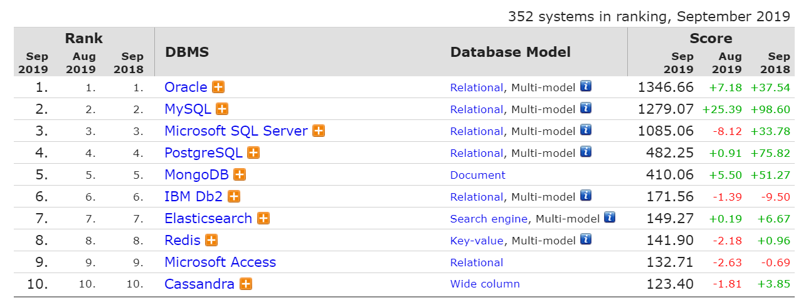
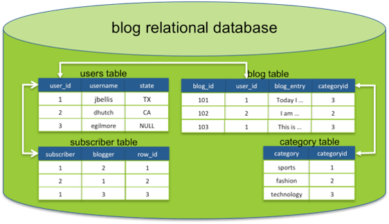
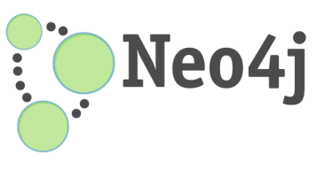
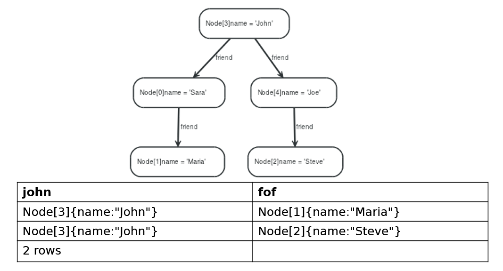

Introducción a Tecnologías NoSQL
================================

Working draft...


## Conceptos y tipos de bases de datos NoSQL (documental, columnar, clave/valor y de grafos)

NoSQL - “Not Only SQL” - es una nueva categoría de bases de datos no-relacionales y altamente distribuidas.

Las bases de datos NoSQL nacen de la necesidad de:

- Simplicidad en los diseños

- Escalado horizontal

- Mayor control en la disponibilidad

Pero cuidado, en muchos escenarios las BBDD relacionales siguen siendo la mejor opción.

### Características de las bases de datos NoSQL

* Libre de esquemas – no se diseñan las tablas y relaciones por adelantado, además de permitir la migración del esquema.
* Proporcionan replicación a través de escalado horizontal.
* Este escalado horizontal se traduce en arquitectura distribuida
* Generalmente ofrecen consistencia débil
* Hacen uso de estructuras de datos sencillas, normalmente pares clave/valor a bajo nivel
* Suelen tener un sistema de consultas propio (o SQL-like)
* Siguen el modelo BASE (*B*asic Availability, Soft state, Eventual consistency) en lugar de ACID (*A*tomicity, *C*onsistency, *I*solation, *D*urability)

El modelo BASE consiste en:

* Basic Availability – el sistema garantiza disponibilidad, en términos del teorema CAP.
* Soft state – el estado del sistema puede cambiar a lo largo del tiempo, incluso sin entrada. Esto es provocado por el modelo de consistencia eventual.
* Eventual consistency – el sistema alcanzará un estado consistente con el tiempo, siempre y cuando no reciba entrada durante ese tiempo.


#### Teorema CAP

Es imposible para un sistema de cómputo distribuido garantizar simultáneamente:

* Consistency – Todos los nodos ven los mismos datos al mismo tiempo
* Availability – Toda petición obtiene una respuesta en caso tanto de éxito como fallo
* Partition Tolerance – El sistema seguirá funcionando ante pérdidas arbitrarias de información o fallos parciales 


Las razones para escoger NoSQL son:

* Analítica
 + Gran cantidad de escrituras, análisis en bloque 
* Escalabilidad
 + Tan fácil como añadir un nuevo nodo a la red, bajo coste.
* Redundancia
 + Están diseñadas teniendo en cuenta la redundancia
* Rápido desarrollo
 + Al ser schema-less o schema on-read son más flexibles que schema on-write
* Flexibilidad en el almacenamiento de datos
 + Almacenan todo tipo de datos: texto, imágenes, BLOBs
 + Gran rendimiento en consultas sobre datos que no implican relaciones jerárquicas
 + Gran rendimiento sobre BBDD desnormalizadas
* Tamaño
 + El tamaño del esquema de datos es demasiado grande
 + Muchos datos temporales fuera de almacén principal

Razones para NO escoger NoSQL:
* Consistencia y Disponibilidad de los datos son críticas
* Relaciones entre datos son importantes 
 + E.g. joins numerosos y/o importantes
* En general, cuando el modelo ACID encaja mejor

### Tipos de Bases de Datos NoSQL





### MongoDB: NoSQL documental


### Redis: NoSQL key-value

In-memory data structure store, útil para base de datos de login-password, sensor-valor, URL-respuesta, con una sintaxis muy sencilla:

* El comando SET almacena valores
 + SET server:name “luna”
* Recuperamos esos valores con GET
 + GET server:name
* INCR incrementa atómicamente un valor
 + INCR clients
* DEL elimina claves y sus valores asociados
 + DEL clients
* TTL (Time To Live) útil para cachés
 + EXPIRE promocion 60

### Cassandra: NoSQL columnar




### Neo4j: NoSQL grafos






### Otros: search engines

Son sistemas especializados en búsquedas, procesamiento de lenguaje natural como ElasticSearch, Solr, Splunk (logs de aplicaciones), etc...


## Conexión de R a MongoDB

A través del paquete [mongolite](https://cran.rstudio.com/web/packages/mongolite/mongolite.pdf), aquí tenéis un [Tutorial](https://datascienceplus.com/using-mongodb-with-r/)


```r
install.packages("mongolite")
```


```r
library(mongolite)

# Connect to a local MongoDB

my_collection = mongo(collection = "restaurants", db = "Restaurants") # create connection, database and collection
my_collection$count
```


## Práctica 2: NoSQL


Los ejercicios se entregarán por correo electrónico a guillermo.lopez.taboada@udc.es en formato R MarkDown con el nombre de archivo P1-Nombre-Apellidos.Rmd (sin tildes ni caracteres especiales en el nombre del arhivo) **antes** del 20 de Noviembre.

### Ejercicios con RMongolite

Realizaremos una serie de ejercicios con la collección [Restaurants] (https://www.w3resource.com/mongodb-exercises/restaurants.zip) importados mediante:


```r
# En Windows
mongoimport.exe --db=Restaurants --file=D:\DATA\opendata\restaurants.json
```

La puntuación de esta práctica será el número de respuestas correctas:

1. Mostrar todos los documentos de la colección restaurants (que no se ejecute en el .rmd, sólo la query)

2. Mostrar nombre de restaurante, barrio y cocina de la colección restaurants (que no se ejecute en el .rmd, sólo la query)

3. Mostrar los primeros 5 restaurantes del barrio Bronx.

4. Mostrar los restaurantes con una longitud menor que -75.7541

5. Mostrar los restaurantes con una puntuación superior a 90

6. Mostrar los restaurantes de comida American o Chineese del barrio Queens.

7. Mostrar los restaurantes con un grado "A" y puntuación 9 obtenida en fecha 2014-08-11T00:00:00Z

8. Con valor de 3 puntos, propón un JSON para descargar, indícame la URL, si has de hacer algún proceso antes de importarlo en MongoDB, cómo lo importas, dame un pantallazo del análisis exploratorio de ese JSON y una query que harías contra ese JSON (la query en MongoDB, Compass o RmongoDB)


