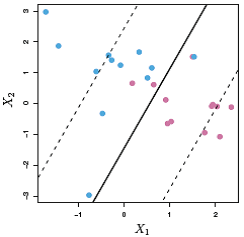
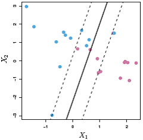

Introducción al Aprendizaje Estadístico
=======================================

## Data Science

***Data Science***: *Data Mining*, *Machine Learning*, *Statistical Learning*, *Knowlegde Discovery*, *Business Intelligence*, ...

-   El conjunto de herramientas para entender y modelizar conjuntos
    (complejos) de datos.

-   El proceso de construir modelos a partir de los datos para aprender
    y predecir.

-   El proceso de descubrir patrones y obtener conocimiento a partir de
    grandes conjuntos de datos (*big data*).

-   El arte y la ciencia del análisis inteligente de los datos.

-   Multidisciplicar, con importantes aportaciones
    estadísticas e informáticas.


\begin{figure}
\includegraphics[width=0.8\linewidth]{images/esquema2} \caption{Etapas del proceso}(\#fig:esquema)
\end{figure}


### Ventajas e inconvenientes

Ventajas:

-   Flexibilidad (hay menos suposiciones sobre los datos).

-   Adecuado para big data.

Inconvenientes:

-   Algunos métodos son poco interpretables.

-   Pueden aparecer problemas de sobreajuste.

-   Mayores problemas al extrapolar e interpolar.


La idea es “dejar hablar a los datos” y no "encorsetarlos" a priori,
dándoles mayor peso que a los modelos.

**CUIDADO**: los datos no sustituyen a la población (pueden presentar grandes sesgos,
la información disponible puede no ser representativa de la población).

> "The sheer volume of data would obviate the need of theory and even
> scientific method"
> --- Chris Anderson, físico y periodista, 2008

## Métodos de aprendizaje estadístico

-   Aprendizaje no supervisado: Métodos exploratorios (sin variable respuesta).
    El objetivo principal es entender las relaciones y estructura de los datos.

    -   Análisis descriptivo
    
    -   Métodos de reducción de la dimensión (análisis de componentes
        principales, análisis factorial,...)
    
    -   Clúster
    
    -   Detección de datos atípicos

-   Aprendizaje supervisado: Métodos predictivos (con variable respuesta).
    El objetivo principal es la construcción de modelos, principalmente para predecir.
    Dependiendo del tipo de variable respuesta:

    -   Clasificación: cualitativa

    -   Regresión: numérica
    

### Métodos (de aprendizaje supervisado):

Métodos de Clasificación:

-   Análisis discriminante (lineal, cuadrático), Regresión logística, multinomial, ...

-   Árboles de decisión, *bagging*, *random forest*,
    *boosting*

-   *Support vector machines* (SVM)

Métodos de regresión:

-   Modelos lineales:

    -   Regresión lineal: `lm()`, `lme()`, `biglm`, ...

    -   Regresión lineal robusta: `MASS::rlm()`, ...

    -   Métodos de regularización (Ridge regression, Lasso):
        `glmnet`, ...

-   Modelos lineales generalizados: `glm()`, `bigglm`, ..

-   Modelos paramétricos no lineales: `nls()`, `nlme`, ...

-   Regresión local (métodos de suavizado):
    `loess()`, `KernSmooth`, `sm`, `np`, ...

-   Modelos aditivos generalizados (GAM): `mgcv`, `gam`, ...

-   Arboles de decisión, Random Forest, Boosting:
    `rpart`, `randomForest`, `xgboost`, ...

-   Redes neuronales: `nnet`, ... 


Paquetes con entornos gráficos (datos en memoria):

-   R-Commander + FactoMineR: `Rcmdr`, `RcmdrPlugin.FactoMineR`

-   Rattle: `rattle`


### Construcción y evaluación de los modelos

El procedimiento habitual es particionar la base de datos en 2 
(o incluso en 3) conjuntos:

-   Conjunto de datos de aprendizaje para construir los modelos

-   Conjunto de datos de (test) validación para (afinar) evaluar el rendimiento 
    de los modelos

Alternativas: validación cruzada, bagging (bootstrap de las observaciones)

En el caso de grandes conjuntos de datos las aproximaciones 
más empleadas son:

-   Submuestreo: la idea es que a partir de un cierto número de
    observaciones el incremento en la precisión es relativamente 
    pequeño^[El error de estimación suele ser de orden $n^{-1/2}$ o superior, 
    incrementar cuatro veces el número de datos disminuye el error de  
    estimación a la mitad o menos].
    
-   Computación paralela/distribuida:
    
    - Resumir (paralela/distribuida) -> Combinar -> Modelar

    - Modelar (paralela/distribuida) -> Combinar
    
    - Se puede implementar mediante un sistema *MapReduce* (Hadoop): 
      los datos se procesan de forma distribuida mediante *Mappers* 
      y los resultados se combinan mediante *Reducers*.


### Matriz de confusión

Para estudiar la eficiencia de un método de clasificación
supervisada se evalúa el modelo en el conjunto de datos de
validación y se genera una tabla de contingencia con las
predicciones (columnas) frente a los valores reales (filas).

  Observado\\Predicción        Positivo                  Negativo
 ----------------------- ------------------------ ------------------------
        Verdadero           Verdadero positivo         Falso negativo
          Falso               Falso positivo         Verdadero negativo
 ----------------------- ------------------------ ------------------------

A partir de esta tabla se pueden estimar las tasas de falsos y
verdaderos negativos y positivos (caso de dos categorías).


### Predicciones frente a observado

Para estudiar la eficiencia de un método de regresión se evalúa el
modelo en el conjunto de datos de validación y se comparan las
predicciones frente a los valores reales


\includegraphics[width=6.38in]{images/predobs} 

-   Las predicciones deberían estar próximas a los valores reales
    $y=x$, en azul.

-   El pseudo R-cuadrado (el cuadrado de la correlación entre las
    predicciones y los valores observados, que se corresponde con la
    línea discontinua) debería ser próximo a 1.


<!-- ## Métodos basados árboles -->

## Arboles de decisión

Métodos simples y fácilmente interpretables.

-   Técnica clásica de apendizaje automático (computación).

-   Válidos también para regresión.

Se segmentan los valores de las variables explicativas de forma
recursiva.

-   Se consideran particiones binarias.

-   El conjunto de reglas de partición se puede resumir en un árbol.

    
    \includegraphics[width=4in]{images/arbol1} 


La predicción será el valor más frecuente (la media en regresión) en
el nodo terminal.


\includegraphics[width=4.44in]{images/arbol2} 
\includegraphics[width=4.22in]{images/arbol3} 


Construcción del arbol:

-   De forma recursiva se realizan particiones binarias.

    -   En cada partición se trata de mejorar la información sobre la
        respuesta.

        -   El indice de Gini es una medida de la varianza total en los
            grupos (mide si hay mucha o poca igualdad dentro de los
            grupos).

    -   Se crece el arbol hasta que cada nodo terminal tiene menos de un
        número mínimo de observaciones.

-   Se poda el árbol considerando una funcion de costo basada en la
    complejidad.

    -   Evita problemas de sobreajuste, selección de variables
        explicativas...

    -   Se suele emplear **validación cruzada**.


## Bagging y Boosting

Bagging y Boosting son procedimientos generales para la reducción de
la varianza de un método estadístico de aprendizaje.

-   Se trata de combinar métodos de clasificación sencillos para
    obtener un método de clasificación muy potente (y robusto).

-   Muy empleados con árboles de decisión.

    -   Se crecen muchos árboles que luego se combinan para producir
        predicciones por consenso.

### Bagging o agregación Bootstrap

-   Se remuestrea repetidamente el conjunto de datos de
    entrenamiento.

    -   Con cada conjunto de datos (bag) se entrena un modelo.

-   Las predicciones se obtienen promediando las predicciones de los
    modelos (la decisión mayoritaria en el caso de clasificación).

-   Se puede estimar la precisión de las predicciones con el error
    OOB (out-of-bag).


### Bosques Aleatorios

Los Bosques Aleatorios son una ligera modificación del bagging para
el caso de árboles de decisión.

-   Además de en las observaciones se induce aleatoriedad en las
    variables.

-   Para evitar dependencias, los posibles predictores se
    seleccionan al azar en cada partición (e.g. $m=\sqrt{p}$).

-   No es necesario podar los árboles.

Estos métodos dificultan la interpretación.

-   Se puede medir la importancia de las variables (índices de
    importancia).

    -   Por ejemplo, para cada árbol se suman las reducciones en el
        índice de Gini correspondientes a las divisiones de un
        predictor y posteriormente se promedian los valores de todos
        los árboles.

### Boosting

-   La idea es hacer un “aprendizaje lento”.

-   Los arboles se crecen de forma secuencial, se trata de mejorar la
    clasificación anterior.

    -   Se utilizan arboles pequeños (en general clasificadores
        débiles).

-   Se puede pensar que se ponderan las observaciones iterativamente, se
    asigna más peso a las que resultaron más difíciles de clasificar.

-   El modelo final es un modelo aditivo (media ponderada de los
    árboles).

## Support vector machines (SVM)

Este método es una generalización del denominado **clasificador de
máximo margen**.

-   Si las clases se pueden separar linealmente, se escoge el
    hiperplano con el mayor margen entre las clases.

    
    \includegraphics[width=4.17in]{images/svm1} 

Los puntos que determinan el margen (y el hiperplano) se denominan
vectores de soporte.


En el caso de que las categorías no sean linealmente separables, se
busca un clasificador de “margen débil”, denominado **clasificador
de soporte vectorial**.

-   Más robusto frente a observaciones individuales.

-   Mejor clasificación de la mayoría de las observaciones de
    entrenamiento.

Se incluye un parámetro adicional $C$ que permite la mala
clasificación de algunas observaciones.

---------------------- ---------------------
            
      $C$ grande            $C$ pequeño
---------------------- ---------------------

En ciertos casos una frontera lineal no es adecuada.

-   Se transforman las variables explicativas de forma que se puedan
separar las clases: **maquinas de soporte vectorial (SVM).**

-   Se consideran núcleos polinómicos, radiales, ...

    
    \includegraphics[width=6.72in]{images/svm4} 


## Modelos lineales (generalizados)

Los modelos lineales suponen que la función de regresión es lineal:

$$Y=\beta_{0}+\beta_{1}X_{1}+\beta_{2}X_{2}+\cdots+\beta_{p}X_{p}+\varepsilon$$

El efecto de las variables explicativas sobre la respuesta es simple 
(proporcional a su valor), por lo que son muy fáciles de interpretar.

Los modelos lineales generalizados son una extensión de los modelos lineales 
para el caso de que la distribución condicional de la variable respuesta no 
sea normal (por ejemplo discreta: Bernouilli, Binomial, Poisson, ...).

En los modelo lineales se supone que:
$$E( Y | \mathbf{X} ) = \beta_{0}+\beta_{1}X_{1}+\beta_{2}X_{2}+\cdots+\beta_{p}X_{p}$$
En los modelos lineales generalizados se introduce una función invertible *g*, denominada función enlace (o link):
$$g\left(E(Y | \mathbf{X} )\right) = \beta_{0}+\beta_{1}X_{1}+\beta_{2}X_{2}+\cdots+\beta_{p}X_{p}$$

Cuando se dispone de un conjunto grande de posibles variables explicativas 
suele ser especialmente importante determinar cuales de estas deberían ser 
incluidas en el modelo de regresión. Si alguna de las variables no contiene 
información relevante sobre la respuesta no se debería incluir (se simplificaría 
la interpretación del modelo, aumentaría la precisión de la estimación y se 
evitarían problemas como la multicolinealidad). Se trataría entonces de conseguir 
un buen ajuste con el menor número de variables explicativas posible.

Para obtener el modelo "óptimo" lo ideal sería evaluar todos los modelos posibles.
Si el número de variables explicativas es grande, en lugar de emplear una 
búsqueda exhaustiva se puede emplear un criterio por pasos:

-   **Selección progresiva** (forward): Se parte de una situación en la
    que no hay ninguna variable y en cada paso se incluye una aplicando
    un **criterio de entrada** (hasta que ninguna de las restantes lo
    verifican).

-   **Eliminación progresiva** (backward): Se parte del modelo con todas
    las variables y en cada paso se elimina una aplicando un **criterio
    de salida** (hasta que ninguna de las incluidas lo verifican).

-   **Regresión paso a paso** (stepwise): El más utilizado, se combina
    un criterio de entrada y uno de salida. Normalmente se parte sin
    ninguna variable y **en cada paso puede haber una inclusión y una
    exclusión** (forward/backward).
    
    
Cuando el número de variables explicativas es muy grande (o si el tamaño de la 
muestra es pequeño en comparación) pueden aparecer problemas al emplear los 
métodos anteriores (incluso pueden no ser aplicables). Una alternativa son los 
métodos de regularización (Ridge regression, Lasso).   

## Métodos de regularización

Estos métodos emplean también un modelo lineal generalizado,
pero imponen restricciones adicionales a los parámetros que los
"retraen" (shrink) hacia cero:

-  Produce una reducción en la varianza de predicción (a
   costa del sesgo).

-  En principio se consideran todas las variables explicativas.

Por ejemplo, en el caso del modelo lineal: 
$$Y=\beta_{0}+\beta_{1}X_{1}+\beta_{2}X_{2}+\cdots+\beta_{p}X_{p}+\varepsilon$$

En lugar de ajustarlo por mínimos cuadrados (estándar), minimizando:
$$ RSS = \sum\limits_{i=1}^{n}\left(  y_{i} - \beta_0 - \beta_1 x_{1i} - \cdots - \beta_p x_{pi} \right)^{2}$$

**Ridge regression**

-  Penalización cuadrática: $RSS+\lambda\sum_{j=1}^{p}\beta_{j}^{2}$.

**Lasso**

-  Penalización en valor absoluto: $RSS+\lambda\sum_{j=1}^{p}|\beta_{j}|$.

-  Normalmente asigna peso nulo a algunas variables
   (selección de variables).

El parámetro de penalización se selecciona por **validación cruzada**.

-  Normalmente estandarizan las variables explicativas
   (coeficientes en la misma escala).


Consideraremos como ejemplo el conjunto de datos *hatco.RData* que contiene
observaciones de clientes de la compañía de distribución industrial (Compañía 
Hair, Anderson y Tatham).


```r
load('data/hatco.RData')
as.data.frame(attr(hatco, "variable.labels"))
```

```
##          attr(hatco, "variable.labels")
## empresa                         Empresa
## tamano             Tamaño de la empresa
## adquisic      Estructura de adquisición
## tindustr              Tipo de industria
## tsitcomp    Tipo de situación de compra
## velocida           Velocidad de entrega
## precio                 Nivel de precios
## flexprec        Flexibilidad de precios
## imgfabri          Imagen del fabricante
## servconj              Servicio conjunto
## imgfvent     Imagen de fuerza de ventas
## calidadp            Calidad de producto
## fidelida   Porcentaje de compra a HATCO
## satisfac            Satisfacción global
## nfidelid        Nivel de compra a HATCO
## nsatisfa          Nivel de satisfacción
```

Consideraremos como respuesta la variable *fidelida* y como variables explicativas
el resto de variables continuas menos *satisfac*.


```r
library(glmnet)
```

El paquete `glmnet` no emplea formulación de modelos, hay que establecer la respuesta
`y` y las variables explicativas `x` (se puede emplear la función `model.matrix()` 
para construir `x`, la matriz de diseño, a partir de una fórmula). 
En este caso, eliminamos también la última fila por tener datos faltantes:


```r
x <- as.matrix(hatco[-100, 6:12])
y <- hatco$fidelida[-100]
```

### Ridge Regression

Ajustamos un modelo de regresión ridge con la función `glmnet` con `alpha=0` (ridge penalty).


```r
fit.ridge <- glmnet(x, y, alpha = 0)
plot(fit.ridge, xvar = "lambda", label = TRUE)
```

<!-- --> 

Para seleccionar el parámetro de penalización por validación cruzada se puede emplear
la función `cv.glmnet`.


```r
cv.ridge <- cv.glmnet(x, y, alpha = 0)
plot(cv.ridge)
```

<!-- --> 

En este caso el parámetro sería:


```r
cv.ridge$lambda.1se
```

```
## [1] 2.749868
```

y el modelo resultante contiene todas las variables explicativas:


```r
coef(cv.ridge)
```

```
## 8 x 1 sparse Matrix of class "dgCMatrix"
##                     1
## (Intercept) 2.4799000
## velocida    1.6053747
## precio      0.7733925
## flexprec    2.4462308
## imgfabri    0.2837000
## servconj    3.9801496
## imgfvent    1.1232130
## calidadp    0.1245096
```

### Lasso

Ajustamos un modelo lasso también con la función `glmnet` (con la opción por defecto `alpha=1`, lasso penalty).


```r
fit.lasso <- glmnet(x,y)
plot(fit.lasso, xvar = "lambda", label = TRUE)
```

<!-- --> 

Seleccionamos el parámetro de penalización por validación cruzada.


```r
cv.lasso <- cv.glmnet(x,y)
plot(cv.lasso)
```

<!-- --> 

En este caso el modelo resultante solo contiene 4 variables explicativas:


```r
coef(cv.lasso)
```

```
## 8 x 1 sparse Matrix of class "dgCMatrix"
##                     1
## (Intercept) 4.4757712
## velocida    0.1020531
## precio      .        
## flexprec    2.7202485
## imgfabri    .        
## servconj    6.4044378
## imgfvent    0.4651076
## calidadp    .
```

## Regresión no paramétrica

No se supone ninguna forma concreta en el efecto de las variables explicativas:
$$Y=f\left(  \mathbf{X}\right)  +\varepsilon,$$
con *f* función "cualquiera" (suave).

- Métodos disponibles en `R`:

    -   Regresión local (métodos de suavizado): `loess()`, `KernSmooth`, `sm`, ...

    -   Modelos aditivos generalizados (GAM): `gam`, `mgcv`, ...
    
    -   ...


### Modelos aditivos

Se supone que:
$$Y=\beta_{0}+f_{1}\left(  \mathbf{X}_{1}\right)  +f_{2}\left(  \mathbf{X}_{2}\right)  +\cdots+f_{p}\left(  \mathbf{X}_{p}\right)  +\varepsilon\text{,}$$
con $f_{i},$ $i=1,...,p,$ funciones cualesquiera.

-   Los modelos lineales son un caso particular considerando $f_{i}(x) = \beta_{i}x$.

-   Son mucho más flexibles pero siguen siendo fáciles de interpretar.

-   Adicionalmente se puede considerar una función link: 
    **Modelos aditivos generalizados** (GAM)

    -   Hastie, T.J. y Tibshirani, R.J. (1990). Generalized Additive Models. 
        Chapman & Hall.
        
    -   Wood, S. N. (2006). Generalized Additive Models: An Introduction with R. 
        Chapman & Hall/CRC


Utilizaremos como ejemplo el conjunto de datos `Prestige` de la librería `carData` 
(Companion to Applied Regression Data Sets, paquete `car`). 
Se tratará de explicar `prestige` (puntuación de ocupaciones obtenidas a traves 
de una encuesta) a partir de `income` (media de ingresos en la ocupación) y 
`education` (media de los años de educación).

```r
library(mgcv)
data(Prestige, package = "carData")
modelo <- gam(prestige ~ s(income) + s(education), data = Prestige)
summary(modelo)
```

```
## 
## Family: gaussian 
## Link function: identity 
## 
## Formula:
## prestige ~ s(income) + s(education)
## 
## Parametric coefficients:
##             Estimate Std. Error t value Pr(>|t|)    
## (Intercept)  46.8333     0.6889   67.98   <2e-16 ***
## ---
## Signif. codes:  0 '***' 0.001 '**' 0.01 '*' 0.05 '.' 0.1 ' ' 1
## 
## Approximate significance of smooth terms:
##                edf Ref.df     F  p-value    
## s(income)    3.118  3.877 14.61 1.53e-09 ***
## s(education) 3.177  3.952 38.78  < 2e-16 ***
## ---
## Signif. codes:  0 '***' 0.001 '**' 0.01 '*' 0.05 '.' 0.1 ' ' 1
## 
## R-sq.(adj) =  0.836   Deviance explained = 84.7%
## GCV = 52.143  Scale est. = 48.414    n = 102
```

En este caso la función `plot` representa los efectos (parciales) estimados de 
cada covariable:    

```r
par.old <- par(mfrow = c(1, 2))
plot(modelo, shade = TRUE) # 
```

<!-- --> 

```r
par(par.old)
```

## Redes neuronales

Se trata de imitar el funcionamiento del cerebro de un ser vivo.

-   Neuronas organizadas en capas que interactuan por medio de pesos.

-   Capa de entrada, capas ocultas y capa de salida.
    
    
    \includegraphics[width=6.88in]{images/nn} 

Son modelos hiperparametrizados de difícil interpretación.

-   Hay distintos métodos de aprendizaje (estimación de los pesos)

    
## Bibliografía

-   Efron, B. y Hastie, T. (2016). [Computer age statistical inference](http://web.stanford.edu/~hastie/CASI/). 
    Cambridge University Press.

-   Hastie, T., Tibshirani, R. y Friedman, J. (2017).
    [The Elements of Statistical Learning: Data Mining, Inference, and Prediction](https://web.stanford.edu/~hastie/ElemStatLearn).
    Springer.

-   James, G., Witten, D., Hastie, T. y Tibshirani, R. (2017). 
    [An Introduction to Statistical Learning: with Aplications in R](http://faculty.marshall.usc.edu/gareth-james/ISL).
    Springer.

-   Torgo, L. (2011). Data Mining with R: Learning with Case
    Studies. Chapman & Hall/CRC Press.

-   Williams, G. (2011). Data Mining with Rattle and R. Springer.
